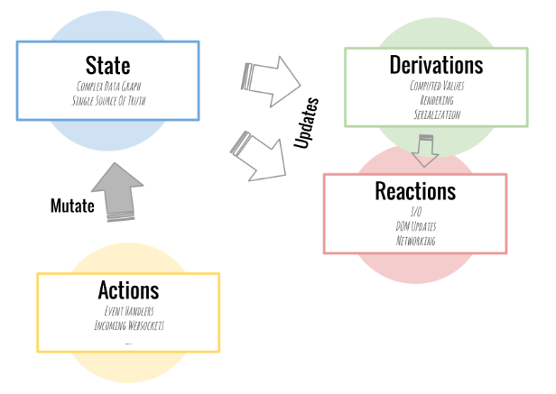

> 참고 블로그의 제목대로 정말 10분만에 MobX가 이해가 될까했는데 진짜로 금방 이해가 되어서 깜짝 놀란 글이다. 핵심적인 내용을 잘 설명해준 것 같아 MobX에 대한 자신감도 상승하였다.

# 핵심개념

총 4가지의 핵심 개념, State, Derviations, Reactions, Actions가 있다.

</img>

1. State

   웹 어플리케이션에 존재하는 데이터들(객체, 배열, 원시 값, 참조 등등)이다.

2. Derivation  
   state로부터 자동으로 계산될 수 있는 값이다. '완료되지 않은 todo 개수'나, 'todo에 관한 시각적 HTML표현' 등이 있다. 어플리케이션의 수식 또는 차트라고 표현한다.
3. Reaction  
   Derivation과 굉장히 유사하지만, 값을 생성하는 대신에 자동으로 특정 테스크를 수행한다. DOM 요소가 업데이트 되었는지, 또는 네트워크 요청이 제떄 자동적으로 이루어졌는지를 확인한다.
4. Action  
   state를 변경하는 모든 것을 의미한다.

# TodoStore 예제

```ts
class TodoStore {
  todos = []

  get completedTodosCount() {
    return this.todos.filter(todo => todo.completed === true).length
  }

  report() {
    if (this.todos.length === 0) return '<none>'
    const nextTodo = this.todos.find(todo => todo.completed === false)
    return (
      `Next todo: "${nextTodo ? nextTodo.task : '<none>'}". ` +
      `Progress: ${this.completedTodosCount}/${this.todos.length}`
    )
  }

  addTodo(task) {
    this.todos.push({
      task: task,
      completed: false,
      assignee: null,
    })
  }
}

const todoStore = new TodoStore()
```

해야할 todo중, 가장 최신으로 입력된 todo와 현재 완료된 todo갯수까지 출력해주는 예제이다.

```ts
todoStore.addTodo('read MobX tutorial')
console.log(todoStore.report())

todoStore.addTodo('try MobX')
console.log(todoStore.report())

todoStore.todos[0].completed = true
console.log(todoStore.report())

todoStore.todos[1].task = 'try MobX in own project'
console.log(todoStore.report())

todoStore.todos[0].task = 'grok MobX tutorial'
console.log(todoStore.report())
```

report에서는 의도적으로 가장 최신으로 입력된 todo를 출력해준다.  
만약 위 코드처럼 일일이 report 함수로 log를 찍는게 아니라, `state가 변경될때마다` report함수를 자동적으로 호출해주고 싶으면 다음과 같이 설계하면된다.

```ts
class ObservableTodoStore {
  todos = []
  pendingRequests = 0

  constructor() {
    makeObservable(this, {
      todos: observable,
      pendingRequests: observable,
      completedTodosCount: computed,
      report: computed,
      addTodo: action,
    })
    autorun(() => console.log(this.report))
  }

  get completedTodosCount() {
    return this.todos.filter(todo => todo.completed === true).length
  }

  get report() {
    if (this.todos.length === 0) return '<none>'
    const nextTodo = this.todos.find(todo => todo.completed === false)
    return (
      `Next todo: "${nextTodo ? nextTodo.task : '<none>'}". ` +
      `Progress: ${this.completedTodosCount}/${this.todos.length}`
    )
  }

  addTodo(task) {
    this.todos.push({
      task: task,
      completed: false,
      assignee: null,
    })
  }
}

const observableTodoStore = new ObservableTodoStore()
```

TodoStore는 발생한 모든 변화를 MobX가 감지할 수 있도록 `observable` 상태가 되어야 한다.  
completedTodosCount나, report 함수처럼 근원적인 state변화가 일어나지 않는 한 해당 값들이 state및 캐시에서 파생될 수 있으므로, `computed`로 명시해준다.  
state가 변경될 때마다 report함수를 실행해야하므로, `autorun`으로 함수를 감싸줘야한다.  
autorun은 한 번 실행되는 `reaction`을 만들고 이후에 함수 안에서 사용된 observable데이터가 변경될 때마다 자동으로 reaction을 재실행한다.

```ts
observableTodoStore.addTodo('read MobX tutorial')
observableTodoStore.addTodo('try MobX')
observableTodoStore.todos[0].completed = true
observableTodoStore.todos[1].task = 'try MobX in own project'
observableTodoStore.todos[0].task = 'grok MobX tutorial'
```

위의 코드에서 다섯 번째줄은 로그가 안 찍히는데 그 이유는 report가 return해주는 값이 바뀌지 실질적으로 바뀌지 않았기 때문이다. 반면 인덱스 1번 todo의 이름은 report에서 활성화되어있었기 때문에 해당 이름을 변경하면 report가 업데이트 된다.  
-> autorun이 todos배열뿐만 아니라, todo항목 내의 개별 속성까지 감지하고 있음을 의미한다.

# 반응형 React 만들기

React 컴포넌트를 반응형으로 만들기 위해서는, mobx-react-lite 패키지의 observer HoC 래퍼를 활용해야한다. 개념적으로 위의 report함수와 똑같다고 볼 수 있다.  
observer래핑을 통해 각각의 컴포넌트들은 관련 데이터가 변경될때마다 `각자 따로 재렌더링`한다.

```ts
const TodoList = observer(({ store }) => {
  const onNewTodo = () => {
    store.addTodo(prompt('Enter a new todo:', 'coffee plz'))
  }

  return (
    <div>
      {store.report}
      <ul>
        {store.todos.map((todo, idx) => (
          <TodoView todo={todo} key={idx} />
        ))}
      </ul>
      {store.pendingRequests > 0 ? <marquee>Loading...</marquee> : null}
      <button onClick={onNewTodo}>New Todo</button>
      <small> (double-click a todo to edit)</small>
      <RenderCounter />
    </div>
  )
})

const TodoView = observer(({ todo }) => {
  const onToggleCompleted = () => {
    todo.completed = !todo.completed
  }

  const onRename = () => {
    todo.task = prompt('Task name', todo.task) || todo.task
  }

  return (
    <li onDoubleClick={onRename}>
      <input
        type="checkbox"
        checked={todo.completed}
        onChange={onToggleCompleted}
      />
      {todo.task}
      {todo.assignee ? <small>{todo.assignee.name}</small> : null}
      <RenderCounter />
    </li>
  )
})

ReactDOM.render(
  <TodoList store={observableTodoStore} />,
  document.getElementById('reactjs-app'),
)
```

TodoList컴포넌트에서 observer를 제외하면 onNewTodo함수가 작동하지 않는다. store라는 데이터를 observe 하지 않는 상태이기 때문에 store의 addTodo 함수가 작동하지 않는다.  
TodoView의 observer를 없애면, todo를 toggle할 때 그 todo만 업데이트가 되는 것이 아니라 모든 todo가 업데이트가 된다. 불필요한 render가 엄청나게 많이 일어나는 것이다.

# 참조(reference) 작업

```ts
const peopleStore = observable([{ name: 'Michel' }, { name: 'Me' }])
observableTodoStore.todos[0].assignee = peopleStore[0]
observableTodoStore.todos[1].assignee = peopleStore[1]
peopleStore[0].name = 'Michel Weststrate'
```

위에서 만든 todo로 이루어진 store와 사람으로 이루어진 peopleStore, 총 2개의 store가 있는 상태이다. peopleStore의 사람 데이터를 store의 todo.assignee 변수에 넣어줌으로써 참조를 하게 된다. 이 변화들은 TodoView에 의해 자동으로 감지된다. 객체들이 observable이기만 하면 데이터가 어디에 저장되어 있든 MobX가 감지할 수 있다.

```html
<input onkeyup="peopleStore[1].name = event.target.value" />
```

참조를 하고나면, `observable`로 감싸줬기 때문에 input태그의 값을 바꾸면 store의 todos[1].assignee 값도 동시에 바뀌는 걸 확인할 수 있다.

# 비동기식 action

todo 어플리케이션의 모든 것은 state로부터 파생되었기 때문에 state가 `언제`변경되든 상관없다.

```ts
observableTodoStore.pendingRequests++
setTimeout(
  action(() => {
    observableTodoStore.addTodo('Random Todo ' + Math.random())
    observableTodoStore.pendingRequests--
  }),
  2000,
)
```

로딩상태를 반영하기 위해 store의 pendingRequests속성을 업데이트해준다.

여러개의 todo들을 동시에 많이 생성하여도 로딩이 끝나고 나서 todo를 업데이트하고, pendingRequests속성을 감소신킨다.

# 요약

1. observable 데코레이터 또는 observable(객체 또는 배열) 함수를 사용하여 MobX가 객체를 트래킹 할 수 있도록 만들면 된다.

2. computed 데코레이터는 state로부터 자동으로 값을 가져와 캐시 할 수 있는 함수를 만드는 데 사용할 수 있다.

3. observable한 state 기반의 함수들을 자동으로 실행하기 위해서는 autorun을 사용해야한다. 로깅, 네트워크 요청 등에 유용하다.

4. mobx-react-lite 패키지의 observer를 사용하여 React 컴포넌트가 진정으로 reactive 하도록 만들면 된다. 거대한 양의 데이터를 사용하는 복잡한 애플리케이션에 사용되더라도 자동적으로, 효율적으로 업데이트하는 효과를 누릴 수 있다.

# 참고사이트

- [10분만에 알아보는 MobX와 React](https://ko.mobx.js.org/getting-started.html)
