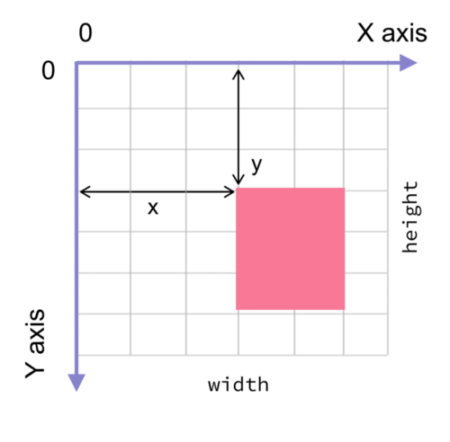
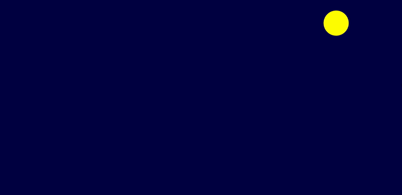
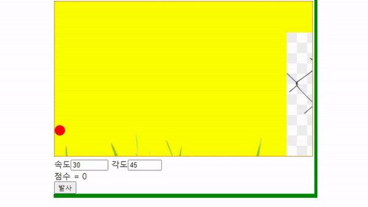

<div class="notice--success">
  <h4>11주차</h4>
  <ul>
    <li>캔버스 요소</li>
    <li>도형 만들기</li>
    <li>애니메이션</li>
  </ul>
</div>

# 캔버스 요소

- 웹페이지 위에 직접 그림을 그릴 수 있는 요소
- 사각 형태의 영역
- 디폴트 값으로 **경계를 갖지 않음**

```html
<canvas id="myCanvas" width="300" height="100"></canvas>
```

항상 id속성을 지정해야해야한다. 그래야 js에서 참조가 가능하다. 그리고 가로, 세로 크기도 꼭 설정해야한다.

## 캔버스 좌표계



## 컨텍스트 객체

- 도화지 === canvas
- 물감과 붓 === **컨텍스트(context)객체**

```js
let canvas = document.getElementById('myCanvas')
let context = canvas.getContext('2d')
```

- '2d' : 2차원 그래픽을 의미한다.
- getContext()가 반환하는 컨텍스트 객체는 HTML5에 내장된 객체  
  => 그림을 그리는 많은 메서드를 가지고 있음

## 사각형 그리기

```js
let canvas = document.getElementById('myCanvas')
let context = canvas.getContext('2d')

context.fillStyle = '#00FF00'
context.fillRect(0, 0, 100, 50)
```

- fillStyle : 채우기 속성(색상, 그라디언트, 패턴 등등)
- fillRect(x, y, width, height) : 사각형을 그린다.

## ! 주의 !

> 캔버스가 생성되기 전에 js가 실행되면 오류가 남! 따라서, 문서의 로드가 끝난 후에 js가 실행되어야함<br>그래서, 자바스크립트를 **<body> 요소의 맨 끝**에 두어야함

## 직선 그리기

- moveTo(x, y) : 직선의 시작점을 정의
- lineTo(x, y) : 직선의 끝점을 정의

```js
let canvas = document.getElementById('myCanvas')
let context = canvas.getContext('2d')

context.beginPath()
context.moveTo(0, 0)
context.lineTo(100, 100)
context.lineTo(150, 50)
context.lineTo(200, 100)
context.stroke()
```

- beginPath() : 경로를 초기화한다
- stroke() : 경로를 형성해서 그릴 때는 마지막에 stroke()를 호출해야 그림이 실제로 그려진다!

## 원 그리기

- arc(x, y, radius, startAngle, endAngle, antiClockWise 여부)


- 원 그린후에, 시작점과 종료점을 연결하여 그리고 싶으면 closePath() 호출!

```js
let canvas = document.getElementById('myCanvas')
let context = canvas.getContext('2d')

context.beginPath()
context.arc(100, 100, 80, 0, 1.5 * Math.PI, false)
context.closePath()
context.strokeStyle = 'blue'
context.stroke()
```

- 선만 나타내고 싶으면 stroke(), 안쪽을 채워서 나타내고 싶으면 fill() 활용

## 곡선 그리기

- **4개의 제어점**을 기준으로 그림

```js
let canvas = document.getElementById('myCanvas')
let context = canvas.getContext('2d')

context.beginPath()
context.moveTo(90, 130)
context.bezierCurveTo(140, 10, 288, 10, 288, 130)
context.lineWidth = 10
context.strokeStyle = 'black'
context.stroke()
```

- moveTo()로 첫번째 점 잡고, beizerCurveTo()로 나머지 3개의 점 잡기

# 도형의 속성

## 이미지 그리기

- drawImage(image, x, y)
- image객체가 필요하기 때문에 drawImage() 호출 전에 이미지가 로드되기를 기다려야함  
  => image객체의 onload 속성 이용하면 됨

```js
let canvas = document.getElementById('myCanvas')
let context = canvas.getContext('2d')

let image = new Image()
image.src = 'html5_logo.png'
image.onload = function () {
  context.drawImage(image, 0, 0)
}
```

- 이미지가 로드된 후에 이미지를 그린다.

# 도형 변환

## 평행 이동(translation)

- 캔버스 좌표계를 평행이동(translate)시킴
- 캔버스를 수평이나 수직으로 이동

```js
let canvas = document.getElementById('myCanvas')
let context = canvas.getContext('2d')

context.translate(50, 50)
context.fillStyle = 'red'
context.fillRect(0, 0, 100, 100)
```

- 좌표계를 (50, 50) 만큼 이동시켰으므로 사각형이 (50, 50) 에서 그려짐

## 회전

### rotate() 함수 사용

- rotate(float degree): (0, 0)을 기준으로 좌표 공간을 회전시킴
- rotate(float degree, float px, float py): (px, py)가 회전의 중심점이 된다

```js
context.rotate(Math.PI / 4)
```

## 신축

### scale() 함수 사용

```js
context.scale(0.5, 0.5)
```

## 일반 변환

### transform() 함수 사용

- 변환행렬 활용

```js
// 변환행렬
// 1 0 tx
// 0 1 ty
// 0 0 1
context.transform(1, 0, 0, 1, 50, 50)
```

- 끝의 두개가 tx, ty가 됨
- tx, ty 위치에 옮겨져서 그려짐

# 애니메이션

- Bouncing Ball 예제

## 애니메이션 작성하는 순서

1. 캔버스를 지운다.
1. (x, y) 위치에 그림을 그린다.
1. 위치를 업데이트한다.
1. 1 ~ 3번까지 반복

## STEP #1 캔버스 지우기

- clearRect() 사용
- 캔버스 객체를 다시 생성하는 것보다 훨씬 빠름!

```js
context.clearRect(0, 0, 300, 200)
```

- 캔버스를 지우지 않으면 이전 그림이 그대로 남아있음..

## STEP #2 캔버스에 그림 그리기

- 빨간색 원 그리기

```js
context.beginPath()
context.fillStyle = 'red'
context.arc(x, y, 20, 0, Math.PI * 2, true)
context.closePath()
context.fill()
```

- 그림 그리기 전, **반드시 beginPath()를 호출**해야함
- fill()을 호출하면 모든 경로를 전부 칠하게 되는데, beginPath()가 없으면 경로가 초기화되지 않아서, 이전경로까지 모두 칠해지게 됨..

## STEP #3 위치 업데이트

- 볼의 위치 => (x, y)

```js
x += dx
y += dy
```

- dx, dy => 볼이 한 번에 움직이는 거리(5로 초기화되어 있음)

- 벽에 부딪히면 볼이 **반사**되도록 해야함  
  => x, y가 벽에 닿으면 dx, dy를 **반전**시키면 됨!

```js
// 볼을 반전시키는 코드

if (x < 0 + 20 || x > 300 - 20) dx = -dx

if (y < 0 + 20 || y > 200 - 20) dy = -dy

x += dx
y += dy
```

## STEP #4 위의 절차를 반복하기

- 모든 애니메이션은 **반복**해야한다
- 다음과 같은 함수 중에서 하나 사용!

```js
setTimeout(doSomething, 500) // 500밀리초 후에 doSomething()을 호출
setInterval(doSomething, 500) // 매 500밀리초마다 doSomething()을 호출
```

- 공 튀기기 예제에선 setInterval()활용

```js
setInterval(draw, 10)
```

## 완성결과



# 게임 제작 - 공 쏘기 게임

## HTML 요소 생성

- 그림을 그리기 위한 canvas
- 사용자로부터 숫자를 입력받을수 있는 input 요소
- 점수 표시부분
- 발사 버튼

## 배경 만들기

- drawImage() 활용
- init() : context변수에 값 대입하고 배경 그려주는 역할
- 문서가 완전히 로드된 후에 init() 호출해야함!

```html
<body onload="init()"></body>
```

## 움직이는 공 만들기

- JS 물리엔진 : **Box 2D**

```js
let ballV // 공의 속도
let ballVx // 공의 x 방향 속도
let ballVy // 공의 y 방향 속도
let ballX // 공의 현재 x좌표
let ballY // 공의 현재 y좌표
let ballRadius // 공의 반지름
```

- ballVx : 초기 속도에서 변하지 않는다.
- ballVy : 초기 속도에서 **중력 가속도** 만큼 점점 느려진다.

```js
ballVx = ballVx
ballVy = ballVy + 1.98
```

- 공의 현재위치
  - 이전 위치에서 속도 \* 시간을 더하면 된다.
  - 단위시간 1이 흘렀다고 가정하면?

```js
ballX = ballX + ballVx * 1
ballY = ballY + ballYy * 1
```

- 단위 시간마다 속도 다시 계산하고, 공을 화면에 다시 그려야한다  
  => setInterval() 활용

```js
timer = setInterval(calculate, 100)
```

- 공이 목표 안에 있으면 점수 1만큼 증가!
- 목표안에 들어오면 timer 중단

```js
if (ballX >= 450 && ballX <= 480 && ballY >= 60 && ballY <= 210) {
  score++
  document.getElementById('score').innerHTML = '점수=' + score
  clearInterval(timer)
}
```

## 공의 초기속도

- 사용자가 입력한 속도와 각도에 따라서 초기속도가 달라짐
- **삼각함수** 활용

```js
//id가 velocity인 요소에서 값을 읽어서 숫자로 변환
velocity = Number(document.getElementById('velocity').value)

// id가 angle인 요소에서 값을 읽어서 숫자로 변환
angle = Number(document.getElementById('angle').value)

// 각도 단위를 도에서 라디안으로 바꿈!
let angleR = (angle * Math.PI) / 180

// 공의 초기 x방향 속도와 y방향 속도를 계산!
ballVx = velocity * Math.cos(angleR)
ballVy = -velocity * Math.sin(angleR)
```

# 완성결과



# 연습문제

## 3번

- canvas가 다 로드되고나서야, script영역에서 canvas를 찾을 수 있음!
- body onload="init()" 활용!

## 4번

- 이미지 객체 생성후, image.onload 활용!
- 이미지가 로드된후에 그려야함!

```js
var image = new Image()
image.src = 'lion.jpg'
image.onload = function () {
  context.drawImage(image, 0, 0)
}
```

## 5번 (아날로그 시계)

[시계구현-참고글](https://www.w3bai.com/ko/canvas/canvas_clock_start.html)

## 6번 (벽돌깨기 게임)

[벽돌깨기구현-참고글](https://developer.mozilla.org/ko/docs/Games/Tutorials/2D_Breakout_game_pure_JavaScript)
