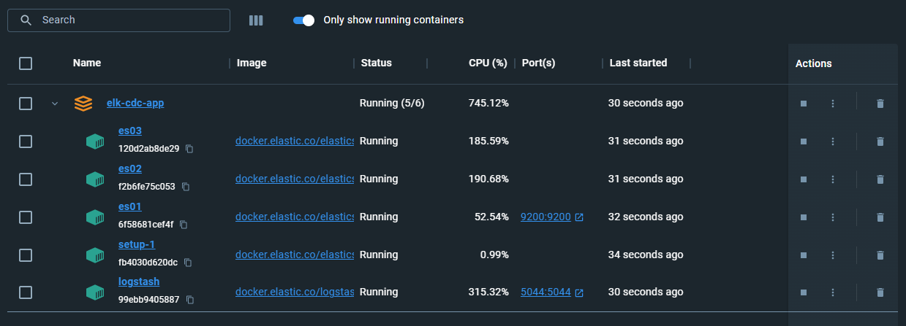
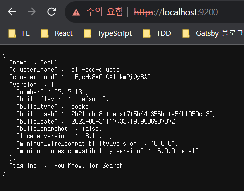
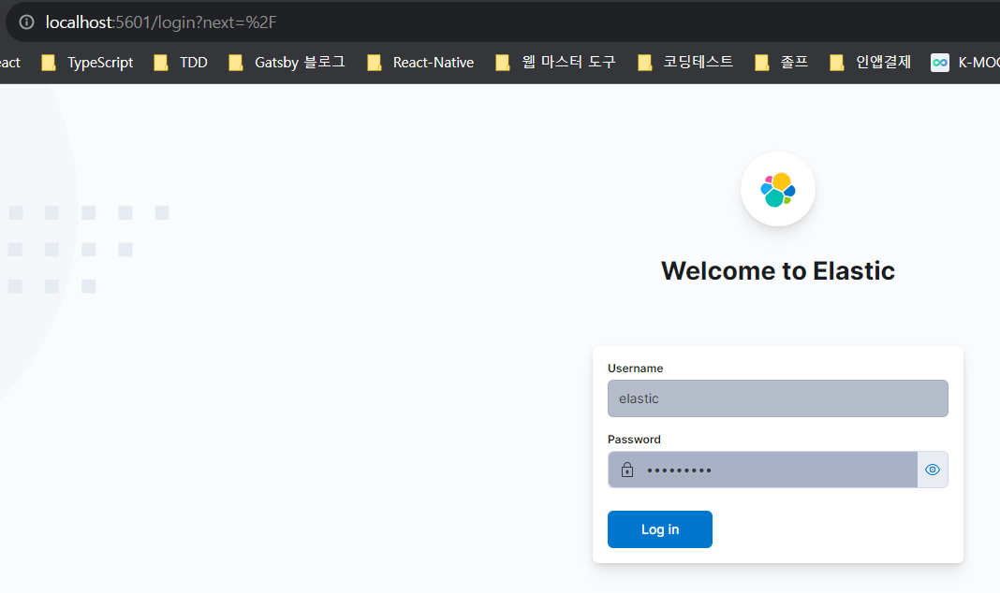

원래는 Airflow 실습 이후, Kafka와 Debezium의 `log-based CDC` 환경 구축을 하려고 했지만, 상대적으로 접근 난이도가 낮은 ELK를 활용한 `query-based CDC`를 다뤄보면서 CDC에 대한 이해와 실습을 진행해보고자 하였다. 우선 큰 방향성 위주로 글을 작성해봤다. 실습을 진행하면서 글을 업데이트 할 예정이다.

# CDC - Change Data Capture
DBMS의 clustering, sharding 등의 고가용성 목표의 이중화에도 활용되거나 DB data pipe-line 구축을 할 때도 사용된다. 핵심은 `DB 데이터의 변경을 감지해서 Event 기반 또는 다양한 형태로 그 내용을 가져온다는 것`이다.

## CDC의 목표
1. 엔터프라이즈 DBMS 스트레스 및 부하 분산
2. 장기 보관 데이터 - 한 번 create되면 update될 일이 거의 없는 data위주 ex) 접속 로그, 매출 데이터, 출생 신고 이력 등의 이관
3. 다양한 text searching optimization 구현  

# log-based CDC vs query-based CDC
- `log-based CDC` : DBMS에서 기본적으로 생성하는 `transaction log`를 기반으로 하며, psql의 경우 wal file, mysql binary log 등을 활용해 CDC 환경을 구성하는 것이다.
- `query-based CDC` : CDC origin(target) DBMS 대상으로 big-query 또는 특정 주기로 schedule된 query를 바탕으로 CDC 환경을 구성하는 것이다.

# docker compose file
- elastic cluster를 3개의 노드로 구성하고 있는 형태이다. 공식 홈페이지의 ELK Stack docker compose를 base로 한다.  
- [Getting started with the Elastic Stack and Docker-Compose](https://www.elastic.co/kr/blog/getting-started-with-the-elastic-stack-and-docker-compose)  
```bash
version: '3'
services:

  setup:
    image: docker.elastic.co/elasticsearch/elasticsearch:${STACK_VERSION}
    volumes:
      - ./certs:/usr/share/elasticsearch/config/certs
    user: "0"
    command: >
      bash -c '
        if [ x${ELASTIC_PASSWORD} == x ]; then
          echo "Set the ELASTIC_PASSWORD environment variable in the .env file";
          exit 1;
        elif [ x${KIBANA_PASSWORD} == x ]; then
          echo "Set the KIBANA_PASSWORD environment variable in the .env file";
          exit 1;
        fi;
        if [ ! -f config/certs/ca.zip ]; then
          echo "Creating CA";
          bin/elasticsearch-certutil ca --silent --pem -out config/certs/ca.zip;
          unzip config/certs/ca.zip -d config/certs;
        fi;
        if [ ! -f config/certs/certs.zip ]; then
          echo "Creating certs";
          echo -ne \
          "instances:\n"\
          "  - name: es01\n"\
          "    dns:\n"\
          "      - es01\n"\
          "      - localhost\n"\
          "    ip:\n"\
          "      - 127.0.0.1\n"\
          "  - name: es02\n"\
          "    dns:\n"\
          "      - es02\n"\
          "      - localhost\n"\
          "    ip:\n"\
          "      - 127.0.0.1\n"\
          "  - name: es03\n"\
          "    dns:\n"\
          "      - es03\n"\
          "      - localhost\n"\
          "    ip:\n"\
          "      - 127.0.0.1\n"\
          > config/certs/instances.yml;
          bin/elasticsearch-certutil cert --silent --pem -out config/certs/certs.zip --in config/certs/instances.yml --ca-cert config/certs/ca/ca.crt --ca-key config/certs/ca/ca.key;
          unzip config/certs/certs.zip -d config/certs;
        fi;
        echo "Setting file permissions"
        chown -R root:root config/certs;
        find . -type d -exec chmod 750 \{\} \;;
        find . -type f -exec chmod 640 \{\} \;;
        echo "Waiting for Elasticsearch availability";
        until curl -s --cacert config/certs/ca/ca.crt https://es01:9200 | grep -q "missing authentication credentials"; do sleep 30; done;
        echo "Setting kibana_system password";
        until curl -s -X POST --cacert config/certs/ca/ca.crt -u "elastic:${ELASTIC_PASSWORD}" -H "Content-Type: application/json" https://es01:9200/_security/user/kibana_system/_password -d "{\"password\":\"${KIBANA_PASSWORD}\"}" | grep -q "^{}"; do sleep 10; done;
        echo "All done!";
      '
    healthcheck:
      test: ["CMD-SHELL", "[ -f config/certs/es01/es01.crt ]"]
      interval: 1s
      timeout: 5s
      retries: 120
    networks:
      - esnet

  es01:
    depends_on:
      setup:
        condition: service_healthy
    image: docker.elastic.co/elasticsearch/elasticsearch:${STACK_VERSION}
    container_name: es01
    hostname: es01
    volumes:
      - ./certs:/usr/share/elasticsearch/config/certs
      - ./esdata01:/usr/share/elasticsearch/data
    ports:
      - ${ES_PORT}:9200
    environment:
      - ELASTIC_PASSWORD=${ELASTIC_PASSWORD}
      - node.name=es01
      - cluster.name=${CLUSTER_NAME}
      - cluster.initial_master_nodes=es01,es02,es03
      - discovery.seed_hosts=es02,es03
      - bootstrap.memory_lock=true
      - xpack.security.enabled=true
      - xpack.security.http.ssl.enabled=true
      - xpack.security.http.ssl.key=certs/es01/es01.key
      - xpack.security.http.ssl.certificate=certs/es01/es01.crt
      - xpack.security.http.ssl.certificate_authorities=certs/ca/ca.crt
      - xpack.security.http.ssl.verification_mode=certificate
      - xpack.security.transport.ssl.enabled=true
      - xpack.security.transport.ssl.key=certs/es01/es01.key
      - xpack.security.transport.ssl.certificate=certs/es01/es01.crt
      - xpack.security.transport.ssl.certificate_authorities=certs/ca/ca.crt
      - xpack.security.transport.ssl.verification_mode=certificate
      - xpack.license.self_generated.type=${LICENSE}
    mem_limit: ${MEM_LIMIT}
    ulimits:
      memlock:
        soft: -1
        hard: -1
    healthcheck:
      test:
        [
          "CMD-SHELL",
          "curl -s --cacert config/certs/ca/ca.crt https://localhost:9200 | grep -q 'missing authentication credentials'",
        ]
      interval: 10s
      timeout: 10s
      retries: 120
    networks:
      - esnet

  es02:
    depends_on:
      - es01
    image: docker.elastic.co/elasticsearch/elasticsearch:${STACK_VERSION}
    container_name: es02
    hostname: es02
    volumes:
      - ./certs:/usr/share/elasticsearch/config/certs
      - ./esdata02:/usr/share/elasticsearch/data
    environment:
      - node.name=es02
      - cluster.name=${CLUSTER_NAME}
      - cluster.initial_master_nodes=es01,es02,es03
      - discovery.seed_hosts=es01,es03
      - bootstrap.memory_lock=true
      - xpack.security.enabled=true
      - xpack.security.http.ssl.enabled=true
      - xpack.security.http.ssl.key=certs/es02/es02.key
      - xpack.security.http.ssl.certificate=certs/es02/es02.crt
      - xpack.security.http.ssl.certificate_authorities=certs/ca/ca.crt
      - xpack.security.http.ssl.verification_mode=certificate
      - xpack.security.transport.ssl.enabled=true
      - xpack.security.transport.ssl.key=certs/es02/es02.key
      - xpack.security.transport.ssl.certificate=certs/es02/es02.crt
      - xpack.security.transport.ssl.certificate_authorities=certs/ca/ca.crt
      - xpack.security.transport.ssl.verification_mode=certificate
      - xpack.license.self_generated.type=${LICENSE}
    mem_limit: ${MEM_LIMIT}
    ulimits:
      memlock:
        soft: -1
        hard: -1
    healthcheck:
      test:
        [
          "CMD-SHELL",
          "curl -s --cacert config/certs/ca/ca.crt https://localhost:9200 | grep -q 'missing authentication credentials'",
        ]
      interval: 10s
      timeout: 10s
      retries: 120
    networks:
      - esnet

  es03:
    depends_on:
      - es02
    image: docker.elastic.co/elasticsearch/elasticsearch:${STACK_VERSION}
    container_name: es03
    hostname: es03
    volumes:
      - ./certs:/usr/share/elasticsearch/config/certs
      - ./esdata03:/usr/share/elasticsearch/data
    environment:
      - node.name=es03
      - cluster.name=${CLUSTER_NAME}
      - cluster.initial_master_nodes=es01,es02,es03
      - discovery.seed_hosts=es01,es02
      - bootstrap.memory_lock=true
      - xpack.security.enabled=true
      - xpack.security.http.ssl.enabled=true
      - xpack.security.http.ssl.key=certs/es03/es03.key
      - xpack.security.http.ssl.certificate=certs/es03/es03.crt
      - xpack.security.http.ssl.certificate_authorities=certs/ca/ca.crt
      - xpack.security.http.ssl.verification_mode=certificate
      - xpack.security.transport.ssl.enabled=true
      - xpack.security.transport.ssl.key=certs/es03/es03.key
      - xpack.security.transport.ssl.certificate=certs/es03/es03.crt
      - xpack.security.transport.ssl.certificate_authorities=certs/ca/ca.crt
      - xpack.security.transport.ssl.verification_mode=certificate
      - xpack.license.self_generated.type=${LICENSE}
    mem_limit: ${MEM_LIMIT}
    ulimits:
      memlock:
        soft: -1
        hard: -1
    healthcheck:
      test:
        [
          "CMD-SHELL",
          "curl -s --cacert config/certs/ca/ca.crt https://localhost:9200 | grep -q 'missing authentication credentials'",
        ]
      interval: 10s
      timeout: 10s
      retries: 120
    networks:
      - esnet

  kibana:
    depends_on:
      es01:
        condition: service_healthy
      es02:
        condition: service_healthy
      es03:
        condition: service_healthy
    image: docker.elastic.co/kibana/kibana:${STACK_VERSION}
    container_name: kibana
    hostname: kibana
    volumes:
      - ./certs:/usr/share/kibana/config/certs
      - ./kibanadata:/usr/share/kibana/data
    ports:
      - ${KIBANA_PORT}:5601
    environment:
      - SERVERNAME=kibana
      - ELASTICSEARCH_HOSTS=["https://es01:9200","https://es02:9200","https://es03:9200"]
      - ELASTICSEARCH_USERNAME=kibana_system
      - ELASTICSEARCH_PASSWORD=${KIBANA_PASSWORD}
      - ELASTICSEARCH_SSL_CERTIFICATEAUTHORITIES=config/certs/ca/ca.crt
    mem_limit: ${MEM_LIMIT}
    healthcheck:
      test:
        [
          "CMD-SHELL",
          "curl -s -I http://localhost:5601 | grep -q 'HTTP/1.1 302 Found'",
        ]
      interval: 10s
      timeout: 10s
      retries: 120
    networks:
      - esnet

networks:
  esnet:
```
- 필수 설정해야할 환경 변수는 아래와 같다. `docker-compose.yml`과 같은 경로에 `.env` 로 만들어서 세팅하자.  
```bash
# Password for the 'elastic' user (at least 6 characters)
ELASTIC_PASSWORD=admin123!

# Password for the 'kibana_system' user (at least 6 characters)
KIBANA_PASSWORD=admin123!

# Version of Elastic products
STACK_VERSION=8.7.0

# Set the cluster name
CLUSTER_NAME=elk-cdc-cluster

# Set to 'basic' or 'trial' to automatically start the 30-day trial
LICENSE=basic
#LICENSE=trial

# Port to expose Elasticsearch HTTP API to the host
ES_PORT=9200

# Port to expose Kibana to the host
KIBANA_PORT=5601

# Increase or decrease based on the available host memory (in bytes)
MEM_LIMIT=1073741824

# Project namespace (defaults to the current folder name if not set)
COMPOSE_PROJECT_NAME=elk-cdc-app
```  
- 8.x version 부터는 보안 인증 세팅이 기본으로 되어있다. 그래서 https를 위한 ssl 인증서가 필요하다. `setup` service가 이를 위해 존재하며, 해당 세팅을 한 뒤에 kill 된다. 실행하고 나면 `certs` 디렉토리가 만들어질텐데 해당 파일이 ssl 인증서이다.

- compose 실행 시, project name을 `elk-cdc-app`로 준다.

## execute 
```bash
docker compose -f ./docker-compose.yml -p elk-cdc-app up -d
```   
해당 명령어로 실행 시, setup이 돌고 ssl를 갱신&생신 이후 es node 가 활성화 되며 뒤이어 kibana가 활성화 된다.  
  
docker desktop 화면에서 정상 실행되고 있는 모습을 볼 수 있다. ES와 Kibana도 확인해보기로 하였다.  
  
  
둘다 정상접속이 된다.


# PostgreSQL & Logstash
`데이터 포털 내의 PostgreSQL DB`와 연결하기 위해 logstash 폴더내의 conf 파일을 다음과 같이 설정해줬다.
```bash
# Sample Logstash configuration for creating a simple
# Beats -> Logstash -> Elasticsearch pipeline.

input {
  jdbc { 
    jdbc_driver_library => "./jar/postgresql-42.6.0.jar"
    jdbc_driver_class => "org.postgresql.Driver"
    jdbc_connection_string => "jdbc:postgresql://${POSTGRES_HOST}:${POSTGRES_PORT}/${POSTGRES_DB}"
    jdbc_user => "${POSTGRES_USER}"
    jdbc_password => "${POSTGRES_PASSWORD}"
    schedule => "* * * * *"
    statement => "select * from tb_table_meta_info"

  }
}

output {
    stdout { codec => json_lines }
}


```

실행 후, Docker log 상에 1분마다 데이터를 SELECT 해와야 하는 내용이 적혀있어야 하지만, 다음과 같은 오류가 발생하였다.
```bash
Error: unable to load ./jar/postgresql-42.6.0.jar from :jdbc_driver_library, file not readable (please check user and group permissions for the path)
```
`PluginLoadingError` 라고 한다. 한 번 해결해보자.

## Trouble Shooting #1 - Exception: LogStash: PluginLoadingError

> 참고글 : [Logstash를 통해 PostgreSQL과 Elastic Stack 연동하기](https://dnai-deny.tistory.com/73)  
  
jdbc_driver_library에 다운로드한 JDBC Driver의 `절대 경로` 값을 넣어줘야 한다고 한다.

```bash
# Sample Logstash configuration for creating a simple
# Beats -> Logstash -> Elasticsearch pipeline.

input {
  jdbc { 
    jdbc_driver_library => "/usr/share/logstash/postgresql-42.6.0.jar"
    jdbc_driver_class => "org.postgresql.Driver"
    jdbc_connection_string => "jdbc:postgresql://${POSTGRES_HOST}:${POSTGRES_PORT}/${POSTGRES_DB}"
    jdbc_user => "${POSTGRES_USER}"
    jdbc_password => "${POSTGRES_PASSWORD}"
    schedule => "* * * * *"
    statement => "select * from tb_table_meta_info"

  }
}

output {
    stdout { codec => json_lines }
}

```

## logstash.conf input 설정
- `jdbc_driver_library`: JDBC 드라이버 JAR 파일의 경로를 설정한다.

- `jdbc_connection_string`: PostgreSQL 데이터베이스에 연결하기 위한 정보를 설정한다.

- `jdbc_user` 및 `jdbc_password`: PostgreSQL 데이터베이스에 액세스하기 위한 사용자 이름 및 비밀번호를 설정한다.

- `jdbc_driver_class`: jdbc를 사용하는 만큼 어떤 jdbc module을 핵심적으로 사용할지 세팅하는 부분이다.

- `statement`: 가져올 데이터를 쿼리로 세팅한다. query based cdc의 가장 핵심적인 부분이 된다.

- `schedule`: query를 실행할 주기를 cron 형태로 세팅한다. 안되어 있으면 한 번 input이 일어난 뒤에 service kill 된다.

- `jdbc_paging_enabled` & `jdbc_page_size`: 위 설정값엔 없지만, select 등의 결과값을 한 번에 너무많이 가져올 경우 target db가 lock 걸릴 리스크가 있다. 특히 target db가 엔터프라이즈 db의 경우 CDC를 위한 query를 던질 때 마다 api가 timeout이 나는 기적을 경험할 수 있다.

    - 이를 위해 pagination 기능을 제공하며 size와 offset값을 활용해 세팅한 row값 만큼만 가져오게 세팅할 수 있으며, jdbc_paging_enabled가 true 여야 jdbc_page_size 를 세팅할 수 있다.
    - [es jdbc official docs](https://www.elastic.co/guide/en/logstash/current/plugins-inputs-jdbc.html#plugins-inputs-jdbc-jdbc_paging_enabled)

## 추가적인 설정
```bash
input {
  jdbc {
    statement => "select * from tb_table_meta_info where table_meta_info_id > :sql_last_value limit :size offset :offset",
    jdbc_paging_enabled => true,
    jdbc_paging_mode => "explicit",
    jdbc_page_size => 100000
  }
}
```
- schedule 마다 실행되는 것은 좋으나, 계속 query의 result를 모두 output으로 준다는 것이다. CDC를 위해서 `마지막으로 읽은 부분을 기억하고 해당 부분 부터 가져와야 한다` 것이 중요하다.

- 가장 먼저 봤던 docker-compose.yml file에서 logstash의 volumes에 잡혀있던 /usr/share/logstash/inspector-index.dat 가 `마지막으로 읽은 row, line을 기록하는 file` 이다. fluented, promtail 등이 사용하는 컨셉이 같다!

- 그래서 볼륨으로 잡아줄 `./logstash/inspector-index.dat`파일을 아래와 같이 구성하고, `logstash.conf`에 설정값을 추가해주기로 하였다.

```bash
input {
    jdbc {
		# ...생략
        # 추가 및 수정된 설정값
        use_column_value => true
        tracking_column => table_meta_info_id
        last_run_metadata_path => "/usr/share/logstash/inspector-index.dat"
        statement => "select * from tb_table_meta_info where table_meta_info_id > :sql_last_value order by id ASC"
    }
}
```
- `use_column_value`: 해당 값이 true여야 statement에 sql_last_value 변수를 사용할 수 있으며, file로 저장되는 id 값 metadata를 저장하고 가져올 수 있다.

- `tracking_column`: 마지막에 읽은 값 기준을 잡아줄 컬럼 명을 설정하는 값이다. 기본적으로 auto increment 세팅이 되어있는 값을 pk로 잡으니, 해당 값을 기준으로 잡으면 좋다. 그리고 값은 numeric 또는 timestamp 를 가지며 기본값은 numeric 이다!

- `last_run_metadata_path`: 마지막에 읽은 값을 저장할 file path를 세팅한다. 위 compose yaml에서 세팅한 볼륨 경로로 맞춰주면 된다.

- `statement` 값 역시 위 설정에 맞춰서 바뀌었다. 그리고 "마지막에 읽은 값" 이기 때문에 select order by를 꼭 "ASC" 로 세팅해야한다.

이제 다시 실행해보면 inspector-index.dat 이 업데이트 되면서 매 분 query가 실행될 때 마다 같은 결과 값이 아닌 추가된 값만 출력되는 것을 볼 수 있다.

# 참고링크

- [Elasticsearch - ELK stack & PostgreSQL & Logtash, query based CDC 만들기 by docker compose](https://velog.io/@qlgks1/Elasticsearch-ELK-stack-Postgresql-Logstash-query-based-CDC-%EB%A7%8C%EB%93%A4%EA%B8%B0-by-docker-compose)