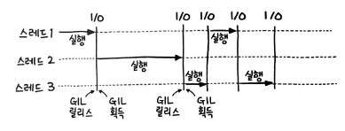

스택과 큐의 연산을 모두 갖고 있는 복합 자료형인 데크와 추출 순서가 일정하게 정해져 있지 않은 우선순위 큐에 대해 공부한 내용을 정리해보았다.

# 데크
데크의 정의는 다음과 같다.
> 데크(Deque)는 더블 엔디드 큐의 줄임말로, 양쪽 끝에서 삽입과 삭제가 모두 가능한 큐이다. 큐를 일반화한 형태의 추상 자료형(ADT)

`양쪽에서 삭제와 삽입` 을 모두 처리 가능하다. 스택과 큐의 연산을 모두 갖고 있는 복합 자료형이다. 이중 연결리스트라고 생각하면 편리하다.  

## 26. 원형 데크 디자인
## 풀이 1. 이중 연결 리스트를 이용한 데크 구현
원형 큐와는 다른점은, `맨 앞에 요소를 추가하는 작업`이 추가된 점이다.

# 우선순위 큐
우선순위 큐의 정의는 다음과 같다.
> 큐 또는 스택과 같은 추상자료형과 유사하지만, 추가로 각 요소의 `우선순위`와 연관되어있다.

어떠한 특정 조건에 따라 우선순위가 가장 높은 요소가 추출되는 자료형이다.  
이는 `정렬 알고리즘`을 사용하면 우선순위 큐를 만들 수 있다는 의미이기도 하다.

# 27. k개 정렬 리스트 병합
- 입력
[
	1->4->5,  
	1->3->4,  
	2->6
]
- 출력
1->1->2->3->4->4->5->6
## `풀이 1. 우선순위 큐를 이용한 리스트 병합`
우선순위 큐 풀이에 거의 항상 `heapq` 모듈을 사용하므로 이를 사용해보았다.
```py
def mergeKLists(lists: List[ListNode]) :
		root = result = ListNode(None)
		heap = []

		for i in range(len(lists)) :
				if lists[i] :
						heapq.heappush(heap, (lists[i].val, i, lists[i]))

		while heap :
				node = heapq.heappop(heap)
				idx = node[1]
				result.next = node[2]

				result = result.next
				if result.next :
						heapq.heappush(heap, (result.next.val, idx, result.next))

		return root.next
```

# PriorityQueue vs heapq
파이썬에서 우선순위 큐는 queue모듈의 PriorityQueue 클래스를 이용하여 쓸 수 있다.
그러나, 우선순위 큐는 `힙`을 사용해 주로 구현하며 파이썬의 PriorityQueue 조차 내부적으로는 heapq를 사용하도록 구현되어 있다.   
PriorityQueue는 `멀티스레드` 환경에서 사용하기 위해 만들어진 클래스이고, heapq는 `단일 스레드` 환경에서 사용하기 위해 만들어진 모듈이다. 즉, PriorityQueue는 Thread-Safe 하다. 내부적으로 락킹을 제공한다는 의미이기도 하다.  
그래서, `락킹 오버헤드` 가 발생해 성능에 영향을 끼칠 수도 있다.  
따라서, 굳이 멀티 쓰레드로 구현할 필요가 없다면 heapq를 사용하는 것이 좋다.

# 파이썬 전역 인터프리터 락(GIL)
Global Interpreter Lock, 파이썬의 인터프리터는 한 번에 하나의 스레드만 실행할 수 있다.
이는 파이썬이 CPython 인터프리터를 사용하기 때문이다. 하나의 스레드가 자원을 독점하는 형태로 실행이 된다.  

그림에서 보듯이, 파이썬은 멀티 쓰레드를 사용할 때, `GIL`을 획득한 스레드만이 자원을 사용할 수 있도록 제한한다.
지금처럼 멀티 코어가 당연한 세상에서, 하나의 스레드가 자원을 독점하는 형태로 실행되는 제약은 매우 치명적이라 할 수 있다.  
