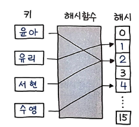
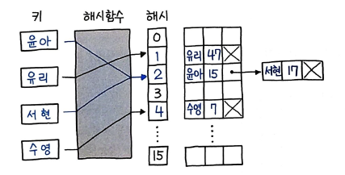
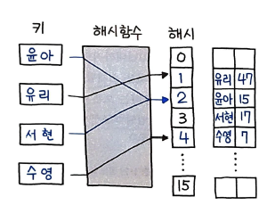
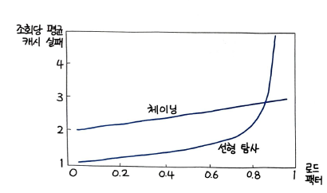

# 해시 테이블
> 해시 테이블 또는 해시 맵은 키를 값에 매핑할 수 있는 구조인, 연관 배열 추상 자료형(ADT)을 구현하는 자료구조이다.

해시 테이블의 가장 큰 특징은 대부분의 연산이 분할 상환 분석에 따른 시간 복잡도가 `O(1)`이라는 점이다. 이는 해시 테이블의 가장 큰 장점이기도 하다. 하지만 이러한 특징 때문에 해시 테이블의 가장 큰 단점은 해시 충돌이다. 해시 충돌이 발생하면 해시 테이블의 성능이 급격히 저하되기 때문에, 해시 충돌을 해결하는 방법에 대해서도 알아보자.

# 해시
> 해시 함수란, 임의 크기 데이터를 고정 크기 값으로 매핑하는 데 사용할 수 있는 함수이다.

해시 테이블을 인덱싱하기 위해 해시 함수를 사용하는 것을 `해싱`이라고 한다.  
여기서 주의해야할 점이 바로 `충돌` 이다. 해시 함수는 임의 크기의 데이터를 고정 크기의 값으로 매핑하는 함수이기 때문에, 해시 함수의 결과값이 같은 경우가 발생할 수 있다. 이를 `해시 충돌`이라고 한다.

# 비둘기집 원리
> n개 아이템을 m개 컨데이너에 넣을 때, n > m 이라면 적어도 하나의 컨테이너에는 반드시 2개 이상의 아이템이 들어 있다는 원리

비둘기 집 원리와 같게, 해시 테이블에서도 해시 충돌이 발생할 수 있다.
해시 충돌이 발생하면, 해시 테이블의 성능이 급격히 저하되기 때문에, 해시 충돌을 가급적 최소화하는 것이 중요하다.

# 로드 팩터
> 해시 테이블에 저장된 데이터 갯수 n을 버킷의 갯수 k로 나눈 것 이다.

# 해시 함수
해시 테이블을 인덱싱하기 위해 해시 함수를 사용하는 것을 `해싱`이라고 하고, 해시 함수는 임의 크기의 데이터를 고정 크기의 값으로 매핑하는 함수이다.
  
해싱에는 다양한 알고리즘이 있지만, 가장 단순하면서도 널리 쓰이는 `정수형 해싱 기법`인 `모듈로 연산을 이용한 나눗셈` 을 살펴보았다.  

# 충돌
아무리 좋은 해시 함수여도 충돌은 발생하게 된다. 충돌이 발생할 경우 어떤 식으로 처리하게 되는지 살펴보자.

## 개별 체이닝
개별 체이닝은 해시 충돌이 발생하면, 충돌이 발생한 버킷에 연결 리스트를 추가로 생성하여, 연결 리스트에 충돌된 데이터를 추가하는 방식이다.
  

원리를 요약하면 다음과 같다.
1. 키의 해시 값을 계산한다.
2. 해시 값을 이용해 배열의 인덱스를 구한다.
3. 같은 인덱스가 있다면 연결 리스트로 연결한다.

잘 구현한 경우, 대부분의 탐색은 O(1)의 시간 복잡도를 가지지만, 최악의 경우, 즉 모든 해시 충돌이 발생하면 O(n)의 시간 복잡도를 가진다. 

## 오픈 어드레싱
충돌 발생시, 탐사(Probing)를 통해 빈 공간을 찾아나서는 방식이다.  
개별 체이닝 방식과 달리, 모든 원소가 반드시 자신의 해시값과 일치하는 일치하는 주소에 저장된다는 보장이 없다.

가장 가까운 다음 빈 위치를 탐사해 새 키를 삽입한다.  
선형 탐사의 한 가지 문제점은 해시 테이블에 저장되는 데이터들이 고르게 분포되지 않고 뭉치는 경향이 있다는 점이다.  
해시 테이블 여기저기에 연속된 데이터 그룹이 생기는 이러한 현상을 `클러스터링` 이라 하는데, 클러스터들이 점점 커지게 되면 인근 클러스터들과 서로 합쳐지는 일이 발생한다. 그렇게되 되면 해시 테이블의 특정 위치에는 데이터가 몰리게 되고, 다른 위치에는 상대적으로 데이터가 거의 없는 상태가 될 수 있다. 이러한 클러스터링 현상은 탐사 시간을 오래 걸리게 하며, 전체적으로 해싱 효율을 떨어뜨리는 원인이 된다.  
이러한 문제를 해결하기 위해, `이차 탐사` 를 사용한다. 이차 탐사는 해시 테이블의 크기가 소수(prime number)인 경우에만 사용할 수 있다.  
오픈 어드레싱은 버킷 사이즈보다 큰 경우에는 삽입할 수 없다. 따라서 일정 이상 채워지면, 즉 기준이 되는 로드 팩터 비율을 넘어서게 되면, `그로스 팩터` 의 비율에 따라 더 큰 크기의 또 다른 버킷을 생성한 후 여기에 새롭게 복사하는 `리해싱` 작업이 일어난다.  
## 언어별 해시 테이블 구현 방식
파이썬에서는 `딕셔너리`가 해시 테이블의 구현체이다. 그리고 파이선의 해시 테이블에서 충돌 발생 시, `오픈 어드레싱` 방식을 사용한다.  
CPython 구현에는 다음과 같이 주석이 적혀있다.  
> 체이닝 시 malloc으로 메모리를 할당하는 오버헤드가 높아 오픈 어드레싱을 택했다.  

파이썬이 체이닝을 사용하지 않는 이유 중 하나는, 체이닝을 사용하면 `메모리 할당`을 해야하기 때문에 오버헤드가 발생하기 때문이다. 추가 메모리 할당은 상대적으로 느린 작업이기 때문이기도 하다.  
그러면 왜 오픈 어드레싱일까??


선형 탐사의 경우, 슬롯의 80% 이상이 차게 되면 급격한 성능 저하가 일어나며 체이닝과 달리 전체 슬롯의 전체 개수 이상, 즉 로드 팩터 1 이상은 저장할 수 없다.  
그래서, 로드 팩터를 작게 잡아 성능 저하 문제를 해결한다.

# 28. 해시맵 디자인
## 풀이 1. 개별 체이닝 방식을 이용한 해시 테이블 구현
편리하기 구현하기 위해 존재하지 않는 키를 조회할 경우 자동으로 디폴트를 생성해주는 `collections.defaultdict`를 사용했다.

```python
class MyHashMap : 
	# 초기화
	def __init__(self) :
		self.size = 1000
		self.table = collections.defaultdict(ListNode)

	# 삽입
	def put(self, key, value) :
		index = key % self.size

		# 인덱스에 노드가 없다면 삽입 후 종료
		if self.table[index].value is None : 
			self.table[index] = ListNode(key, value)
			return

		# 인덱스에 노드가 있다면 연결 리스트 처리
		p = self.table[index]
		while p:
			if p.key == key :
				p.value = value
				return
			if p.next is None :
				break
			p = p.next
		p.next = ListNode(key, value)

	# 조회
	def get(self, key) :
		index = key % self.size

		# 인덱스에 노드가 없다면 -1 반환
		if self.table[index].value is None :
			return -1

		# 인덱스에 노드가 있다면 연결 리스트 처리
		p = self.table[index]
		while p :
			if p.key == key :
				return p.value
			p = p.next
		return -1

	# 삭제
	def remove(self, key) :
		index = key % self.size

		# 인덱스에 노드가 없다면 종료
		if self.table[index].value is None :
			return

		# 인덱스에 노드가 있다면 연결 리스트 처리
		p = self.table[index]
		if p.key == key :
			self.table[index] = ListNode() if p.next is None else p.next
			return

		# 삭제하려는 노드가 연결 리스트의 중간에 있다면
		prev = p
		while p :
			if p.key == key :
				prev.next = p.next
				return
			prev, p = p, p.next


```


# 29. 보석과 돌
J는 보석이며, S는 갖고 있는 돌이다. S에는 보석이 몇 개나 있을까? 이를 구하는 문제이다.

## 풀이 1. 해시 테이블을 이용한 풀이
갖고 있는 돌 S의 각각의 개수를 모두 헤아린 다음, J의 각 요소를 키로 하는 각 개수를 합산하면 풀이할 수 있다.

```py
freqs = {}

for char in S :
	if char not in freqs :
		freqs[char] = 1
	else :
		freqs[char] += 1

```
먼저 freqs 라는 해시테이블을 선언한다음, S를 문자 단위로 하나씩 분리해 반복한다. 각 문자를 키로 하는 값이 없다면 1을, 있다면 1을 더해준다.

```py
{
	'a': 1,
	'A': 2,
	'b': 4
}
```
다음과 같이 저장이 된다.  
이제 이 중에서 보석을 나타내는 J의 문자를 다음과 같이 꺼내어 해당 문자의 빈도 수를 합하면 최종 결과가 된다.
```py
count = 0
for char in J :
	if char in freqs :
		count += freqs[char]
```


## 풀이 2. defaultdict를 이용한 비교 생략
존재하지 않는 키에 대해 디폴트를 리턴해주는 풀이를 가끔씩 사용한 바 있다. 이를 이용하면 풀이 1의 코드를 더욱 줄일 수 있다.

```py
def numJewelsInStones(self, J, S) :
	freqs = collections.defaultdict(int)
	count = 0

	for char in S :
		freqs[char] += 1

	for char in J :
		count += freqs[char]

	return count
```


## 풀이 3. Counter로 계산 생략
Counter를 사용하면 코드를 더욱 짧게 줄이기 가능하다. `각 개수를 계산하는 부분까지 자동으로 처리할 수 있기 때문`이다.

```py
def numJewelsInStones(self, J, S) :
	freqs = collections.Counter(S)
	count = 0

	# 비교 없이 보석(J) 빈도 수 합산
	for char in J :
		count += freqs[char]

	return count
```
아울러 Counter는 존재하지 않는 키의 경우 KeyError를 발생하는 게 아니라 `0을 출력` 해주기 때문에, defaultdict와 마찬가지로 에러에 대한 예외 처리를 할 필요가 없다. 실행 속도 또한 동일하다.

## 풀이 4. 파이썬다운 방식
해시 테이블과는 관련 없지만, 파이썬다운 방식으로 단 한줄로 계산 가능하다.
```py
def numJewelsInStones(self, J, S) :
	return sum(s in J for s in S)

```
`리스트 컴프리헨션`을 출력해보면 좀 더 직관적으로 이해할 수 있다.
```py
>>> [s for s in S]
['a', 'A', 'A', 'b', 'b', 'b', 'b']
```
`in` 연산자는 리스트에 해당 원소가 존재하는지를 판단한다. 따라서 `s in J`는 J에 s가 존재하는지를 판단하게 된다. 이를 리스트 컴프리헨션으로 묶어주면, `S에 존재하는 문자 중 J에 존재하는 문자의 개수를 계산`할 수 있다.
```py
>>> [s in J for s in S]
[True, True, True, False, False, False, False]
```
이를 `sum` 함수로 묶어주면, `True의 개수`를 계산하게 되어, `J에 존재하는 문자의 개수`를 계산할 수 있다.
```py
>>> sum(s in J for s in S)
3
```
리스트 컴프리헨션을 의미하는 앞뒤의 대괄호 [] 는 위의 코드처럼 제거 가능하다.  
풀이 1부터 4의 실행속도는 모두 동일하다고 볼 수 있다.

# `30. 중복 문자 없는 가장 긴 부분 문자열`

중복 문자가 없는 가장 긴 부분 문자열의 길이를 리턴하라.
- 입력
"abcabcbb"
- 출력
3

## 풀이 1. 슬라이딩 윈도우, 투 포인터로 사이즈 조절
슬라이딩 윈도우로 한 칸씩 우측으로 이동하면서 윈도우 내에 모든 문자가 중복이 없도록 투 포인터로 윈도우 사이즈를 조절하면서 풀이하는 방식이다.  
시작은 포인터 2개 모두 왼쪽에서 출발하는 방식이다. 각각 왼쪽 시작점에서 출발해 두 번째 포인터는 다음과 같이 계속 오른쪽으로 확장한다.
```py
for index, char in enumerate(s) :
	if char in used: 
		# 이미 등장했던 문자라면 '왼쪽 포인터' 조절
		start = max(start, used[char] + 1)
	else :
		...
```
여기서 만약 이미 등장한 문자라면 used에 있을 것이고 이 경우 첫 번째 포인터인 start를 used[char] + 1 위치로 갱신한다.  
처음 보는 문자라면 다음과 같이 처리한다.
```py
for index, char in enumerate(s) :
	if char in used :
		...
	else :
		max_length = max(max_length, index - start + 1)

```
이제 used[char] 는 현재 문자로 키로 하는 `해시 테이블` 이며, `값`은 현재 문자의 위치로 한다.  
그런데, 현재 슬라이딩 윈도우의 바깥에 있는 문자는 예전에 등장한 적이 있더라도, 지금은 무시해야 하기 때문에 다음과 같이 and 이후에 조건 start <= used[char]를 추가한다.
```py
for index, char in enumerate(s) :
	if char in used and start <= used[char] :
		start = max(start, used[char] + 1)
	else :
		...
```
이제 전체 코드는 다음과 같다.
```py
def lengthOfLongestSubstring(self, s: str) -> int:
	used = {}
	max_length = start = 0
	for index, char in enumerate(s) :
		# 이미 등장했던 문자라면 'start' 위치 갱신
		if char in used and start <= used[char] :
			start = max(start, used[char] + 1)
		else : # 최대 부분 문자열 길이 갱신
			max_length = max(max_length, index - start + 1)
		used[char] = index
	return max_length
```

# 31. 상위 K 빈도 요소
상위 k번 이상 등장하는 요소를 추출하라.
- 입력
nums = [1,1,1,2,2,3], k = 2
- 출력
[1, 2]

## 풀이 1. Counter를 이용한 음수 순 추출
요소의 값을 키로 하는 `해시 테이블`을 만들고, 여기에 값으로 등장 횟수를 저장한다.  
`우선순위 큐` 를 이용해 상위 k번 만큼 추출하면 k번 이상 등장하는 요소를 손쉽게 추출할 수 있다.  
파이썬에서 우선순위 큐는 힙을 활용하는 `heapq` 모듈을 사용한다.  
빈도 수는 `collections.Counter` 모듈을 사용해 추출할 수 있다.  
```py
freqs = collections.Counter(nums)
```
입력값이 [1, 1, 1, 2, 2, 3]일 때, freqs의 결과를 출력해보면 다음과 같다.
```py
>>> type(s.freqs)
collections.Counter

>>> s.freqs
Counter({1: 3, 2: 2, 3: 1}) # 키: 리스트의 숫자 값, 값: 등장 횟수
```
이제 힙에 삽입하면 된다.  
삽입 방식은 2가지가 있는데, 첫 째는 일반적인 파이썬의 리스트에 모두 삽입한 다음 마지막에 `heapify()`를 하는 방식과, 두 번째는 매번 `heappush()`를 하는 방식이다. heappush() 로 삽입하게 되면 매번 heapify() 가 일어나기 때문에 별도로 처리할 필요가 없다. 이 문제에선 후자인 heappush()로 처리하는 방식을 사용한다.
```py
for f in freqs :
	heapq.heappush(freqs_heap, (-freqs[f], f))
```
여기서는 빈도 수를 키로하고, freqs의 키를 값으로 했다. 즉, 키/값을 바꿔서 힙에 추가했다. 힙은 `키 순서대로 정렬`되기 때문에 빈도 수를 키로 한 것이다.  
값을 음수로 바꾼 이유는 파이썬의 힙은 최소 힙이기 때문이다. `가장 빈도수가 높은 값이 가장 큰 음수`가 되므로, `최소 힙으로 빈도 수가 가장 높았던 값을 추출`할 수 있다.  
마지막으로 `heappop()` 으로 k번만큼 값을 추출하면 결과를 얻을 수 있다.
```py
topk = list()
for _ in range(k) :
	topk.append(heapq.heappop(freqs_heap)[1])
```

## 풀이 2. 파이썬다운 방식
상위 k번만큼의 요소를 추출하기 위해, 힙에 넣고 빼는 작업들을 진행하였다. 이 작업을 자동으로 할 수도 있다.  
Counter의 `most_common()`이라는 빈도 수가 높은 순서대로 아이템을 추출해준다.
```py
>>> collections.Counter(nums).most_common(k)
[(1, 3), (2, 2)]
```

이제 여기서 정답인 1과 2를 추출하기만 하면 된다.  
파이썬의 2가지 기능인 `zip()` 과 `*(별표)` 를 더 활용할 수 있다.

```py
def topKFrequent(self, nums: List[int], k: int) -> List[int]:
	return list(zip(*collections.Counter(nums).most_common(k)))[0]
```

# zip() 함수
2개 이상의 시퀀스를 짧은 길이를 기준으로 일대일 대응하는 새로운 튜플 시퀀스를 만드는 역할을 한다.  
```py
>>> a = [1, 2, 3, 4, 5]
>>> b = [2, 3, 4, 5]
>>> c = [3, 4, 5]
>>> zip(a, b)
<zip object at 0x105b6d9b0>

```
파이썬 3+ 에서부터는 제너레이터를 리턴하므로 실젯값을 추ㅜㄹ하기 위해서는 list() 로 한번 더 묶어주면 된다.

```py
>>> list(zip(a, b))
[(1, 2), (2, 3), (3, 4), (4, 5)]

>>> list(zip(a, b, c))
[(1, 2, 3), (2, 3, 4), (3, 4, 5)]
```

# 아스테리스크(*)
zip() 의 파라미터는 1개가 될 수도 있고, 10개가 될 수도 있다.  
파이썬에서 * 는 `언팩(Unpack)` 이다. 시퀀스 언패킹 연산자로 말 그대로 시퀀스를 풀어헤치는 연산자를 뜻하며, 주로 튜플이나 리스트를 언패킹하는 데(풀어 헤처는 데) 사용한다.
```py
>>> collections.Counter(nums).most_common(k)
[(1, 3), (2, 2)]

# 언패킹을 했을 때(31번 문제 풀이 #2)
>>> list(zip(*collections.Counter(nums).most_common(k)))
[(1, 2), (3, 2)]

# 언패킹을 하지 않았을 때
>>> list(zip(collections.Counter(nums).most_common(k)))
[((1, 3),), ((2, 2),)]
```
언패킹을 하지 않으면, 위와 같이 튜플이 풀어지지 않고 그대로 하나의 값처럼 묶여버린다. * 로 언패킹을 해줘야 튜플의 값을 풀어 헤칠 수 있다.  
다음의 예시를 살펴보자.

```py
>>> fruits = ['lemon', 'pear', 'watermelon', 'tomato']
>>> fruits
['lemon', 'pear', 'watermelon', 'tomato']
```
위의 리스트를 `언패킹` 해주면 다음과 같이 매우 간편하게 출력이 가능하다.
```py
>>> print(*fruits)
lemon pear watermelon tomato
```
이외에도 * 는 활용도가 많다. 언패킹뿐만 아니라 함수의 파라미터가 되었을 때는 반대로 `패킹(Packing)`도 가능하다.  
파라미터가 여러 개인 함수를 호출할 때, 파라미터를 하나의 튜플로 묶어서 전달할 수 있다.  
```py
>>> def f(*params) :
...     print(params)
...
>>> f(1, 2, 3)
(1, 2, 3)
```
이처럼 하나의 파라미터를 받는 함수에 3개의 파라미터를 전달했지만, params 변수 하나로 패킹되어 처리된다.  
다음과 같이 또 다른 활용 예를 살펴보자
```py
>>> a, *b = [1, 2, 3, 4]
>>> a
1
>>> b
[2, 3, 4]
>>> *a, b = [1, 2, 3, 4]
>>> a
[1, 2, 3]
>>> b
4
```
일반적인 변수는 값을 하나만 취하지만 * 로 처리하게 되면 나머지 모든 값을 취하게 된다.  
`*`는 파이썬에서 매우 중요하며 자주 쓰이는 기능 중 하나이므로 반드시 숙지하도록 하자.  
마지막으로 하나가 아닌 2개를 쓰는 경우도 있다. 파이썬에서 * 는 1개는 튜플 또는 리스트 등의 시퀀스 언패킹이고, ** 2개는 다음과 같이 키/값 페어를 언패킹하는 데 사용된다.

```py
>>> date_info = { 'year': '2020', 'month': '08', 'day': '15' }
>>> new_info = { **date_info, 'day' : '14' }
>>> new_info
{'year': '2020', 'month': '08', 'day': '14'}
```
위의 예시를 보면, ** 를 사용하여 date_info 딕셔너리의 키/값 페어를 언패킹하였다. 여기서 'day' : "14" 는 기존의 키/값 페어를 덮어쓰게 된다.