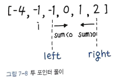

파이썬 알고리즘 인터뷰 책의 3부 7장을 읽고 나서 그 내용을 정리해보았다.

# 07. 두 수의 합
매우 쉬운 난이도의 문제에 속하지만, 최적화할 수 있는 여러 가지 방법이 숨어 있어서 코딩 인터뷰 시 높은 빈도로 출제가 된다고 한다.

## 풀이 1. 브루트 포스로 계산
배열을 2번 반복하면서 모든 조합을 더해서 일일이 확인해보는 무차별 대입 방식인 `브루트 포스(Brute-Force)` 로 문제를 해결하였다.  
시간복잡도가 O(n^2) 이고 `5,284ms`나 소요된다. 굉장히 비효율적인 방법이여서 좀 더 최적화할 수 있는 방법들을 살펴보았다.

## 풀이2. in 을 이용한 탐색

```python
def twoSum(self, nums: List[int], target: int) -> List[int]:
	for i, n in enumerate(nums) :
		complement = target - n

		if complement in nums[i + 1:] :
			return [nums.index(n), nums[i + 1:].index(complement) + (i + 1)]
```
in 의 시간복잡도는 O(n) 이여서 이전과 동일한 O(n^2)이지만 같은 시간복잡도라도 in 연산쪽이 훨씬 더 가볍고 빠르다.  
이 풀이의 경우 파이썬의 내부 함수로 구현된 in 은 파이썬 레벨에서 매번 값을 비교하는 것에 비해 훨씬 더 빨리 실행된다.  
실제로 `864ms` 만에 실행이 가능하다.

## 풀이3. 첫 번째 수를 뺸 결과 키 조회
```python
def twoSum(self, nums: List[int], target: int) -> List[int]:
	nums_map = {};

	# 키와 값을 바꿔서 딕셔너리로 저장
	for i, num in enumerate(nums) :
		nums_map[num] = i

	# 타켓에서 첫 번째 수를 뺀 결과를 키로 조회
	for i, num in enumerate(nums):
		if target - num in nums_map and i != nums_map[target_num] :
			return [i, nums_map[target - num]] 
```
타켓에서 첫 번쨰 수를 빼면 두 번쨰 수를 바로 알아낼 수 있다.  
딕셔너리는 해시 테이블로 구현되어 있고, 이 경우 조회느 평균적으로 O(1)에 가능하다. 불과 `48ms` 만에 실행된다.

## 풀이4. 조회 구조 개선
`딕셔너리 저장` 과 `조회`를 2개의 for문으로 각각 처리했던 방식을 좀 더 개선해서 하나의 for문으로 합친 풀이이다.  
굳이 전체를 모두 저장하지 않고도 정답을 찾게 되면 함수를 바로 빠져나올 수 있는 장점이 있다. 그러나, 두 번째 값을 찾기 위해 어차피 매번 비교해야 하기 때문에  
앞의 풀이와 성능은 비슷하다.
```py
def twoSum(self, nums: List[int], target: int) -> List[int]:
	nums_map = {}
	# 하나의 for문으로 통합
	for i, num in enumerate(nums) :
		if target - num in nums_map :
			return [nums_map[target - num], i]
		nums_map[num] = i
```
실행속도가 `44ms` 이므로, 앞의 풀이와 큰 차이가 없다. 그러나 한결 코드가 간결해졌다.

## 풀이5. 투 포인터 이용
양쪽 끝에서 2개의 포인터를 이용하여 두 수의 합을 타켓과 비교하면서 포인터를 이동시키는 방식이다.
```py
def twoSum(self, nums: List[int], target: int) -> List[int]:
	left, right = 0, len(nums) - 1
	while not left == right:
		# 합이 타켓보다 작으면 왼쪽 포인터를 오른쪽으로
		if nums[left] + nums[right] < target:
			left += 1
		# 합이 타켓보다 크면 오른쪽 포인터를 왼쪽으로
		elif nums[left] + nums[right] > target :
			right -= 1
		else :
			return [left, right]
		
```
투 포인터의 시간 복잡도도 O(n) 이다. 하지만 이 풀이가 제대로 작동하려면 배열이 `정렬된 상태`여야 한다.  

하지만 우리는 인덱스를 찾아야하는데, 정렬을 해버리면 `인덱스가 섞여버리기 때문`에 곤란해진다.

# `08. 빗물 트래핑`

## 풀이 1. 투 포인터를 최대로 이동
이 문제는 높이와 너비 모든 공간을 차례대로 모두 살펴보면 O(n^2)에 풀이가 가능하다.  
그러나, 너무 비효율적이기 때문에 효율적인 방법을 활용해야한다. 투 포인터나 스택으로 O(n) 풀이가 가능하다.
```py
def trap(self, height: List[int]) -> int :
	if not height: 
		return 0
	
	volume = 0
	left, right = 0, len(height) - 1
	left_max, right_max = height[left], height[right]
	
	while left < right :
		left_max, right_max = max(height[left], left_max),
													max(height[right], right_max)

		# 더 높은 쪽을 향해 투 포인터 이동
		if left_max <= right_max :
			volume += left_max - height[left]
			left += 1
		
		else :
			volume += right_max - height[right]
			right -= 1
		
		return volume
```
아직 완벽히 이해가 되지 않아서 다시 한번 봐야 할 것 같다.

## 풀이 2. 스택 쌓기
스택을 쌓아 나가면서 현재 높이가 이전 높이보다 높을 때, 즉 꺾이는 부분 변곡점을 기준으로 격차만큼 물 높이를 채운다.  
한 번씩만 조회하기 때문에 마찬가지로 O(n)에 풀이가 가능하다.
```py
def trap(self, height: List[int]) -> int :
	stack = []
	volume = 0

	for i in range(len(height)) :
		# 변곡점을 만나는 경우
		while stack and height[i] > height[stack[-1]] :
			# 스택에서 꺼낸다.
			top = stack.pop()

			if not len(stack) :
				break

			# 이전과의 차이만큼 물 높이 처리
			distance = i - stack[-1] - 1
			waters = min(height[i], height[stack[-1]]) - height[top]

			volume += distance * waters

		stack.append(i)
	return volume
```
이 문제는 상당히 어려운 문제이다. 특히 스택 쌓기 풀이는 직관적으로 떠올리기가 쉽지 않을 뿐더러 풀이 방법 또한 많이 고민해봐야겠다.

# 09. 세 수의 합

## 풀이 1. 브루트 포스로 계산
O(n^3) 이 걸리겠지만, 타임아웃이 발생할 것 이다. 이 문제는 시간복잡도를 O(n^2) 으로 줄이기를 요구할 것 이다.
우선 배열을 정렬해준다. 팀소트의 .sort() 를 이용하면 되고, `O(nlogn)` 이 걸린다.  
삼중 for문을 순회하면서, 중복된 값이 있을 수 있으므로 이 경우 다음과 같이 `continue` 로 건너뛰도록 처리해준다.

```py
if i > 0 and nums[i] == nums[i - 1] :
	continue
```
결국 타임아웃이 발생한다. O(n^2) 이내로 최적화 할 수 있는 방법을 찾아야 한다.

## 풀이 2. 투 포인터로 합 계산
i를 축으로 하고, 중복된 값을 건너뛰게 한 부분은 앞의 풀이와 동일하다.
```py
for i in range(len(nums - 2)) :
	if i > 0 and nums[i] == nums[i - 1] :
		continue
```
i의 다음 지점과 마지막 지점을 그림과 같이 left, right 로 설정하고 간격을 좁혀가면서 sum 을 계산하는 방식이다.  


앞의 풀이가 타임아웃이 발생한다면, 이 풀이는 `884ms`가 걸린다.

# 투 포인터
시작점과 끝점 또는 왼쪽 포인터와 오른쪽 포인터 두 지점을 기준으로 하는 문제 풀이 전략을 뜻한다.  
범위를 좁혀나가기 위해서는, 일반적으로 배열이 정렬되어 있을 때 좀 더 유용하다.

# 10. 배열 파티션 I
n개의 페어를 이용한 min(a, b)의 합으로 만들 수 있는 가장 큰 수를 출력하라.

## 풀이 1. 오름차순 풀이
처음에는 이해가 잘 안되었는데, 찬찬히 이해해보니 결국 min()이 되도록 커야한다는 뜻이고 뒤에서부터 내림차순으로 집어넣으면 항상 최대 min() 페어를 유지할 수 있다.  
`정렬된 상태` 에서 앞에서부터 오름차순으로 `인접 요소 페어` 를 만들면 가장 큰 a1 과 a2 페어들을 만들 수 있고 이 페어들의 합이 곧 만들 수 있는 최대합이 된다. `332ms` 가 걸린다.

## 풀이 2. 짝수 번째 값 계산
사실 페어에 대해 일일이 min 값을 구하지 않아도 짝수 번째 값(0부터 시작하므로)을 더하면 더 빠르게 해결가능하다.

```py
def arrayPairSum(list) :
	sum = 0
	nums.sort()

	for i, n in enumerate(nums) :
		# 짝수 번째 값 계산
		if i % 2 == 0:
			sum += n

	return sum

```
실행시간은 `308ms` 이다.

## 풀이 3. 파이썬다운 방식
풀이 2의 코드를 `슬라이싱` 을 활용하면 한 줄로 풀이가 가능하다.

```py
def arrayPairSum(list) :
	return sum(sorted(nums)[::2])
```
슬라이싱 구문 `[::2]` 는 2칸씩 건너뛰므로 짝수 번째 값을 계산하는 것과 동일하다. `284ms`가 걸린다.

# 11. 자신을 제외한 배열의 곱
배열을 입력받아 output[i] 가 자신을 제외한 나머지 모든 요소의 곱셈 결과가 되도록 출력하라.  
단, 나눗셈을 하지 않고 O(n)에 풀이하라.

# 풀이 1. 왼쪽 곱셈 결과에 오른쪽 값을 차례대로 곱셈
여기서 이 제약사항 때문에, `미리 전체 곱셈 값을 구해놓고 각 항목별로 자기 자신을 나눠서 풀이하는 방법은 안된다는 뜻`이다. 그렇다면, 자기 자신을 제외하고 왼쪽의 곱셈결과와 오른쪽의 곱셈 결과를 곱하는 수밖에 없다.
```py
def productExceptSlef(nums) : 
	out = []
	p = 1
	# 왼쪽 곱셈
	for i in range(0, len(nums)) :
		out.append(p)
		p = p * nums[i]
	p = 1
	# 왼쪽 곱셈 결과에 오른쪽 값을 차례대로 곱셈
	for i in range(len(nums) - 1, 0 - 1, -1) :
		out[i] = out[i] * p
		p = p * nums[i]
	return out
```
# 12. 주식을 사고팔기 가장 좋은 시점
한 번의 거래로 낼 수 있는 최대 이익을 산출하라.

## 풀이 1.브루트 포스로 계산
가장 저점에 사서 고점에 팔면 최대 이익을 낼 수 있다.  
처음부터 O(n^2), 즉 브루트 포스 기반으로 사고팔고를 반복하면 마지막에 최대 이익을 산출 가능하다.
```py
def maxProfit(prices) : 
	max_price = 0 
	
	for i, price in enumerate(prices) :
		for j in range(i, len(prices)) :
			max_price =  max(prices[j] - price, max_price)
		
	return max_price
```
하지만, 안타깝게도 타임아웃이 발생한다.

## 풀이 2. 저점과 현재 값과의 차이 계산
현재값을 가리키는 포인터가 우측으로 이동하면서 이전 상태의 저점을 기준으로 가격 차이를 계산하고, 만약 클 경우 최댓값을 계속 교체해나가는 형태로 O(n) 풀이가 가능해진다.
```py
profit = -sys.maxsize
min_price = sys.maxsize
```
최댓값이 되어야 할 profit 변수와 최솟값이 되어야 할 min_price 변수의 초깃값은 이처럼 각각 시스템의 가장 작은 값, 가장 큰 값으로 정한다.  
이렇게 하면 어떤 값이 들어오든 바로 교체될 수 있기 때문이다. 만약 `None` 으로 잡아두게 되면 비교 시 타입 에러가 발생할 수 있으므로 `최솟값, 최댓값은 시스템의 최댓값, 최솟값으로 설정하는게 편하다.`  
단, 이 문제에서는 최대 이익 profit이 나중에 최종 결과로 리턴되는데, 입력값이 [], 즉 빈 배열인 경우에는 -sys.maxsize가 그대로 리턴될 수 있기 떄문에, profit 을 0으로 설정해준다.

```py
def maxProfit(prices) : 
	profit = 0
	min_price = sys.maxsize

	# 최솟값 & 최댓값을 계속 갱신
	for price in prices :
		min_price = min(min_price, price)
		profit = max(profit, price - min_price)
	
```

# 최댓값과 최솟값
이 둘의 값을 지정하는 방법에는 여러 가지가 있다. 앞서 문제 풀이에서 `sys 모듈`을 사용하면 시스템이 지정할 수 있는 가장 높은 값, 낮은 값을 사용가능하다.
```py
mx = -sys.maxsize
mn = sys.maxsize
```
`float()` 을 이용해 다음과 같이 무한대 값을 지정하는 방법도 있다.
```py
mx = float('-inf')
mn = float('inf')
```

가장 좋지 않은 방법은 99999999와 같은 임의의 값을 지정하는 것이다.  
```py
mn = 9999999
```
파이썬의 숫자형은 임의 정밀도를 지원하며 사실상 무한대의 값을 지정할 수 있다.  
보통 코딩 테스트 플랫폼에서는 문제에 `n은 0 < n < 5000 사이의 값이다` 와 같은 입력값의 제약 조건이 기술되어 있다.  
이 기준에 맞춰 최댓값과 최솟값을 처리하면 된다.