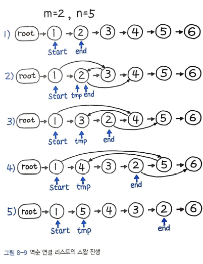

파이썬 알고리즘 인터뷰 3부 8장을 읽으면서 새롭게 알게 된 내용 및 어려운 내용들을 정리해보았다.

## 13. 팰린드롬 연결 리스트

### 풀이 01. 리스트로 변환

리스트에 요소 하나한씩 삽입한 후, 리스트의 길이가 1보다 클 때까지 요소들을 하나씩 뺴서 비교한다. `164ms`가 걸린다.

```py
while len(q) > 1 :
	if q.pop(0) != q.pop() :
		return False;

return True;
```

### 풀이 02. 데크를 이용한 최적화

앞선 풀이에서 리스트 대신 deque()를 사용하고, pop(0) 대신 popleft()를 사용하면 양방향 모두 O(1) 에 처리가 가능해진다. 총 `72ms`가 걸린다.

### `풀이4. 런너를 이용한 우아한 풀이`

생전 보지 못했던 개념을 활용하여서 완전히 이해를 하지 못하였다. 처음부터 다시 찬찬히 이해를 해봐야겠다.  
fast와 slow라는 2개의 포인터를 이용하여 연결리스트를 순회하는 `런너 기법`을 활용한 문제이다. 대개 빠른 런너(포인터)는 두 칸씩 건너뛰고 느린 런너(포인터)는 한 칸씩 이동하게 된다. 이때 빠른 런너가 연결 리스트의 끝에 도달하면, 느린 런너는 정확히 연결 리스트의 중간 지점을 가리키게 된다. 중간 위치를 찾아낸 이후로 여기서부터 값을 비교하거나 뒤집기를 시도하는 등 여러 방법으로 활용이 가능해진다. 총 `64ms`가 걸린다.

### 다중할당

2개 이상의 값을 2개 이상의 변수에 동시에 할당하는 것이다.

```py
rev, rev.next, slow = slow, rev, slow.next
```

위의 코드가 풀이4의 코드 중 다중할당을 사용한 부분이다. 이렇게 말고 밑의 코드처럼 쓰면 되지 않나 라고 생각할 수 있다.

```py
fast = fast.next.next
rev, rev.next = slow, rev
slow = slow.next
```

만약 이렇게 쓴다면 두번쨰 줄에서 slow와 rev가 동일한 참조가 된다. 이렇게 되면 slow 나 rev의 값이 바뀐다면 둘 다 바뀌게 되는 문제가 발생한다.  
다음 내용을 보면 내용이 더 이해가기 쉽다.


## 14. 두 정렬 리스트 병합

### `풀이 1. 재귀 구조로 연결`

```py
def mergeTwoLists(self, l1, l2) :
	if (not l1) or (l2 and l1.val > l2.val) :
		l1, l2 = l2, l1

	if l1 :
		l1.next = self.mergeTwoLists(l1.next, l2)
	return l1
```

and 연산자가 or 연산보다 먼저 실행이 된다.  
책에 있는 그림으로 봐도 이해가 잘 되지 않는다..나중에 다시 봐야할 것 같다.

### 연산자 우선순위

`괄호`가 모든 연산자 중 가장 먼저 실행되므로, 실행 순서가 헷갈리거나 모호한 경우 일단 괄호부터 묶어주는 버릇을 들여야겠다.

### 변수 스왑

파이썬은 다른 언어와는 다르게 임시 변수(temp) 없이 a, b = b, a 이런식으로 바로 스왑이 가능하다. 이러한 기능을 `다중 할당`이라 부른다.

## 15. 역순 연결 리스트

### `풀이 1. 재귀 구조로 뒤집기`

활용도가 높은 문제로, 실무에서도 빈번하게 쓰인다.

```py
def reverseList(self, head) :
	def reverse(node, prev = None) :
		if not node :
			return prev
		next, node.next = node.next, prev
		return reverse(next, node)

	return reverse(head)
```

아직 재귀 구조가 머릿속에 잘 들어오지 않아서 `직접 그림을 그리면서` 이해를 해봐야할 것 같다.

### 풀이2. 반복 구조로 뒤집기

```py
def reverseList(self, head) :
	node, prev = head, None

	while node:
		next, node.next = node.next, prev
		prev, node = node, next

	return prev
```

node.next를 이전 prev 리스트로 계속 연결하면서 끝날 떄 까지 반복한다. node가 None이 될 때 prev는 뒤집힌 연결 리스트의 첫 번째 노드가 된다. next, node.next = node.next, prev로 다중 할당하는 부분은 재귀나 반복 양쪽 모두 동일하다. 풀이1과 풀이2 둘다 비슷한 속도를 보인다. 다만, 반복이 재귀에 비해 70% 수준의 메모리를 차지해 공간 복잡도는 좀 더 낮은 편이며, 실행 속도 또한 약간 더 빠른 편이다.

반복 구조는 그림을 그려보니 이해가 잘 되었다. 재귀구조도 다음에 그림을 꼭 그려봐야겠다.

## 16. 두 수의 덧셈

### 풀이1. 자료형 변환

연결 리스트를 문자열로 이어 붙인 다음에 숫자로 변환하고, 이를 모두 계산한 후 다시 연결 리스트로 바꾸는 풀이이다. 수행 시간이 오래 걸리겠지만 난이도는 어렵지 않은 편이다. 연결 리스트를 뒤집는 코드는 바로 직전 문제의 코드를 활용하면 된다.  
리스트를 뒤집고, 문자열 형태로 합친 다음 int형으로 변환한 값을 더해준다. 더한 값을 다시 문자열로 변환하여 뒤집힌 상태의 연결리스트로 출력을 해준다.  
이 풀이는 절대로 깔끔하지 않으며, 시간도 오래 걸린다.

### `풀이2. 전가산기 구현`

이해가 잘 안되었으므로 다시 한번 차근차근 읽어보면서 이해를 할 예정이다.

### 숫자형 리스트를 단일 값으로 병합하기

앞선 풀이1에서, 처음의 숫자형 리스트를 문자형으로 바꿨다가 숫자형으로 다시 한번 바꿔주는 불편함이 존재한다. 이걸 좀 더 효율적으로 할 수 있는 방법이 존재하긴 한다.

```py
''.join(str(e) for e in a)
```

위와 같은 코드는 가독성이 좀 떨어진다. 다음과 같은 코드는 좀 더 깔끔하다고 할 수 있다.

```py
''.join(map(str, a))
```

이 경우 임시 변수 a를 사용하지 않아 깔끔하며, map(str , 로 이어지는 부분이 문자열로 변환을 암시하는 듯하여 가독성도 좋다.

```py
# 1
resultStr = int(''.join(str(e) for e in a)) + \
						int(''.join(str(e) for e in b))

# 2
resultStr = int(''.join(map(str, a))) + \
						int(''.join(map(str, b)))
```

2번 방식이 좀 더 깔끔하긴 하지만, 이 방식도 원래는 숫자형인데 문자형으로 바꿨다가 다시 숫자형으로 바꾼다는 부분이 존재한다.

```py
functools.reduce(lambda x, y : 10 * x + y, a, 0)
```

`functools`는 함수를 다루는 함수를 뜻하는 고계 함수(Higher-Order Function)를 지원하는 함수형 언어 모듈이며, 리트코드에서 기본적으로 import 되어 있다.  
여기서 reduce는 두 인수의 함수를 누적 적용하라는 메소드이다.

```py
functools.reduce(lambda x, y : x + y, [1, 2, 3, 4, 5])
# 15
```

이 코드의 결과는 ((((1+2)+3)+4)+5) = 15 가 된다. 이와 같은 원리로 값 x에 계속 10을 곱하면서 자릿수 `10*n` 형태로 올려나가고 그 뒤에 y를 더해서 `10*0` 자릿수를 채워나가는 방식을 활용하면 된다.  
이외에도 `operator` 모듈을 사용하는 방식이 있다. 이 경우 연산자 명칭(함수)을 reduce() 메소드의 파라미터로 지정할 수 있어 가독성이 매우 높다.

```py
from operator import add, mul
functools.reduce(add, [1, 2, 3, 4, 5])
# 15
functools.reduce(mul, [1, 2, 3, 4, 5])
# 120
```

## 17. 페어의 노드 스왑

### 풀이 1. 값만 교환

```py
def swapPairs(self, head) :
	cur = head

	while cur and cur.next :
		# 값만 교환
		cur.val, cur.next.val = cur.next.val, cur.val
		cur = cur.next.next

	return head
```

빨리 풀 수 있는 풀이이긴 하지만, 변칙적인 풀이 방법이므로 만약 코드 리뷰를 진행하다가 좋지 않은 피드백을 받을 가능성도 있다.

### `풀이 2. 반복 구조로 스왑`

```py
def swapPairs(self, head) :
	root = prev = ListNode(None)
	prev.next = head
	while head and head.next :
		# b가 a(head)를 가리키도록 할당
		b = head.next
		head.next = b.next
		b.next = head

		# prev가 b를 가리키도록 할당
		prev.next = b

		# 다음번 비교를 위해 이동
		head = head.next
		prev = prev.next.next
```

이전 풀이들과 달리 연결리스트의 head를 가리키는 노드가 직접 바뀌는 풀이이므로 head를 리턴하지 못하고 그 이전 값을 root로 별도로 설정한 다음 root.next를 리턴하게 했다.

### `풀이 3. 재귀 구조로 스왑`

재귀로 훨씬 깔끔하게 풀이가 가능하다.

```py
def swapPairs(self, head) :
	if head and head.next :
		p = head.next

		# 스왑된 값 리턴 받음
		head.next = self.swapPairs(p.next)
		p.next = head
		return p
	return head
```

반복 풀이와는 달리 포인터 역할을 하는 p 변수는 하나만 있어도 충분하며, 더미 노드를 만들 필요도 없이 head를 바로 리턴할 수 있어 공간 복잡도가 낮다. p는 head.next가 되고, p.next는 head가 된다.  
이러한 재귀 방식은 불필요한 변수를 사용하지 않아 공간 복잡도가 낮다.  
실행속도는 모든 방식이 거의 동일하다.

## 18. 홀짝 연결 리스트

연결 리스트의 홀수 노드 다음에 짝수 노드가 오도록 재구성하라. 단, 공간 복잡도 O(1), 시간 복잡도 O(n) 에 풀이하라.

### `풀이 1. 반복 구조로 홀짝 노드 처리`

홀(odd), 짝(even) 각 노드를 구성한 다음, 홀수 노드의 마지막을 짝수 노드의 처음과 이어주면 될 것 같다.

```py
def oddEvenList(self, head) :
	# 예외처리
	if head is None :
		return None

	odd = head
	even = head.next
	even_head = head.next

	# 반복하면서 홀짝 노드 처리
	while even and even.next :
		odd.next, even.next = odd.next.next, even.next.next
		odd, even = odd.next, even.next

	# 홀수 노드의 마지막을 짝수 헤드로 연결
	odd.next = even_head
	return head
```

## 19. 역순 연결 리스트 II

인덱스 m 에서 n 까지를 역순으로 만들어라. 인덱스 m은 1부터 시작한다.

### `풀이 1. 반복 구조로 노드 뒤집기`

```py
def reverseBetween(head, m, n) :
	# 예외처리
	if not head or m == n :
		return head

	root = start = ListNode(None)
	root.next = head

	# start, end  지정
	for _ in range(m - 1) :
		start = start.next

	end = start.next

	# 반복하면서 노드 차례대로 뒤집기
	for _ in range(n - m) :
		tmp, start.next, end.next = start.next, end.next, end.next.next
		start.next.next = tmp

	return root.next
```

start, next는 끝까지 값이 변하지 않는다. start와 end를 기준으로 다음 그림과 같이 반복하면서 역순으로 뒤짚는다.

