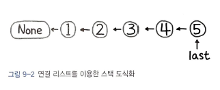
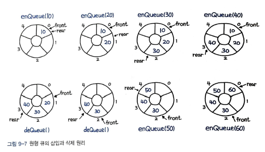

스택, 큐에 대한 개념 및 활용방법들에 대해 정리해보았다.

# 연결리스트를 이용한 스택 ADT 구현

> ADT : Abstract Data Type, 추상 자료형

```py
class Node:
	def __init__(self, item, next) :
		self.item = item
		self.next = next

class Stack:
	def __init__(self) :
		self.last = None

	def push(self, item) :
		self.last = Node(item, self.last)

	def pop(self) :
		item = self.last.item
		self.last = self.last.next # last 포인터를 한 칸 앞으로 전진
		return item

```

pop() 은 가장 마지막 아이템을 끄집어내고 last 포인터를 한 칸 앞으로 전진시키는 과정이다. 그림으로 표현하면 다음과 같다.



# 20. 유효한 괄호

괄호로 된 입력값이 올바른지 판별해야 하는 문제.
입력값이 `()[]{}` 면, 출력이 true이다.

## 풀이 1. 스택 일치 여부 판별

(, [, { 는 스택에 push 하고, ), ], } 를 만날 떄, 스택에서 팝한 결과가 `매핑 테이블 결과` 와 매칭되는지 확인하면 된다.
파이썬 리스트는 스택 연산인 `푸쉬` 와 `팝` 이 O(1)에 동작한다.

```py
def isValid(s: str) :
	stack = []
	table = {
		')' : '(',
		'}' : '{',
		']' : '[',

	}

	# 스택 이용 예외 처리 및 일치 여부 판별
	for char in s :
		if char not in table :
			stack.append(char)
		elif not stack or table[char] != stack.pop() :
			return False

```

`not stack` 부분은 stack이 비어있는지 체크해주는 예외 처리 구문이다.

# `21. 중복 문자 제거`

중복된 문자를 제거하고 사전식 순서로 나열하라.
"bcabc" -> "abc"
상당히 어려운 문제이다.

## `풀이 1. 재귀를 이용한 분리`

```py
def removeDuplicateLetters(str) :

	# 집합으로 정렬
	for char in sorted(set(s)) :
		suffix = s[s.index(char):]
		# 전체 집합과 접미사 집합이 일치할 때 분리 진행
		if set(s) == set(suffix) :
			return char + self.removeDuplicateLetters(suffix.replace(char, ''))
	return ''
```

## 풀이 2. 스택을 이용한 문자 제거

스택을 이용한 풀이이다.
`collections.Counter()` 모듈을 이용해 문자열의 각 문자의 개수를 세어준다.
그리고 스택에 문자를 넣을 때, 이미 스택에 존재하는 문자라면 넣지 않는다.

```py
def removeDuplicateLetters(s: str) :
	counter, seen, stack = collections.Counter(s), set(), []

	for char in s :
		counter[char] -= 1
		if char in seen :
			continue
		# 뒤에 붙일 문자가 남아 있다면 스택에서 제거
		while stack and char < stack[-1] and counter[stack[-1]] > 0 :
			seen.remove(stack.pop())
		stack.append(char)
		seen.add(char)

	return ''.join(stack)
```

스택을 이용한 풀이가 조금 더 빠르다.

# 22. 일일 온도

매일의 화씨 온도(F) 리스트를 입력받아서, 더 따뜻한 날씨를 위해서는 며칠을 더 기다려야 하는지를 출력하라.

- 입력

  > [73, 74, 75, 71, 69, 72, 76, 73]

- 출력
  > [1, 1, 4, 2, 1, 1, 0, 0]

## 풀이 1. 스택 값 비교

이 문제는 앞서 7장에서 풀어본 8번 '빗물 트래핑' 문제와 유사한 방법으로 풀이할 수 있다.  
현재의 인덱스를 계속 스택에 쌓아두다가, 이전보다 상승하는 지점에서 현재 온도와 스택에 쌓아둔 인덱스 지점의 온도차이를 비교해서, 더 높다면 다음과 같이 스택의 값을 pop() 해주고, 그 인덱스와 현재 인덱스의 차이를 계산해준다.

```py
def dailyTemperatures(T) :
	answer = [0] * len(T)
	stack = []
	for i, cur in enumerate(T) :
		# 현재 온도가 스택 값보다 높다면 정답 처리
		while stack and cur > T[stack[-1]] :
			last = stack.pop()
			answer[last] = i - last
		stack.append(i)
	return answer
```

인덱스를 스택에 쌓아두는 것이 핵심이다. 그리고 인덱스간의 차이를 활용하는 연습을 많이 해야할 것 같다.

# 큐

큐는 나중에 나올 `데크(Deque)` 나 `우선순위 큐(Priority Queue)` 같은 변형들에 쓰인다.  
이외에도 `너비 우선 탐색(BFS)` 이나 `캐시` 등을 구현할 때도 널리 사용된다.  
사실상 파이썬의 리스트는 큐의 몯느 연산을 지원하기 때문에 그대로 사용해도 무방하지만 좀 더 나은 성능을 위해서는 이후에 살펴볼 양방향 삽입, 삭제가 모두 O(1)에 가능한 데크를 사용하는 편이 좋다.

# 23. 큐를 이용한 스택 구현

큐를 이요해 다음 연산을 지원하는 스택 구현

## 풀이 1. push() 할 때 큐를 이용해 재정렬

```py
class MyStack :
	def __init__(self) :
		self.q = collections.deque()

	def push(self, x) :
		self.q.append(x)
		# 요소 삽입 후 맨 앞에 두는 상태로 재정렬
		for _ in range(len(self.q) - 1) :
			self.q.append(self.q.popleft())

	def pop(self) :
		return self.q.popleft()

	def top(self) :
		return self.q[0]

	def empty(self) :
		return len(self.q) == 0
```

시간복잡도가 O(n)인게 단점이다.

# 24. 스택을 이용한 큐 구현

## `풀이 1. 스택 2개 사용`

```py
class MyQueue :
	def __init__(self) :
		self.input = []
		self.output = []

	def push(self, x) :
		self.input.append(x)

	def pop(self) :
		self.peek()
		return self.output.pop()

	def peek(self) :
		# output이 없으면 모두 재입력
		if not self.output :
			while self.input :
				self.output.append(self.input.pop())
		return self.output[-1]

	def empty(self) :
		return self.input == [] and self.output == []
```

2개의 스택을 이용한 풀이이다. input에 차례대로 push를 하고, pop 를 할 떄는 output에 있는 것을 pop하고, 없으면 input에 있는 것을 모두 output으로 옮겨서 pop을 한다.

# 25. 원형 큐 디자인

## 풀이 1. 배열을 이용한 풀이

원형 큐의 삽입과 삭제 원리는 다음과 같다.


동작하는 원리는 투 포인터와 비슷하다.
enQueue() 를 하게 되면 rear 포인터가 앞으로 이동하고, deQueue()를 하게 되면 front 포인터가 앞으로 이동한다.
maxlen 변수를 이용해 큐의 크기를 제한한다. front와 rear 의 자리를 앞으로 이동시킬때, maxlen을 넘어가면 0으로 초기화해줘야 하는데, 이때 `module` 연산을 이용한다.

```py
class MyCircularQueue:
	def __init__(self, k: int) :
		self.q = [None] * k
		self.maxlen = k
		self.p1 = 0
		self.p2 = 0

	# enQueue() : rear 포인터 이동
	def enQueue(self, value: int) :
		if self.q[self.p2] is None :
			self.q[self.p2] = value
			self.p2 = (self.p2 + 1) % self.maxlen
			return True
		else :
			return False

	# deQueue() : front 포인터 이동
	def deQueue(self) :
		if self.q[self.p1] is None :
			return False
		else :
			self.q[self.p1] = None
			self.p1 = (self.p1 + 1) % self.maxlen
			return True

	def Front(self) :
		return -1 if self.q[self.p1] is None else self.q[self.p1]

	def Rear(self) :
		return -1 if self.q[self.p2 - 1] is None else self.q[self.p2 - 1]

	def isEmpty(self) :
		return self.p1 == self.p2 and self.q[self.p1] is None

	def isFull(self) :
		return self.p1 == self.p2 and self.q[self.p1] is not None

```
