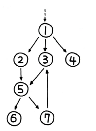
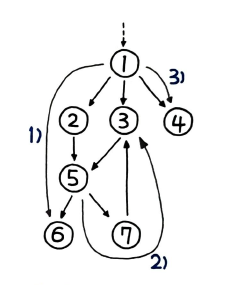
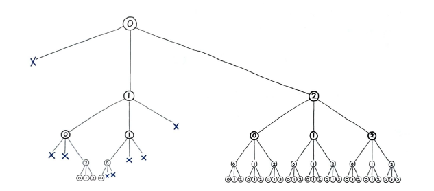
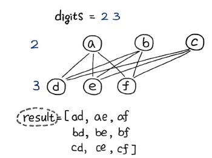
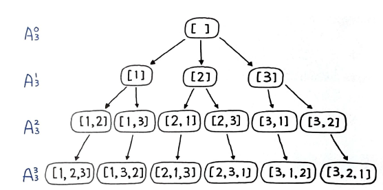
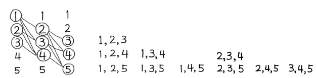
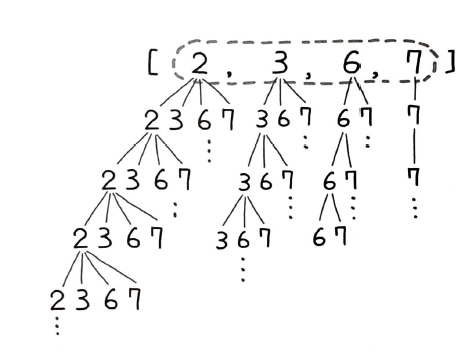
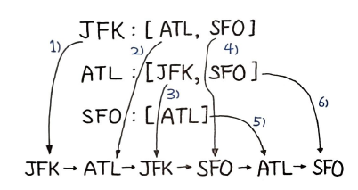

# 그래프
> 객체의 일부 쌍들이 '연관되어' 있는 객체 집합 구조

# 오일러 경로
> 모든 간선을 한 번씩 방문하는 경로

# 해밀턴 경로
> 각 정점을 한 번씩 방문하는 무향 또는 유향 그래프 경로

오일러 경로는 `간선`을 기준으로 하고, 해밀턴 경로는 `정점`을 기준으로 한다는게 차이점이다.  
원래의 출발점으로 돌아오는 경로는 특별히 해밀턴 순환이라 한다. 이중에서도 특히 `최단 거리`를 찾는 문제는 알고리즘 분야에서는 `외판원 문제` 라고 한다.  

# NP 복잡도
NP는 Non-deterministic Polynomial의 약자로, 다항 시간에 풀 수 있는 판정 문제의 집합이다.  
헷갈릴 수 있는 부분은 해밀턴 경로 문제와 외판원 문제의 NP 문제가 다르다는 점이다.  
- 해밀턴 경로 : 한 번만 방문하는 경로
- 해밀턴 순환 : 한 번만 방문하여 출발지로 돌아오는 경로
- 외판원 문제 : 한 번만 방문하여 출발지로 돌아오는 경로 중 가장 짧은 경로  
위의 세 문제를 보면 `해밀턴 경로 > 해밀턴 순환 > 외판원 문제` 의 포함 관계를 이룹니다.

# 그래프 순회
> 그래프 탐색이라고도 하며, 그랲의 각 정점을 방문하는 과정을 말한다.
그래프의 각 정점을 방문하는 그래프 순회에는 크게 `깊이 우선 탐색(DFS)`과 `너비 우선 탐색(BFS)`이 있다.  
일반적으로 BFS보다 `DFS`가 더 널리 쓰인다.  
DFS는 주로 `스택`으로 구현하거나 `재귀`로 구현하며, 이후에도 살펴볼 `백트래킹`을 통해 뛰어난 효용을 보인다. 반면, BFS는 주로 `큐`로 구현하며 그래프의 최단 경로를 구하는 문제 등에 사용된다.  
그래프를 표현하는 방법에는 크게 `인접 행렬`과 `인접 리스트`가 있다.  

  
파이썬의 `딕셔너리` 자료형으로 다음과 같이 나타낼 수 있다.
```py
graph = {
	1: [2, 3, 4],
	2: [5],
	3: [5],
	4: [],
	5: [6, 7],
	6: [],
	7: [3]
}
```
이 딕셔너리를 입력값으로 해서 각각 DFS, BFS를 구현해보자.  
# DFS(깊이 우선 탐색)
일반적으로 `스택`으로 구현하며, `재귀`를 이요하면 좀 더 간단하게 구현할 수 있다.  
코딩 테스트 시에도 `재귀 구현`이 더 선호되는 편이다.

## 재귀 구조로 구현
위키피디아에 제세된 수도코드는 밑 코드와 같다.
```py
DFS(G, v) :
	label v as discovered
	for all directed edges from v to w that are in G.adjacentEdges(v) do
		if vertex w is not labeled as discovered then
			recursively call DFS(G, w)
```
정점 v의 모든 `인접 유향(Directed)` 간선들을 반복하라고 표기되어 있다.  
이 알고리즘을 파이썬 코드로 구현해보면 다음과 같다.
```py
def recursive_df(v, discovered = []) :
	discovered.append(v)
	for w in graph(v) :
		if w not in discovered :
			discovered = recursive_df(w, discovered)
	return discovered
```
discorvered는 방문한 정점들을 저장하는 리스트이다. 이걸 `누적된 결과`로 만들기 위해 리턴하는 형태만 받아오도록 처리했을 뿐 다른 부분들은 변수명까지 동일하게 수도코드와 맞춰서 작성한 결과이다. 그림으로 표현하면 다음과 같다.



## 스택을 이용한 반복 구조로 구현
이번에는 스택을 이용한 반복 결과로 DFS를 구현했다.
```py
def iterative_dfs(start_v) :
	discorvered = []
	stack = [start_v]
	while stack :
		v = stack.pop()
		if v not in discovered :
			discovered.append(v)
			for w in graph[v] :
				stack.append(w)
	return discovered
```
이와 같은 반복 구현은 재귀 구현에 비해 더 직관적이고 실행 속도 또한 더 빠르다.  
방문순서는 [1, 4, 3, 5, 7, 6, 2] 이다. 스택으로 구현하다 보니 가장 마지막에 삽입된 노드부터 꺼내서 반복하게 되고 이 경우 인접 노드에서 가장 최근에 담긴 노드, 즉 가장 마지막부터 방문하기 때문이다.
# BFS(너비 우선 탐색)
BFS는 DFS보다 쓰임새는 적지만, `최단 경로`를 찾는 `다익스트라 알고리즘` 등에 매우 유용하게 쓰인다. 먼저 BFS를 반복 구조로 구현해보자.
## 큐를 이용한 반복 구조로 구현
모든 인접 간성을 추출하고 도착점인 정점을 큐에 삽입하는 원리이다. 파이썬 코드로 구현하면 다음과 같다.

```py
def iterative_bfs(start_v) :
	discovered = [start_v]
	queue = [start_v]
	while queue :
		v = queue.pop(0)
		for w in graph[v] :
			if w not in discovered :
				discovered.append(w)
				queue.append(w)
	return discovered
```
이와 같이 구현하면 방문 순서는 [1, 2, 3, 4, 5, 6, 7] 이 된다.  
BFS의 경우 단계별 차례인 숫자 순으로 실행됬으며, 1부터 순서대로 각각의 인접 노드를 우선적으로 방문하는 식으로 실행된다.  

## 재귀 구현 불가
BFS는 DFS와 달리 재귀 구조로 구현할 수 없다. BFS는 큐를 이용해 구현하는데, 재귀 구조는 함수의 호출과 복귀를 이용해 구현하는데, 이는 스택을 이용하는 것과 같다. 따라서 BFS는 반복 구조로만 구현할 수 있다.  

# 백트래킹
> 해켤책에 대한 후보를 구축해 나아가다 가능성이 없다고 판단되는 즉시 후보를 포기(백트랙)
백트래킹은 DFS와 같은 방식으로 탐색하는 모든 방법을 뜻하며, DFS는 백트래킹의 골격을 이루는 알고리즘이라고 할 수 있다. 백트래킹은 주로 `재귀`로 구현하며, 알고리즘마다 DFS의 변형이 조금씩 일어나지만 기본적으로 모두 DFS의 범주 에 속한다.  
백트래킹은 운이 좋으면 시행착오를 ㄷ러 거치고 목적이에 도착할 수 있지만 최악의 경우에는 모든 경우를 다 거친 다음에 도착할 수 있다. 이 때문에 `브루트 포스`와 유사하다. 하지만 한번 방문 후 가능성이 없는 경우에는 즉시 후보를 포기한다는 점에서 매번 같은 경로를 방문하는 브루트 포스보다는 훨씬 더 우아한 방식이라 할 수 있다.  

위의 사진을 `트리의 가지치기(Pruning)`라고 하며, 불필요한 부분을 일찍 포기한다면 탐색을 최적화 할 수 있다.

# 제약 충족 문제
> 수많은 제약 조건을 충족하는 상태를 찾아내는 수학 문제

`백트래킹`은 제약 충족 문제(Constraint Satisfaction Problems 이하 CSP)를 풀이하는데 필수적인 알고리즘이다. 앞서 살펴본 `가지치기`를 통해 제약 충족 문제를 최적화 하기 때문이다.  
예시로는 스토쿠, 십자말 풀이, N-Queen 문제 등이 있다.  

# 32. 섬의 개수
1을 육지로, 0을 물로 가정한 2D 그리드 맵이 주어졌을 때, 섬의 개수를 계산하라. (연결된 1의 덩어리 개수를 구하라)

## 풀이 1. DFS로 그래프 탐색
반드시 그래프 모양이 아니더라도 그래프형으로 변환해서 풀이할 수 있음을 확인해보는 좋은 문제다. 네 방향으로 DFS 재귀를 이용해 탐색을 끝마치면 1이 증가하는 형태로 육지의 개수를 파악할 수 있다.

```PY
for i in range(len(grid)) :
	for j in range(len(grid[0])) :
		if grid[i][j] == '1' :
			self.dfs(grid, i, j)
```
육지를 발견하면 그때부터 self.dfs() 를 호출해 탐색 시작.
```py
def dfs(self, grid, i, j) :
	# 더 이상 땅이 아닌 경우 종료
	if i < 0 or i >= len(grid) or \
		j < 0 or j >= len(grid[0]) or \
		grid[i][j] != '1' :
		return

	grid[i][j] = '0' # 가지치기

	# 동서남북 탐색
	self.dfs(grid, i + 1, j)
	self.dfs(grid, i - 1, j)
	self.dfs(grid, i, j + 1)
	self.dfs(grid, i, j - 1)
```
함수 상단에는 유직가 아닌 곳은 return 으로 `종료 조건`을 설정해둔다. 육지(1) 를 더 이상 육지가 아닌 곳으로 설정해야 다시 계산하는 경우가 생기지 않는다. 일종의 `가지치기`라 할 수 있다.  
간혹, 또 다른 행렬을 생성해 그곳에 방문했던 경로를 저장하는 형태로 풀이가 가능하긴 한데 그렇게 하면 공간 복잡도가 O(n) 이 되기 때문에 공간의 활용이 비효율적이다.
dfs() 함수를 빠져 나온 후에는 해당 위치에서 탐색할 수 있는 모든 육지를 탐색한 것 이므로, 카운트를 1 증가시킨다. 이제 입력값이 비어 있는 경우에 대해 예외 처리를 포함한 전체 코드는 다음과 같다.
```py
class Solution(self, grid, i, j) :
	def dfs(self, grid, i, j) :
		# 더 이상 땅이 아닌 경우 종료
		if i < 0 or i >= len(grid) or \
			j < 0 or j >= len(grid[0]) or \
			grid[i][j] != '1' :
			return

		grid[i][j] = '0' # 가지치기

		# 동서남북 탐색
		self.dfs(grid, i + 1, j)
		self.dfs(grid, i - 1, j)
		self.dfs(grid, i, j + 1)
		self.dfs(grid, i, j - 1)

	def numIslands(self, grid) :
		count = 0

		for i in range(len(grid)) :
			for j in range(len(grid[0])) :
				if grid[i][j] == '1' :
					self.dfs(grid, i, j)
					count += 1

		return count
```
여기서, grid를 계속해서 넘기는 부분을 파이썬의 `중첩함수` 기능을 활용하여 다음과 같이 표현할 수 있다.
```py
def numIslands(self, grid) :
	def def(i, j) :
		# 더 이상 땅이 아닌 경우 종료
		if i < 0 or i >= len(grid) or \
			j < 0 or j >= len(grid[0]) or \
			grid[i][j] != '1' :
				return

		grid[i][j] = 0

		# 동서남북 탐색
		dfs(i + 1, j)
		dfs(i - 1, j)
		dfs(i, j + 1)
		dfs(i, j - 1)
	
	count = 0
	for i in range(len(grid)) :
		for j in range(len(grid[0])) :
			if grid[i][j] == '1' :
				dfs(i, j)
				# 모든 육지 탐색 후 카운트 1 증가
				count += 1

```
numIslands() 함수 내에 dfs() 함수 전체가 중첩 함수로 들어갔다. 중첩 함수는 부모 함수에서 선언한 변수도 유효한 범위 내에서 사용가능하다.

## 중첩함수
함수 내에 위치한 또 다른 함수로, `바깥에 위치한 함수들과 달리 부모 함수의 변수를 자유롭게 읽을 수 있다`는 장점이 있다. 중첩 함수는 부모 함수의 변수를 자유롭게 읽을 수 있지만, `부모 함수의 변수를 변경할 수는 없다`. 중첩 함수는 `부모 함수의 변수를 변경할 수 없기 때문에` 부모 함수의 변수를 변경하고 싶다면 `nonlocal` 키워드를 사용해야 한다.  
```py
def outer_function(t) :
	text = t
	print(id(text), text)
	
	def inner_function1() :
		text = 'World!'
		print(id(text), text)
	
	def inner_function2() :
		print(id(text), text)

	inner_function1()
	inner_function2()

outer_function('Hello!')
```
위 코드를 실행하면 다음과 같은 결과가 나온다.
```py
140711000000000 Hello!
147211000000123 World!
140711000000000 Hello!
```
inner 함수에서 값을 재할당해줘도 부모 함수에서는 반영이 되지 않으므로 주의가 필요하다.

# 33. 전화 번호 문자 조합
2에서 9까지 숫자가 주어졌을 때 전화번호로 조합 가능한 모든 문자를 리턴하라.


## 풀이 1. 모든 조합 탐색
이 문제를 전체를 탐색하여 풀이가 가능하다. 각 자릿수에 해당하는 키판 배열을 DFS로 탐색하면 결과가 완성된다.

```PY
digits = "23"
path = ""

def letterCombinations(digits) :
	def dfs(index, path) :
		# 끝까지 탐색하면 백트래킹
		if len(path) == len(digits) :
			result.append(path)
			return 

		# 입력값 자릿수 단위 반복
		for i in range(index, len(digits)) :
			# 키패드 배열의 문자열 단위 반복
			for j in dic[digits[i]] :
				dfs(i + 1, path + j)

	# 예외처리
	if not digits : 
		return []

	dic = { "2": "abc", "3" : "def", "4": "ghi", "5": "jkl",
					"6": "mno", "7": "pqrs", "8": "tuv", "9": "wxyz"}
	result = []
	dfs(0, "")

return result

```
다음 그림과 같이 DFS를 통해 모든 조합을 탐색한다.


# 34. 순열
서로 다른 정수를 입력받아 가능한 모든 순열 리턴

## `풀이 1. DFS를 활용한 순열 생성`
경우의 수만 구하는건 쉽지만, 문제는 모든 가능한 경우들 자체를 리턴해야하는 것이다.  

다음 사진과 같이 DFS를 통해 모든 경우의 수를 탐색하면서 결과를 찾아내는 방법을 구현해 보았다.

```py
def dfs(elements) :
	# 리프 노드일 때 결과 추가
	if len(elements) == 0: 
		results.append(prev_elements[:])
	
	# 순열 생성 재귀 호출
	for e in elements :
		next_elements = elements[:]
		next_elements.remove(e)

		prev_elements.append(e)
		dfs(next_elements)
		prev_elements.pop()
```
여기서 중요한 부분은 결과를 추가할 때 prev_elements[:] 로 처리해야 한다는 점이다. 파이썬은 모든 객체를 참조하는 형태로 처리되므로 만약 results.append(prev_elements)를 하게 되면 결과 값이 추가되는 게 아니라 prev_elements에 대한 참조가 추가되며, 이 경우 참조된 값이 변경될 경우 같이 바뀌게 된다.  
따라서, 값을 복사하는 형태로 참조 관계를 갖지 않도록 처리해야 한다.

## 풀이 2. itertools 모듈 사용
`itertools` 모듈은 반복자 생성에 최적화된 효율적인 기능들을 제공하므로, 실무에서는 알고리즘으로 직접 구현하기보다는 이미 잘 구현된 라이브러리를 사용하는 것이 더 효율적이다. 속도도 더 빠른 장점을 지닌다.
```py
def permute(nums) :
	return list(itertools.permutations(nums))
```
단, 위 코드의 결과는 리스트 내 튜플 형태인 점이 걸린다. 이를 리스트로 변환하려면 다음과 같이 처리해야 한다.
```py
def permute(nums) :
	return list(map(list, itertools.permutations(nums)))
```
## `객체 복사 - 중요!`
파이썬의 중요한 특징 중 하나는 `모든 것이 객체라는 점`이다. 숫자, 문자가 리스트, 딕셔너리 같은 객체와의 차이점이라면 불변 객체라는 차이 뿐, 이들마저 모두 객체라고 할 수 있다. 그러니 별도로 값을 복사하지 않는 한, 변수에 값을 할당하는 모든 행위는 값 객체에 대한 참조가 된다.  
참조가 되지 않도록 값 자체를 복사하려면 `[:]` 로 처리하는 방법이다.
```py
>>> a = [1, 2, 3]
>>> b = a
>>> c = a[:]
>>> id(a), id(b), id(c)
(43627, 43627, 43615)
```
a와 c가 다른 id를 갖는다.

```py
>>> d = a.copy()
>>> id(a), id(b), id(c), id(d)
(43627, 43627, 43615, 43639)
```
이 경우 변수 d 또한 다른 id를 갖는다. 만약 복잡한 리스트의 경우에는 `deepcopy()`를 사용해야 한다.
```py
>>> import copy
>>> a = [1, 2, [3, 5], 4]
>>> b = copy.deepcopy(a)
>>> id(a), id(b), b
(43627, 43615, [1, 2, [3, 5], 4])
```
이처럼 리스트 내에 리스트를 갖는 중첩 리스트도 deepcopy()를 사용하면 문제 없이 값을 복사할 수 있으며, 다른 id를 갖는다.

# 35. 조합
전체 수 n을 입력받아 k개의 조합을 리턴하라.
## `풀이 1. DFS로 k개 조합 생성`
  

조합은 순열과는 달리, 자기 자신 뿐만 아니라 앞의 모든 요소를 배제하고 next_elements를 구성한다. 따라서 여기서는 그냥 elements라는 이름으로 다음과 같이 처리한다.

```py
def dfs(elements, start, k) :
	if k == 0:
		results.append(elements[:])
		return
	
	for i in range(start, n + 1) :
		elements.append(i)
		dfs(elements, i + 1, k - 1)
		elements.pop()
```

## 풀이 2. itertools 모듈 사용
이 문제도 itertools를 이용해 한 줄 풀이가 가능하다. itertools.permutations()가 있었던 것처럼 `itertools.combinations()` 도 지원된다.
```py
def combine(n, k) :
	return list(itertools.combinations(range(1, n + 1), k))
```
풀이 1은 536ms, 풀이 2는 76ms가 걸린다.

# 36. 조합의 합
숫자 집합 candidates를 조합하여 합이 target이 되는 원소를 나열하라. 각 원소는 중복으로 나열 가능하다.
- 입력
candidates = [2, 3, 6, 7], target = 7

- 출력
[
	[7],
	[2, 2, 3]
]
## `풀이 1. DFS로 중복 조합 그래프 탐색`
조합을 응용한 문제가 이번 문제라 할 수 있다.  

```py
def dfs(csum, index, path) :
	...
	for i in range(index, len(candidates)) :
		dfs(csum - candidates[i], i, path + [candidates[i]])
	
```
dfs() 함수의 첫 번째 파라미터는 합을 갱신해나갈 csum, 두 번째는 순서, 세 번쨰 파라미터는 지금까지의 탐색 경로로 정한다. 종료 조건은 다음 2가지 경우로 정한다.
1. csum < 0 : 목표값을 초과한 경우로 탐색을 종료한다.
2. csum = 0 : csum의 초기값은 target이며, 따라서 csum의 0은 target과 일치하는 정답이므로 결과 리스트에 추가하고 탐색을 종료한다.

나머지 경우는 계속해서 탐색을 시도한다.
```py
def combinationSum(candidates, target) :
	result = []

	def dfs(csum, index, path) :
		# 종료 조건 
		if csum < 0 :
			return
		if csum == 0 :
			result.append(path)
			return

		# 자신부터 하위 원소까지의 나열 재귀 호출
		for i in range(index, len(candidates)) :
			dfs(csum - candidates[i], i, path + [candidates[i]])
```

# 37. 부분 집합

## 풀이 1. 트리의 모든 DFS 결과
경로 path를 만들어 나가면서 인덱스를 1씩 증가하는 형태로 깊이 탐색한다. 부분 집합은 모든 탐색의 경로가 결국 정답이 되므로, 탐색할 때마다 매번 결과를 추가하면 된다.
```py
def subsets(nums) :
	result = []

	def dfs(index, path) :
		# 매번 결과 추가
		result.append(path)

		# 경로를 만들면서 DFS
		for i in range(index, len(nums)) :
			dfs(i + 1, path + [nums[i]])

	dfs(0, [])
	return result
```

# 38. 일정 재구성
[from, to]로 구성된 항공권 목록을 이용해 JFK에서 출발하는 여행 일정을 구성하라. 여러 일정이 있는 경우 사전 어휘 순으로 방문한다.

- 입력
[["JFK", "SFO"], ["JFK", "ATL"], ["SFO", "ATL"], ["ATL", "JFK"], ["ATL", "SFO"]]

- 출력
["JFK", "ATL", "JFK", "SFO", "ATL", "SFO"]

## 풀이 1. DFS로 일정 그래프 구성
중복된 일정일 경우, 어휘 순으로 방문을 해야한다는 점을 주의해야한다.  
먼저, 그래프를 구성하는 작업이 필요하다. 다음과 같이 구현 가능하다.
```py
graph = collections.defaultdict(list)
for a, b in tickets :
	graph[a].append(b)
for a in graph :
	graph[a].sort()
```
어휘 순으로 방문해야 하기 때문에 일단 그래프를 구성한 후에 다시 꺼내 정렬하는 방식을 택했다. 위의 입력 예시일 때 그래프 형태는 다음과 같다.
```py
defaultdict(list,
	{'JFK': ['ATL', 'SFO'],
	'SFO': ['ATL'],
	'ATL': ['JFK', 'SFO']})
```
그런데 이렇게 매번하지 않고 애초에 tickets를 한 번만 정렬해도 결과는 동일하다.  
`sorted()`함수를 이용하면 된다.
```py
graph = collections.defaultdict(list)
for a, b in sorted(tickets) :
	graph[a].append(b)
```
그 다음엔 pop으로 재귀 호출하면서 모두 꺼내 결과에 추가한다. 결과 리스트에는 역순으로 담기게 될 것 이며, pop()으로 처리했기 때문에 그래프에서는 해다 경로는 사라지게 되어 재방문하게 되지는 않을 것 이다.
```py
def dfs(a) :
	while graph[a] :
		dfs(graph[a].pop(0))
	route.append(a)
```
어휘순으로 그래프를 생성했기 때문에 pop(0)으로 첫 번째 값을 읽어야 한다. 마지막에는 다시 뒤집어서 어휘 순으로 맨 처음 읽어들였던 값이 처음이 되게 한다. 최종 코드는 다음과 같다.
```py
def findItinerary(tickets) :
	graph = collections.defaultdict(list)
	# 그래프 순서대로 구성
	for a, b in sorted(tickets) :
		graph[a].append(b)

	route = []
	def dfs(a) :
		# 첫 번째 값을 읽어 어휘 순 방문
		while graph[a] :
			dfs(graph[a].pop(0))
		route.append(a)

	dfs('JFK')
	# 다시 뒤집어 어휘 순 결과로
	return route[::-1]
```


## 풀이 2. 스택 연산으로 큐 연산 최적화 시도
앞서 풀이에서 큐의 연산을 수행한다고 언급한 바 있다. 파이썬 리스트의 경우 파라미터를 저장하지 않은 값, 즉 마지막 값을 꺼내는 pop()은 O(1)이지만, 첫 번쨰 값을 꺼내는 pop(0)은 O(n)이다. 따라서, 좀 더 효율적인 구현을 위해서 pop(), 즉 스택의 연산으로 처리될 수 있도록 개선하는 게 좋다.
```py
for a, b in sorted(tickets, reverse=True):
	graph[a].append(b)

...
def dfs(a) :
	while graph[a] :
		dfs(graph[a].pop())
```
이처럼 애당초 그래프를 `역순`으로 구성하면 추출 시에는 pop()으로 처리가 가능하다.

## `풀이 3. 일정 그래프 반복`
재귀가 아닌 동일한 구조를 `반복`으로 풀이도 가능하다.


한번 방문했던 곳을 다시 방문하지 않으려면, 별도로 마킹하여 다음번에 방문하지 않거나 아예 스택의 pop()으로 값을 제거하는 방법이 있는데, 여기서는 스택을 이용하므로 다음과 같이 pop()으로 아예 값을 제거한다.
```py
stack = ['JFK']
while stack : 
	while graph[stack[-1]] :
		stack.append(graph[stack[-1]].pop())
	route.append(stack.pop())
```
그래프에 값이 있다면 pop(0)으로 맨 처음의 값을 추출하여 스택 변수 stack에 넣게 했다. 큐의 연산이다. 이렇게 하면 그래프의 값들은 점점 제거될 것 이며 마지막 방문지가 남지 않을 때까지 while문이 계속 돌면서 위의 그림과 같은 순서대로 처리가 된다.  
만약 중간에 끊어지는 입력값들이 주어진다고 해보자.
```py
defaultdict(list, {"JFK": ["KUL", "NRT"], "NRT" : ["JFK"]})
```
이 경우, JFK -> KUL 에서 더 이상 진행이 불가능하다. 따라서 스택의 값을 다시 pop() 하여 거꾸로 풀어낼 수 있는 또 다른 변수가 필요하다.
```py
route, stack = [], ['JFK']
while stack : 
	while graph[stack[-1]] :
		stack.append(graph[stack[-1]].pop())
	route.append(stack.pop())
```
이렇게 하면, JKF -> NRT -> JFK -> KUL 순서로 처리가 된다.  
전체 코드는 다음과 같다.
```PY
def findItinerary(self, tickets) :
	graph = collections.defaultdict(list)
	for a, b in sorted(tickets):
		graph[a].append(b)

	route, stack = [], ['JFK']
	while stack : 
		# 반복으로 스택을 구성하되, 막히는 부분에서 풀어내는 처리
		while graph[stack[-1]] :
			stack.append(graph[stack[-1]].pop())
		route.append(stack.pop())
	return route[::-1]
```
이 문제의 경우 재귀, 스택 연산, 반복 모두 속도 차이가 거의 없다.  
대개는 반복보다는 재귀에 좀 더 높은 점수를 주는 편이며, 재귀로 풀라고 제한하는 경우도 있으므로 `재귀 풀이`에 좀 더 익숙해지도록 꾸준한 연습이 필요하다.

# 39. 코스 스케줄

0을 완료하기 위해서는 1을 끝내야 한다는 것을 [0, 1] 쌍으로 표현하는 n개의 코스가 있다. 코스 개수 n과 이 쌍들을 입력으로 받았을 때 모든 코스가 완료 가능한지 판별하라

- 입력
2, [[1, 0]]
- 출력
true

2개의 코스가 있으며 1을 완료하기 위해 0을 끝내면 된다.

## 풀이 1. DFS로 순환 구조 판별

이 문제는 그래프가 `순환 구조`인지 판별하는 문제이다.  
```py
graph = collections.defaultdict(list)
for x, y in prerequisties : 
	graph[x].append(y)
```
페어의 첫 번째 값을 x, 두 번째 값을 y로 하되 y는 복수 개로 구성할 수 있게 하다. 이렇게 하면 'x': ['y1', 'y2'] 같은 구조가 된다.
```py
traced = set()
...
for x in graph :
	if not dfs(x) :
		return False
```
순환 구조를 판별하기 위해 앞서 이미 방문했던 노드를 traced 변수에 저장한다. 이미 방문했던 곳을 중복 방문하게 된다면 순환 구조로 간주할 수 있고 이 경우 False를 리턴하고 종료할 수 있다. 순환구조를 찾기 위한 탐색은 다음과 같이 DFS로 진행한다.
```py
def canFinish(numCourses:  prerequisites) :
	graph = collections.defaultdict(list)

	# 그래프 구성
	for x, y in prerequisites :
		graph[x].append(y)

	traced = set()

	def dfs(i) :
	# 순환 구조이면 False
	if i in traced :
		return False

	traced.add(i)
	for y in graph[i] :
		if not dfs(y) :
			return False

	# 탐색 종료 후 순환 노드 삭제
	traced.remove(i)

	return True

	for x in list(graph) :
		if not dfs(x) :
			return False

	return True
```


## 풀이 2. 가지치기를 이용한 최적화
위의 풀이를 좀 더 효율적으로 만들 수 있다. 한 번 방문했던 그래프는 두 번 이상 방문하지 않도록 무조건 True로 리턴하는 구조로 개선하면 시간을 획기적으로 줄일 수 있다.
```py
def canFinish(numCourses, prerequisites) :
	graph = collections.defaultdict(list)

	# 그래프 구성
	for x, y in prerequisites :
		graph[x].append(y)

	traced = set()
	visited = set()

	def dfs(i) :
		# 순환 구조이면 False
		if i in traced :
			return False
		# 이미 방문했던 노드이면 True
		if i in visited :
			return True

		traced.add(i)
		for y in graph[i] :
			if not dfs(y) :
				return False

		# 탐색 종료 후 순환 노드 삭제
		traced.remove(i)
		# 탐색 종료 후 방문 노드 추가
		visited.add(i)
	
		return True

	# 순환 구조 판별
	for x in list(graph) :
		if not dfs(x) :
			return False

	return True
```
이런식으로 가지치기를 이용하면 920ms 에서 96ms로 시간을 줄일 수 있다.

## defaultdict 순회 문제
```py
for x in list(graph) :
```
graph를 순회할 때 list 로 감싸지 않으면 `Runtime Error: dictionary changed size during iteration` 이 뜨게 된다. graph 딕셔너리를 최소 생성 후 변경한 적이 없는데 이런 에러가 뜬다.  
```py
graph = collections.defaultdict(list)
```
위의 코드가 문제이다. 존재하지 않는 키를 조회할 때 오류를 내지 않기 위해 항상 디폴트를 생성하는 구조로 되어 있다는 점이다. 따라서 다음과 같은 반복문에서 graph 값이 변경된다는 오류가 발생한다.
```py
for x in graph : 
	...
```
해당 반복문이 제대로 실행되려면 graph 변수를 defaultdict() 에서 분리해서 고정시킬 필요가 있다. 3.7+의 해결 방식을 보면 `list() 로 묶어서 해결`하라는 답변을 볼 수 있다.  
즉, 새로운 복사본을 만들어야 한다는 뜻이다.