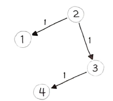

> 각 간선의 `가중치 합`이 최소가 되는 두 정점(또는 노드) 사이의 경로를 찾는 문제
`정점`은 교차로에 해당하고 `간선`은 길에 해당한다. `가중치`는 거리나 시간과 같은 이동 비용에 해당한다.  
여러 개의 최단 경로 알고리즘 중, 가장 유명한 것은 `다익스트라 알고리즘`일 것이다.  
다익스트라 알고리즘은 항상 노드 주변의 최단 경로만을 택하는 대표적인 `그리디 알고리즘` 중 하나로, 단순할 뿐만 아니라 실행 속도 또한 빠르다. 다익스트라는 노드 주변을 탐색할 떄 `BFS`를 이용하는 대표적인 알고리즘이기도 하다.  
`DFS`는 한 사람이 미로를 찾아 헤매는 과정과 비슷한 반면, `BFS`는 여러명의 사람이 각기 서로 다른 갈릴김로 흩어져서 길을 찾는 것과 비슷하다.

# `40. 네트워크 딜레이 타임`
K 부터 출발해 모든 노드가 신호를 받을 수 있는 시간을 계산하라. 불가능할 경우 -1을 리턴한다. 입력값 (u, v, w)는 각각 출발지, 도착지, 소요 시간으로 구성되며, 전체 노드의 개수는 N으로 입력받는다.

- 입력
times = [[2,1,1],[2,3,1],[3,4,1]], N = 4, K = 2

## 풀이 1. 다익스트라 알고리즘 구현
이 문제에서는 다음과 같은 2가지 사항을 판별해야 한다.
1. 모든 노드가 신호를 받는 데 걸리는 시간
2. 모든 노드에 도달할 수 있는지 여부

다익스트라 알고리즘을 좀 더 효율적으로 구현하기 위해 `우선순위 큐` 방식을 적용한다. 파이썬에서 우선순위 큐를 `최소 힙`으로 구현한 모듈인 `heapq`를 사용하는 형태로 구현해본다. 다음은 다익스트라 알고리즘의 수도코드이다.
```py
function Dijkstra(Graph, source) :
	dist[source] ← 0

	create vertex priority queue Q

	for each vertex v in Graph :
		if v ≠ source
			dist[v] ← INFINITY
			prev[v] ← UNDEFINED

		Q.add_with_priority(v, dist[v])

	while Q is not empty :
		u ← Q.extract_min()
		for each neighbor v of u :
			alt ← dist[u] + length(u, v)
			if alt < dist[v] :
				dist[v] ← alt
				prev[v] ← u
				Q.decrease_priority(v, alt)

	return dist, prev
```
그래프에서 각 정점과 거리를 우선순위 큐에 삽입하는 부분 Q.add_with_priority(v, dist[v]), 그리고 우선순위 큐에서 최소 값 추출(u ← Q.extract_min())을 통해 이웃을 살펴보는 (for each neighbor v of u) 수도코드를 확인할 수 있다. 이제 이 수도코드 알고리즘을 실제로 실행 가능한 파이썬 코드로 구현해보자.
```py
graph = collections.defaultdict(list)
for u, v, w in times :
	graph[u].append((v, w))
```
먼저 그래프를 인접 리스트로 표현하는 딕셔너리부터 만들어준다.  
다음은 우선순위 큐를 위한 큐 변수를 정의한다.
```py
Q = [(0, K)]
dist = collections.defaultdict(int)
```
큐 변수 Q는 '(소요 시간, 정점)' 구조로 구성한다. 수도코드에는 큐에 add_with_priority(), decrease_priority(), extract_min(), 3번의 연산을 내리도록 구현되어 있다. 여기서 add_with_priority() 와 extract_min() 은 문제없지만, `decrease_priority` 가 문제다. heapq 모듈은 우선순위 업데이트를 지원하지 않는다.  
따라서, decrease_priority() 연산이 핌요 없도록 다음과 같이 알고리즘을 살짝 변경해야 한다.
```py
while Q : 
	time, node = heapq.heappop(Q)
	if node not in dist :
		dist[node] = time
		for v, w in graph[node] :
			alt = time + w
			heapq.heappush(Q, (alt, v))
```
마지막으로 모든 노드에 도달할 수 있는지 여부를 다음과 같이 판별한다.
```py
if len(dist) == N : 
	return max(dist.values())
return -1
```
전체 코드를 정리하면 다음과 같다.
```py
def networkDelayTime(times, N, K) :
	graph = collections.defaultdict(list)
	# 그래프 인접 리스트 구성
	for u, v, w in times :
		graph[u].append((v, w))

	# 큐 변수 : [(소요 시간, 정점)]
	Q = [(0, K)]
	dist = collections.defaultdict(int)
	
	# 우선순위 큐 최솟값 기준으로 정점까지 최단 경로 삽입
	while Q :
		time, node = heapq.heappop(Q)
		if node not in dist :
			dist[node] = time
			for v, w in graph[node] :
				alt = time + w
				heapq.heappush(Q, (alt, v))

	# 모든 노드의 최단 경로 존재 여부 판별
	if len(dist) == N :
		return max(dist.values())
	return -1
```

# `41. K 경유지 내 가장 저렴한 항공권`
시작점에서 도착점까지의 가장 저렴한 가격을 계산하되, K개의 경유지 이내에 도착하는 가격을 리턴하라.
## 풀이 1. 다익스트라 알고리즘 응용
가격을 시간이라고 가정한다면 최단 시간을 계산하는 경로는 앞서 다익스트라 알고리즘으로 동일하게 구현할 수 있다. 다만, 여기에는 한 가지 제약사하잉 추가되었는지 K개의 경유지 이내에 도착해야 한다는 점이다. 따라서, 다익스트라 알고리즘의 구현을 위해 우선순위 큐에 추가할 때 K 이내일 때만 경로를 추가하여 K를 넘어서는 경로는 더 이상 탐색되지 않게 하면 된다.
전체거리를 보관할 필요가 없기 때문에 40번 문제 풀이의 dist 딕셔너리는 삭제해도 된다. 도착점까지의 최단 경로만 계산하면 된다. 전체 경로의 개수도 체크할 필요가 없다.  
최종코드는 다음과 같다.
```py
def findCheapestPrice(flights, src, dst, K) :

	graph = collections.defaultdict(list)
	# 그래프 인접 리스트 구성
	for u, v, w in flights :
		graph[u].append((v, w))

	# 큐 변수 : [(가격, 정점, 남은 가능 경유지 수)]
	Q = [(0, src, K)]

	# 우선순위 큐 최솟값으로 기준으로 도착점까지 최소 비용 판별
	while Q :
		price, node, k = heapq.heappop(Q)
		if node == dst :
			return price
		if k >= 0 :
			for v, w in graph[node] :
				alt = price + w
				heapq.heappush(Q, (alt, v, k-1))
``` 
