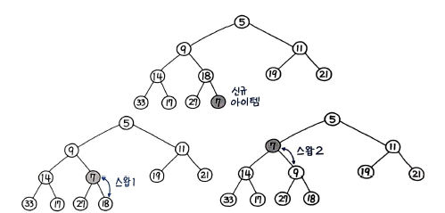
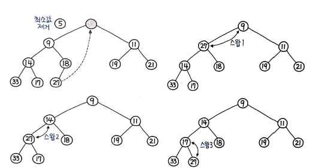

> 힙은 힙의 특성(최소 힙에서는 부모가 항상 자식보다 작거나 같다) 을 만족하는 거의 완전한 트리(Almost Complete Tree) 인 특수한 트리 기반의 자료구조
힙은 그래프와 트리와는 전혀 관계 없어 보이는 독특한 이름과 달리, `트리 기반의 자료구조`다. 최소 힙은 부모가 자식보다 작기 때문에 루트가 결국 가장 작은 값을 갖게 되며, 우선순위 큐에서 가장 작은 값을 추출하는 것은 `매번 힙의 루트를 가져오는 형태`로 구현된다.  
우선순위 큐 ADT(추상 자료형)은 주로 힙으로 구현되고, 힙은 주로 배열로 구현한다.  
따라서, 우선순위 큐는 결국 배열로 구현하는 셈이 된다.  
오해하기 쉬운 특징 중 하나는 `힙은 정렬된 구조가 아니라는 점` 이다. 최소 힙의 경우 `부모 노드가 항상 작다는 조건만 만족` 할 뿐, 서로 정렬되어 있지는 않다.  
부모, 자식간의 관계만 정의할 뿐, 좌우에 대한 관계는 정의하지 않기 때문이다. 즉, 부모는 항상 자식보다 작을 뿐, 좌우의 정렬 관계는 제각각이다.  
힙은 `완전 이진 트리` 이기 때문에, 배열로 구현할 수 있다.  
힙으로 `우선순위 큐` 뿐만 아니라 `다익스트라 알고리즘` 에도 활용이 된다. 힙 덕분에 다익스트라 알고리즘의 시간 복잡도는 O(V^2) 에서 `O(ElogV)` 가 된다.  
이외에도 원래의 용도인 힙 정렬과 최소 신장 트리를 구현하는 `프림 알고리즘`등에도 활용되며, 중앙값의 근사값을 빠르게 구하는 데도 활용할 수 있다.  
# 힙 연산
실제로 이진 힙(자식이 둘인 힙)을 구현해보겠다. 파이썬의 `heapq` 모듈에서 지원하는 최소 힙 연산을 파이썬의 리스트만으로 동일하게 구현해보겠다.
```py
class BinaryHeap(object) :
	def __init__(self) :
		self.items = [None]
	
	def __len__(self) :
		return len(self.items) - 1
```
len()을 호출하면 마지막 요소의 인덱스를 가져오기 위해 실제 길이보다 하나 더 작은 가져오도록 구현했다.  
그리고, 0번 인덱스는 사용하지 않기 때문에, `None`을 넣어두었다. 대게 트리의 배열 표현의 경우 인덱스 계산을 편하게 하기 위해 인덱스는 1부터 사용한다. 특히 이진 힙에서는 항상 1번 인덱스부터 사용한다.

## 삽입
힙에 요소를 삽입하기 위해서는 업힙(Up-Heap) 연산을 수행해야 한다. 업힙 연산은 `percolate_up()` 이라는 함수로 정의한다. 힙에 요소를 삽입하는 과정은 다음과 같다.
1. 요소를 가장 하위 레벨의 최대한 왼쪽으로 삽입한다.(배열로 표현할 경우 가장 마지막에 삽입된다.)
2. 부모 값과 비교해 값이 더 작은 경우 위치를 변경한다.
3. 계속해서 부모 값과 비교해 위치를 변경한다.(가장 작은 값일 경우 루트까지 올라감)

이 과정을 그림으로 표현하면 다음과 같다.
  
위의 과정을 코드로 구현하면 다음과 같다.
```py
def _percolate_up(self) :
	i = len(self)
	parent = i // 2
	while parent > 0:
		if self.items[i] < self.items[parent] :
			self.items[i], self.items[parent] = self.items[parent], self.items[i]
		i = parent
		parent = i // 2

def insert(self, k) :
	self.items.append(k)
	self._percolate_up()
```
삽입 자체는 insert() 함수를 호출해 실행된다. 코드에서 insert() 함수의 self.items.append()는 1번 과정이고, percolate_up() 함수는 2, 3번 과정을 수행한다.  
시간 복잡도는 `O(logN)` 이다. parent를 i // 2 로 약 절반씩 줄여나가는 형태이므로, 로그만큼 연산을 수행하는 것을 알 수 있다. percolate_up() 함수명 앞에는 `내부 함수` 라는 의미로 `_`를 붙였다.

## 추출
추출 자체는 매우 간단하다. `루트를 추출`하면 된다. 추출 이후에 다시 힙의 특성을 유지하는 작업이 필요하기 때문에 시간 복잡도는 O(1)이 아닌 O(logN)이다.  
  
위의 그림은 추출 과정을 보여준다. 루트를 추출하고, 가장 마지막 노드를 루트로 옮긴다. 그리고, 자식 노드와 비교해 자식 노드가 더 작은 경우 위치를 변경한다.  
삽입과는 반대의 연산이므로, `다운힙` 연산이 수행된다. 일반적으로 힙 추출에 많이 쓰이는 `percolate_down()` 이라는 함수로 구현해보자.  
```py
def _percolate_down(self, idx) :
	left = idx * 2
	right = idx * 2 + 1
	smallest = idx

	if left <= len(self) and self.items[left] < self.items[smallest] :
		smallest = left
	if right <= len(self) and self.items[right] < self.items[smallest] :
		smallest = right
	if smallest != idx :
		self.items[idx], self.items[smallest] = self.items[smallest], self.items[idx]
		self._percolate_down(smallest)

def extract(self) :
	extracted = self.items[1]
	self.items[1] = self.items[len(self)]
	self.items.pop()
	self._percolate_down(1)
	return extracted
```
추출 자체는 extract() 함수를 호출해 실행된다.  
# 이진 힙 vs 이진 탐색 트리 (BST)
가장 직관적인 차이점은, 힙은 `상/하 관계를 보장`하며, 특히 최소 힙에서는 부모가 항상 자식보다 작다. 반면 BST는 `좌/우 관계를 보장`한다. BST에서는 부모는 왼쪽 자식보다는 크며, 오른쪽 자식보다는 작거나 같다. 이 같은 특징으로 인해 BST는 탐색과 삽입 모두 O(logN)에 가능하며, 모든 값이 정렬되어야 할 때 사용한다.  
반면 가장 큰 값을 추출하거나(최대 힙) 가장 작은 값을 추출하려면(최소 힙) 이진 힙을 사용해야 한다. 이진 힙은 이 작업이 O(1) 에 가능하다. 우선순위와 연관되어 있으며, 따라서 이진 힙은 `우선순위 큐`에 활용된다.

# 55. 배열의 K번쨰 큰 요소
정렬되지 않은 배열에서 k번쨰 큰 요소를 추출하라.
- 입력
[3, 2, 3, 1, 2, 4, 5, 5, 6], k = 4
- 출력
4
## 풀이 1. heapq 모듈 이용
11장의 31번 문제 "상위 K 빈도 요소" 와 비슷한 문제다. 다른 점이라면 가장 큰 값이냐, 가장 빈번한 값이냐의 차이다. 비슷한 방식으로 풀이가 가능하므로, 그 때 풀이했던 코드를 가져와봤다.
```py
def topKFrequent(self, nums, k) :
	freqs = collections.Counter(nums)
	freqs_heap = []
	for f in freqs :
		heapq.heappush(freqs_heap, (-freqs[f], f))

	topk = list()
	for _ in range(k) :
		topk.append(heapq.heappop(freqs_heap)[1])

	return topk
```
Counter()로 빈도 수를 계산해 삽입했던 예전 풀이 대신 값 자체를 힙에 푸시하고 순서만큼 팝하는 형태로 수정해본다.
```py
def findKthLargest(self, nums, k) :
	heap = list()
	for n in nums :
		heapq.heappush(heap, -n)
	
	for _ in range(1, k) :
		heapq.heappop(heap)
	
	return -heapq.heappop(heap)
```
파이썬 heapq모듈은 `최소 힙`만 지원하므로, 음수로 저장한 다음 가장 낮은 수 부터 추출해 부호를 변환하면 최대 힙 처럼 동작하도록 구현 가능하다.

## 풀이 2. heapq 모듈의 heapify 이용
모든 값을 꺼내서 푸시하지 않고도 한 번에 `heapify()` 하여 처리할 수 있다. heapify()란 주어진 자료구조가 힙 특성을 만족하도록 바꿔주는 연산이며, 이 경우 파이썬의 일반적인 리스트는 힙 특성을 만족하는 리스트로, 값의 위치가 변경된다.
```py
def findKthLargest(self, nums, k) :
	heapq.heapify(nums)
	
	for _ in range(1, k) :
		heapq.heappop(heap)
	
	return -heapq.heappop(heap)
```

## 풀이 3. heapq 모듈의 nlargest 이용
heapq 모듈은 강력한 기능을 많이 지원한다. 그중에는 n번째 큰 값을 추출하는 `nlargest()` 함수가 있다. 이 함수는 `n`개의 가장 큰 요소를 추출한다. 이 함수를 이용하면 풀이가 매우 간단해진다.
```py
def findKthLargest(self, nums, k) :
	return heapq.nlargest(k, nums)[-1]
```
k번째 만큼 큰 값이 가장 큰 값부터 순서대로 리스트로 리턴된다. 마지막 인덱스 -1이 k번째 값이 된다. 힙이 아니라도 내부적으로 heapify() 함수도 호출해 처리해주기 때문에 별도로 힙 처리를 할 필요가 없어 편리하다. 참고로 `nsmallest()` 를 사용하면 동일한 방식으로 n번째 작은 값도 추출이 가능하다.

## 풀이 4. 정렬을 이용한 풀이

이번에는 정렬부터 한 다음, k번째 값을 추출하는 방식으로 풀이해보자. 추가, 삭제가 빈번할 때는 heapq를 이용한 힙 정렬이 유용하지만, 이처럼 `입력값이 고정되어 있을 때는 그저 한 번 정렬하는 것 만으로 충분`하다.
```py
def findKthLargest(self, nums, k) :
	return sorted(nums, reverse=True)[k - 1]
```

4개의 풀이 중, 정렬 방식이 가장 빠르다. 파이썬의 정렬 함수는 `팀소트(Timsort)`를 사용하며 C로 매우 정교하게 구현되어 있기 때문에 대부분의 경우에는 파이썬의 내부 정렬 함수를 사용하는 편이 가장 성능이 좋다.