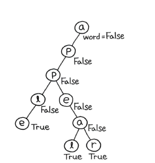
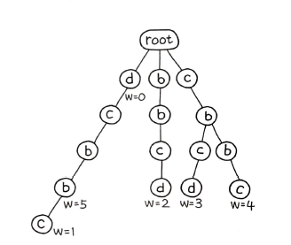
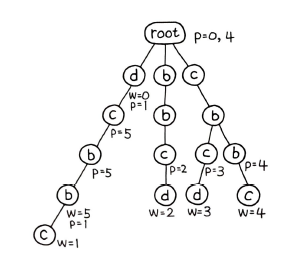

# 트라이
> 검색 트리의 일종으로 일반적으로 키가 문자열인, 동적 배열 또는 연관 배열을 저장하는 데 사용되는 정렬된 트리 자료구조다.
자연어 처리(NLP) 분야에서 문자열 탐색을 위한 자료구조로 널리 쓰인다.  
검색을  뜻하는 retrieval 의 중간 음절에서 용어를 따왔다. 리트리벌이라고 발음이 되는데, 그러면 트리로 발음이 되어서 기존의 트리와 구분하기 위해 오늘날에는 `트라이`로 불린다.  
트라이는 트리와 유사하지만, `다진 트리`의 형태를 띤다.  
트라이 탐색을 하면 apple를 찾기 위해 a -> p -> p-> l -> e 순서로 탐색을 하게 된다. 즉, `문자열의 길이`만큼만 탐색을 하면 되기 때문이다. 
# 56. 트라이 구현
트라이의 insert, search, startsWith 메소드를 구현하라. 
```python
Trie trie = new Trie();

trie.insert("apple");
trie.search("apple");   // returns true
trie.search("app");     // returns false
trie.startsWith("app"); // returns true
trie.insert("app");
trie.search("app");     // returns true
```

## `풀이 1. 딕셔너리를 이용해 간결한 트라이 구현`
  

그림처럼 같은 문자가 같은 자식을 타고 내려가다가, 달라지는 문자부터 서로 다른 노드로 분기된다.  

삽입을 위한 insert()는 self.children를 `defaultdict()`로 선언한다면 insert() 삽입 메소드에서 매번 if로 자식 노드가 존재하는지 확인할 필요가 없다.  
```py
def __init__(self) :
	self.word = False
	self.children = collections.defaultdict(TrieNode)

def insert(self, word) :
	node = self.root
	for char in word :
		node = node.children[char]
	node.word = True

```

search() 와 startsWith() 는 둘 다 검색을 위한 메소드이다.  
둘 다 동일하게 문자 단위로 계속 깊이 탐색을 하고 search()의 경우에만 마지막에 word가 True인지 확인하면 된다.  
```py
def search(self, word) :
		node = self.root
		for char in word :
				if char not in node :
						return False
				node = node[char]
		return node.word

```
문자열에서 문자를 하나씩 for 반복문으로 순회하면서 자식 노드를 계속 타고 내려간다. 그리고 마지막에 node.word 여부를 리턴한다. 만약 단어가 완성된 트라이라면 True로 되어 있을 것이고, 이때 True가 결과로 리턴된다.
```py
def startsWith(self, prefix) :
		node = self.root
		for char in prefix :
				if char not in node :
						return False
				node = node[char]
		return True
```
search() 와는 다르게, node.word를 확인하지 않고, 자식 노드가 존재하는지 여부만 판별하면 된다. 

# 57. 팰린트롬 페어
단어 리스트에서 words[i] + words[j] 가 팰린드롬이 되는 모든 인덱스 조합 (i, j) 를 구하라.
- 입력
```py
["abcd","dcba","lls","s","sssll"]
```
- 출력
```py
[[0,1],[1,0],[3,2],[2,4]]
```
## 풀이 1. 팰린드롬을 부르트 포스로 계산
6장의 1번 `유효한 팰린드롬` 문제의 풀이 중 가장 간단하면서 성능이 좋은 풀이는 `슬라이싱`을 이용하는 것이다.  
```py
def is_palindrome(word) :
	return word == word[::-1]
```
n^2 번 반복하면서 모든 조합을 구성하고, 매번 팰린드롬 여부를 체크한다.

```py
def palindromePairs(self, words) :'
	def is_palindrome(word) :
		return word == word[::-1]
		
	result = []
		for i, word1 in enumerate(words) :
			for j, word2 in enumerate(words) :
					if i == j :
							continue
					if self.is_palindrome(word1 + word2) :
							result.append([i, j])
		return result
```
하지만 타임아웃이 발생한다.

## `풀이 2. 트라이 구현`
O(n^2) 에서 O(n) 으로 풀이가 가능하다.  
O(n) 으로 하기 위해서는, 모든 입력값을 트라이로 만들어주고 딱 한번씩만 탐색하는 문제로 변형을 하면 된다. 팰린드롬 판별을 위해, `뒤집어서 트라이로 구성`하면 된다.  
입력값이 ['d', 'cbbccd', 'dcbb', 'dcbc', 'cbbc', 'bbcd'] 라고하자. 입력값을 뒤집은 후, 트라이를 구성하면 아래와 같다.



트라이로 삽입하는 코드는 다음과 같다.
```py
def insert(self, index, word) :
	node = self.root
	for i, char in enumerate(reversed(word)) :
		...
		node = node.children[char]
	node.word_id = index
```
각각의 단어가 끝난 지점에는 단어 인덱스를 word_id로 부여했다. 이전 문제에서는 True, False 여부만 표기했지만, 여기서는 해당 단어의 인덱스를 찾아야 하기 때문에 word_id로 부여했다. 단어 존재 여부를 찾는 핵심 코드는 다음과 같다.
```py
results = []
...
while word : 
	if node.word_id >= 0 :
		...
		result.append([index, node.word_id])
```
단어를 뒤집어서 구축한 트라이이기 때문에 입력값을 순서대로 탐색하다가, 끝나는 지점의 word_id 값이 -1 이 아니라면, 현재 인덱스 index와 해당 word_id는 팰린드롬으로 판단 가능하다.  
예를 들어 위의 그림에서 입력값 bbcd의 트라이 탐색이 끝나는 지점에는 word_id가 2가 셋팅되어 있고, bbcd의 인덱스는 5이기 때문에, [5, 2] 인 bbcd + dcbb는 팰린드롬이며, 이 방법이 `첫 번째 판별 로직`이다.  
`두 번째 판별 로직`은 트라이 삽입 중에 남아 있던 단어가 팰린드롬이라면 미리 팰린드롬 여부를 세팅해 두는 방법이다. 즉 입력값들 중, 'cbbc'는 단어 자체가 팰린드롬이므로, 루트에 바로 입력값의 인덱스인 p = 4를 세팅하고, word[0:len(word) - i] 형태로 단어에서 문자 수를 계속 줄여 나가며 팰린드롬 여부를 체크한다. 문자가 하나만 남게 될 때는 항상 팰린드롬이므로, 마찬가지로 p = 4를 마지막에 세팅한다. 당연히 이 마지막 값은 항상 w의 바로 앞 노드가 된다. 팰린드롬 여부인 p를 추가한 트라이는 다음과 같다.  
  
이 알고리즘을 추가하여 삽입 함수를 다음과 같이 개선 가능하다.
```py
def insert(self, index, word) :
	node = self.root
	for i, char in enumerate(reversed(word)) :
		if self.is_palindrome(word[0:len(word) - i]) :
			node.palindrome_word_ids.append(index)
		node = node.children[char]
	node.word_id = index
```
p로 표현한 것을 코드에서는 palindrome_word_ids 로 풀어서 표현했다. 코드에서는 속성의 이름을 복수형으로 정했는데, 그 이유는 이 그림의 루트 경우처럼 p값이 여러 개가 될 수 있기 때문이다. 이제 위의 로직들을 반영한 각 트라이 노드가 저장될 TrieNode 클래스를 다음과 같이 수정해보자.

```py
class TrieNode :
	def __init__(self) :
		self.children = collections.defaultdict(TrieNode)
		self.word_id = -1
		self.palindrome_word_ids = []
```
이제 남아 있는 단어가 팰린드롬인 경우를 좀 더 살펴보자. w는 단어의 끝이고 p는 w 이전 노드에 반드시 셋팅이 된다. 

```py
# 트라이를 저장할 노드
class TrieNode :
	def __init__(self) :
		self.children = collections.defaultdict(TrieNode)
		self.word_id = -1
		self.palindrome_word_ids = []

class Trie :
	def __init__(self) :
		self.root = TrieNode()
	
	@staticmethod
	def is_palindrome(word) :
		return word == word[::-1]
	
	# 단어 삽입
	def insert(self, index, word) :
		node = self.root
		for i, char in enumerate(reversed(word)) :
			if self.is_palindrome(word[0:len(word) - i]) :
				node.palindrome_word_ids.append(index)
			node = node.children[char]
		node.word_id = index
	
	def search(self, index, word) :
		result = []
		node = self.root

		while word :
			# 판별 로직 3
			if node.word_id >= 0 :
				if self.is_palindrome(word) :
					result.append([index, node.word_id])

			if not word[0] in node.children :
				return result
		
			node = node.children[word[0]]
			word = word[1:]

		# 판별 로직 1
		if node.word_id >= 0 and node.word_id != index :
			result.append([index, node.word_id])

		# 판별 로직 2
		for palindrome_word_id in node.palindrome_word_ids :
			result.append([index, palindrome_word_id])
		
		return result

class Solution :
	def palindromePairs(self, words) :
		trie = Trie()
		for i, word in enumerate(words) :
			trie.insert(i, word)
		
		result = []
		for i, word in enumerate(words) :
			result.extend(trie.search(i, word))
		
		return result
```
위의 3가지 경우를 팰린드롬으로 판별할 수 있으며, 입력값을 각각 한 번씩만 대입하면 되기 때문에 O(n) 으로 풀이가 가능하다. 좀 더 정확히는 단어의 최대 길이를 k로 했을 때 O(k^2n) 이며, 앞서 브루트 포스 풀이의 경우는 O(kn^2) 이다.

# @staticmethod 데코레이터
자바에서는 애노테이션(Annotation) 이라 부르는 동일한 위치에 있다. 파이썬에서는 이 부분을 데코레이터(Decorator)라 부른다. 그 중에서 @staticmethod는 자바의 메소드 static 선언과도 비슷한데, 이렇게 정의한 메소드는 `클래스와 독립적인 함수`로서의 의미를 강하게 갖는다. 실제로 파라미터에도 클래스 메소드에는 항상 따라붙는 self가 빠져있고, 함수 자체가 별도의 자료형으로 선언되어 있다.

```py
class CLASS :
	def a(self) :
		pass
	
	@staticmethod
	def b() :
		pass
```
이 같은 클래스가 선언되어 있을 때, 함수 a()와 b()의 타입을 출력해보자.
```py
>>> type(CLASS.a), type(CLASS.b)
(<class 'function'>, <class 'function'>)
```
클래스를 생성하지 않고 바깥에서 직접 호출했을 때 타입은 이처럼 둘 다 function이다. 그러나 다음과 같이 클래스를 생성한 후에 호출해보자.
```PY
>>> cls = CLASS()
>>> type(cls.a), type(cls.b)
(<class 'method'>, <class 'function'>)
```
클래스 생성 후엔, 클래스 내 함수는 이제 메소드가 된다. 그러나 @staticmethod로 선언핞 함수는 여전히 함수임을 확인할 수 있다. 클래스의 메소드가 아니라 여전히 `독립된 함수`의 의미를 갖는 것이다. 사실상 클래스 바깥에 함수를 별도로 선언한 것과 같은 의미를 지닌다.  
이렇게 하면 클래스 메소드처럼 자유롭게 클래스 인스턴스에 접근하는 것이 제한된다. 따라서 클래스 인스턴스에 접근을 제한하고 분명하게 독립적인 함수로 선언하고자 할 경우 종종 사용한다.