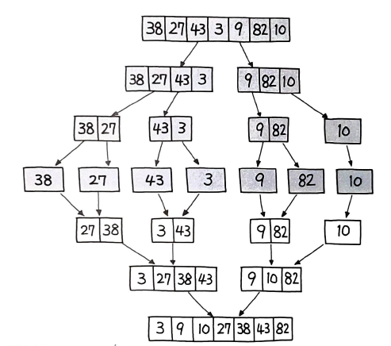
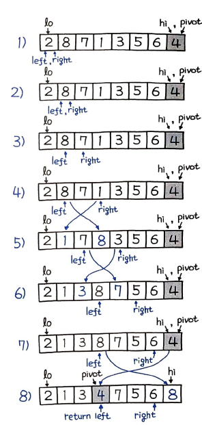
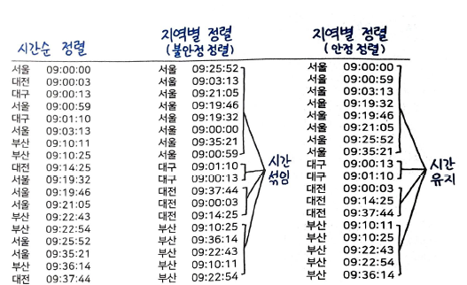
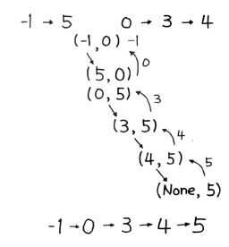
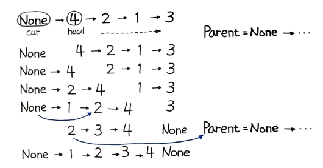

# 정렬
> 목록의 요소를 특정 순서대로 넣는 알고리즘이다. 대개 숫자식 순서와 사전식 순서로 정렬한다.

## 버블 정렬 - Bubble Sort
> 인접한 두 개의 요소를 비교하여 정렬하는 방법이다. 시간 복잡도는 O(n^2)이다.

```python
def bubble_sort(nums):
		for i in range(1, len(nums)):
				for j in range(0, len(nums) - 1):
						if nums[j] > nums[j+1]:
								nums[j], nums[j+1] = nums[j+1], nums[j]
		return nums
```
## 병합 정렬- Merge Sort
> 리스트를 절반으로 잘라 비슷한 크기의 두 부분 리스트로 나누고 각 부분 리스트를 재귀적으로 합병 정렬을 이용해 정렬한다. 시간 복잡도는 O(nlogn)이다.

분할 정복의 진수를 보여주는 알고리즘이다. 최선과 최악 모두 O(nlogn)이다. 그림으로 표현하면 다음과 같다.  


## 퀵 정렬 - Quick Sort
> 기준 데이터를 설정하고 그 기준보다 큰 데이터와 작은 데이터의 위치를 바꾸는 방법이다. 시간 복잡도는 O(nlogn)이다.

기준 데이터를 `피벗`이라고도 한다. 피벗을 기준으로 좌우를 나누는 특징 때문에 `파티션 교환 정렬(Partition-Exchange Sort)` 이라고도 한다.  
병합 정렬과 마찬가지로 분할 정복 알고리즘이며 여기에 피벗이라는 개념을 통해 피벗보다 작으면 왼쪽, 크면 오른쪽과 같은 방식으로 `파티셔닝`하면서 쪼개 나간다. 여러 가지 변형과 개선 버전이 있는데 여기서는 N. 로무토가 구현한 파티션 계획을 살펴본다.  
로무토 파티션이란 `항상 맨 오른쪽의 피벗을 택하는 단순한 방식` 이다. 

```python
def partition(low, high):
	pivot = A[high]
	left = low
	for right in range(low, high) :
		if A[right] < pivot:
			A[left], A[right] = A[right], A[left]
			left += 1
	A[left], A[high] = A[high], A[left]
	return left
```
코드는 위와 같고 그림으로 나타내면 아래와 같다.  
  
이 그림에서 보듯이 오른쪽 right 포인터가 이동하면서 피벗의 값이 오른쪽 값보다 클 때, 왼쪽과 오른쪽의 스왑이 진행된다. 스왑 이후에는 왼쪽 left 포인터가 함께 이동한다. 여기서 피벗의 값은 4이므로, 오른쪽 포인터가 끝에 도달하게 되면 4 미만의 값은 왼쪽으로, 4 이상인 값은 오른쪽에 위치하게 된다. 그리고 왼쪽 포인터의 위치로 피벗 아이템이 이동한다.  
이런식으로 계속 `분할하면서 정복을 진행`하여 코드 기준으로 lo < hi 를 만족하지 않을 때까지, 즉 서로 위치가 역전할 때까지 계속 재귀로 반복되면서 정렬이 완료된다. 중첩 함수를 이용해 파이썬답게 구현해 좀 더 깔끔하게 정리한 전체 코드는 다음과 같다.  
```py
def quicksort(A, lo, hi) :
	def partition(lo, hi) :
		pivot = A[hi]
		left = lo
		for right in range(lo, hi) :
			if A[right] < pivot:
				A[left], A[right] = A[right], A[left]
				left += 1
		A[left], A[hi] = A[hi], A[left]
		return left

	if lo < hi :
		pivot = parititon(lo, hi)
		quicksort(A, lo, pivot - 1)
		quicksort(A, pivot + 1, hi)
```
퀵 정렬은 그 이름처럼 매우 빠르며 굉장히 효율적인 알고리즘이지만, 최악의 경우에는 O(n^2)이 된다. 만약 이미 정렬된 배열이 입력값으로 들어오면, 피벗이 계속 오른쪽에 위치하게 되므로 파티셔닝이 전혀 이루어지지 않는다. 이때 n 번의 라운드에 걸쳐 결국 전체를 비교하기 때문에, 버블 정렬과 다를 바 없는 최악의 성능을 보이게 된다. 

# 안정 정렬 vs 불안정 정렬
> 안정 정렬(Stable Sort) 알고리즘은 중복된 값을 입력 순서와 동일하게 정렬한다.
퀵 정렬의 또 다른 문제점은 안정 정렬이 아니라는 점이다. 다음 그림을 보자.  
  
안정 정렬의 경우에는 기존의 시간 순으로 정렬했던 순서는 지역명으로 재정렬하더라도 기존 순서가 그대로 유지된 채로 정렬되지만, 불안정 정렬의 경우에는 시간 순으로 정렬한 값을 지역명으로 재정렬하면 기존의 정렬 순서는 무시된 채 모두 뒤섞여버린다.  
대표적으로 병합 정렬은 안정 정렬이며, 심지어 버블 정렬 또한 안정 정렬이다. 하지만 퀵 정렬은 불안정 정렬이다. 파이썬의 기본 정렬 알고리즘으로는 병합 정렬과 삽입 정렬을 휴리스틱하게 조합한 `팀소트(Timsort)`가 사용된다. 팀소트는 안정 정렬이다.  

# 58. 리스트 정렬
연결 리스트를 O(nlogn)에 정렬하라.
## `풀이 1. 병합 정렬`
연결리스트는 전체 길이를 알 수 없기 때문에 여기서는 `런너(Runner)` 기법을 활용해보자.
```py
half, slow, fast = None, head, head
while fast and fast.next : 
	half, slow, fast = slow, slow.next, fast.next.next
half.next = None
```
slow는 한 칸씩, fast는 두 칸씩 앞으로 이동한다. 이렇게 하면 fast가 맨 끝에 도달했을 때 slow는 중앙에 도착한다. half는 slow의 바로 이전의 값으로 한다. 그리고 마지막에는 half.next = None으로 half 위치를 기준으로 연결 리스트 관계를 끊어버린다.   
이제 다음과 같이 분할해서 `재귀 호출`을 진행해보자.
```py
def sortList(self, head) : 
	...
	l1 = self.sortList(head)
	l2 = self.sortList(slow)
```
head는 시작 노드이고, slow는 우리가 탐색을 통해 발견한 중앙 지점이다. 계속 재귀 호출을 해나가면 결국 연결 리스트는 -1, 5, 3, 4, 0 단일 아이템으로 모두 쪼개진다.  

```py
def mergeTwoLists(self, l1, l2) :
	if l1 and l2 :
		if l1.val > l2.val :
			l1, l2 = l2, l1
		l1.next = self.mergeTwoLists(l1.next, l2)
```
크기 비교를 통해 정렬하면서 이어 붙인다.
```py
# 두 정렬 리스트 병합
def mergeTwoLists(self, l1, l2) :
	if l1 and l2 :
		if l1.val > l2.val :
			l1, l2 = l2, l1
		l1.next = self.mergeTwoLists(l1.next, l2)

	return l1 or l2

def sortList(self, head) :
	if not (head and head.next) :
		return head

	# 런너 기법 활용
	half, slow, fast = None, head, head
	while fast and fast.next : 
		half, slow, fast = slow, slow.next, fast.next.next
	half.next = None

	# 분할 재귀 호출
	l1 = self.sortList(head)
	l2 = self.sortList(slow)

	return self.mergeTwoLists(l1, l2)
```
코드에서 처음에는 l1에 -1, l2에는 0이 입력값으로 들어오고, l1의 next인 5는 0보다 크기 때문에 스왑한다. 이후에는 스왑 없이 계속 next 순서로 3, 4로 연결된다. 마지막에는 4의 next가 None이고, 이 경우 return l1 or l2 부분에서 l2 값이 return 되며, 즉 5가 리턴된다. 그림처럼 정렬이 되는 것이다.  
  

## 풀이 2. 퀵 정렬
퀵 정렬은 대표적인 불안정 정렬로, 같은 값이 반복될 경우에도 계속해서 스왑을 시도한다.  
연결리스트는 특성상 피벗을 임의로 지정하기가 어렵기 때문에 여기서는 피벗을 항상 첫번째 값으로 설정했는데, 이 경우 이미 정렬된 리스트가 들어오면 계쏙해서 불균형 리스트로 나뉘기 때문에 O(n^2)의 시간 복잡도를 가진다.

## 풀이 3. 내장 함수를 이용하는 실용적인 방법
.sort()와 sorted()를 통해 효율적인 팀소트 정렬 알고리즘을 활용하는 방법이다.  
우선 연결리스트를 파이썬의 리스트로 만든다.  
```py
lst = []
while p:
	lst.append(p.val)
	p = p.next
```
그 다음 파이썬의 내장 정렬 함수인 sort()를 다음과 같이 수행한다.
```py
lst.sort()
```
정렬한 리스트는 다음과 같이 다시 연결 리스트로 만든다.
```py
p = head
for i in range(len(lst)) :
	p.val = lst[i]
	p = p.next
return head
```
병합 정렬은 320ms, 퀵 정렬은 타임아웃이 발생하지만, 이 풀이는 84ms 만에 풀린다.

# 59. 구간 병합
구간을 정렬하고 겹치는 구간을 병합하라.
## 풀이 1. 정렬하여 병합
먼저 정렬을 수행한다. 정렬 순서는 첫 번째 값을 기준으로 한다.  
```py
sorted(intervals, key=lambda x:x[0])
```
다음 아이템의 시작 값이 이전 아이템의 끝과 더 이상 겹치지 않게 된다면, 병합을 멈추고 다음과 같이 merged += i, 를 이용해 새로운 아이템으로 추가한다.
```py
def merge(self, intervals) :
	merged = []
	for i in sorted(intervals, key=lambda x:x[0]) :
		if merged and i[0] <= merged[-1][1] :
			merged[-1][1] = max(merged[-1][1], i[1])
		else :
			merged += i,
	return merged
```
# 콤마 연산자
```py
merged += i,
```
기본적인 추가 연산을 해보자
```py
>>> a = [1]
>>> b = [2, 3]
>>> a += b
>>> a
[1, 2, 3]
```
단순히 += 를 했을 때는 요소를 이어붙인다. 행렬의 연결(Concatenate) 연산과 동일하다. 이번에는 콤마를 넣어보자.
```py
>>> a = [1]
>>> b = [2, 3]
>>> a += b,
>>> a
[1, [2, 3]]
```
이렇게 되면 `중첩 리스트`가 된다. 콤마는 중첩 리스트로 만들어주는 역할을 하며, 대괄호 [] 를 부여한 것과 동일한 역할을 한다.
```py
>>> a += [b]
>>> a
[1, [2, 3]]
```
# 60. 삽입 정렬 리스트
연결 리스트를 삽입 정렬로 정렬하라.
## 풀이 1. 삽입 정렬
삽입 정렬의 과정을 그림으로 나타내면 다음과 같다.  
  
삽입 정렬은 정렬을 해야 할 대상과 정렬을 끝낸 대상, 두 그룹으로 나눠 진행한다.  
head는 정렬을 해야 할 대상이며, cur는 정렬을 끝낸 대상으로 정한다. 다음과 같이 정렬을 해야 할 대상 head를 반복한다.
```py
cur = parent = ListNode(None)
while head:
	while cur.next and cur.next.val < head.val :
		cur = cur.next
```
cur와 parent는 빈 노드로 정한다. cur에는 정렬을 끝낸 연결 리스트를 추가해줄 것이고, parent는 계속 그 위치에 두어 사실상 루트를 가리키게 한다. 정렬을 끝낸 cur는 이미 정렬된 상태이므로, 정렬을 해야 할 대상과 head와 비교하면서 더 작다면 계속 cur, next를 이용해 다음으로 이동한다. 이제 정렬이 필요한 위치, 즉 cur에 삽입될 위치를 찾았다면 다음과 같이 cur 연결 리스트에 추가한다.  
```py
cur.next, head.next, head = head, cur.next, head.next
cur = parent
```
찾은 cur 위치 다음에 head가 들어가고, head.next 에는 cur.next를 연결해 계속 이어지게 한다. 그리고 다음번 head는 head.next 로 차례를 이어받는다. 이후에는 cur = parent를 통해 다시 처음으로 되돌아가며, 차례대로 다시 비교하게 된다.
```py
def insertionSortList(self, head) :
	cur = parent = ListNode(None)
	while head :
		while cur.next and cur.next.val < head.val :
			cur = cur.next

		cur.next, head.next, head = head, cur.next, head.next
		
		cur = parent

	return cur.next
```
수행시간은 거의 2초가 걸리므로 타임아웃이 발생한다.

## 풀이 2. 삽입 정렬의 비교 조건 개선
매번 가장 작은 값부터 차례대로 크기 비교를 하는 매우 비효율적인 연산이 수행된다.  
```py
cur = parent
```
다음번 head를 비교할 때 정렬된 노드인 cur도 다시 맨 처음으로 돌아가게 되는데, 만약 다음번 head도 cur보다 큰 상태라면 굳이 되돌아갈 필요가 없다. 되돌아가는 경우는 cur가 head보다 클 떄만 하면 될 것 같다.
```py
if head and cur.val > head.val :
	cur = parent
```
cur.val 이 head.val 보다 작다면, 그 다음 반복 때 while 구문이 실행되지 않고 바로 교환이 진행되므로, 불필요한 while 반복은 진행하지 않아도 된다. 수정사항을 반영한 전체코드는 다음과 같다.
```py
def insertSortList(self, head) :
	# 초깃값 변경
	cur = parent = ListNode(0)
	while head :
		while cur.next and cur.next.val < head.val :
			cur = cur.next

		cur.next, head.next, head = head, cur.next, head.next

		# 필요한 경우에만 cur 포인터가 되돌아가도록 처리
		if head and cur.val > head.val :
			cur = parent
	return parent.next
```
cur.val 을 비교할 때 None 타입이면 에러가 발생하므로, 이 부분 떄문에 초기 값을 풀이 #1의 ListNode(None) 에서 ListNode(0) 으로 수정해주었다. 1936ms에서 180ms까지 줄일 수 있다.

# 61. 가장 큰 수
항목들을 조합하여 만들 수 있는 가장 큰 수를 출력하라.
## 풀이 1. 삽입 정렬
각 요소 단위로 크기 순으로 정렬하면 된다. 단, 이 문제에서는 맨 앞에서부터 자릿수 단위로 비교해서 크기 준으로 정렬해야한다. 즉 9는 30보다 맨 앞자리 수가 더 크므로 9가 더 앞에 와야한다. 즉, 930 이 큰지 309가 큰지 비교하는 문제로 풀 수 있다. a + b와 b + a를 비교하는 형태로 처리가능하다.  
```py
def to_swap(n1, n2) :
	return str(n1) + str(n2) < str(n2) + str(n1)
```
삽입 정렬을 연결 리스트가 아닌 리스트로 구현하면 다음과 같다.
```py
def largestNumber(self, nums) :
	i = 1
	while i < len(nums) :
		j = i
		while j > 0 and self.to_swap(nums[j - 1], nums[j]) :
			nums[j], nums[j - 1] = nums[j - 1], nums[j]
			j -= 1
		i += 1
```
이전 값이 더 커서 스왑이 필요한지 여부를 체크하는 로직인데, 우리는 이 부분을 문제에 적합하게 단순 비교가 아닌 to_swap() 이라는 함수를 통해 스왑 여부를 판단하였다.  
아울러 정렬된 리스트 변수를 별도로 선언했던 것과 달리 원래 삽입 정렬을 배열로 구현하게 되면, 이처럼 제자리 정렬이 가능하여 공간 복잡도도 줄일 수 있다.

```py
class Solution :
	# 문제에 적합한 비교 함수
	def to_swap(self, n1, n2) :
		return str(n1) + str(n2) < str(n2) + str(n1)

	# 삽입 정렬 구현
	def largestNumber(self, nums) :
		i = 1
		while i < len(nums) :
			j = i
			while j > 0 and self.to_swap(nums[j - 1], nums[j]) :
				nums[j], nums[j - 1] = nums[j - 1], nums[j]
				j -= 1
			i += 1

		# 예외 처리 : [0, 0, 0] -> "0"
		return str(int(''.join(map(str, nums))))
```
그냥 문자로 처리하면 입력값이 ["0", "0"] 인 경우도 있기 때문에, join() 결과를 int로 바꿔서 00이 0이 되도록 만들어 준 후, 다시 str로 변경해줘야 한다.  
# 62. 유요한 애너그램
t가 s의 애너그램인지 판별하라
## 풀이 1. 정렬을 이용한 비교
애너그램 여부를 판별하려면 양쪽 문자열을 모두 정렬하고 그 상태가 일치하는지 확인하면 된다.
```py
def isAnagram(self, s, t) :
	return sorted(s) == sorted(t)
```

# 63. 색 정렬
빨간색을 0, 흰색을 1, 파란색을 2라 할 때 순서대로 인정하는 제자리 정렬을 수행하라.  
##  풀이 1. 네덜란드 국기 문제를 응용한 풀이
네덜란드 국기의 색깔인 붉은색(위), 흰색(중앙), 파란색(아래)을 세 부분으로 대입해 분할하는 것으로서, 피벗보다 작은 부분, 같은 부분, 큰 부분 이렇게 세 부분으로 분할하여 기존 퀵 정렬의 두 부분 분할에 비해 개선하는 방안을 제시하는 것이다.
```py
def sortColors(self, nums) :
	red, white, blue = 0, 0, len(nums)

	while white < blue :
		if nums[white] < 1 :
			nums[red], nums[white] = nums[white], nums[red]
			red += 1
			white += 1
		elif nums[white] > 1 :
			blue -= 1
			nums[white], nums[blue] = nums[blue], nums[white]
		else :
			white += 1
```
1을 기준으로 작은 값은 왼쪽으로, 큰 값은 오른쪽으로 스왑된다. 이때 red와 blue는 각각 오른쪽과 왼쪽으로 이동하면서 간격이 점점 더 좁아지는 형태가 된다. 투 포인터 풀이와 유사하며, 그 사이에 포인터가 하나 더 존재한다고 볼 수 있다. white와 blue 사이는 계쏙 비교가 진행된다. 마지막으로 비교가 완료될 때 red는 1보다 작은 인덱스의 + 1지점, blue는 1보다 큰 인덱스의 처음을 가리키게 되며, white와 blue가 겹쳐지면서 비교가 완료된다.

# 원점에 K번쨰로 가까운 점
평면상에 points 목록이 있을 때, 원점 (0, 0) 에서 K번 가까운 점 목록을 순서대로 출력하라. 평면상 두 점의 거리는 유클리드 거리로 한다.  

## 풀이 1. 유클리드 거리의 우선순위 큐 순서
유클리드 거리 값들을 크기가 작은 순으로 `K번 추출`하면 되는 문제이다.  
`K번 추출` 이라는 단어에서 바로 `우선순위 큐`를 떠오릴 수 있다. 즉 유클리드 거리를 계산하고 이 값을 우선순위 큐로 K번 출력하면 쉽게 문제를 풀이할 수 있다. `math 모듈`을 이용해 위의 유클리드 거리 수식을 구현해 계산하고 힙에 삽입하는 코드는 다음과 같다.

```py
heap = []
for (x, y) in points :
	dist = math.sqrt((0 - x) ** 2 + (0 - y) ** 2)
	heapq.heappush(heap, (dist, x, y))
```
우선순위 큐는 주로 `힙으로 구현` 한다고 여러 차례 언급된 바가 있다. 파이썬의 heapq 모듈은 `최소 힙` 이기 때문에 거리가 가까운 순을 출력해야 하는 이 문제 풀이에 더욱 적합하다. 만약 가장 먼 거리를 출력해야 한다면, 음수로 변환하여 -dist를 삽입하는 형태로 풀이할 수 있을 것이다.  
```py
def kClosest(self, points, K) :
	heap = []
	for (x, y) in points :
		dist = x ** 2 + y ** 2
		heapq.heappush(heap, (dist, x, y))

	result = []
	for _ in range(K) :
		(dist, x, y) = heapq.heappop(heap)
		result.append([x, y])
	return result
```
만약 거리를 계산해 다른 데서 활용할 게 아니라면 수식을 간략하게 만들 수 있다. 어차피 순서만 동일하면 되기 떄문이다. 따라서 여기서 math.sqrt()는 생략해도 무방하다. 이 경우에는 `거리의 제곱`을 계산하고, `힙에 삽입`할 때도 `거리의 제곱`을 삽입하면 된다. 수행속도 또한 높일 수 있다.