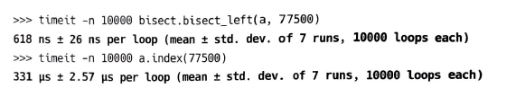
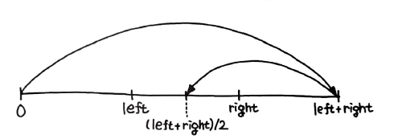
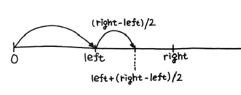
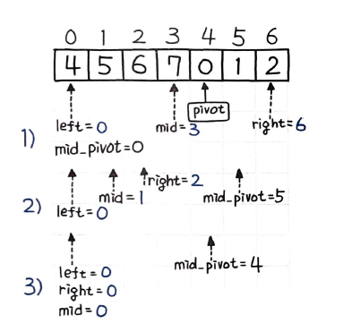

> 이진 검색(Binary Search) 이란 정렬된 배열에서 타켓을 찾는 검색 알고리즘이다.  
이진 검색은 값을 찾아내는 시간 복잡도가 O(log n) 이라는 점에서 대표적인 로그 시간 알고리즘이며, 이진 탐색 트리(Binary Search Tree)와도 유사한 점이 많다.  
그러나 이진 탐색 트리가 정렬된 구조를 저정하고 탐색하는 `자료구조` 라면, 이진 검색은 정렬된 배열에서 값을 찾아내는 `알고리즘` 자체를 지칭한다.  

# 65. 이진 검색
정렬된 nums 를 입력받아 이진 검색으로 target에 해당하는 인덱스를 찾아라.
- 입력
nums = [-1, 0, 3, 5, 9, 12], target = 0
- 출력
4

## 풀이 1. 재귀 풀이
간단히 재귀로 이진 검색을 구현할 수 있다. 절반씩 범위를 줄여나가며 맞출 떄까지 계속 재귀 호출하면 된다.

```py
def search(self, nums, target) :
	def binary_search(left, right) :
		if left <= right :
			mid = (left + right) // 2

			if nums[mid] < target :
				return binary_search(mid + 1, right)
			elif nums[mid] > target :
				return binary_search(left, mid - 1)
			else :
				return mid

		else :
			return -1

	return binary_search(0, len(nums) - 1)
```
# 재귀 제한
파이썬에서는 재귀 호출에 대한 호출 횟수 제한이 있으며 기본 값은 1,000 으로 설정되어있다.
```py
>>> sys.getrecursionlimit()
1000
```
당연히 이 값은 변경할 수 없으나 일반적으로 코딩 테스트 플랫폼에서는 sys 모듈을 이용한 설정 변경을 허용하지 않기 때문에 가급적 모든 재귀 풀이는 1,000 회 반복 이내에 풀이가 가능하도록 구현해야 한다.

## 풀이 2. 반복 풀이
대부분의 재귀 풀이는 반복 풀이로도 구현할 수 있다. 좀 더 직관적인 반복 풀이는 다음과 같다.
```py
def search(self, nums, target) :
	left, right = 0, len(nums) - 1

	while left <= right :
		mid = (left + right) // 2

		if nums[mid] < target :
			left = mid + 1
		elif nums[mid] > target :
			right = mid - 1
		else :
			return mid

	return -1
```
## 풀이 3. 이진 검색 모듈
앞서 풀이 #1과 풀이 #2에서 이진 검색을 직접 구현했지만 사실 파이썬에서는 이진 검색을 직접 구현할 필요가 없다. 이진 검색 알고리즘을 지원하는 `bisect 모듈` 을 기본으로 제공하기 때문이다.
```py
def search(self, nums, target) :
	index = bisect.bisect_left(nums, target)

	if index < len(nums) and nums[index] == traget :
		return index
	else :
		return -1
```
bisect_left() 함수는 정렬된 순서를 유지하면서 리스트 a에 x를 삽입할 가장 왼쪽 인덱스를 찾는다. 만약 리스트에 x가 이미 존재한다면 x가 삽입될 가장 왼쪽 인덱스를 반환한다. 여러 가지 예외 처리를 포함한 이진 검색 알고리즘이 깔끔하게 모듈 형태로 구현되어 있으므로, 이 모듈을 이용하면 이진 검색을 파이썬다운 방식으로 위와 같이 좀 더 간단히 풀이 가능하다.

## 풀이 4. 이진 검색을 사용하지 않는 index 풀이
이진 검색을 사용하지 않고도 문제를 풀 수 있다. 이진 검색은 정렬된 배열에서만 사용할 수 있기 때문에 정렬되지 않은 배열에서는 이진 검색을 사용할 수 없다.  
파이썬에서 제공하는, 해당 값의 인덱스를 찾아내는 `index() 메소드`를 활용하는 방법이다. 이 경우 존재하지 않는 값이라면 ValueError 예외가 발생하므로 이를 처리해주어야 한다.  
```py
def search(self, nums, target) :
	try :
		return nums.index(target)
	except ValueError :
		return -1
```
재귀를 이용한 풀이가 가장 느린 편이지만, 풀이 1 부터 4의 속도 차이는 거의 없다.  
index() 를 사용할 떄, 입력값의 배열이 작고 찾는 찾고자 하는 값이 가까울 때는 오히려 이진 탐색보다 속도가 빠르지만, 다음과 같은 예시에선 그림과 같이 차이가 난다.  
값이 엄청 많이 있는 배열에서, 중후반부에 위치한 77500 을 찾는다고 가정해보자.  
  
앞에서부터 차례대로 찾는 index() 함수는 최악의 경우 O(n) 으로, 뒤에 위치한 값일수록 점점 찾는 속도가 느려진다.  
반면 이진 검색은 항상 O(log n) 이므로, 아무리 큰 값이라도 log 의 성능 때문에 속도 차이가 거의 없다.  
# 이진 검색 알고리즘 버그
```py
mid = (left + right) // 2
```
이진 탐색에서 중앙의 위치를 구하는 코드이다. 하지만, 자료형에는 최댓값이 있으므로, left + right가 자료형의 최댓값을 넘어선다면, 좀 더 구체적으로 int 형일 때, 2^31 - 1 을 넘어선다면, C에서는 예상치 못한 결과가 나오게 되고, 자바에서는 오류가 발생한다. 결과가 int 자료형이 허용하는 최댓값을 초과하므로, 오버플로(Overflow)가 발생하기 떄문이다.  
  
  
위의 그림 중, 첫 번째가 에러가 나는 상황이고, 두 번째 사진은 개선 버전이다.  
left + (right - left) / 2 를 계산하면 오버플로를 피하면서 정확한 mid 값을 구할 수 있다.  
사실 파이썬은 임의 정밀도 정수형을 지원하기 때문에, 이 문제에서 자유로우며 해당 사항이 없다. 그러나 이는 자료형이 엄격한 언어들에는 여전히 발생할 수 있는 문제이기 때문에 주의가 필요하며, 따라서 반드시 숙지할 필요가 있다.  
# 66. 회전 정렬된 배열 검색
특정 피벗을 기준으로 회전하여 정렬된 배열에서 target 값의 인덱스를 출력하라.  
## 풀이 1. 피벗을 기준으로 한 이진 검색
정렬이 되어있긴 한데, 피벗을 기준으로 입력값이 돌아간 상황이다. 피벗이 어떤 것인지 모르는 상태이므로, 기존 이진 검색을 그대로 활용할 수는 없고 좀 더 특별한 처리가 필요하다. 피벗을 찾는 방법 중 하나는 `가장 작은 값`을 찾는 것이다. 
```py
left, right = 0, len(nums) - 1
while left < right :
	mid = left + (right - left) // 2

	if nums[mid] > nums[right] :
		left = mid + 1
	else :
		right = mid
```
재귀가 아닌 반복으로 풀이를 해보면 다음과 같다.
```py
pivot = left
left, right = 0, len(nums) - 1
while left <= right :
	mid = left  + (right - left) // 2 # 자료형을 초과하지 않는 중앙 위치 계산
	mid_pivot = ...

	if nums[mid_pivot] < target :
		left = mid + 1
	elif nums[mid_pivot] > target :
		right = mid - 1
	else :
		return mid

	...
```
앞서 최솟값 left를 찾아내 pivot 으로 구성하고, 이를 기준으로 피벗의 위치만큼 살짝 틀어준 mid_pivot 을 구성한 다음, 다시 이진 검색을 통해 target 값을 찾았다. mid_pivot은 다음과 같이 구현을 하였다.
```py
mid_pivot = (mid + pivot) % len(nums)
```
mid_pivot은 중앙의 위치 mid에 피벗 pivot 만큼 이동하고, 배열의 길이를 초과할 경우 모듈로 연산으로 회전될 수 있도록 처리했다. 이제 타켓과 값을 비교하는 부분은 mid가 아닌 mid_pivot을 기준으로 하되, left와 right는 mid를 기준으로 이동한다.
  
# 67. 두 배열의 교집합
두 배열의 교집합을 구하라
## 풀이 1. 브루트 포스로 계산
이 문제는 이진 검색과 투 포인터 등 다양한 풀이법을 시도할 수 있다. 먼저 가장 간단하고 직관적인 브루트 포스 풀이이다.
```py
def intersection(self, nums1: List[int], nums2: List[int]) -> List[int]:
	result = set()
	for n1 in nums1 :
		for n2 in nums2 :
			if n1 == n2 :
				result.add(n1)

	return result
```
O(n^2) 으로 반복하면서 일치하는 경우 무조건 추가한다.
## 풀이 2. 이진 검색으로 일치 여부 판별
한쪽으로 순서대로 탐색하고 다른 쪽은 정렬해서 이진 검색으로 값을 찾으면, 검색 효율을 획기적으로 높일 수 있다. 이 경우 시간 복잡도는 O(n log n) 이 된다.  
```py
...
nums2.sort()
for n1 in nums1 :
	i2 = bisect.bisect_left(nums2, n1)
	if n1 == nums2[i2] :
		result.add(n1)
```
nums2 는 정렬한 상태에서, nums1을 O(n) 순차 반복하면서 nums2를 O(log n) 이진 검색한다. 최초 정렬에 소요되는 O(n log n)을 감안해도 전체 O(n log n)에 가능하므로 앞서 O(n^2)에 비해 훨씬 좋은 성능을 보인다.

## 풀이 3. 투 포인터로 일치 여부 판별
양쪽 다 정렬하여 투 포인터로 풀이할 수도 있다. 마치 병합 정렬 시 마지막에 최종 결과를 비교하는 과정과 유사하다. 다만 일치하는 값을 판별한다는 차이만 있을 뿐이다. 이 경우 각각 정렬에 2 * O(n log n), 비교에 O(2n) 이 소요되므로, 마찬가지로 전체 O(n log n)에 풀이가 가능하다. 전체 코드는 다음과 같다.
```py
def intersection(self, nums1, nums2) :
	result = set()
	nums1.sort()
	nums2.sort()

	i = j = 0
	# 투 포인터 우측으로 이동하여 일치 여부 판별
	while i < len(nums1) and j < len(nums2) :
		if nums1[i] < nums2[j] :
			i += 1
		elif nums1[i] > nums2[j] :
			j += 1
		else :
			result.add(nums1[i])
			i += 1
			j += 1

	return result
```
정렬을 제외하면 비교에 따른 시간 복잡도는 상수항을 제외해서 O(n)이다.  
이진 검색과 투 포인터는 비슷한 성능을 보인다.  
# 68. 두 수의 합 II
정렬된 배열을 받아 덧셈하여 타켓을 만들 수 있는 배열의 두 숫자 인덱스를 리턴하라.  
## 풀이 1. 투 포인터
`정렬된 배열`이라 가정했을 떄때, 투 포인터로 풀이가 가능해진다. 7장의 7번 문제의 투 포인터 코드는 다음과 같다.
```PY
left, right = 0, len(nums) - 1
while not left == right :
	if nums[left] + nums[right] < target :
		left += 1
	elif nums[left] + nums[right] > target :
		right -= 1
	else :
		return left, right
```
이 문제의 경우 특별히 0이 아닌 `1부터 시작` 한다고 했으니, 리턴하는 부분의 값에 각각  +1 을 하고, 문제에서 입력값에 해당하는 변수명이 기존 nums에서 numbers로 바뀌었으니 이 부분만 수정해주면 된다.  
투 포인터의 경우, O(n)에 풀이가 가능하다.
## 풀이 2. 이진 검색
```py
def twoSum(self, nums, target) :
	for k, v in enumerate(numbers) :
		left, right = k + 1, len(numbers) - 1
		expected = target - v
		# 이진 검색으로 나머지 값 판별
		while left <= right :
			mid = left + (right - left) // 2
			if numbers[mid] < expected :
				left = mid + 1
			elif numbers[mid] > expected :
				right = mid - 1
			else :
				return k + 1, mid + 1
```
이진 검색을 이용한 풀이는 O(n log n)에 가능하다. 투 포인터가 O(n) 으로 이진 검색 풀이 O(n log n)에 비해 더 빠르게 실행된다. 112ms가 걸린다.

## 풀이 3. bisect 모듈 + 슬라이싱
bisect 모듈을 사용해서 이진 검색을 구현한 알고리즘이다.  
```py
def twoSum(self, numbers, target) :
	for k, v in enumerate(numbers) :
		expected = target - v
		i = bisect.bisect_left(numbers[k + 1:], expected)
		if i < len(numbers[k + 1:]) and numbers[i + k + 1] == expected :
			return k + 1, i + k + 2
```
위 풀이는 2초 이상 소요가 된다. 앞서 이진 검색 풀이가 112ms 정도였으니 20배 느려진 셈이다. 개선을 할 필요가 있다.
## 풀이 4. bisect 모듈 + 슬라이싱 최소화
아무래도 파이썬 슬라이싱을 무리하게 적용한 게 원인이므로, nums 변수에 한 번만 사용해 담아두는 형태로 다음과 같이 개선을 시도해봤다.
```py
def twoSum(self, numbers, target) :
	for k, v in enumerate(numbers) :
		expected = target - v
		nums = numbers[k + 1:]
		i = bisect.bisect_left(nums, expected)
		if i < len(nums) and numbers[i + k + 1] == expected :
			return k + 1, i + k + 2
```
1136ms 까지 왔지만, 아직 개선의 여지가 있다.

## 풀이 5. bisect 모듈 + 슬라이싱 제거
bisect 모듈의 기능을 좀 더 활용하기로 하고, 이진 검색 시 사용하는 bisect_left() 메소드의 공식 문서를 살펴보니 다음과 같이 기본 파라미터 외에도 여러 추가 파라미터가 있는 것을 발견했다.
```py
bisect.bisect_left(a, x, lo=0, hi=len(a))
```
왼쪽 범위를 제한하는 lo 파라미터를 활용하기로 하였다. 그러면 더 이상 슬라이싱을 사용할 필요가 없어진다.
```py
def twoSum(self, numbers, target) :
	for k, v in enumerate(numbers) :
		expected = target - v
		i = bisect.bisect_left(numbers, expected, k + 1)
		if i < len(numbers) and numbers[i] == expected :
			return k + 1, i + 1
```
이 경우 68ms로 드디어 투 포인터 풀이와 속도가 같아졌다.  
비록 슬라이싱은 편리하고 빠른 모듈이지만, 이처럼 생각 없이 무분별하게 남용하다 보면 속도 저하의 주범이 될 수 있다. 입력값이 매우 크기 떄문에 슬라이싱에서 속도 저하가 발생한 듯하다. 경우에 따라서는, 꼭 필요한 곳에만 적절히 사용해야 실행 속도를 좀 더 최적화 할 수 있다.

# 슬라이싱 성능
슬라이싱은 매번 새롭게 객체를 생성해서 할당하게 되고, 엄청나게 큰 배열의 경우 슬라이싱으로 새로운 개게를 생성하는 데 상당한 시간이 들기 때문이다. 마찬가지로 `배열의 길이를 계산하는 데도 매번 길이를 계산하는 비용`이 들기 때문에, 여기에 상당한 시간이 소요된다. 슬라이싱은 매번 새롭게 배열의 길이를 계산해야한다. 새로운 객체이기 때문이다.  
다음과 같이 1억 개 요소를 지닌 리스트를 생성했을 떄 다른 리스트 변수로 할당하는 작업은 금방 실행이 된다.
```py
>>> a = [x for x in range(1000000000)]
>>> id(a)
437698632
>>> b = a
>>> id(b)
437698632
```
여기서 b 변수는 a 변수 객체를 참조만 하면 되기 때문이다.  
```py
>>> c = a[:]
>>> id(c)
4377566600
```
그러나 c 변수는 다르다. 슬라이싱으로 할당했고, 이 경우 객체 참조가 아닌 요소 전체, 즉 `1억개를 모두 복사하는 과정`을 거친다. 이로 인해 상당한 시간이 소요되며, 복사로 인해 ID 또한 달라지는 것을 확인할 수 있다. 
# 69. 2D 행렬 검색 II
m * n 행렬에서 값을 찾아내는 효율적인 알고리즘을 구현하라. 행렬은 왼쪽에서 오른쪽, 위에서 아래 오름차순으로 정렬되어 있다.
- 예제
행렬은 다음과 같다.
```py
[
	[1, 4, 7, 11, 15],
	[2, 5, 8, 12, 19],
	[3, 6, 9, 16, 22],
	[10, 13, 14, 17, 24],
	[18, 21, 23, 26, 30]
]
```
target = 5인 경우 true를 반환한다. target = 20인 경우 false를 반환한다.
## 풀이 1. 첫 행의 맨 뒤에서 탐색

열을 기준으로 이진 검색을 수행한 다음, 행을 기준으로 이진 검색을 수행하면 된다.  
첫 행의 맨 뒤 요소를 택한 다음, 타켓이 이보다 작으면 왼쪽으로, 크면 아래로 이동하게 하는 방법을 택하면 된다. 행렬은 왼쪽에서 오른쪽, 위에서 아래로 정렬되어 있기 때문에 작으면 왼쪽, 크면 아래로 이동하면 원하는 위치에 도달할 수 있다.
```py
def searchMatrix(self, matrix, target) :
	# 예외처리
	if not matrix :
		return False

	# 첫 행의 맨 뒤
	row, col = 0, len(matrix[0]) - 1

	while row <= len(matrix) - 1 and col >= 0 :
		if target == matrix[row][col] :
			return True
		# 타켓이 작으면 왼쪽으로 이동
		elif target < matrix[row][col] :
			col -= 1
		# 타켓이 크면 아래로 이동
		elif target > matrix[row][col] :
			row += 1
	return False
```

## 풀이 2. 파이썬다운 방식
파이썬이 내부적으로 행렬에 값이 존재하는지 여부를 위에서부터 차례대로 한 줄씩 탐색하는 방법이다.
```py
def serachMatrix(self, matrix, target) :
	return any(target in row for row in matrix)
```

실행 시간은 모두 동일하다.

# any(), all() 함수
```py
>>> any([True, False, False])
True
```
any()는 포함된 값 중 어느 하나가 참이라면 항상 참으로 출력한다. 논리 연산의 OR과 비슷하다.
```PY
>>> all([True, False, False])
False
```
all()은 포함된 값이 모두 참이어야 참으로 출력한다. 논리 연산의 AND와 비슷하다.
