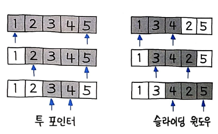
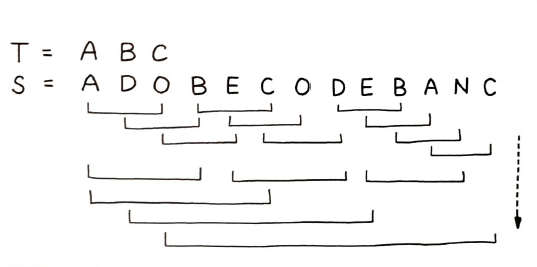

# 슬라이딩 윈도우

> 슬라이딩 윈도우(Sliding Window) 란 고정 사이즈의 윈도우가 이동하면서 윈도우 내에 있는 데이터를 이용해 문제를 풀이하는 알고리즘
`투 포인터`와 함께 `슬라이딩 윈도우`는 알고리즘 문제 풀이에 매우 유용하게 사용되는 중요한 기법이다. 투 포인터와 비슷하지만 일반적으로 `고정 사이즈 윈도우`를 사용하는 경우를 슬라이딩 윈도우로 따로 구분하기도 한다. 또한, 주로 `정렬된 배열`을 대상으로 하는 투 포인터와 달리 슬라이딩 윈도우는 `정렬 여부에 관계 없이` 활용된다는 차이가 있다.
  

윈도우의 사이즈가 가변적이며 좌우 포인터가 자유롭게 이동할 수 있는 방식이 투 포인터인 반면, 슬라이딩 윈도우는 [1, 3, 4, 2, 5]와 같이 정렬되어 있지 않은 배열에도 적용할 수 있다. 윈도우 사이즈는 고정이며, 좌 또는 우 한쪽 방향으로만 이동한다.  
# 75. 최대 슬라이딩 윈도우
배열 nums가 주어졌을 때 k 크기의 스랄이딩 윈도루를 오른쪽 끝까지 이동하면서 최대 슬라이딩 윈도우를 구하라.
- 입력
nums = [1, 3, -1, -3, 5, 3, 6, 7], k = 3
- 출력
[3, 3, 5, 5, 6, 7]

## 풀이 1. 브루트 포스로 계산
슬라이딩 윈도우를 우측으로 움직여 가며 max()로 최댓값을 추출한다. 매번 윈도우의 최댓값을 계산하기 때문에 이 경우 시간 복잡도는 O(k * n) 이다. 이 풀이는 704ms가 걸린다.  
```py
def maxSlidingWindow(self, nums, k):
	if not nums :
		return nums

	r = []
	for i in range(len(nums) - k + 1) :
		r.append(max(nums[i:i+k]))

	return r
```
## 풀이 2. 큐를 이용한 최적화
최댓값 계산을 O(n) 이내로 줄일 수 있는 방법이 없다. 따라서 가급적 최댓값 계산을 최소화하기 위해 이전의 최댓값을 저장해뒀다가 한 칸씩 이동할 때 `새 값에 대해서만 더 큰 값인지 확인`하고, 최댓값이 윈도우에서 빠지게 되는 경우에만 다시 전체를 계산하는 형태로 개선하는 방법이 있다. `선입선출` 형태로 풀이할 수 있기 때문에, 이에 해당하는 대표적인 자료형인 `큐(Queue)`를 사용한다.  
```py
current_max = float('-inf')

for i, v in enumerate(nums) :
	window.append(v)
	if i < k - 1 :
		continue
	...
```
이 코드에서는 k 만큼, 이후 비즈니스 로직은 상관하지 않고 일단 값을 계속 채워 넣는다.  
파이썬에서는 큐 사용이 필요한 경우, 실제로는 기능이 많고 좀 더 성능이 좋은 `데크`를 주로 사용한다. 
```py
window = collections.deque()
```
아직 최댓값이 반영되지 않은 상태가 아니라면, 현재 윈도우 전체의 최댓값을 게산해야 한다. 이미 최댓값이 존재한다면 새로 추가된 값이 기존 최댓값보다 더 큰 경우에만 최댓값을 교체한다. 바로, 이 부분이 `성능 개선을 위한 핵심`이다. 매번 최댓값을 계산할 필요가 없기 떄문이다. 
```py
if current_max == float('-inf') :
	current_max = max(window)
elif v > current_max :
	current_max = v
```
이처럼 `새로 추가된 값이 기존 최댓값보다 더 큰 경우에만, 최댓값을 교체한다`. 이제 다음과 같이 최댓값을 결과에 추가해준다.
```py
results.append(current_max)
```
```py
def maxSlidingWindow(self, nums, k) :
	results = []
	window = collections.deque()
	current_max = float('-inf')
	for i, v in enumerate(nums) :
		window.append(v)
		if i < k - 1 :
			continue

		# 새로 추가된 값이 기존 최댓값보다 큰 경우 교체
		if current_max == float('-inf') :
			current_max = max(window)
		elif v > current_max :
			current_max = v
		
		results.append(current_max)

		# 최댓값이 윈도우에서 빠지면 초기화
		if current_max == window.popleft() :
			current_max = float('-inf')
	
	return results
```
슬라이딩 윈도우가 오른쪽으로 점차 이동하면서 시작하자마자 다시 신규 요소가 추가될 것이므로, 가장 오래된 값은 마지막에 제거한다. 이때 만약 그 값이 현재 윈도우의 최댓값이라면, 기존의 최댓값은 더 이상 윈도우에 포함되지 않으므로, `초기화` 과정을 거친다.
# 76. 부분 문자열이 포함된 최소 윈도우
문자열 S와 T 를 입력받아 O(n) 에 T의 모든 문자가 포함된 S의 최소 윈도우를 찾아라.

## 풀이 1. 모든 윈도우 크기를 브루트 포스롵 탐색
브루트 포스 기반 풀이 방법이다. 최소 윈도우라고 했으니 일단 T의 크기부터 시작해 점점 크기를 키워가며 모든 윈도우 크기에 대해 다음 그림처럼 탐색을 할 수 있다.  
  
T는 3개의 문자이므로 먼저 슬라이딩 윈도우 사이즈를 3으로 하고, 끝까지 스캔한 다음, T에 해당하는 문자열을 발견하지 못한 경우 4, 다시 5, 6 ... 으로 크기를 늘리는 방법이다.  
이 풀이의 경우 O(n^2) 이므로 이렇게 풀이해선 안되며, 실제로 이렇게 구현해본 다음의 코드는 타임아웃이 발생한다.
```py
def minWindow(self, s ,t) :
	def contains(s_substr_lst, t_lst) :
		for t_elem in t_lst :
			if t_elem in s_substr_lst :
				s_substr_lst.remove(t_elem)
			else :
				return False
		return True

	if not s or not t :
		return ''

	window_size = len(t)

	for size in range(window_size, len(s) + 1) :
		for left in range(len(s) - size + 1) :
			s_substr = s[left : left + size]
			if contains(list(s_substr), list(t)) :
				return s_substr
	return ''
```
여기서 중요한 부분은 contains() 함수인데, t의 문자를 하나씩 비교하며 슬라이딩 윈도우 내에 속한 문자를 다음과 같이 제거하는 방식으로 포함 여부를 판단했다.
```py
for t_elem in t_lst :
	if t_elem in s_substr_lst :
		s_substr_lst.remove(t_elem)
	else :
		return False
```
만약 이미 제거되었거나 등의 이유로 문자가 없다면 False를 리턴하게 했다. 문자 단위의 포함 여부를 판별하는 것은 `반드시 일대일로 문자가 대응`되어야 한다는 점에서, 전체를 한 번에 비교하기 어렵고 정렬해서 풀이하기도 어렵다.


## `풀이 2. 투 포인터, 슬라이딩 윈도우로 최적화`
이런 유형의 문제는 투 포인터를 사용하면 O(n^2) 에서 `O(n)`으로 줄일 수 있다.  
먼저, 다음과 같이 기본 변수를 정의해보자.
```py
need = collections.Counter(t)
missing = len(t)
```
need는 필요한 문자 각각의 갯수, missing은 필요한 문자의 전체 개수로 한다.  
```py
for right, char in enumerate(s, 1) :
	missing -= need[char] > 0
	need[char] -= 1
```
이제 오른쪽 포인터인 right 값을 계속 늘려 나간다. 슬라이딩 윈도우의 크기가 점점 더 커지는 현애탁 된다. 여기서 enumerate(n, 1)은 1부터 시작한다는 의미다. 만약 현재 문자가 필요한 문자 need[char] 에 포함되어 있다면 전체 갯수인 missing을 1 감소하고, 해당 문자의 필요한 개수 need[char]도 1 감소한다.
```py
if missing == 0:
	while left < right and need[s[left]] < 0 :
		need[s[left]] += 1
		left += 1

```
missing이 0이 되면, 즉 필요한 문자의 개수가 0이 된다면 이제 왼쪽 포인터를 더 줄일 수 있는지 살핀다. 기준은 음수인 경우다. 즉 왼쪽 포인터가 불필요한 문자를 가리키고 있다면 분명 음수일 것 이고, 0을 가리키는 위치까지 왼쪽 포인터를 이동한다. 
```py
if missing == 0 :
	...
	if not end or right - left <= end - start :
		start, end = left, right
	need[s[left]] += 1
	missing += 1
	left += 1
```
그렇게 missing이 0이 될 때까지의 오른쪽 포인터와, need[s[left]]가 0 이 될 때까지의 왼쪽 포인터를 정답으로 간주한다. 이 값은 더 작은 값을 찾을 때까지 유지하다가 가장 작은 값의 경우, 정답으로 슬라이싱 결과를 리턴한다. 전체 코드는 다음과 같다.
```py
def minWindow(self, s, t) :
	need = collections.Counter(t)
	missing = len(t)
	left = start = end = 0

	# 오른쪽 포인터 이동
	for right, char in enumerate(s, 1) :
		missing -= need[char] > 0
		need[char] -= 1

		# 필요 문자가 0이면 왼쪽 포인터 이동 판단
		if missing == 0 :
			while left < right and need[s[left]] < 0 :
				need[s[left]] += 1
				left += 1
			
			if not end or right - left <= end - start :
				start, end = left, right
			need[s[left]] += 1
			missing += 1
			left += 1
	return s[start:end]
```

## 풀이 3. Counter로 좀 더 편리한 풀이
같은 방식으로 풀되 missing == 0 대신 `Counter() 의 AND 연산`으로 다음과 같이 우아하게 비교가능하다.
```PY
t_count = collections.Counter(t)
...
for right, char in enumerate(s, 1) :
	current_count[char] += 1

	while current_count & t_count == t_count :
		...
```
이렇게 지금까지 계산한 current_count 와 t_count의 AND 연산으로 모든 결과가 포함 되는지 여부를 확인 가능하다. 만약 요소가 하나라도 비어 있다면 AND 연산 결과는 t_count와 일치하지 않을 것이다.
```py
def minWindow(self, s, t) :
	t_count = collections.Counter(t)
	current_count = collections.Counter()

	start = float('-inf')
	end = float('inf')

	left = 0

	# 오른쪽 포인터 이동
	for right, char in enumerate(s, 1) :
		current_count[char] += 1

		# AND 연산 결과로 왼쪽 포인터 이동 판단
		while current_count & t_count == t_count :
			if right - left < end - start :
				start, end = left, right
			current_count[s[left]] -= 1
			left += 1

	return s[start:end] if end - start <= len(s) else ""
```
그러나 아쉽게도, 풀이 3은 너무 느리게 실행(1924ms)된다. Counter 끼리 AND 연산으로 비교하는 과정 current_count & t_count 이 내부적으로 매우 무거운 연산이기 때문으로 추측된다. 풀이2는 반면, 108ms가 걸린다.

# 77. 가장 긴 반복 문자 대체
대문자로 구성된 문자열 s가 주어졌을 때 k번만큼의 변경으로 만들 수 있는, 연속으로 반복된 문자열의 가장 긴 길이를 출력하라. 
- 입력
s = "AAABBC", k = 2

- 출력
5

- 설명
B를 A로 각각 2번 변경하면 길이 5인 AAAAA를 만들 수 있다.

## `풀이 1. 투 포인터, 슬라이딩 윈도우, Counter를 모두 이용`
오른쪽 포인터에서 왼쪽 포인터 위치를 뺸 다음, 윈도우 내 출현 빈도가 가장 높은 문자의 수를 뺀 값이 k와 같을 수 있는 수 중 가장 큰 최댓값이라 정의 가능하다.  
```py
max(right) - min(left) - max_char_n == k
```
오른쪽 포인터 5에서 왼쪽 포인터 0을 뺸 다음, 출현 빈도가 가장 높은 문자인 A의 개수 3을 뺀 값, 즉 5 - 0 - 3 이 연산 횟수 k가 되며 이 값은 2가 된다.
```py
left = right = 0
counts = collections.Counter()
for right in range(1, len(s) + 1) :
	counts[s[right - 1]] += 1
	max_char_n = counts.most_common(1)[0][1]
```
왼쪽 포인터와 오른쪽 포인터를 0 으로 지정한 다음에 오른쪽 포인터 right는 게속 우측으로 한 칸씩 이동한다. 이 때 Counter() 를 이용해 가장 흔하게 등장하는 문자의 값을 계산해 나간다. 
```py
>>> counts
Counter({'A': 3, 'B': 2, 'C': 1})
>>> counts.most_common(1)
[('A', 3)]
>>> counts.most_common(1)[0]
('A', 3)
>>> counts.most_common(1)[0][1]
3
```
이 과정을 통해 `가장 흔하게 등장하는 문자의 개수`를 가져오게 된다.  
```py
if right - left - max_char_n > k :
	counts[s[left]] -= 1
	left += 1
```
오른쪽 포인터는 계속 커지기 떄문에 최댓값을 추출하기 위해서는 왼쪽 포인터는 0에서 움직이지 않는 게 가장 좋다. 그러나 k 연산 횟수를 넘어선다면 어쩔 수 없이 left += 1 과 같이 왼쪽 포인터를 1 더 크게 한다. 이제 마지막으로 최대 길이가 되는 값을 찾는다.
```py
max_len = max(max_len, right - left)
```
전체 코드는 다음과 같다.
```py
def characterReplacement(self, s, k) :
	left = right = 0
	counts = collections.Counter()
	for right in range(1, len(s) + 1) :
		counts[s[right - 1]] += 1
		# 가장 흔하게 등장하는 문자 탐색
		max_char_n = counts.most_common(1)[0][1]

		# k 초과시 왼쪽 포인터 이동
		if right - left - max_char_n > k :
			counts[s[left]] -= 1
			left += 1
	return right - left
```
