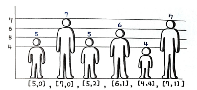

# 그리디 알고리즘
> 글로벌 최적을 찾기 위해 각 단계에서 로컬 최적의 선택을 하는 휴리스틱 문제 해결 알고리즘
말 그대로, 눈앞의 이익만을 좇는 알고리즘이다.  
그리디 알고리즘이 잘 작동하는 문제들은 `탐욕 선택 속성`을 갖고 있는 `최적 부분 구조`인 문제들이다. 여기서 탐욕 선택 속성이란, 앞의 선택이 이후 선택에 영향에 주지 않는 것을 말한다. 다시 말해 그리디 알고리즘은 선택을 다시 고려하지 않는다. 또한 최적 부분 구조란 문제의 해결 방법이 부분 문제에 대한 최적 해결방법으로 구성되는 경우를 말한다.  
이렇게 탐욕 선택 속성과 최적 부분 구조의 2가지 조건을 만족하면 최적해를 찾을 수 있다. 하지만 그렇지 않더라도 최적해를 찾을 수 있는 경우, 아니면 최적에 가까운 해를 찾는 경우도 있다.  
그리디 알고리즘은 `최적 부분 구조` 최적 부분 구조 문제를 푼다는 점에서 흔히 `다이나믹 프로그래밍`과 비교되는데, 서로 풀 수 있는 문제의 성격이 다르며 알고리즘이 접근 방식 또한 다르다. DP가 하위 문제에 대한 최적의 솔루션을 찾은 다음, 이 결과들을 결합한 정보에 입각해 `전역 최적 솔루션`에 대한 선택을 한다면, 이에 반해 그리디는 각 단계마다 로컬 최적해를 찾는 문제로 접근해 문제를 더 작게 줄여나가는 형태로, `서로 반대 방향`으로 접근하는 구조를 띤다.  

# 배낭 문제
조합 최적화 분야의 매우 유명한 문제로, 쉽게 말해 그림과 같이 배낭에 담을 수 있는 무게의 최댓값(15kg)이 정해져 있고 각각 짐의 가치($ 단위)와 무게(kg 단위)가 있는 짐들을 배낭에 넣을 때 가치의 합이 최대가 되도록, 즉 달러의 가치가 최대가 되도록 짐을 고르는 방법을 찾는 문제이다.  
배낭 문제는 그리디와 DP 로 해결 방법이 나뉜다. 그리디의 풀이는 다음과 같다.
- 입력
cargo = [
		(4, 12),
		(2, 1),
		(10, 4),
		(1, 1),
		(2, 2)
]
- 출력
17.3
```PY
def fractional_knapsack(cargo) :
	capacity = 15
	pack = []
	# 단가 계산 역순 정렬
	for c in cargo :
		pack.append((c[0] / c[1], c[0], c[1]))
	pack.sort(reverse=True)

	# 단가 순 그리디 계산
	total_value: float = 0
	for p in pack :
		if capacity - p[2] >= 0 :
			capacity -= p[2]
			total_value += p[1]
		else :
			fraction = capacity / p[2]
			total_value += p[1] * fraction
			break

	return total_value
```
이 문제에서 만약 짐을 쪼갤 수 없다면 위의 코드대로 `단가 순으로 배치해서는 안된다`. 이와 같이 짐을 쪼갤 수 없는 0-1 배낭 문제는 DP로 풀 수 있다.

# 78. 주식을 사고팔기 가장 좋은 시점 II
여러 번의 거래로 낼 수 있는 최대 이익을 산출하라.
- 입력
[7, 1, 5, 3, 6, 4]
- 출력
7
1일 때 사서 5일 때 팔아 4의 이익을 얻고, 3일 때 사서 6일 때 팔아 3의 이익을 얻는다.  
둘을 합하면 7이 된다.

## 풀이 1. 그리디 알고리즘
간단하게, 항상 이익을 내는 방향으로 몇 번이든 사고팔고를 반복하면 된다.  
매번 단계마다 이익을 취하는 탐욕 구조로 구현하면 다음과 같다.   
```PY
def maxProfit(prices) :
	profit = 0
	# 값이 오를 경우 매번 그리디 계산
	for i in range(len(prices) - 1) :
		if prices[i] < prices[i + 1] :
			profit += prices[i + 1] - prices[i]
	return profit
```
## 풀이 2. 파이썬 다운 방식
파이썬의 특징인 슬라이싱을 이용하면 다음과 같이 간단하게 풀 수 있다.
```py
def maxProfit(prices) :
	return sum(max(prices[i + 1] - prices[i], 0) for i in range(len(prices) - 1))
```
매번 이익을 계산하여 0보다 크면 무조건 합산할 수 있다.

## 79. 키에 따른 대기열 재구성

## 풀이 1. 우선순위 큐 이용
  
  

자신보다 앞에 있고 자신의 키 이상인 사람들의 수를 맞춰주면 되는 문제이다.  
첫 번쨰 값이 큰 순서대로 추출되는 최대 힙 형태로 풀이할 수 있고, 두 번쨰 값은 삽입되는 인덱스로 활용할 수 있다. 파이썬은 `최소 힙` 만 지원하기 때문에, 첫 번째 값을 음수로 변경해 최소 힙에서도 	`최대 힙`처럼 구현하면 된다.  
```py
def reconstructQueue(people) :
	heap = []
	# 키 역순, 인덱스 삽입
	for p in people :
		heapq.heappush(heap, (-p[0], p[1]))

	result = []
	# 키 역순, 인덱스 추출
	while heap :
		person = heapq.heappop(heap)
		result.insert(person[1], [-person[0], person[1]])
	return result
```  
키로 내림차순 정렬하고, 두 번째 값을 삽입하는 위치의 인덱스로 활용을 하였다.  
# `80. 태스크 스케줄러`
A에서 Z로 표현된 태스크가 있다. 각 간격마다 CPU는 한 번의 태스크만 실행할 수 있고, n 번의 간격 내에는 동일한 태스크를 실행할 수 없다. 더 이상 태스크를 실행할 수 없는 경우 아이들(idle) 상태가 된다. 모든 태스크를 실행하기 위한 최소 간격을 출력하라.  
- 입력
tasks = ["A", "A", "A", "B", "B", "B"], n = 2
- 출력
8
- 설명 
A -> B -> idle -> A -> B -> idle -> A -> B

## 풀이 1. 우선순위 큐 이용
이 문제 또한 마찬가지로 우선순위 큐를 이용해 그리디하게 풀 수 있는 문제이다. 그런데 아이템을 추출한 이후에는 매번 `아이템 갯수`를 업데이트 해줘야 한다. 파이썬의 heapq만 으로 구현하기에는 상당히 번거롭다. 따라서, `collections.Counter`를 이용해 간단하게 구현할 수 있다.  
```py
def leastInterval(tasks, n) :
	counter = collections.Counter(tasks)
	result = 0

	while True:
		sub_count = 0
		# 개수 순 추출
		for task, _ in counter.most_common(n + 1) :
			sub_count += 1
			result += 1

			counter.subtract(task)
			# 0 이하인 아이템을 목록에서 제거
			counter += collections.Counter()

		if not counter :
			break

		result += n - sub_count + 1
	
	return result
```
우선순위 큐를 이용해 가장 갯수가 많은 아이템부터 하나씩 추출해야 하는데, 문제는 전체를 추출하는 게 아니라 하나만 추출하고 빠진 개수를 업데이트할 수 있는 구조가 필요하다는 점이다.  
만약 heapq를 사용한다면 다음과 같은 형태가 된다.  
```py
for task, count in collections.Counter(tasks).items() :
	heapq.heappush(heap, (-count, task))
	...
	count, task = heapq.heappop(heap)
	...
	heapq.heappush(heap, (count + 1, task))
```
각 태스크의 개수를 Counter로 계산하고 이 값을 힙에 추가한다. heapq는 최소 힙만을 지원하기 때문에 `최대 힙` 효과를 내기 위해 음수로 변환하여 저장한다. heappop()은 항목 전체가 추출되기 떄문에 꺼내서 활용한 이후에는 heappush() 로 개수를 줄여(여기서는 음수이기 때문에 + 1을 해야한다.) 다시 힙에 넣어줘야 한다. 이와 같은 번거로운 작업을 `Counter` 만으로도 간결하게 처리 가능하다. 
```py
counter = collections.Counter(tasks)
for task, _ in counter.most_common() :
	counter.subtract(task)
```
most_common() 은 가장 개수가 많은 아이템부터 출력하는 함수이며, 사실상 최대 힙과 같은 역할을 한다. 그러나 pop() 으로 추출되는 것은 아니기 떄문에 subtract(task) 를 지정해 1개씩 개수를 별도로 줄여 나간다. 이처럼 Counter 모듈은 `개수를 줄이는 메소드` 도 지원하기 때문에 매우 편리하다.  
그리고, Counter는 `0과 음수도 처리하는 특징`이 있다. 원래는 편리한 특징이지만, 여기서는 0 이하는 필요가 없기 떄문에 매번 0 이하인지 체크를 하거나 0 이하일 때는 아예 삭제하는 기능이 필요하다. 다음 코드가 그 역할을 수행해준다.  
```py
counter.subtract(task)
counter += collections.Counter()
```
`빈 collection.Counter()` 를 더하는 것인데, 이렇게 할 경우 0 이하인 아이템을 목록에서 아예 제거해준다. 매우 유용한 `핵(Hack)`이다.   
또 다른 트릭은 n과 관련된 내용이다. 만약 다음의 입력값을 most_common(n) 으로 추출하고, 뒤에 idle을 덧붙이는 형태로 실행한다고 가정해보자.  
```py
tasks = ["A", "A", "A", "B", "C", "D"], n = 2
```
이 입력값의 경우 실행 결과는 다음과 같다.  
```py
A -> B -> idle -> A -> C -> idle -> A -> D
```
결과는 8이다. 하지만 정답이 아니다. 왜냐하면 다음 순서대로 실행할 경우 7로, 한 번더 줄일 수 있기 때문이다.
```py
A -> B -> idle -> A -> C -> D -> D
```
이 경우 마지막에는 순서가 다르게 나와야 하는데, 앞 부분과 달리 마지막에만 순서가 다르게 나오게 하는 일은 `별도의 예외처리`가 필요하다. 이 같은 처리를 구현하는 일은 생각보다 쉽지 않다.  
n이 아닌 n + 1 만큼을 추출해야한다. 즉 most_common(n + 1) 을 추출하고 n + 1 개가 추출될 때는 idle 없이 실행된다.  
```py
A -> B -> C -> A -> D -> idle -> A
```
입력값이 n = 2 였기 때문에 n + 1 을 추출했을 때 3개가 모두 나온다면 idle 없이 계속 진행한다. 그 다음에는 A -> D 2개만 추출됐기 때문에 한 번 idle 하고, 마지막으로 A를 출력한다. 앞서와 순서는 달라졌지만 정답은 7로 동일하다. 이렇게 하면 별도의 예외 처리 없이도 쉽게 계산이 가능하다. `n + 1` 부분이 핵심이다.

# 81. 주유소
원형으로 경로가 연결된 주유소 목록이 있다. 각 주유소는 gas[i] 만큼의 기름을 갖고 있으며, 다음 주유소로 이동하는데 cost[i] 가 필요하다. 기름이 부족하면 이동할 수 없다고 할 때, 모든 주유소를 방문할 수 있는 출발점의 인덱스를 출력하라.

- 입력
gas = [1, 2, 3, 4, 5], cost = [3, 4, 5, 1, 2]

- 출력
3

- 설명
gas[3] 에서 출발하면 모든 주유소를 방문할 수 있다.  
3 -> 4 : +4 -1 fuel 3
4 -> 0 : +5 -2 fuel 6
0 -> 1 : +1 -3 fuel 4
1 -> 2 : +2 -4 fuel 2
2 -> 3 : +3 -5 fuel 0

## 풀이 1. 모두 방문
우선, 처음부터 한 칸씩 출발점으로 지정하고, 나머지 모든 주유소를 방문하는 방법으로 풀이해보자.
```py
for start in range(len(gas)) :
	...
	for i in range(start, len(gas) + start) :
		index = i % len(gas)
```
주유소의 경로는 원형으로 연결되어 있으므로, `모듈로 연산(나머지 연산)` 을 하여 인덱스를 다시 0부터 지정할 수 있게 한다. 그리고 모든 주유소를 방문 가능한지 점검하고, 가능할 경우 이 문제에서는 출발점이 유일하다는 제약이 있기 떄문에, 즉 `정답이 한 군데` 이기 때문에 바로 해당 출발점을 결과로 리턴한다. 만약 중간에 끊길 경우 다시 다음번 출발점으로 이 작업을 반복한다.  
```py
def canCompleteCircuit(gas, cost) :
	for start in range(len(gas)) :
		fuel = 0
		for i in range(start, len(gas) + start) :
			index = i % len(gas)
			
			can_travel = True
			is gas[index] + fuel < cost[index] :
				can_travel = False
				break
			else :
				fuel += gas[index] - cost[index]
		if can_travel :
			return start
	return -1
```
하지만 두 번의 루프가 중첩되어 있으므로 O(n^2) 이다. 이를 개선해보자. 

## 풀이 2. 한 번 방문
전체 기름의 양이 전체 비용보다 클 경우, 반드시 전체를 방문할 수 있는 출발점이 존재한다. 원래는 여러 곳이 될 수 있겠지만, 이 문제에는 출발점이 유일하다는 제약이 있으므로, 여기서는 반드시 한 군데만 존재하게 된다.  
```py
if sum(gas) < sum(cost) :
	return False
```
이렇게 비용이 더 클 떄 리턴해버리면, 이제 반드시 존재하는 경우만 남아 있게 된다. 따라서 전체를 방문하면서 성립되지 않는 경우는 출발점을 한 칸씩 뒤로 밀어낸다. 
```py
def canCompleteCircuit(gas, cost) :
	# 모든 주유소 방문 가능 여부 판별
	if sum(gas) < sum(cost) :
		return - 1
	
	start, fuel = 0, 0
	for i in range(len(gas)) :
		# 출발점을 한 칸씩 뒤로 밀기
		if gas[i] + fuel < cost[i] :
			start = i + 1
			fuel = 0
		else :
			fuel += gas[i] - cost[i]
	return start
```
두 번의 루프가 한 번으로 줄었다. 전체 sum()을 비교하는 구문을 통과했다면 반드시 출발점이 존재하는 경우고, 딱 한 군데만 존재하므로 한 번만 돌면서 확인하는 것으로 충분하다. O(n) 으로 최적화했고, 풀이1 보다 거의 80배 이상 빠른 속도로 실행된다.

# 82. 쿠키 부여
아이들에게 1개씩 쿠키를 나눠줘야 한다. 각 아이 child_i 마다 그리드 팩터 g를 가지고 있으며, 이는 아이가 만족하는 최소 쿠키의 크기를 말한다. 각 쿠키 cookie_j 는 크기 s를 갖고 있으며, s >= g 이어야 아이가 만족하며 쿠키를 받는다. 최대 몇 명의 아이들에게 쿠키를 줄 수 있는지 출력하라. 
- 입력
g = [1, 2, 3], s = [1, 1]
- 출력
1
- 설명
두 번째 아이부터는 크기가 2 이상의 쿠키가 필요하지만, 갖고 있는 최대 크키는 1이기 때문에 1명의 아이에게만 줄 수 있다.

- 입력
g = [1, 2], s = [1, 2, 3]
- 출력
2
- 설명
충분한 쿠키를 가지고 있고, 2명 모두에게 쿠키를 줄 수 있다.

## 풀이 1. 그리디 알고리즘
코드 상단부에 먼저 정렬해주는 작업을 직접 진행해야 한다.  
```py
def findContentChildren(g, s) :
	g.sort()
	s.sort()

	child_i = cookie_j = 0
	# 만족하지 못할 때까지 그리디 진행
	while child_i < len(g) and cookie_j < len(s) :
		if g[child_i] <= s[cookie_j] :
			child_i += 1
		cookie_j += 1
```

## 풀이 2. 이진 검색
2개의 리스트를 모두 번갈아면서 탐색하는 게 아니라 하나의 리스트를 순회하면서 다른 하나는 이진 검색으로 찾는다. 그런 다음 찾아낸 인덱스가 현재 부여한 아이들보다 클 경우에는 이 경우 더 줄 수 있다는 말이 되므로, 줄 수 있는 아이들의 수를 1명 더 늘린다.
```py
def findContentChildren(g,  s) :
	g.sort()
	s.sort()

	result = 0
	for i in s :
		# 이진 검색으로 적절한 위치 찾기
		index = bisect.bisect_right(g, i)
		if index > result : 
			result += 1
	return result
```
bisect_right() 는 bisect_left() 랑 기능을 동일하며, 찾아낸 값의 `다음 인덱스` 를 리턴한다는 차이가 있다.
```py
>>> bisect.bisect_left([1, 2, 3, 4, 5], 3)
2 
>>> bisect.bisect_right([1, 2, 3, 4, 5], 3)
3
```
풀이 1, 2 모두 속도는 동일하다.

