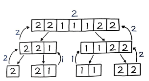

# 분할 정복

> 분할 정복은 `다중 분기 재귀`를 기반으로 하는 알고리즘 디자인 패러다임을 말한다.

직접 해결할 수 있을 정도로 간단한 문제가 될 때까지 문제를 재귀적으로 쪼개나간 다음, 그 하위 문제의 결과들을 조합하여 원래 문제의 결과로 만들어내는 방식이다. 대표적으로는 `병합 정렬`을 예시로 들 수 있다.

- 분할 : 문제를 동일한 유형의 여러 하위 문제로 나눈다.
- 정복 : 가장 작은 단위의 하위 문제를 해결하여 정복한다.
- 조합 : 하위 문제에 대한 결과를 원래 문제에 대한 결과로 조합한다.

말 그대로 문제를 `분할`해서 `정복`한 다음, 정답을 `조합`해 나간다는 의미를 지닌다. 정의에서도 `재귀`가 언급되어 있는 것처럼 분할 정복은 재귀를 활용하는 대표적인 알고리즘이기도 하다. 수도코드로 표현해보면 다음과 같은 형태가 된다.

```py
function F(x) :
	if F(x)가 간단 then :
		return F(x)를 계산한 값 # 2. 정복

	else :
		x를 x1, x2로 분할 # 1. 분할
		F(x1)과 F(x2)를 재귀 호출
		return F(x1)과 F(x2)로 F(x)를 구한 값 # 3. 조합
```

이 같은 알고리즘 디자인 패러다임은 중급 이상의 코딩 테스트 문제로 빈번히 출제되며 23장에서 다시 한번 살펴보게 될 `최적 부분 구조` 를 풀이하는 매우 중요한 기법 중 하나이므로 잘 숙지해 둘 필요가 있다.

# 83. 과반수 엘리먼트

과반수를 차지하는(절반을 차지하는) 엘리먼트를 출력하라.

## 풀이 1. 브루트 포스로 과반수 비교

앞에서부터 하나씩 과반수를 넘는지 일일이 체크하다가 과반수를 넘으면 바로 정답으로 처리하는 방법이다.

```py
def majorityElement(self, nums) :
	for num in nums :
		if nums.count(num) > len(nums) // 2:
			return num
```

하지만 타임아웃이 발생한다.

### // 연산자

// 연사자는 결과가 실수일 때 `내림 처리`를 하고 동일한 자료형을 리턴해주는 파이썬 특유의 편리한 연산자다.

```py
>>> 5 / 3
1.6666666666666667
>>> 5 // 3
1
>>> 5.0 // 3
1.0
>>> 5 // 3.0
1.0
>>> 5.0 // 3.0
1.0
>>> math.floor(5/3)
1
```

## 풀이 2. 다이나믹 프로그래밍

```py
def majorityElement(nums) :
	counts = collections.defaultdict(int)
	for num in nums :
		if counts[num] == 0 :
			counts[num] = nums.count(num)

		if counts[num] > len(nums) // 2 :
			return num
```

nums.count() 로 한 번 카운트를 계산한 값을 저장해서 재활용했다. 만약 계산되지 않았던 값이 들어온다면 항상 0이 될 것이고, 그 때만 카운트를 계산하게 될 것이다. 이 풀이는 `메모이제이션` 을 이용한 DP 풀이의 에시이다.

## `풀이 3. 분할 정복`

병합 정렬과 매우 유사한 방식으로 풀이할 수 있다. 쪼갠 다음 정렬해서 각각의 엘리멘트를 전부 리턴하는 병합 정렬과 매우 유사한 방식으로 풀이할 수 있다. 쪼갠 다음 정렬해서 각각의 엘리먼트를 전부 리턴하는 병합정렬과 달리 여기서는 `과반수 후보군에 해당하는 엘리멘트만 리턴` 하면서 밑 그림과 같이 계속 위로 올려주면, 즉 `백트래킹` 하면 최종적으로 정답이 남게 된다.  
  
코드는 다음과 같은 식이다.

```py
def majorityElement(self, nums) :
	...

	a = self.majorityElement(nums[:len(nums) // 2])
	b = self.majorityElement(nums[len(nums) // 2:])
```

이런식으로 먼저 분할을 시도한다. a와 b는 각각 최소 단위로 쪼개질 것이다. 물론 그렇게 하기 위해서는 상단에 끊어서 리턴해주는 부분이 필요하다.

```py
def majorityElement(self, nums) :
	if not nums :
		return None
	if len(nums) == 1 :
		return nums[0]
	a = self.majorityElement(nums[:len(nums) // 2])
	b = self.majorityElement(nums[len(nums) // 2:])
```

이제 이렇게 리턴해주면, 최소 단위로 쪼개질 때 해당하는 값을 리턴하게 될 것이다. 마지막으로 백트래킹될 때 처리하는 부분, 즉 `정복`에 해당하는 부분을 다음과 같이 구현해보자.

```py
return [b, a][nums.count(a) > len(nums) // 2]
```

a가 만약 현재 분할된 리스트 nums에서 과반수를 차지한다면 해당 인덱스는 1이 될 것이고, [b, a][1] 이 되어 a를 리턴할 것이다. 즉 과반수인 엘리먼트를 리턴한다.  
이외에는 b를 리턴한다.

```py
def majorityElement(self, nums) :
	if not nums :
		return None
	if len(nums) == 1 :
		return nums[0]

	half = len(nums) // 2
	a = self.majorityElement(nums[:half])
	b = self.majorityElement(nums[half:])

	return [b, a][nums.count(a) > half]
```

half 변수에 len(nums) // 2 를 저장해두면 10% 가량 속도를 더 높일 수 있다. 재귀 풀이의 특성상 DP 나 다른 방식에 비해서는 속도가 다소 느린 편이다.

## 풀이 4. 파이썬 다운 방식

이제 파이썬다운 방식으로도 풀이해보자.

```py
def majorityElement(self, nums) :
	return sorted(nums)[len(nums) // 2]
```

정렬하여 가운데를 지정하면 반드시 과반수 이상인 엘리먼트 일 것이다. 매우 직관적이며 쉬운 알고리즘이다.

# 84. 괄호를 삽입하는 여러 가지 방법

슷자와 연산자를 입력받아 가능한 모든 조합의 결과를 출력하라.

- 입력  
  "2-1-1"
- 출력  
  [0, 2]
- 설명  
  ((2-1)-1) = 0  
  (2-(1-1)) = 2

- 입력  
  "2x3-4x5"
- 출력  
  [-34, -14, -10, -10, 10]
- 설명  
  ((2x(3-(4x5))) = -34  
  ((2x((3-4)x5)) = -14  
  ((2x(3-4))x5) = -10  
  ((2x3)-(4x5)) = -10  
  (((2x3)-4)x5) = 10

## 풀이 1. 분할 정복을 이용한 다양한 조합

괄호를 어디에 추가하느냐에 따라 다양한 조합이 가능하다.

```py
def diffWaysToCompute(self, input) :
	...
	results = []
	for index, value in enumerate(input) :
		if value in "-+*" :
			left = self.diffWaysToCompute(input[:index])
			right = self.diffWaysToCompute(input[index + 1:])

			results.extend(compute(left, right, value))
	return results
```

연산자를 기준으로 left, right를 계속 분할하고, 분할된 값은 compute() 함수로 계산한 결과를 extend()로 확장한다.

```py
def diffWaysToCompute(self, input) :
	...
	if input.isdigit() :
		return [int(input)]
```

분할 결과를 리턴받으려면 이처럼 input이 숫자형일 때 리턴하게 한다. 이렇게 하면 분할의 결과가 최종적으로 숫자형인 타입을 재귀의 최종 결과로 리턴하게 될 것이다. 이제 게산하는 부분은 다음과 같다.

```py
def compute(left, right, op) :
	results = []
	for l in left :
		for r in right :
			results.append(eval(str(l) + op + str(r)))
	return results
```

위의 코드를 합친 결과는 다음과 같다.

```py
def diffWaysToCompute(self, input) :
	def compute(left, right, op) :
		results = []
		for l in left :
			for r in right :
				results.append(eval(str(l) + op + str(r)))
		return results

	if input.isdigit() :
		return [int(input)]

	results = []
	for index, value in enumerate(input) :
		if value in "-+*" :
			left = self.diffWaysToCompute(input[:index])
			right = self.diffWaysToCompute(input[index + 1:])

			results.extend(compute(left, right, value))
	return results
```

### append() vs extend()

```py
>>> a = [1, 2, 3]
>>> b = [4, 5]
>>> a.append(b)
>>> a
[1, 2, 3, [4, 5]]
```

리스트에 또 다른 리스트를 삽입할 때 append()는 이처럼 리스트 전체를 또 다른 엘리멘트로 처리한다.

```py
>>> a = [1, 2, 3]
>>> b = [4, 5]
>>> a.extend(b)
>>> a
[1, 2, 3, 4, 5]
```

반면 extend()는 삽입 대상의 리스트를 풀어서 각각의 엘리멘트로 확장(Extend) 해 삽입한다. 앞서 풀이에서는 삽입 대상이 복수형이 될 수도 있기 때문에 풀어서 삽입하는 extend() 를 사용했다.
