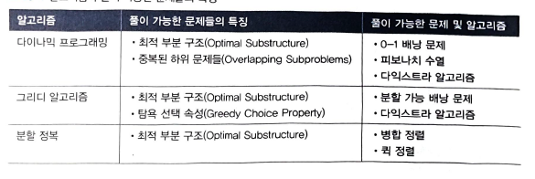
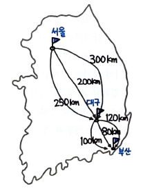
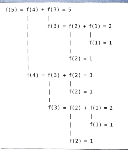
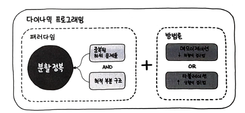
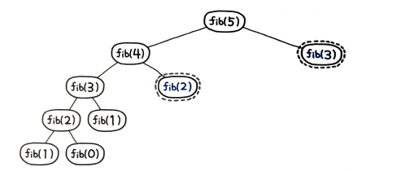
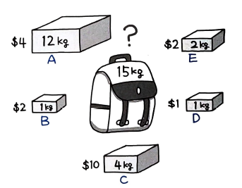
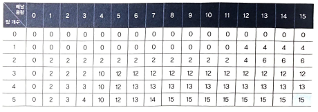
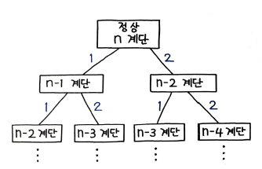

드디어 마지막 장 까지 도달하였다. 책 이론들을 정리만 하는데 그치지 않고, 문제들을 풀면서 계속해서 복습해 나갈 예정이다.

# 다이나믹 프로그래밍

최적 부분 구조를 갖고 있는 문제를 DP로 풀이가 가능하다. 최적 부분 구조를 푸는 또 다른 알고리즘으로는 `그리디 알고리즘`이 있다. 그리디는 `항상 그 순간에 최적이라고 생각되는 것을 선택`하면서 문제를 푸는 방식이고, DP는 `중복된 하위 문제들의 결과를 저장해뒀다가 풀이해 나간다`는 차이가 있다. 여기서 중요한 점은 `중복된` 문제들이란 점이며, 중복되지 않는 문제들은 DP로 풀지 않는다. 대표적으로 병합 정렬과 퀵 정렬 등이 있으며, 이들은 모두 `분할 정복 알고리즘`으로 분류한다.대부분의 재귀 알고리즘은 최적 부분 구조 문제를 풀 수 있다. 이 중에서도 병합 정렬, 퀵 정렬과 같은 분할 정복 알고리즘은 `중복된 하위 문제들` 을 푸는 것이 아니기 떄문에 DP로 분류하지 않는다. 배낭 문제 중 분할 가능 배낭 문제는 `탐욕 선택 속성`이 있기 떄문에 `그리디 알고리즘`으로 풀이할 수 있다.  
  
13장의 다익스트라 알고리즘은 DP와 그리디에 둘 다 해당하는 경우인데, BFS 시 항상 최단 경로를 찾고 탐욕 선택 속성을 갖는 그리디 알고리즘이면서, 이미 계산한 경로를 저장해두었다가 활용하며 중복된 하위 문제들을 푸는 DP 이기도 하다.  
즉, 다익스트라 알고리즘은 `최적 부분 구조`, `중복된 하위 문제들`, `탐욕 선택 속성`을 모두 갖는 문제이다.

# 최적 부분 구조

최적 부분 구조에 대해 좀 더 살펴보자.
  
서울에서 부산까지 가는 최단 경로를 찾는 간단한 예를 들어보자.  
그림에서 보듯이, 서울에서 대구까지 가는 경로는 3가지가 있으며, 부산까지도 마찬가지로 3가지 경로가 있다. 서울에서 부산까지 가는 최단 경로는 `서울에서 대구까지 가는 최단 경로(200km)`와 `대구에서 부산까지 가는 최단 경로(80km)`로 구성된다. 즉, 서울에서 부산까지 가는 최단 경로는 각각의 `부분 문제`인 1.서울에서 대구까지 가는 최단 경로 문제와 2.대구에서 부산까지 가는 최단 경로 문제의 해결 방법의 합이다. 따라서, 문제의 최적 해결 방법은 부분 문제에 대한 최적 해결 방법으로 구성된다.  
이러한 구조를 `최적 부분 구조`라 하며, 이런 유형의 문제는 분할 정복으로 풀 수 있다. 또한 DP 또는 그리디로 접근해볼 수 있는 문제의 후보가 된다. 그러나, 만약 서울에서 부산까지 바로 연결되는 고속도로가 새롭게 개통되어 더 이상 대구를 거칠 필요가 없다면, 이 문제는 더 이상 최적 부분 구조가 아니다. 더는 분할 정복으로 풀 수 없으며, DP나 그리디로도 풀이할 수 없다.

# 중복된 하위 문제들

DP로 풀 수 있는 문제들과 다른 문제들의 결정적인 차이는 `중복된 하위 문제들을 갖는다는 점`이다.  
  
f(3) = f(2) + f(1) 이며, f(4) = f(3) + f(2) 이다. f(5) 또한 f(5) = f(4) + f(3) 이다. 이처럼, 피보나치 수열을 재귀로 풀면 반복적으로 동일한 하위 문제들이 발생한다. 이러한 `중복된 하위 문제들을 풀이할 때, DP는 이미 계산한 결과를 저장해두었다가 재활용`한다.  
즉, `중복 문제가 발생하지 않는 병합 정렬`은 `분할 정복`으로 분류되지만, 피보나치 수열을 풀이하는 알고리즘은 DP로 분류된다.

# 다이나믹 프로그래밍 방법론

지금까지 `최적 부분 구조`와 중복된 하위 문제들로 구성된 `DP`의 패러다임을 살펴봤고, 이제부터는 DP의 방법론을 알아볼 차례이다.  

이 그림에서 방법론은 방식에 따라 크게 상향식과 하향식으로 나뉜다. 일반적으로 상향식을 `타뷸레이션`, 하향식을 `메모이제이션`이라고 부른다.

## 상향식(Bottom-Up)

더 작은 하위 문제부터 살펴본 다음, 작은 문제의 정답을 이용해 큰 문제의 정답을 풀어나간다.`타뷸레이션(Tabulation) `이라 부르며, 일반적으로 이 방식만을 DP로 지칭하기도 한다.

## 하향식(Top-Down)

하위 문제에 대한 정답을 계산했는지 확인해가며 문제를 자연스러운 방식으로 풀어나간다. 이 방식을 특별히 `메모이제이션(Memoization)`이라 지칭한다.

피보나치 수열의 예제 코드를 보면서 상향식과 하향식의 차이를 살펴보자.

### 피보나치 수열 - 상향식

```py
def fib(n) :
	dp[0] = 0
	dp[1] = 1

	for i in range(2, n + 1) :
		dp[i] = dp[i - 1] + dp[i - 2]
	return dp[n]
```

작은 하위 문제부터 차례대로 정답을 풀어나가며 큰 문제의 정답을 만든다. 이 방식을 `타뷸레이션`이라 하며, 이 방식만을 DP라 지칭하는 경우도 있다. 데이터를 테이블 형태로 만들면서(Tabulate) 문제를 풀이한다고 하여 타뷸레이션 방식이라고 부른다.

### 피보나치 수열 - 하향식

```py
def fib(n) :
	if n <= 1 :
		return n

	if dp[n] :
		return dp[n]
	dp[n] = fib(n - 1) + fib(n - 2)
	return dp[n]
```

하향식 방법론은 하위 문제에 대한 정답을 계산했는지 확인해가며 문제를 자연스럽게 `재귀`로 풀어나간다. 기존 재귀 풀이와 거의 동일하면서도 `이미 풀어봤는지 확인하여 재활용`하는 효율적인 방식으로, 메모이제이션 방식이라고 부른다.

# 85. 피보나치 수

## 풀이 1. 재귀 구조 브루트 포스

```py
def fib(N) :
	if N <= 1 :
		return N
	return fib(N - 1) + fib(N - 2)
```

888ms가 걸리는 느린 풀이이다. 최적화가 필요하다.

## 풀이 2. 메모이제이션

DP의 하향식 풀이로 정리한 것이 바로 이 문제의 메모이제이션 풀이이다.

```py
class Solution :
	dp = collections.defaultdict(int)

	def fib(N) :
		if N <= 1:
			return N

		if self.dp[N] :
			return self.dp[N]
		self.dp[N] = self.fib(N - 1) + self.fib(N - 2)
		return self.dp[N]
```

원래의 브루트 포스 풀이와 유사하게 재귀로 계산해 나가지만, `이미 계산한 값은 저장해뒀다가 바로 리턴`한다. 앞서 fib(5) 일때 15번의 연산을 진행하던 구조는 이 메모이제이션 풀이에서는 밑의 그림과 같이 9번의 연산만으로 풀이할 수 있게 된다. 한번 계산한 수는 더 이상 계산하지 않으므로, fib(2) 와 fib(3) 은 한 번만 계산하게 되어 매우 효율적이다.  
  
만약 시작이 fib(5)가 아니라 5보다 훨씬 더 큰 수라면 성능 차이는 훨씬 더 클 것이다.

## 풀이 3. 타뷸레이션

상향식 풀이의 코드는 다음과 같다.

```py
class Solution:
	dp = collections.defaultdict(int)

	def fib(N) :
		self.dp[0] = 0
		self.dp[1] = 1

		for i in range(2, N + 1) :
			self.dp[i] = self.dp[i - 1] + self.dp[i - 2]
		return self.dp[N]
```

재귀를 사용하지 않고 `반복으로 풀이`하며, 작은 값부터 직접 계산하면서 타뷸레이션한다. 미리 계산을 해두는 것인데, 다른 복잡한 DP와는 달리 타뷸레이션이 `일차원 선형 구조`라 복잡하지 않고, 구조 자체도 단순해 이해가 쉬운 편이다. 메모이제이션과 마찬가지로 실행 속도도 당연히 빠르다.

## 풀이 4. 두 변수만 이용해 공간 절약

그런데 사실 앞서 풀이는 dp라는 딕셔너리(사실 단순 배열만 사용해도 충분하다)에 결과를 차곡차곡 담아 나갔지만 변수는 2개만 있어도 충분하다.

```py
def fib(N) :
	x, y = 0, 1
	for i in range(N) :
		x, y = y, x + y
	return x
```

이 경우 앞서 풀이처럼 메소드 바깥에 클래스의 멤버 변수도 선언할 필요가 없기 때문에 코드는 훨씬 더 간결해진다. 공간 복잡도도 O(n) 에서 O(1)로 줄어든다. 시간 복잡도는 동일한 O(n) 이므로 매우 효율적이다.

## 풀이 5. 행렬

DP와는 관련없지만, n번째 피보차니 수를 O(log n) 번의 연산만으로 구할 수 있는 방법이 있다. 바로 `넘파이` 모듈을 사용하는 방식이다.

```py
def fib(n) :
	M = np.martix([0, 1], [1, 1])
	vec = np.array ([[0], [1]])

	return np.matmul(M ** n, vec)[0]
```

풀이 2부터 4는 각각 28ms, 24ms, 24ms가 된다.

## `0-1 배낭 문제`

DP의 또 다른 대표 문제 중 하나인 배낭 문제를 살펴보자. 짐을 쪼갤 수 없는 0-1 배낭 문제이다. 이 문제는 `탐욕 선택 속성`이 있는 문제가 아니며, `중복된 하위 문제들` 속성을 갖고 있으므로, DP 풀이할 수 있다.
  
단가 순으로 그리디하게 배치해서 풀이했던 분할 기능 배낭 문제와 달리, 0-1 배낭 문제는 짐을 쪼갤 수 없다. 이 경우 모든 경우의 수를 계산해야 하며, 이렇게 모든 경우의 수를 계산하는 문제에서 DP는 위력을 발휘한다. 다음과 같이 풀이할 수 있따. 먼저, 입력값으로 짐을 정의하고 zero_one_knapsack() 풀이 함수를 호출한다.

```py
cargo = [
	(4, 12), # (value, weight)
	(2, 1),
	(10, 4),
	(1, 1),
	(2, 2)
]

r = zero_one_knapsack(cargo)
```

zero_one_knapsack() 함수는 다음과 같이 정의한다.

```py
def zero_one_knapsack(cargo) :
	capacity = 15
	pack = []
```

pack 이라는 리스트 변수에 6 X 16 행렬 형태의 중간 결과 테이블이 생성될 것이다. 즉, 이 테이블을 그자 그대로 `타뷸레이션` 하는 DP 풀이가 될 것이다. 테이블의 크기의 기준은 짐의 최대 개수 + 1, 배낭의 최대 용량 + 1 이렇게 6 X 16이며, 이 테이블 각각의 셀에는 그 위치까지의 짐의 개수와 배낭의 용량에 따른 최댓값이 담기게 된다.  
실제로 어떤 값인지는 먼저 전체 코드부터 먼저 살펴본 이후에 다시 정리해보자.

```PY
def zero_one_knapsack(cargo) :
	capacity = 15
	pack = []

	for i in range(len(cargo) + 1) :
		pack.append([])
		for c in range(capacity + 1) :
			if i == 0 or c == 0:
				pack[i].append(0)

			elif cargo[i - 1][1] <= c :
				pack[i].append(
					max(
						cargo[i - 1][0] + pack[i - 1][c - cargo[i - 1][1]],
						pack[i - 1][c]
					))

			else :
				pack[i].append(pack[i - 1][c])

	return pack[-1][-1]
```

이 코드의 실행 결과로 pack에는 다음과 같은 표가 생성된다.


이 표에서 세로 축은 짐의 개수, 가로축은 배낭의 용량이다. 각각의 셀은 그 위치까지의 짐의 개수와 배낭의 용량에 따른 최댓값이다. 즉 짐이 4개가 있을 때는 차례대로 ($4, 12kg), ($2, 1kg), ($10, 4kg), ($1, 1kg) 일 것이고, 배냥의 용량이 4라면 4kg인 $10 짜리 짐 하나를 담는게 가장 이익이다. 따라서, 4 X 4 위치의 최댓값은 10이며 위의 표에서도 10인 것을 확인할 수 있다. 배낭의 용량이 5라면 1kg 인 $2 를 추가해 12가 될 수 있다. 마찬가지로 표에서도 12다. 이렇게 가장 마지막 위치인 5 X 15 까지 이동한 총 5개의 짐, 용량이 15인 배낭의 최댓값은 15이며, 이 문제의 정답은 15임을 확인할 수 있다.  
이렇게 최아의 경우 O(2^n) 의 계산이 필요한 0-1 배낭 문제를 여기서는 `타뷸레이션` 방식으로 O(nW)(여기서 n은 짐의 개수, W는 배낭의 용량)에 잘 풀이해봤다.

# 86. 최대 서브 배열

합이 최대가 되는 연속 서브 배열을 찾아 합을 리턴하라.

- 입력
  [-2, 1, -3, 4, -1, 2, 1, -5, 4]

- 출력
  6

## 풀이 1. 메모이제이션

언뜻 투 포인터 문제인가 하는 생각이 들 수 있다. 그런데 생각해보면, 투 포인터로 풀이하기는 어렵다.  
왼쪽 포인터가 -2이고, 오른쪽 포인터가 4라고 했을 때, 그 사잇값이 최대가 되기 위해서는 음수를 지나치는 방식으로 알고리즘을 구현해야 하는데, 연속된 서브 배열을 찾아야 하는 문제인 만큼 정렬을 할 수 없고, 그렇다면 다음 숫자가 뭐가 될지 모르는 상황에서 단순히 음수를 건너 뛰는 방식으로는 구현이 어렵다. 무엇보다 효율적으로 투 포인터로 풀이하기 위해서는 `정렬이 필요하다`.  
그렇다면, 메모이제이션을 이용해 다음과 같은 결과를 만드는게 효과적이다.

```py
#nums = [-2, 1, -3, 4, -1, 2, 1, -5, 4]
sums = [-2, 1, -2, 4, 3, 5, 6, 1, 5]
```

앞에서부터 계속 값을 계산하면서 누적 합을 계산한다. 이전 값을 계속 더해나가되, 0 이하가 되면 버린다. 어차피 최댓값을 찾는데 0 이하인 값은 굳이 서브 배열에 포함할 이유가 없기 때문이다.

```py
def maxSubArray(nums) :
	sums = [nums[0]]
	for i in range(1, len(nums)) :
		sums.append(nums[i] + (sums[i - 1] if sums[i - 1] > 0 else 0))

	return max(sums)
```

이렇게 메모이제이션으로 값을 더해 나간 sums에서 최댓값을 추출하면 서브 배열의 최댓값을 찾을 수 있다. 여기서 sums라는 별도 변수를 사용했는데 가만히 살펴보면 추가 변수 없이도 충분히 처리가 가능할 것 같다. 전체 코드는 다음과 같다.

```py
def maxSubArray(nums) :
	for i in range(1, len(nums)) :
		nums[i] += nums[i - 1] if nums[i - 1] > 0 else 0
	return max(nums)
```

기존 nums에 합을 함께 넣었다. 공간을 재활용하여 공간 복잡도를 없앴고, 풀이도 좀 더 깔끔해졌다.

## 풀이 2. 카데인 알고리즘

제이 카데인이 O(n)에 풀이가 가능하도록 고안한 `카데인 알고리즘` 이라는 해법도 존재한다. 당시 그는 최대 서브 배열을 찾기 위해 어디서 시작되는지를 찾는 문제 O(n^2) 풀이에서 각 단계마다 최댓값을 담아 어디서 끝나는지를 찾는 문제 O(n) 풀이로 치환해서 풀이했다. 전체 풀이 코드는 다음과 같다.

```py
def maxSubArray(nums) :
	best_sum = -sys.maxsize
	current_sum = 0
	for num in nums :
		current_sum = max(num, current_sum + num)
		best_sum = max(best_sum, current_sum)

	return best_sum
```

이전 풀이에서는 매번 계산해서 넣기만 하고 마지막에 max()를 전체 계산해서 가져오게 했지만, 당시 제이 카데인은 이런 형태로 매번 best_sum 을 계산하게 했다. 하지만 사실상 동일한 코드로 볼 수 있으며, 속도 또한 양쪽 모두 동일하다.

# 87. 계단 오르기

정상에 도달하기 위해 n 계단을 올라야 한다. 매번 각각 1계단 또는 2계단씩 오를 수 있다면 정상에 도달하기 위한 방법은 몇 가지 경로가 되는지 계산하라.

- 입력  
  3
- 출력  
  3
- 설명  
  정상에 오르기 위한 방법은 3가지 경로가 있다.  
  a. 1계단 + 1계단 + 1계단  
  b. 1계단 + 2계단  
  c. 2계단 + 1계단

## 풀이 1. 재귀 구조 브루트 포스

언뜻 생각해보면 모든 경우의 수를 다 찾아야해서 상당히 풀기 어려워 보인다. 그러나 다음과 같이 경우의 수를 하나씩 그려보면 기본적으로 피보나치 수와 동일한 유형의 문제라는 것을 알 수 있다. 다만, 방법과 형식이 달라 연상하기 어려울 뿐이며, 동일한 방식으로 풀이할 수 있다.
  
이처럼 새로운 유형의 문제를 피보나치 수열 같은 기존의 유명한 문제와 연결해 풀이하는 방법은 문제 해결에 매우 좋은 방법이다. 피보나치 수열과 완전히 동일한 풀이로 다음과 같이 간단한 재귀로 풀 수 있다.

```py
def climbStairs(n) :
	if n == 1 :
		return 1
	if n == 2 :
		return 2
	return climbStairs(n - 1) + climbStairs(n - 2)
```

그러나 타임아웃이 발생하므로, 메모이제이션을 적용해야 한다.

## 풀이 2. 메모이제이션

```py
class Solution :
	dp = collections.defaultdict(int)

	def climbStairs(self, n) :
		if n <= 2 :
			return n

		if self.dp[n] :
			return self.dp[n]

		self.dp[n] = self.climbStairs(n - 1) + self.climbStairs(n - 2)
		return self.dp[n]
```

40ms가 걸린다. 기존의 풀이와 연결해 풀이하는 연습을 꾸준히 해보자.

# 88. 집 도둑

어느 집에서는 돈을 훔쳐올 수 있지만 경보 시스템 때문에 바로 옆집은 훔칠 수 없고 한 칸 이상 떨어진 집만 가능하다. 각 집에는 훔칠 수 있는 돈의 액수가 입력값으로 표기되어 있다. 훔칠 수 있는 가장 큰 금액을 출력하라.

- 입력  
  [1, 2, 3, 1]
- 출력  
  4
- 설명
  첫 번째 집과 세 번째 집을 훔치면 4가 최대 금액이다.

## 풀이 1. 재귀 구조 브루트 포스

이제 이런 유형의 문제를 보면 바로 DP를 떠올릴 수 있을 것 같다. 바로 옆집은 훔칠 수 없으니, 현재 집과 옆집 숫자 중의 최댓값을 구하고, 한 집 건넛집까지의 최댓값과 현재 집의 숫자값과의 합을 구해서 두 수 중 더 높은 값이 정답이 된다. 이렇게 하면 역시 피보나치 수열과 거의 유사한 형태로, 다음과 같이 간단한 재귀로 풀 수 있다.

```py
nums: List[int]
def rob(i: int) -> int:
	...
	return max(rob(i - 1), rob(i - 2) + nums[i])
```

브루트 포스로 구현해보면 다음과 같다. 앞서 rob() 함수를 중첩 함수로 처리하고, 문제 풀이 함수와 이름이 겹치므로 밑줄을 추가해 내부 함수라는 의미를 부여해봤다.

```py
def rob(nums) :
	def _rob(i) :
		if i < 0 :
			return 0
		return max(_rob(i - 1), _rob(i - 2) + nums[i])
	return _rob(len(nums) - 1)
```

하지만 역시 타임아웃으로 풀리지 않는다. 집이 10채, 즉 len(nums)가 10이라면 탐색 횟수가 287회나 된다.

## 풀이 2. 타뷸레이션

이미 계산한 값은 dp에 저장하고 두 번 이상 계산하지 않는다.

```py
dp[0], dp[1] = nums[0], max(nums[0], nums[1])
for i in range(2, len(nums)) :
	dp[i] = max(dp[i - 1], dp[i - 2] + nums[i])
```

변수명은 dp이며 여기서는 메모이제이션이 아닌 타뷸레이션으로 풀이했다. 아무래도 재귀로 구현하는 메모이제이션보다 순회 방식인 `타뷸레이션`이 좀 더 직관적이여서 이해하기 쉬운 편이다. 결과는 파이썬의 해시 테이블인 딕셔너리에 넣을 것인데, 원래 딕셔너리는 입력 순서가 유지되지 않았으나, 파이썬 3.7+ 부터는 입력 순서가 유지된다. 하지만 여기서는 파이썬의 낮은 버전에서도 순서가 유지될 수 있도록 명시적으로 `collections.OrderedDict()` 로 선언해 풀이해본다.  
이제 가장 마지막 값을 추출하기 위해 `popitem()`을 사용한다. 리스트의 pop()과 동일한 역할을 하는데, 딕셔너리에도 pop()이 있지만 반드시 키를 지정해야 하고 해당 키의 아이템을 추출하는 역할을 한다. 딕셔너리에서 가장 마지막 아이템을 추출하기 위해서는 이처럼 `popitem()`을 사용한다.

```py
dp = collections.OrderedDict()
...
return dp.popitem()[1]
```

이제 전체 코드는 다음과 같다.

```py
def rob(nums) :
	if not nums :
		return 0
	if len(nums) <= 2 :
		return max(nums)

	dp = collections.OrderedDict()
	dp[0], dp[1] = nums[0], max(nums[0], nums[1])
	for i in range(2, len(nums)) :
		dp[i] = max(dp[i - 1], dp[i - 2] + nums[i])
	return dp.popitem()[1]
```

28ms가 걸린다.

## 딕셔너리 입력 순서 유지

파이썬 3.7부터는 collections.OrderedDict가 아니더라도, 다음과 같은 형태로 맨 마지막 값을 추출할 수 있다.

```py
list(a.keys())[-1]
```

그러나 원래 해시 테이블은 입력 순서가 유지되지 않는다. 많이 실수하는 부분이고 오죽하면 C++ 에서는 해시 테이블 자료형의 이름이 `정렬되지 않은 맵(std::unordered_map)` 일 정도이니 말이다.  
3.6 이하의 버전에서는 위의 코드가 오작동할 수 있으므로, 구 버전에도 동작하는 collections.OrderedDict라는 좋은 자료형을 활용하자.
