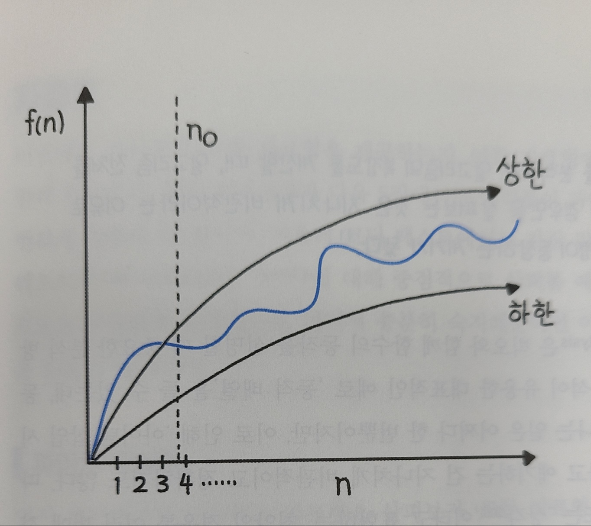

파이썬 알고리즘 인터뷰 책의 2부 4장을 읽으면서 배운 내용을 정리해보았다.
빅오와 자료형의 개념 중, 새로 알게된 내용을 중심으로 정리하였다.

# 빅오
> 빅오란 입력값이 무한대로 향할때 함수의 상한을 설명하는 수학적 표기 방법이다.
`시간 복잡도` 는 어떤 알고리즘을 수행하는 데 걸리는 시간을 설명하는 계산복잡도를 의미하며, 계산 복잡도를 표기하는 대표적인 방법이 바로 빅오이다.
빅오 표기법은 주어진(최선/최악/평균) 경우의 수행 시간의 상한을 나타낸다. 여기서 상한은 알고리즘이 가장 늦게 실행될 때를 뜻한다.  



# 분할 상환 분석
> 알고리즘 전체를 보지 않고 최악의 경우만을 살펴보는 것은 지나치게 비관적이라는 이유로 분할 상환 분석 기법이 등장하였다.  
최악의 경우를 여러 번에 걸쳐 골고루 나눠주는 형태로 알고리즘의 시간 복잡도를 계산하는 분석 기법이라 할 수 있다.

# 객체
파이썬의 모든 자료형은 `객체` 이다. 애초에 편리한 기능 제공에 우선순위를 둔 언어인만큼 느린 속도와 더 많은 메모리를 차지하더라도 훨씬 더 다양한 기능을 제공할 수 있는 객체에 관심을 두었기 떄문이다.  
불변 객체와 가변 객체가 있는데, 가변 객체는 list, set, dict 이고 나머지는 모두 불변 객체이다.

# is 와 ==
is는 id() 값, 즉 메모리 상에 위치한 객체의 주소를 반환하는 함수를 기반으로 비교를 하고, == 는 값을 비교하는 연산자이다.
```py
>>> a = [1, 2, 3]
>>> a == a
True
>>> a == list(a)
True
>>> a is a
True
>>> a is list(a)
False
```
값은 동일하지만, list()로 한번 더 묶어주면, `별도의 객체로 복사`가 되고 다른 id를 갖게 되므로 a 와 list(a)를 is로 비교하면 False가 된다.

```py
>>> a = [1, 2, 3]
>>> a = copy.deepcopy(a)
True
>>> a is copy.deepcopy(a)
False
```
copy.deepcopy()로 복사한 결과는 값은 같지만 id는 다르게 나온다.