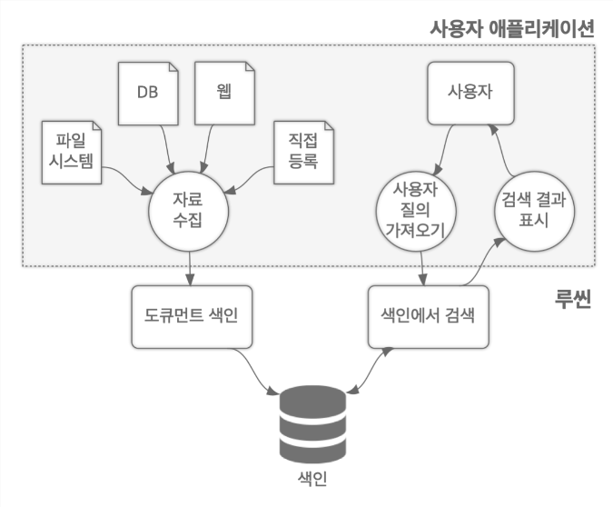
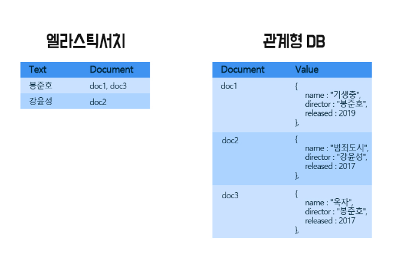
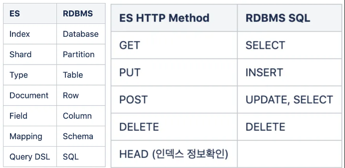
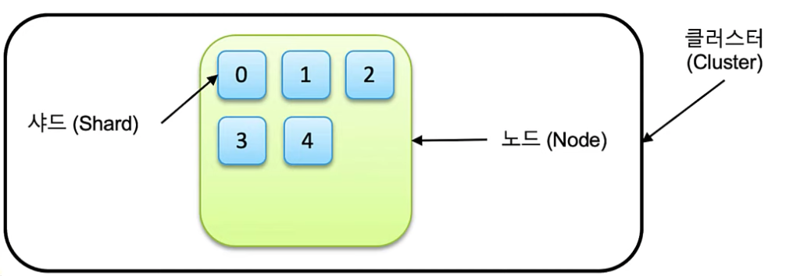
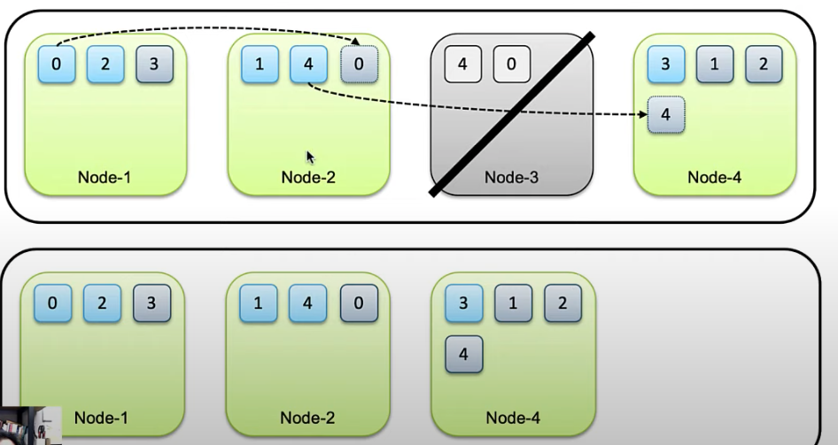
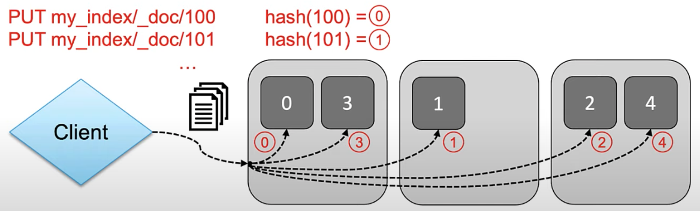
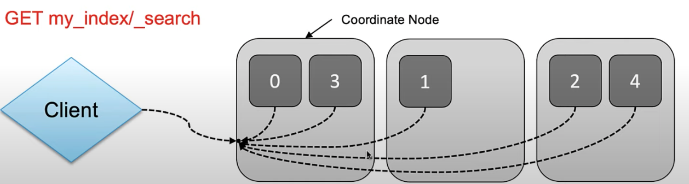

데이터 포털의 `메타 데이터 검색` 기능 고도화를 위해, 여러 데이터 노드에 분산 저장해서 빠르게 검색하고 분석하는 Document Database 형태를 갖출 수 있는 `ElasticSearch`를 사용하기로 하였다.

# ElasticSearch

## 1. Apache Lucene

ES는 `Apache Lucene`을 기반으로 만들어진 `분산 검색 엔진`이다. 루씬은 자바 언어로 개발된 오픈소스 정보 검색 라이브러리이다.

### 검색엔진

- 예전에 www 가 생기고 나서, 인터넷의 출현은 많은 정보를 얻을 수 있게 되었다. 하지만, 이 정보들을 찾는 것은 매우 어려운 일이었다. 이러한 문제를 해결하기 위해 검색엔진이 등장하게 되었다. 검색엔진은 사용자가 원하는 정보를 찾아주는 역할을 한다. 검색엔진은 `스크래핑, 크롤링` 기술과 연관이 깊다.

### Lucene 검색엔진

- 루씬은 고성능 정보 검색 IR(Information retrieval) 라이브러리다. IR은 문서를 검색하거나, 문서와 연관된 메타 정보를 검색하는 과정이다.
- 검색엔진은 링크와 텍스트 인식 베이스이다. 크롤러가 방문한 웹 페이지에서 새로운 링크를 발견하면 웹 서버에 데이터 정보를 요청하고 이때 웹 서버는 검색엔진에게 웹 페이지 정보를 보내는데 이것이 바로 `메타태그가 포함된 사이트 정보`이다.

### Lucene의 시스템 구성도

- 자료수집을 크롤링이라 하고, 그렇게 모여지고 이미 색인된 데이터를 사용자가 Query 한다.
- 이 `자료수집`의 본집은 ES로 가면서 데이터(JSON Document)를 인덱싱해서 여러 데이터 노드에 분산 저장해서 빠르게 검색하고 분석하는 Document Database 면모로 갖춰지게 되었다.

## 2. ES 시스템 및 데이터 구조

### RDB와의 핵심 차이

- RDB는 특정 value를 찾기 위해 특정 테이블의 모든 레코드를 보면서 체크하지만, ES에서는 특정 텍스트 값 기반으로 이미 어떤 Document에 포함되어 있는지 색인이 되어 있어서, 찾는 속도에서 차이가 날 수 밖에 없다.

- RDBMS의 물리와 논리 단위를 ES와 비교하여 정리한 표이다.
- ES는 자체 REST API를 지원해주기 때문에, Insert 나 Query 할 때 또는 다양한 configure에 http request를 기본적으로 rest-full 하게 활용 가능하다.

### 기본적인 시스템 단위

1. `Cluster` : 독립된 ES 시스템 환경, 1개 이상의 노드로 구성. 1개의 ES만 구동해도 1개의 Cluster로 구성을 하게 된다. 그 이상 노드로 구성된 ES Cluster는 내부적으로 데이터 교환 하지 않는다.
2. `Node` : 실행중인 ES 시스템 프로세스 단위
3. `Document` : 저장된 "단일" 데이터 단위, 흔히 RDB에서 record와 비교되는 단위이다.
4. `Index` : Document의 `논리적 집합`을 의미한다. RDB에서의 Table과 비교되는 단위이다. 기본적으로 Index는 1개 이상의 shard로 구성되어 있다.
5. `Shard` : Index(색인)과 Search(검색) 진행하는 작업 단위(Thread)를 의미한다.

### Shard

- 기본적으로 primary shard와 replica로 구성된다.
- 각 샤드들은 클러스터 노드들에 분산되어 저장된다.
- 같은 프라이머리 샤드와 복제본은 같은 데이터 세트를 가지고 있지만, 다른 노드에 저장된다.
- 데이터 노드가 1개인 경우 복제본은 생성되지 않는다. 기본적인 시스템 단위의 그림이 노드가 1개인 경우라 복제본이 없다.

- 이런 구조기반으로 기본적인 `데이터 무결성`을 유지한다. 노드가 유실되면 남아있는 샤드의 데이터를 다른 노드로 복사한다.

### ES 데이터 활용하기

1. ES 데이터 Insert와 Shard

- ES에 데이터가 입력될 떄, 데이터를 색인할 때 Index에 해당하는 모든 shard에 `Round Robin` 방식으로 입력된다.
- 사용자는 어떤 document가 어떤 shard에 적재되는지 알 수 없다.
- `my_index` 라는 index가 존재하고 5개 shard로 되어 있다고 가정해보자. 데이터를 넣을 때 마다 doc id를 지정했는데, 그 id를 hash한 result에 해당하는 shard의 number로 RR 방식으로 적재된다.

  

- doc id 를 특정하지 않고 랜덤하게 넣으면 대체적으로 균등하게 적재된다.
- 검색을 할 떄도 요청을 받은 노드가 해당되는 모든 샤드에 검색 명령을 전달한다. 최초로 검색 전달을 받은 노드를 `coordinate node`라고 부른다.

- 각 샤드별로 분산 실행되고 결과는 다시 요청받은 노드, coordinate node로 전달되어 취합된 후 client로 response를 넘겨준다.
- 인덱스용량에 따라 적절한 수의 샤드로 구성해야 한다. 인덱스를 선언하지 않고 바로 document를 insert해도 `schemless` 라는 세팅으로 자동 index를 세팅하며 샤드 개수에도 default 설정을 따른다.

2. 멀티테넌시 - multitenancy

- ES에서는 서로 다른 인덱스를 `묶어서 한꺼번에 검색` 가능하다. 쉼표로 나열하거나 와일드카드를 사용할 수 있다.
- ex) `GET book, magazine/_search` 혹은 `GET filebeat-*/_search`

# 정리

ES를 단순 검색 엔진 툴로만 이해하고 있었지만, 클러스터링과 샤드 개념에서 학습을 하니, 정교하게 짜여진 자료구조를 기반으로 작동되는 엔진이라는 느낌을 받았다. 향후 데이터 포털 고도화 작업을 할 때, ES를 활용하면서, 데이터를 어떻게 색인하고, 어떻게 검색할 것인지에 대한 고민을 해야겠다.

# 참고링크

- [새로운 Elasticsearch 데이터 구조 이해하기](https://velog.io/@qlgks1/Elasticsearch-%EB%A3%A8%EC%94%AC-%EA%B8%B0%EB%B3%B8-%EA%B0%9C%EB%85%90%EA%B3%BC-ES-%EC%8B%9C%EC%8A%A4%ED%85%9C-%EB%B0%8F-%EB%8D%B0%EC%9D%B4%ED%84%B0-%EA%B5%AC%EC%A1%B0Node-Index-Shard-%EC%9D%B4%ED%95%B4%ED%95%98%EA%B8%B0)
