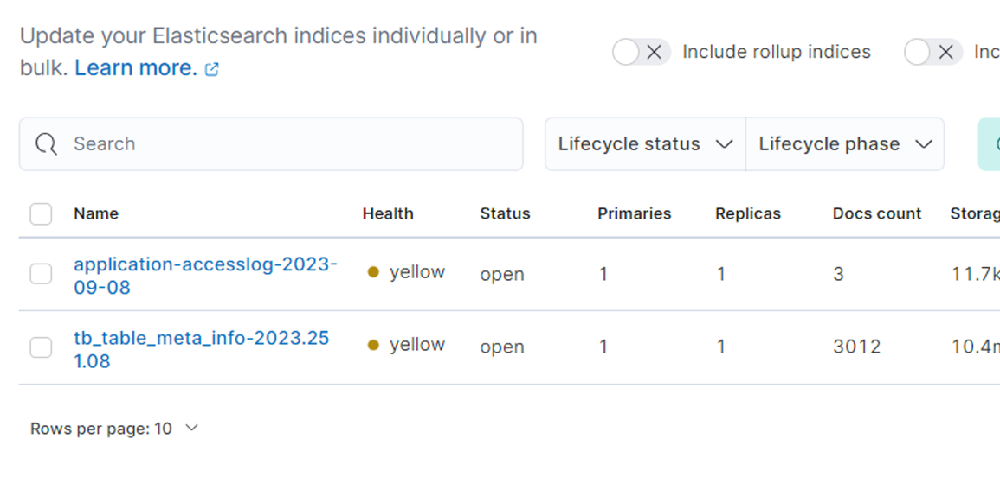

데이터 포털 SpringBoot 프로젝트에서 메타데이터 검색 API 실행 시, 해당 검색어 로그를 Logstash를 통해 ES로 전송 후, 해당 로그들을 일정 기준으로 집계하여 `실시간 검색어 순위`를 파악하고자 한다.

# Logback

SpringBoot는 기본적으로 `Logback`` 로깅 프레임워크를 사용하여 로그를 기록하는데, 다행히 이를 ES로 전송하는 기능이 있다.  

SpringBoot 프로젝트의 resources 폴더안에 xml 파일을 생성 후, 이 파일 내에서 http 요청의 로그를 전송해준다.

```xml
// logback-access-spring.xml
<?xml version="1.0" encoding="UTF-8"?>
<configuration>
    <springProperty scope="context" name="elasticsearch_uris" source="spring.elasticsearch.uris" defaultValue="http://localhost:9200"/>
    <appender name="ELASTIC" class="com.internetitem.logback.elasticsearch.ElasticsearchAccessAppender">
        <url>http://localhost:9200/_bulk</url>
        <index>application-accesslog-%date{yyyy-MM-dd}</index>
        <headers>
            <header>
                <name>Content-Type</name>
                <value>application/json</value>
            </header>
        </headers>
    </appender>
    <appender-ref ref="ELASTIC"/>
</configuration>
```
그러나, ES로 바로 로그를 넘길 시 포맷이 깔끔하게 보내지지 않는 오류가 존재한다.

이를 해결하기 위해 `Logstash` 를 거친 다음에 ES 로 넘겨줄 예정이다.


# Logstash - 2개의 conf 파일 동시 실행

## pipelines.yml

DB 에서 pull 해온 테이블을 저장해주는 config와, 검색 로그를 전송해줄 config 파일 2개가 필요해졌다.  

여러 config 파일을 동시에 실행해주려면, logtash의 config 폴더 내의 `pipelines.yml` 을 사용하면 된다.  
- Logstash 여러개 실행 - https://m.blog.naver.com/inggi/221816427585  
위의 글을 참고하여 다음과 같이 yml 파일을 수정했다.
```yaml
# List of pipelines to be loaded by Logstash
#
# This document must be a list of dictionaries/hashes, where the keys/values are pipeline settings.
# Default values for omitted settings are read from the `logstash.yml` file.
# When declaring multiple pipelines, each MUST have its own `pipeline.id`.
#
# Example of two pipelines:
#
- pipeline.id: id_database
  pipeline.workers: 1
  path.config: "../bin/logstash-database.conf"

- pipeline.id: id_searchlog
  pipeline.workers: 1
  path.config: "../bin/logstash-searchlog.conf"
#   pipeline.batch.size: 1
#   config.string: "input { generator {} } filter { sleep { time => 1 } } output { stdout { codec => dots } }"
# - pipeline.id: another_test
#   queue.type: persisted
#   path.config: "/tmp/logstash/*.config"
#
```
각 conf 파일의 id, workers, 그리고 경로 지정을 마친 후, 다음 명령어로 logstash를 실행해주면 된다.  
```bash
# bin 폴더 내에서
./logstash.bat
```
별도의 옵션이 없으면 `./config/pipelines.yml` 을 읽어 실행해준다.

# Log 전송 담당 conf 파일

DB 테이블 pull 용 conf 는 logstash-database.conf, 로그 담당은 logstash-searchlog.conf 파일로 이름을 지었고, 다음과 같이 구성하였다.  
```bash
# Sample Logstash configuration for creating a simple
# Beats -> Logstash -> Elasticsearch pipeline.

input {
  tcp {
    port => 4560
    codec => json_lines
  }
}

output {
  elasticsearch {
    hosts => ["http://localhost:9200"]
	    index => "application-accesslog-%{+YYYY.MM.dd}"
  }
}
```

# SpringBoot의 logback-spring.xml
- logback-spring.xml : https://ggparkitbank.tistory.com/190
- SpringBoot 로그 설정 : https://hello-startup.tistory.com/4

## gradle 라이브러리 추가
```bash
// spring boot log to logstash
implementation 'net.logstash.logback:logstash-logback-encoder:7.1.1'
```

## logback-spring.xml
`TcpSocker`를 통해 로그를 보내줄 예정이다.
```bash
<?xml version="1.0" encoding="UTF-8"?>
<configuration scan="true" scanPeriod="30 seconds">
    <!-- Console -->
    <appender name="CONSOLE" class="ch.qos.logback.core.ConsoleAppender">
        <encoder>
            <pattern>%d{HH:mm:ss.SSS} [%thread] %-5level %logger{10} - %msg%n</pattern>
        </encoder>
    </appender>

    <!-- Logstash -->
    <appender name="LOGSTASH" class="net.logstash.logback.appender.LogstashTcpSocketAppender">
        <destination>localhost:4560</destination>
        <encoder class="net.logstash.logback.encoder.LogstashEncoder">
            <timeZone>GMT+9</timeZone>
            <timestampPattern>yyyy-MM-dd'T'HH:mm:ss</timestampPattern>
            <fieldNames>
                <timestamp>time</timestamp>
            </fieldNames>
        </encoder>
    </appender>

    <root level="INFO">
        <appender-ref ref="CONSOLE" />
        <appender-ref ref="LOGSTASH" />
    </root>
</configuration>
```

`destination` 에 명시한 logstash의 주소로 input 요청을 보내고, logstash의 `logstash-searchlog.conf` 를 통해 받은 input 요청을 ouput을 통해 명시해준 ES 주소로 보내준다.   


여기서 주의해야할 점은 XML 파일명을 `logback-spring.xml 로 정확히 설정`해줘야 한다는 점이다.  
> 이유 : 자동 구성 기능 활용: Spring Boot는 logback-spring.xml 파일을 자동으로 인식하고 해당 설정을 적용합니다. 이를 통해 사용자는 로깅 설정을 별도로 코드로 지정하지 않아도 됩니다.  
그리고, 한국 기준 시간대 범위 값 내의 로그만을 활용하기 위해, `timeZone 에 GMT+9 옵션`을 달아줬다.

`timestampPattern` 옵션을 통해 알아보기 쉬운 형태의 시간 형식으로 출력  
- logstash-logback-encoder : https://github.com/logfellow/logstash-logback-encoder?source=post_page-----e62c691128b--------------------------------#registering-additional-providers  
해당 깃헙 문서를 통해, `@timestamp` 값을 커스터마이징 해줄 수 있는 `LogstashEncoder` 를 활용하였다.  
  


# Bucket Aggregations
> Index 내의 doc를 특정 Bucket으로 묶은 다음, 그 버킷내에서의 집계 결과 계산 후 반환  
- ES 버킷 : https://esbook.kimjmin.net/08-aggregations/8.2-bucket-aggregations  
SpringBoot 내의 검색 Service 단을 다음과 같이 구성해줬다.
```bash
public List<TableSearchDto> getTotalTableSearchResult(String keyword) {

        // 빈 키워드인지 체크
        validateBlankKeyword(keyword);

        ElasticUtil client = ElasticUtil.getInstance("localhost", 9200);

        // index : tb_table_meta_info-YYYY-MM-DD
        LocalDate now = LocalDate.now();

        // fields
        List<String> fields = new ArrayList<>();
        fields.add("table_id");
        fields.add("table_comment");
        fields.add("small_clsf_name");

        String indexName = "tb_table_meta_info-" + now;
        List<Map<String, Object>> searchResult = client.getTotalTableSearch(indexName, keyword, fields, 10000);
        log.info("{} {}", keyValue("requestURI", "/metadata/search/total"), keyValue("keyword", keyword));

        // 검색 결과 -> TableSearchDto로 감싸주는 작업
        return searchResult.stream()
                .map(mapData -> new TableSearchDto(String.valueOf(mapData.get("table_id")), String.valueOf(mapData.get("table_comment")), String.valueOf(mapData.get("small_clsf_name")), searchResult.size()))
                .collect(Collectors.toList());
    }
```  
로그 전송 시, `StructuredArguments` 를 사용하였다.

requestURI 와 검색 키워드 값(keyword) 을 `keyvalue` 함수를 통해 JSON 형태로 전송하였다. 이를 `BucketAggregation` 을 통해 키워드 기준으로 로그 수를 집계해줬다.  
```bash
POST logstash-searchlog-2023-09-13/_search
{
  "query": {
    "bool": {
      "must": [
        {
          "match": {
            "requestURI": "/metadata/search/total"
          }
        
        },
        {
          "range": {
            "time": { 
              "gte": "2023-09-13T09:55:00",
              "lte": "2023-09-13T18:30:00"
            }
          }
        }
      ]
    }
  },
  "aggs": {
    "KEYWORD_RANK": {
      "terms": {
        "field": "keyword.keyword",
        "size": 10,
        "min_doc_count": 1,
        "shard_min_doc_count": 0,
        "show_term_doc_count_error": false,
        "order": [
          {
            "_count": "desc"
          },
          {
            "_key": "asc"
          }
        ]
      }
    }
  }, 
  "fields": [
    "time",
    "keyword",
    "requestURI"
  ],
  "_source": false
}
```
- `match` : 검색 API 요청에 해당하는 로그만 활용

- `range` : 로그 시간대인 time 필드를 활용하여 특정 시간대의 로그만 추출

- `aggs` : 검색 키워드인 keyword 를 기준으로 집계한 Bucket Aggregation 결과 요청

- `terms` : keyword 필드의 문자열 별로 버킷을 나누어 집계가 가능하다. text 필드는 일반적으로 사용 불가능

- `order` : 집계 결과의 정렬 순서를 정의해주는 옵션 (_count: 집계 수, _key: 해당 집계 결과의 key 값)

- `fields` : 검색어 순위에 필요한 결과값인 time, keyword, 그리고 requestURI 를 각각 배열 형태로 받아온다.

위의 요청의 결과값은 다음과 같다.  

```bash
{
  "took" : 1,
  "timed_out" : false,
  "_shards" : {
    "total" : 1,
    "successful" : 1,
    "skipped" : 0,
    "failed" : 0
  },
  "hits" : {
    "total" : {
      "value" : 73,
      "relation" : "eq"
    },
    "max_score" : 1.0279663,
    "hits" : [
      {
        "_index" : "logstash-searchlog-2023-09-13",
        "_type" : "_doc",
        "_id" : "YJ5ujIoBLnJOv6dQmmUa",
        "_score" : 1.0279663,
        "fields" : {
          "time" : [
            "2023-09-13T11:46:13.000Z"
          ],
          "requestURI" : [
            "/metadata/search/total"
          ],
          "keyword" : [
            "심리"
          ]
        }
      },
      {
        "_index" : "logstash-searchlog-2023-09-13",
        "_type" : "_doc",
        "_id" : "YZ5ujIoBLnJOv6dQnGV2",
        "_score" : 1.0279663,
        "fields" : {
          "time" : [
            "2023-09-13T11:46:13.000Z"
          ],
          "requestURI" : [
            "/metadata/search/total"
          ],
          "keyword" : [
            "심리"
          ]
        }
      },
      {
        "_index" : "logstash-searchlog-2023-09-13",
        "_type" : "_doc",
        "_id" : "Yp5ujIoBLnJOv6dQnmXU",
        "_score" : 1.0279663,
        "fields" : {
          "time" : [
            "2023-09-13T11:46:14.000Z"
          ],
          "requestURI" : [
            "/metadata/search/total"
          ],
          "keyword" : [
            "심리"
          ]
        }
      },
      {
        "_index" : "logstash-searchlog-2023-09-13",
        "_type" : "_doc",
        "_id" : "Y55ujIoBLnJOv6dQoGXl",
        "_score" : 1.0279663,
        "fields" : {
          "time" : [
            "2023-09-13T11:46:14.000Z"
          ],
          "requestURI" : [
            "/metadata/search/total"
          ],
          "keyword" : [
            "심리"
          ]
        }
      },
      {
        "_index" : "logstash-searchlog-2023-09-13",
        "_type" : "_doc",
        "_id" : "up7SjIoBLnJOv6dQ8GXU",
        "_score" : 1.0279663,
        "fields" : {
          "time" : [
            "2023-09-13T13:35:48.000Z"
          ],
          "requestURI" : [
            "/metadata/search/total"
          ],
          "keyword" : [
            "문제"
          ]
        }
      },
      {
        "_index" : "logstash-searchlog-2023-09-13",
        "_type" : "_doc",
        "_id" : "u57SjIoBLnJOv6dQ82Wy",
        "_score" : 1.0279663,
        "fields" : {
          "time" : [
            "2023-09-13T13:35:49.000Z"
          ],
          "requestURI" : [
            "/metadata/search/total"
          ],
          "keyword" : [
            "문제"
          ]
        }
      },
      {
        "_index" : "logstash-searchlog-2023-09-13",
        "_type" : "_doc",
        "_id" : "vJ7SjIoBLnJOv6dQ9WXE",
        "_score" : 1.0279663,
        "fields" : {
          "time" : [
            "2023-09-13T13:35:50.000Z"
          ],
          "requestURI" : [
            "/metadata/search/total"
          ],
          "keyword" : [
            "문제"
          ]
        }
      },
      {
        "_index" : "logstash-searchlog-2023-09-13",
        "_type" : "_doc",
        "_id" : "vZ7SjIoBLnJOv6dQ92XD",
        "_score" : 1.0279663,
        "fields" : {
          "time" : [
            "2023-09-13T13:35:50.000Z"
          ],
          "requestURI" : [
            "/metadata/search/total"
          ],
          "keyword" : [
            "문제"
          ]
        }
      },
      {
        "_index" : "logstash-searchlog-2023-09-13",
        "_type" : "_doc",
        "_id" : "vp7SjIoBLnJOv6dQ-WU4",
        "_score" : 1.0279663,
        "fields" : {
          "time" : [
            "2023-09-13T13:35:51.000Z"
          ],
          "requestURI" : [
            "/metadata/search/total"
          ],
          "keyword" : [
            "문제"
          ]
        }
      }
    ]
  },
  "aggregations" : {
    "KEYWORD_RANK" : {
      "doc_count_error_upper_bound" : 0,
      "sum_other_doc_count" : 4,
      "buckets" : [
        {
          "key" : "상담",
          "doc_count" : 16
        },
        {
          "key" : "수학",
          "doc_count" : 11
        },
        {
          "key" : "문제",
          "doc_count" : 9
        },
        {
          "key" : "",
          "doc_count" : 7
        },
        {
          "key" : "심리",
          "doc_count" : 7
        },
        {
          "key" : "진단",
          "doc_count" : 7
        },
        {
          "key" : "영어",
          "doc_count" : 4
        },
        {
          "key" : "와우",
          "doc_count" : 4
        },
        {
          "key" : "국어",
          "doc_count" : 2
        },
        {
          "key" : "금융",
          "doc_count" : 2
        }
      ]
    }
  }
}
```  

이제 위의 요청과 응답을 Java 프로젝트 내에서 어떤식으로 구현하는지 살펴보자.

# High Level Rest Client  
- Java에서 ES 사용 : https://shanepark.tistory.com/141
- Java High Level Rest Client : https://joyhong.tistory.com/107
- 엘라스틱서치 클라이언트 : https://hanseom.tistory.com/156  


## 공통 사항 - ElasticUtil.java  
자바 프로젝트 내에서 필요한 API는 2가지이다. `메타 데이터 전체 기준 검색`, 그리고 `실시간 검색어 순위 결과` API이다.  
둘 다 `ElasticSearch Client`가 필요하므로, 자바 내에서 ES 용 클라이언트 생성을 도와주는 `High Level Rest Client` 를 `ElasticUtil 클래스`내에 생성  
```bash
@Component
@AllArgsConstructor
@NoArgsConstructor(access = AccessLevel.PROTECTED)
public class ElasticUtil {

    private static ElasticUtil self;
    private RestClientBuilder restClientBuilder;

    public ElasticUtil(String hostname, int port) {

        HttpHost host = new HttpHost(hostname, port);
        restClientBuilder = RestClient.builder(host);
    }

    public static ElasticUtil getInstance(String hostname, int port) {
        if (self == null)
            self = new ElasticUtil(hostname, port);
        return self;
    }

}
```
ES 로 Rest 요청을 보낼 수 있는 Client 인스턴스를 생성해주는 Util 클래스


## 메타 데이터 전체 기준 검색 API

```bash
POST tb_table_meta_info-2023-09-12/_search
{
  "query": {
    "bool": {
        "must" : [
            {
                "multi_match" : {
                "query" : "진단",
                "fields" : ["table_id", "table_comment", "small_clsf_name"]
                }
            }
        ]
    }
  }
}
```
필요한 QueryDSL 요청문이다. `multi_match` 옵션을 위해, QueryBuilders의 `multiMatchQuery` 함수 사용

```java
public List<Map<String, Object>> getTotalTableSearch(
            String index, String query, List<String> fields, Integer size
    ) {

        SearchRequest searchRequest = new SearchRequest(index);
        SearchSourceBuilder searchSourceBuilder = new SearchSourceBuilder();

        // multi-match query
        searchSourceBuilder.query(QueryBuilders.multiMatchQuery(query, fields.toArray(new String[fields.size()])));

        // set size
        if (size != null) {
            searchSourceBuilder.size(size);
        }
        searchRequest.source(searchSourceBuilder);

        List<Map<String, Object>> list = new ArrayList<>();
        try (RestHighLevelClient client = new RestHighLevelClient(restClientBuilder)) {
            SearchResponse response = client.search(searchRequest, RequestOptions.DEFAULT);
            SearchHits searchHits = response.getHits();
            for (SearchHit hit : searchHits) {
                Map<String, Object> sourceMap = hit.getSourceAsMap();
                list.add(sourceMap);
            }
        } catch (IOException e) {}

        return list;

    }
```
함수의 파라미터 값으로 `index` , `query`, `fields`, 그리고 `size` 값을 넘겨줬다.

`query`는 검색 키워드 값, `fields` 는 table_id, table_comment, small_clsf_name이다.

 

위의 함수는 `ElasticUtil 클래스`에 저장을 해줬고, 이를 필요로 하는 서비스단에서 사용하기로 함  
다음 경로로 요청이 올 시,
```bash
// 메타 테이블 전체 검색 API
{{host}}/metadata/search/total?keyword="검색어"
```  
`MetaDataService` 단에서 ES Client의 list 결과를 DTO로 감싸서 최종 리턴해줬다.

```java
public List<TableSearchDto> getTotalTableSearchResult(String keyword) {

        // 빈 키워드인지 체크
        validateBlankKeyword(keyword);

        ElasticUtil client = ElasticUtil.getInstance("localhost", 9200);

        // index : tb_table_meta_info-YYYY-MM-DD
        LocalDate now = LocalDate.now();

        // fields
        List<String> fields = new ArrayList<>();
        fields.add("table_id");
        fields.add("table_comment");
        fields.add("small_clsf_name");

        String indexName = "tb_table_meta_info-" + now;
        List<Map<String, Object>> searchResult = client.getTotalTableSearch(indexName, keyword, fields, 10000);
        log.info("{} {}", keyValue("requestURI", "/metadata/search/total"), keyValue("keyword", keyword));

        // 검색 결과 -> TableSearchDto로 감싸주는 작업
        return searchResult.stream()
                .map(mapData -> new TableSearchDto(String.valueOf(mapData.get("table_id")), String.valueOf(mapData.get("table_comment")), String.valueOf(mapData.get("small_clsf_name")), searchResult.size()))
                .collect(Collectors.toList());
    }
```  
해당 요청의 결과값은 다음과 같다.  
```bash
{
    "status": "SUCCESS",
    "message": "메타 테이블 전체 검색 결과 조회 성공했습니다.",
    "data": [
        {
            "table_id": "tb_psych_diagnosis",
            "table_comment": "심리진단",
            "small_clsf_name": "심리 진단",
            "total_num": 32
        },
        {
            "table_id": "tb_study_diagnosis",
            "table_comment": "학습진단",
            "small_clsf_name": "진단 정보",
            "total_num": 32
        },
        {
            "table_id": "TYPE_CST_BODY",
            "table_comment": "학력진단 진단지정보 테이블",
            "small_clsf_name": "학력진단",
            "total_num": 32
        },
        {
            "table_id": "tb_study_diagnosis_detail",
            "table_comment": "학습진단상세",
            "small_clsf_name": "진단 상세 정보",
            "total_num": 32
        },
        {
            "table_id": "TYPE_CST_INFO",
            "table_comment": "진단정보테이블",
            "small_clsf_name": "진단 정보",
            "total_num": 32
        },
        {
            "table_id": "TYPE_CST_CTR_MEMO",
            "table_comment": "성격 진단 상담 테이블",
            "small_clsf_name": "기록",
            "total_num": 32
        },
        {
            "table_id": "TYPE_CST_CTR_PROBLEM",
            "table_comment": "유형진단 문제 정보",
            "small_clsf_name": "유형진단",
            "total_num": 32
        },
        {
            "table_id": "TYPE_CST_CTR_RESULT_MASTER",
            "table_comment": "유형진단 결과 마스터",
            "small_clsf_name": "유형진단",
            "total_num": 32
        },
        {
            "table_id": "TYPE_CST_CTR_RESULT_V2",
            "table_comment": "유형진단 테스트 결과",
            "small_clsf_name": "유형진단",
            "total_num": 32
        },
        {
            "table_id": "TYPE_CST_STRATEGY_INFO",
            "table_comment": "유형진단 월별 전략",
            "small_clsf_name": "유형진단",
            "total_num": 32
        },
        {
            "table_id": "AD_STEPENG_TEST_RESULT",
            "table_comment": "수준별영어 진단결과[하누리텐 20081201]",
            "small_clsf_name": "진단 결과",
            "total_num": 32
        },
        {
            "table_id": "AD_STEPHJ_TEST_RESULT",
            "table_comment": "급수한자_진달결과[하누리텐 20081201]",
            "small_clsf_name": "진단 결과",
            "total_num": 32
        },
        {
            "table_id": "MT_SUM_LEVEL_TEST_AREA",
            "table_comment": "수학 학년별 가입진단 영역별 누적집계(백인흠/생성일:2010-09-13)",
            "small_clsf_name": "진단 집계",
            "total_num": 32
        },
        {
            "table_id": "PARENTS_TYPE_MASTER",
            "table_comment": "학부모유형마스터",
            "small_clsf_name": "유형 진단",
            "total_num": 32
        },
        {
            "table_id": "TYPE_CST_CTR_LEARN",
            "table_comment": "유형진단 차시 정보정보",
            "small_clsf_name": "유형진단",
            "total_num": 32
        },
        {
            "table_id": "TYPE_CST_CTR_PBL",
            "table_comment": "성격진단 문제 정보지 테이블",
            "small_clsf_name": "성격진단",
            "total_num": 32
        },
        {
            "table_id": "TAB_TYPE_EXAMINATION_ANSWER",
            "table_comment": "부모양육/자녀학습 유형진단 결과 / 생성일 : 2018-11-23",
            "small_clsf_name": "진단 결과",
            "total_num": 32
        },
        {
            "table_id": "EVENT_HANJA_LEVEL_CHALLENGE2",
            "table_comment": "한자 진단 모의고사 도전 결과",
            "small_clsf_name": "도전 결과",
            "total_num": 32
        },
        {
            "table_id": "TB_DGNSS_CNTNTS",
            "table_comment": "진단 콘텐츠 관리를 위한 테이블",
            "small_clsf_name": "컨텐츠",
            "total_num": 32
        },
        {
            "table_id": "TB_DGNSS_HABIT",
            "table_comment": "진단 습관 관리를 위한 테이블",
            "small_clsf_name": "습관",
            "total_num": 32
        },
        {
            "table_id": "TB_DGNSS_RESULT",
            "table_comment": "진단 결과 관리를 위한 테이블",
            "small_clsf_name": "결과",
            "total_num": 32
        },
        {
            "table_id": "TB_DGNSS_SCRIPT",
            "table_comment": "진단 스크립트 관리를 위한 테이블",
            "small_clsf_name": "스크립트",
            "total_num": 32
        },
        {
            "table_id": "TYPE_CST_AGAIN",
            "table_comment": "진단다시풀기 관리(20051105 김인현)",
            "small_clsf_name": "다시풀기 관리",
            "total_num": 32
        },
        {
            "table_id": "MT_LEVEL_TEST_START_CHAPTER",
            "table_comment": "(2010-06-28 김인현) 진단 평가 학년별 월별 기본 시작 단원, 진단 시작에서 단원선택 안함 이 내용으로 설정, 가입/정기 진단 동일",
            "small_clsf_name": "시작 단원",
            "total_num": 32
        },
        {
            "table_id": "TB_DGNSS_ASIGN_MEM",
            "table_comment": "진단 배정 회원 관리를 위한 테이블",
            "small_clsf_name": "회원",
            "total_num": 32
        },
        {
            "table_id": "TB_DGNSS_CNTNTS_QESITM",
            "table_comment": "진단 콘텐츠 문항 관리를 위한 테이블",
            "small_clsf_name": "컨텐츠",
            "total_num": 32
        },
        {
            "table_id": "TB_DGNSS_DRCTS",
            "table_comment": "진단 지시문 관리를 위한 테이블",
            "small_clsf_name": "지시문",
            "total_num": 32
        },
        {
            "table_id": "TB_DGNSS_QESITM_RSPNS",
            "table_comment": "진단 문항 응답 관리를 위한 테이블",
            "small_clsf_name": "문항 응답",
            "total_num": 32
        },
        {
            "table_id": "TB_DGNSS_STATS",
            "table_comment": "진단평가평균관리를 위한 테이블",
            "small_clsf_name": "집계",
            "total_num": 32
        },
        {
            "table_id": "TYPE_APTITUDE_TEST_POP",
            "table_comment": "진단test 결과체크(2010-03-23 박효정)",
            "small_clsf_name": "결과",
            "total_num": 32
        },
        {
            "table_id": "TB_DGNSS_RESULT_REPRT",
            "table_comment": "진단 결과 보고서 관리를 위한 테이블",
            "small_clsf_name": "결과",
            "total_num": 32
        },
        {
            "table_id": "TYPE_STUDY_RST_FOR_TBL",
            "table_comment": "학력진단 결과를 시간표와 연결하는 테이블",
            "small_clsf_name": "결과",
            "total_num": 32
        }
    ]
}
```

## 실시간 검색어 순위 API

필요한 QueryDSL 요청값과 이에 대한 응답은 위에 명시가 되어있으니 참고바란다.  
다음 경로로 HTTP GET 요청이 올 시,
```bash
{{host}}/metadata/search/total?keyword="검색어"
```  
실시간 검색어 순위 결과를 리턴해준다. 우선, 위의 요청에 대한 서비스단과 검색 시 보내지는 로그 형식을 다시 살펴보자.
```java
public List<TableSearchKeywordRankDto> getTableSearchRank(TableSearchRankRequest request) {

        // message 안에 uri 가 포함된 로그만 필터링
        String uri = request.getUri();

        // 검색 시간대
        String gte = request.getGte();
        String lte = request.getLte();

        ElasticUtil client = ElasticUtil.getInstance("localhost", 9200);

        // index : logstash-searchlog-YYYY-MM-DD
        LocalDate now = LocalDate.now();

        String indexName = "logstash-searchlog-" + now;
        return client.getTableSearchRank(indexName, uri, gte, lte, 10000, 10);
    }
```  
```java
log.info("{} {}", keyValue("requestURI", "/metadata/search/total"), keyValue("keyword", keyword));
```  
  
검색 시, requestURI 와 검색 키워드인 keyword 를 keyValue 형식으로 보내줬다.

`해당 URI 에만 해당되고, 원하는 시간대 값 내의 로그들이 집계된 결과` → 궁극적으로 필요한 값

서비스단에서 RequestBody 내의 `URI, GTE, LTE` 를 받아와 ElasticUtil의 `getTableSearchRank` 함수의 파라미터로 넘겨줬다.  
```java
public List<TableSearchKeywordRankDto> getTableSearchRank(
            String index, String uri, String gte, String lte, Integer logResultSize, Integer rankResultSize
    ) {
        SearchRequest searchRequest = new SearchRequest(index);
        SearchSourceBuilder searchSourceBuilder = new SearchSourceBuilder();

        // match -> message : URI
        BoolQueryBuilder boolQuery = QueryBuilders.boolQuery();
        boolQuery.must(QueryBuilders.matchQuery("message", uri));

        // range -> gte to lte
        RangeQueryBuilder rangeQuery = QueryBuilders.rangeQuery("time")
                .gte(gte)
                .lte(lte);
        boolQuery.must(rangeQuery);

        searchSourceBuilder.query(boolQuery);

        // time, requestURI, keyword 필드만 받아오도록
        String[] includes = new String[]{"time", "requestURI", "keyword"};
        searchSourceBuilder.fetchSource(includes, null);

        TermsAggregationBuilder aggregationBuilder = AggregationBuilders.terms("KEYWORD_RANK")
                                                                        .field("keyword.keyword")
                                                                        .size(rankResultSize);
        searchSourceBuilder.aggregation(aggregationBuilder);

        // set size
        if (logResultSize != null) {
            searchSourceBuilder.size(logResultSize);
        }

        searchRequest.source(searchSourceBuilder);
        searchRequest.scroll(TimeValue.timeValueMinutes(1));

        List<TableSearchKeywordRankDto> list = new ArrayList<>();
        try (RestHighLevelClient client = new RestHighLevelClient(restClientBuilder)) {
            SearchResponse response = client.search(searchRequest, RequestOptions.DEFAULT);

            RestStatus status = response.status();
            if (status == RestStatus.OK) {
                Aggregations aggregations = response.getAggregations();
                Terms keywordAggs = aggregations.get("KEYWORD_RANK");
                for (Terms.Bucket bucket : keywordAggs.getBuckets()) {
                    list.add(new TableSearchKeywordRankDto(bucket.getKey().toString(), (int) bucket.getDocCount()));
                }
            }

        } catch (IOException e) {}

        return list;
    }
```  
- `boolQuery, matchQuery` : 로그 중, 검색 요청 경로에 매칭되는 로그만 사용할 수 있도록 필터링

- `rangeQuery` : 시간대 값 범위 설정에 필요한 함수

- `AggregationBuilder` : QueryDSL의 aggs 에 필요한 요청을 설정해주는 부분  
해당 리스트의 결과를 서비스 단이 아닌, ElasticUtil 클래스 내에서 DTO 변환 작업을 수행해줬다. 최종 결과는 다음과 같다.
```bash
{
    "status": "SUCCESS",
    "message": "특정 시간대의 검색어 순위 집계에 성공했습니다.",
    "data": [
        {
            "keyword": "진단",
            "count": 7
        },
        {
            "keyword": "EVENT",
            "count": 6
        },
        {
            "keyword": "영어",
            "count": 5
        },
        {
            "keyword": "수학",
            "count": 4
        }
    ]
}
```