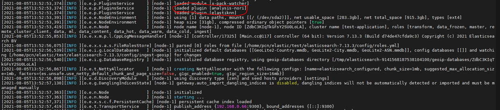

메타 데이터는 `테이블ID, 테이블 코멘트, 하위 주제` 로 구성되어 있다. 여기서 이 요소들을 기준으로 더 정확한 검색을 위해 다음의 과정을 거쳤다. 테이블 코멘트와 하위 주제는 `의미 있는 한글 형태소 기반`으로, 테이블 ID는 `'_' -> 언더바`를 기준으로 나누어서 검색되도록 하였다.

# ElasticSearch, Logstash, Kibana 설치

ELK Stack 설치. 셋 모두 7.15.2 버전을 설치해줬다.

- ES - https://www.elastic.co/kr/downloads/elasticsearch
- Logstash - https://www.elastic.co/kr/downloads/past-releases#logstash
- Kibana - https://www.elastic.co/kr/downloads/kibana

# PostgreSQL 연동

데이터 포털 사이트 내 메타 데이터 DB는 PostgreSQL이다. PostgreSQL 과 연동하기 위해서는 `JDBC Driver` 가 필요하다.

- PostgreSQL Driver (42.6.0) - https://jdbc.postgresql.org/

# ELK 실행

`Logstash -> ES -> Kibana` 순으로 실행

## Logstash

다운받은 포더 압축 해제 후, bin 폴더에서 다음 명령어로 실행

```bash
# bin 폴더 내에서
./logstash.bat -f logstash-simple.conf
```

위 명령어 실행 시, logstash-simple.conf 파일 내용을 기반으로 실행된다.  
logstash-simple.conf 파일은 PostgreSQL의 DB 데이터를 pull 방식으로 가져와 ES로 보내는 역할을 해준다.

```bash

# Sample Logstash configuration for creating a simple
# Beats -> Logstash -> Elasticsearch pipeline.
input {
  jdbc {
    jdbc_driver_library => "C:/Users/user/projects/logstash-7.15.2/bin/postgresql-42.6.0.jar"
    jdbc_driver_class => "org.postgresql.Driver"
    jdbc_connection_string => "postgres url"
    jdbc_user => "postgres user"
    jdbc_password => "postgres password"
    schedule => "* * * * *"
    statement => "select * from tb_table_meta_info"
  }
}

output {
  elasticsearch {
    hosts => ["http://localhost:9200"]
    index => "nori_test"
    document_id => "%{table_meta_info_id}"
  }
}
```

- input: `PostgreSQL JDBC` Connection 정보 입력
- output: `ElasticSearch` Connection 정보 입력

document_id 설정 이유 : https://blog.naver.com/xomyjoung/221650123319  
바로 `중복 데이터 처리`를 위해서이다. Logstash에서 1분마다 한번씩 input의 statement SQL 구문을 실행해준다. 그렇게 되면 중복되는 데이터가 계속해서 쌓이게 되는데, 이를 document_id 옵션을 통해 해결가능하다.

## ElasticSearch

압축해제 후, bin 폴더 내의 .bat 파일을 실행

```bash
localhost:9200
```

ES의 기본 URL 주소

## Kibana

압축해제 후, bin 폴더 내의 .bat 파일을 실행

```bash
localhost:5601
```

Kibana의 기본 URL 주소

# Nori Tokenizer

## Nori 설치 및 실행

> Nori - 한글 형태소 분석기

- Nori 플러그인 설치 및 실행 : https://dogf.tistory.com/110  
  Nori 설치를 위해 ES 폴더 내에 다음 명령어 실행

```bash
./bin/elasticsearch-plugin install analysis-nori
```

설치 후, ES 실행 시 다음과 같이 나오면 정상적으로 Nori가 구동되고 있다는 것  
  
빨간 부분을 확대해서 보면
