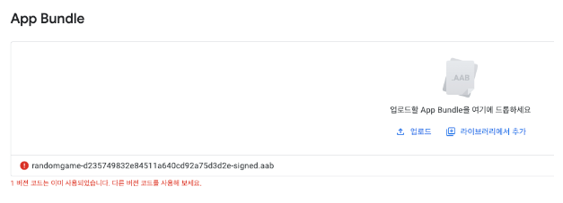

Enwise 국가근로 활동을 하면서 진행한 프로젝트, CandyKorean 앱의 인앱 결제 기능을 구현하면서 생긴 트러블 슈팅들을 정리해보았다.  
또한, Expo의 InAppPurchases 라이브러리를 어떤식으로 사용하였는지 적어보았다.

# 1. 버전 코드는 이미 사용되었습니다. 다른 버전 코드를 사용해보세요.

> 참고링크 : https://goddino.tistory.com/274

react native 에서 빌드 과정을 거치고, 구글 플레이 콘솔에서 앱 출시를 위해 aab 파일을 업로드 하였더니 다음과 같은 오류가 떴다.  


## 해결방법

react-native를 사용한다면 app.json 파일에서 version, versionCode를 기존의 1에서 다른 것으로 바꿔야 에러가 뜨지 않는다라고 블로그에 적혀있었다. 하지만, `이미 android 앱으로 빌드를 마친 상태에서는 app.json이 아닌 build.gradle의 android 블럭 내용을 참조`한다고 콘솔창에 안내되었다. 그러므로, 아래 코드의 versionCode를 수정하여 에러를 해결하였다.

```json
android {
    ndkVersion rootProject.ext.ndkVersion

    compileSdkVersion rootProject.ext.compileSdkVersion

    defaultConfig {
        applicationId 'com.candykorean.candykoreanapp'
        minSdkVersion rootProject.ext.minSdkVersion
        targetSdkVersion rootProject.ext.targetSdkVersion
        versionCode 42
        versionName "1.0.3"
        buildConfigField "boolean", "IS_NEW_ARCHITECTURE_ENABLED", isNewArchitectureEnabled().toString()

				...
```

# 2. E_IAP_NOT_AVAILABLE

처음엔 react-native-iap 라이브러리를 활용하기로 하였지만, 계속해서 제목과 같은 오류가 떴다.  
꼼꼼하게 찾아본 결과, Expo 환경에서는 Expo 만의 In-App Purchase 라이브러리를 사용해야 한다는 것을 알게 되었다.  
만약 react native cli 환경에서 인앱 결제 기능을 구현할 시엔, 다음 글을 참고하면 좋을 것 같다.

> https://github.com/dooboolab-community/react-native-iap/issues/1404

# 3. Error: You need wrap your app with withIAPContext HOC

> https://velog.io/@lumpenop/TIL-RN-%EC%9D%B8%EC%95%B1-%EA%B2%B0%EC%A0%9C-react-native-iap-6-Hooks-221130

사실 이 에러 또한 2번 에러때와 마찬가지로 react-native-iap 라이브러리를 사용하려고 해서 뜬 에러이다.  
useIAP() 훅은 간단한 react-native-iap 메서드에 쉽게 엑세스할 수 있는 방법이다. 다음과 같이 사용하면 된다.

```js
import React from 'react';
import {View, Text} from 'react-native';
import {requestPurchase, useIAP} from 'react-native-iap';

const App = () => {
  const {
    connected,
    products,
    promotedProductsIOS,
    subscriptions,
    purchaseHistories,
    availablePurchases,
    currentPurchase,
    currentPurchaseError,
    initConnectionError,
    finishTransaction,
    getProducts,
    getSubscriptions,
    getAvailablePurchases,
    getPurchaseHistories,
  } = useIAP();

	...
```

# 4. 이 버전의 애플리케이션에서는 google play를 통한 결제를 사용할 수 없습니다.

> https://itstudy-mary.tistory.com/401?category=929375

인앱 결제 기능을 테스트 하던 도중, 제목과 같은 에러를 발견하였다.  
해당 빌드 버전과 콘솔에 등록된 버전이 달라서 발생한 에러였다. 콘솔 내의 버전 등록이 완료되려면 시간이 좀 걸리므로, 1, 2시간 정도 기다리니 오류가 해결되었다.

# Expo InAppPurchases

> https://docs.expo.dev/versions/latest/sdk/in-app-purchases/

## finishTransactionAsync(purchase, consumeItem)

cosumeItem이 false이면, 딱 한번만 구매할 수 있는 상품임을 의미하고, true면 한 번 이상 사용할 수 있다는 의미이다. 이번 프로젝트 같은 경우엔 강의를 한 번 구매하면 계속해서 사용할 수 있으므로 false로 설정하였다.

# purchaseItemAsync(itemId, details), setPurchaseListener(callback)

인앱 결제 기능의 핵심이라고 할 수 있는 함수들이다. 구매를 시도하고, 그 구매의 결과에 대한 처리를 해주는 콜백함수를 정의해줘야 결제 프로세스가 완료가 된다. 프로젝트에서는 다음과 같이 구현을 하였다.

```js
const handlePayment = async courseName => {
  // 결제 프로세스 여기에 필요!

  // 인앱결제 test용 courseName -> 나중에 지우기
  // courseName = "iap_test"
  // setBottomText(courseName);

  let itemArray = []
  if (courseName === 'Conversational Korean Course') {
    itemArray.push('lollipop_yoojin')
    // itemArray.push("iap_test_3");
  } else if (courseName === 'Survival Korean Course') {
    itemArray.push('lollipop_seongyeop')
  } else if (courseName === 'After Like Course') {
    itemArray.push('lollipop_kyungeun')
  }

  try {
    // 구매 정보 가져오기
    const { responseCode, results } = await getProductsAsync(itemArray)

    if (responseCode === IAPResponseCode.OK) {
      setProductId(results[0].productId)
      setBottomText(results[0].productId)
    } else {
      setBottomText('something wrong!')
    }

    // 구매 내역에 없는 상품일때만 결제 진행
    if (purchasedCourseList.indexOf(itemInfo.course_id) === -1) {
      purchaseItemAsync(results[0].productId)
    } else {
      // 아닐떈, 바로 이미 구입한 상품이라고 알려주기
      navigation.navigate('PaymentResult', {
        user_id: userId,
        itemInfo: itemInfo,
        isSuccess: false,
        returnToClass,
        imgUrl: imgUrl,
        isBought: true,
      })
    }

    return await new Promise((resolve, reject) => {
      setPurchaseListener(async result => {
        if (result.responseCode === IAPResponseCode.OK) {
          setBottomText('success')
          if (!result.results[0].acknowledged) {
            setBottomText('successful purchase')
            await finishTransactionAsync(result.results[0], false)

            // 계속 구매 가능한지 test
            // await finishTransactionAsync(result.results[0], true);

            // DB에 저장 - purchasedCourse 에 없는 경우에만!
            if (purchasedCourseList.indexOf(itemInfo.course_id) === -1) {
              createPurchasedCourse(
                { user_id: userId, course_id: itemInfo.course_id },
                d => {
                  navigation.navigate('PaymentResult', {
                    user_id: userId,
                    itemInfo: itemInfo,
                    isSuccess: true,
                    returnToClass,
                    imgUrl: imgUrl,
                  })
                },
                setIsCoursePurchased,
                e => {
                  setIsSuccess(false)
                  console.log(e.message)
                },
              )
            } else {
              navigation.navigate('PaymentResult', {
                user_id: userId,
                itemInfo: itemInfo,
                isSuccess: true,
                returnToClass,
                imgUrl: imgUrl,
              })
            }
          }
        } else if (
          result.responseCode === IAPResponseCode.USER_CANCELED ||
          result.responseCode === IAPResponseCode.DEFERRED
        ) {
          setBottomText('User canceled the transaction')
        } else {
          setBottomText(
            `Something went wrong with the purchase. Received errorCode ${result.errorCode}`,
          )
          navigation.navigate('PaymentResult', {
            user_id: userId,
            itemInfo: itemInfo,
            isSuccess: false,
            returnToClass,
            imgUrl: imgUrl,
            isBought: result.errorCode === 8 ? true : false,
          })
        }
      })
    })
  } catch (e) {
    disconnectAsync()
    setBottomText('error!!!!!')
  }

  navigation.navigate('PaymentResult', {
    user_id: userId,
    itemInfo: itemInfo,
    isSuccess: true,
    returnToClass,
    imgUrl: imgUrl,
  })
}
```
