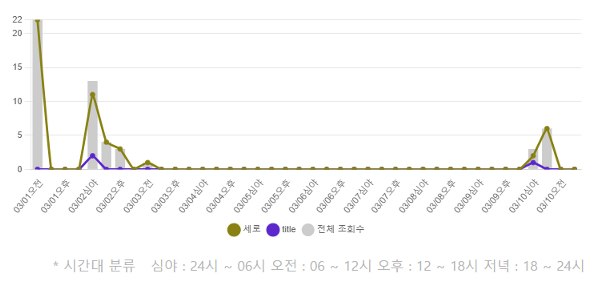

Enwise 국가 근로 활동을 하면서 진행한 프로젝트 중, cafe24 wizmon 프로젝트를 정리해보았다.  
# 프로젝트 소개

쇼핑몰 상품 홍보를 할때, 본인의 유튜브 영상를 활용하여 쇼핑몰 사이트에 올릴 수 있는 배너를 제작하는 것을 도와주는 사이트입니다.

Cafe24 쇼핑몰 사이트는 본인의 상품을 홍보할 수 있는 자신만의 쇼핑몰 사이트를 직접 제작할 수 있는 곳입니다. 저희가 개발한 wizmon 사이트를 사용하여 상품과 동영상이 합쳐진 형태의 콘텐츠를 만들어서 본인의 쇼핑몰 페이지에서 활용을 할 수 있습니다.  

# 프로젝트 기간
2022.03.01 ~ 2022.09.10

# 역할
프론트엔드 개발자로써 참여를 하였고, 메인 기술 스택은 `React` 입니다.  
주로 통계와 콘텐츠의 UI 설정을 담당하였고, 통계메뉴의 기능들로는 정보의 상품 순위, 시간대 별 상품 순위, 콘텐츠 조회, 콘텐츠 인기상품, 그리고 구매 유도율을 보여주는 페이지를 구현하였다.

# Trouble Shooting & New Knowledge
## 1. React 이미지 엑박 뜸
[[React] 리액트 이미지 엑박 뜰 때 해결법](https://velog.io/@hyunsung9999/React-%EB%A6%AC%EC%95%A1%ED%8A%B8-%EC%9D%B4%EB%AF%B8%EC%A7%80-%EC%97%91%EB%B0%95-%EB%9C%B0-%EB%95%8C-%ED%95%B4%EA%B2%B0%EB%B2%95)

 태그를 사용하여 이미지를 불러오는 경우, 엑박이 뜨는 오류가 발생하였다.

```javascript
img elements must have an alt prop, either with meaningful text, or an empty string for decorative images 
```  
위와 같은 오류가 발생하여서, 다음과 같이 해결을 할 수 있다고 나와있었다.  
```javascript

```
하지만, require는 이미지가 아닌 `객체`를 반환해주기 때문에 `.default`를 붙여줘야 한다.
```js

```
이렇게 해주면 이미지가 제대로 반환되어 엑박 없이 잘 뜬다.

## 2. React Router - history
지금까지의 경로에 대한 정보가 필요한 경우가 발생했다.  
header.js에서 `MyPage` 문자열이 경로 상에 존재하는지 여부가 필요했다. 만약 있다면 로그아웃 버튼이 보이도록, 없다면 안 보이도록 해야했었다.

```js
const hasMyPage = history.location.pathname.indexOf("MyPage");
// -1 이 아니면 MyPage가 경로명에 존재한다는 것
```
위와 같이 `history` 객체를 사용하여 현재 경로에 `MyPage`가 존재하는지 여부를 확인할 수 있다.  
[React | Router : match, location, history](https://gongbu-ing.tistory.com/45)  

## 3. 데이터 불러오기 전에 Render 되는 오류
데이터를 불러오기 전에 렌더링이 되는 오류가 발생했다. 이 오류는 && 구문을 활용하여 해결을 해주었다.
```js
todayContents[0] &&
```
todayContents가 비어있는 배열이라면, todayContents[0]은 undefined가 되기 때문에 && 구문을 사용하면, undefined가 아닌 경우에만 뒤에 있는 코드가 실행이 된다.  

## 4. 서버단의 Query문 변경 시, 그 결과값을 즉시 확인하고 싶었음
이 프로젝트는 네트워크 지식이 좀 부족했을 때 진행했던터라, 서버단에 대한 개념이 제대로 수립되지 않은 상태였다.  
통계 관련 데이터를 불러오는 쿼리문을 수정한 결과를 바로 확인하고 싶었는데, 서버단의 코드를 수정하고, 서버를 재시작해야지만 결과를 확인할 수 있었다.  
이를 해결하기 위해, 서버단의 코드를 수정하고, 서버를 재시작하지 않고도, 바로 결과를 확인할 수 있는 방법을 찾아보았다. 그 결과, `setupProxy.js` 의 타켓을 localhost로 설정을 해주기로 하였다. 
```js
const { createProxyMiddleware } = require('http-proxy-middleware');
module.exports = function (app) {
    app.use(createProxyMiddleware('/apis', { 
        // real: http://ec2-13-125-45-118.ap-northeast-2.compute.amazonaws.com:3000/
        // local test : http://127.0.0.1:3000/
        target: "http://ec2-13-125-45-118.ap-northeast-2.compute.amazonaws.com:3000/", 
        // target: "http://127.0.0.1:3000/", 
        changeOrigin: true, 
        // 하단 처리는 필수로 해주어야 한다. 아래의 내용이 없으면 url 경로에 
        // api가 추가되어 경로를 찾을 수 없어진다. 
        // pathRewrite: { '^/apis/': '/' } 
    }))
    // app.use(
    //     createProxyMiddleware('/api', {
    //         // target: "https://wizmon.cafe24api.com/",
    //         target: "http://127.0.0.1:3000/",
    //         changeOrigin: true,
    //         ws: true,
    //         // followRedirects:true,
    //         // 하단 처리는 필수로 해주어야 한다. 아래의 내용이 없으면 url 경로에

    //         // api가 추가되어 경로를 찾을 수 없어진다.
    //         // pathRewrite: {
    //         //     '^/cafe24api/': '/'
    //         // }
    //     }))
};

```
## 4. Chart.js 
통계 관련 페이지에서는 여러 데이터들을 한 눈에 표현하기 위해 `차트`를 사용해야 했다.  
차트를 사용하기 위해, `Chart.js` 라이브러리를 사용하였다. 통계 파트에서 개인적으로 좀 어려웠던 부분은 `시간대 별 상품 순위`를 보여주는 것 이었다.  
  
위와 같이, 시간대 별로 상품의 순위를 보여주는 차트를 만들어야 했다. 하지만, 하루에 대한 오전, 오후, 심야, 저녁 4개가 모두 안나오고 2개만 나오는 오류가 발생했었다. 그 이유는 바로 chart의 label수와 data 수가 달랐기 때문이다. 같아야지만 온전하게 데이터가 모두 출력되었다.  

