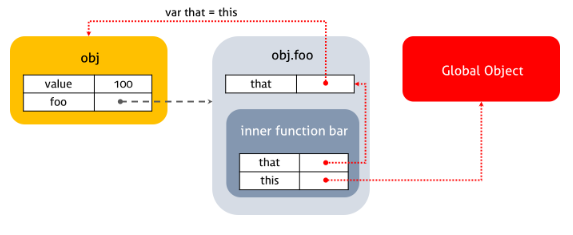

자바스크립트의 함수는 호출될 때, 매개변수로 전달되는 인자값 이외에, arguments 객체와 this를 암묵적으로 받는다.

```js
function square(number) {
  console.log(arguments)
  console.log(this)

  return number * number
}

square(2)
```

# this

> this를 이용하는 함수를 어떤 방식으로 실행하느냐에 따라서 this값이 결정된다.
> 즉, this에 바인딩할 객체가 동적으로 결정된다.

## 1. 일반 함수 실행 방식 (Regular Function Call)

전역객체(Global Object) : 모든 객체의 유일한 최상위 객체  
-> 일반적으로 Browser-side에서는 `widnow`, Server-side(Node.js)에서는 `global`객체를 의미한다.

```js
// in browser console
this === window // true

// in Terminal
node
this === global // true
```

```js
function foo() {
  console.log(this)
}
foo() // window 객체
```

```js
let name = 'Shin'

function foo() {
  console.log(this.name) // 'Shin'
}

foo()
```

name변수는 전역 변수이기 때문에 전역 객체인 window에 속성으로 추가된다. 즉, let name = 'Shin'; 이라는 코드를 쓰면 window 객체에 name이라는 key와 'Shin'이라는 value가 추가된다.

-> foo 함수를 일반 함수 실행 방식으로 실행하여기 떄문에, this는 `window객체`를 가리킨다.  
-> console.log(this.name);은 console.log(window.name); 과 똑같아진다.

```js
let age = 100

function foo() {
  let age = 99
  bar(age)
}

function bar() {
  console.log(this.age)
}

foo()
```

여기서도 마찬가지이다. foo함수 내부에서 bar함수가 일반 함수 실행 방식으로 실행된다. 일반 함수 실행 방식에서는 this가 window 객체를 가리키기 때문에, `this.age는 window.age`, 즉 99가 아닌 100이 출력된다.

```js
let value = 1

let obj = {
  value: 100,
  foo: function () {
    console.log("foo's this: ", this) // obj
    console.log("foo's this.value: ", this.value) // 100
    function bar() {
      console.log("bar's this: ", this) // window
      console.log("bar's this.value: ", this.value) // 1
    }
    bar()
  },
}

obj.foo()
```

메소드의 내부함수일 경우에도 위 코드처럼 this는 전역객체에 바인딩된다.

```js
let value = 1

let obj = {
  value: 100,
  foo: function () {
    setTimeout(function () {
      console.log("callback's this: ", this) // window
      console.log("callback's this.value: ", this.value) // 1
    }, 100)
  },
}

obj.foo()
```

콜백함수의 경우에도 this는 전역객체에 바인딩된다.  
**내부 함수는 일반 함수, 메소드, 콜백함수 어디에 선언되었든 관계없이 this는 전역객체를 바인딩한다.** 내부함수의 this가 전역객체를 참조하는 것을 회피하는 방법은 아래와 같다.

```js
let value = 1

let obj = {
  value: 100,
  foo: function () {
    let that = this // Workaround : this === obj

    console.log("foo's this: ", this) // obj
    console.log("foo's this.value: ", this.value) // 100
    function bar() {
      console.log("bar's this: ", this) // window
      console.log("bar's this.value: ", this.value) // 1

      console.log("bar's that: ", that) // obj
      console.log("bar's that.value: ", that.value) // 100
    }
    bar()
  },
}

obj.foo()
```

</img>
<br/><br/>

## \* Strict mode에서의 일반 함수 실행 방식 (Regular Function Call in Strict Mode)

- 비엄격 모드(Sloppy mode)에서 자주 일어나느 다양한 실수들을 방지하여 각종 에러들을 감소시키기 위해 strict mode 사용함.

- 스크립트 코드 맨 상단에 'use strict'; 구문 추가

```js
'use strict'

let name = 'Shin'

function foo() {
  console.log(this.name) // error
}

foo()
```

- strict mode에서 this는 무조건 `undefined`이다.
- 보통 코드 작성할 때 this가 실수로 window객체로 인식되는 에러가 발생할 수 있는데, strict mode는 그러한 버그 발생을 애초에 방지해준다.

## 2. 도트 표기법 (Dot Notation)

우리가 Object를 만들고 그 Object의 key와 value를 부여한 후, 도트(.)로 값에 접근하는 방식

```js
let age = 100

let ken = {
  age: 35,
  foo: function () {
    console.log(this.age) //35
  },
}

ken.foo()
```

Dot Notation으로 함수가 실행되면, this는 `그 도트 앞에 써있는 객체 자체`를 가리킨다. 그러므로 this.age는 ken.age, 즉 35가 출력된다.

```js
function foo() {
  console.log(this.age)
}

let age = 100
let ken = {
  age: 36,
  foo: foo,
}

let wan = {
  age: 32,
  foo: foo,
}

ken.foo() // 36
wan.foo() // 32

let fn = ken.foo
fn() // 100
```

ken.foo라는 값을 입력하고 fn(); 라고 실행하였다. 이는 함수를 Dot Notation이 아니고 `일반 실행 함수 방식`으로 실행한 것이다.  
-> 그러므로 이 때의 this는 Global Object를 가리키고, 전역 변수 age의 값인 100이 출력된다.

```js
function Person(name) {
  this.name = name;
}

Person.prototype.getName = function() {
  return this.name;
}

let me = new Person('Lee');
console.log(me.getName()); // 'Lee'

Person.prototype.name = 'Kim';
console.log(Person.prototype.getName()); / 'Kim'

```

프로토타입 객체도 메소드를 가질 수 있다. 프로토타입 객체 메소드 내부에서 사용된 this도 일반 메소드 방식과 마찬가지로 해당 메소드를 호출한 객체에 바인딩된다.

# 3. 명백한 바인딩 (Explicit Binding) / call, bind, apply

this의 역할을 우리가 직접 명확하게 지정해준다는 의미이다.  
 function.prototype.call, function.prototype.bind, function.prototype.apply와 같은 메소드를 사용하여 할 수 있다.

```js
let age = 100
function foo() {
  console.log(this.age)
}

let ken = {
  age: 35,
  log: foo,
}

foo.call(ken, 1, 2, 3)
```

foo 함수의 인자로 각각 ken, 1, 2, 3을 주었다. 이 인자들 중에서 가장 첫 번째로 쓴 ken이 바로 this의 값으로 지정된다.  
즉, this.age는 ken.age가 되어 35가 출력된다.

```js
let age = 100

function foo() {
  console.log(this.age)
}

let ken = {
  age: 35,
  log: foo,
}

foo.apply(ken, [1, 2, 3, 4, 5])
```

apply또한 같은 역할을 수행한다. apply는 this의 값을 지정해주는 인자 외에도 배열을 인자로 넣을 수 있는데, 이 배열의 값이 순차적으로 foo함수의 인자가 된다.

```js
let value = 1

let obj = {
  value: 100,
  foo: function () {
    console.log("foo's this: ", this) // obj
    console.log("foo's this.value: ", this.value) // 100
    function bar(a, b) {
      console.log("bar's this: ", this) // obj
      console.log("bar's this.value: ", this.value) // 100
      console.log("bar's arguments: ", arguments)
    }
    bar.apply(obj, [1, 2])
    bar.call(obj, 1, 2)
    bar.bind(obj)(1, 2)
  },
}

obj.foo()
```

위와 같이 bind도 사용할 수 있다.

## 4. new 키워드를 사용한 함수 실행

new 키워드를 사용하서 생성자 함수로 만들어 사용할 수도 있다. 이 경우에 this는 `빈 객체`가 된다.

```js
function Person() {
  console.log(this)
}

new Person()
```

위 코드에서 this는 빈 객체를 가리키며 생성자 함수는 this라는 빈 객체를 return 한다.  
-> return 문이 없어도 생성자 함수는 return해주는 특징을 지니고 있다.

```js
function Foo() {
  console.log(this.age) // undefined
  this.age = 100 // 빈 객체에 속성 추가
  console.log(this.age) // 100
}

new Foo()
```

Foo 함수가 new 키워드와 함께 생성자 함수로 사용되는 즉시, 함수 내부의 this는 빈 객체가 된다.  
-> this.age = 100;을 통해, 그 빈 객체에 age라는 속성이 추가되고 100이라는 값이 할당된다.  
-> 그러므로, 두 번째 console.log(this.age) 는 100을 출력하고, Foo함수는 `{ age : 100 }`이라는 객체를 return한다.

```js
function Person() {
  this.name = 'ken'
  console.log(this)
}

// bad
let ken = Person()
console.log(you) // undefined

// good
let ken = new Person()
console.log(ken)
```

- 만약 위 코드가 일반 함수 실행 방식으로 실행되었다면?
  <br/><br/>
  this는 window를 가리키게 될 것이고 window객체에 name이란 속성과 'ken'이라는 값이 추가되었을 것이다. 그리고 return문이 없기 때문에 어떠한 값도 리턴하지 않으므로 ken이라는 변수엔 어떤 것도 할당되지 않아 console 창에는 `undefined`가 출력될 것이다.
  <br/><br/>
- new Person(); 처럼 생성자 함수 방식으로 실행되었다면?
  <br/><br/>
  this는 빈 객체를 생성하여 name이란 속성과 'ken' 이라는 값을 할당할 것이고, return이 없음에도 불구하고 그 객체가 리턴된다. 그러므로 ken이라는 변수에는 `{ name : "ken" }`이라는 객체가 할당되고 console.log에는 그 객체가 return된다.

```js
function foo() {
  this.age = 100
  return 3
}

let a = new foo()
console.log(a)
```

생성자 함수는 return문이 있음에도 불구하고 그 return문을 무시하고 this객체를 return하는 특징이 있다.  
-> 즉, 위의 코드에서 3이 아닌 `{ age: 100 }`이 return된다.

```js
function foo() {
  this.age = 100
  return { haha: 200 }
}

let a = new foo()
console.log(a)
```

그러나, 생성자 함수도 return되는 대상이 **객체`**라면, this객체 대신 해당 객체가 return된다.  
-> 즉, 위 코드에서는 a는 { age : 100 }이 아닌 `{ haha: 200 }`이 된다.

## 함정 문제

**Q. 'I can do my work! I am smart!' alert가 출력이 될 것 인가?**

```js
function programmer() {
  this.isSmart = false
  this.upgrade = function (version) {
    this.isSmart = !!version
    work()
  }
  function work() {
    if (this.isSmart) {
      window.alert('I can do my work! I am smart!')
    }
  }
}

let programmer = new programmer()
programmer.upgrade(1.1)
```

**A. 출력하지 않는다**  
work() 함수가 일반 함수 실행 방식으로 실행되었으므로, work함수 안에서 this는 `window 객체`를 가리킨다. 전역 변수로 isSmart값을 지정하지 않았으므로 this.isSmart는 **undefined**이다.

[참고 사이트 1](https://im-developer.tistory.com/96)
[참고 사이트 2](https://poiemaweb.com/js-this)
