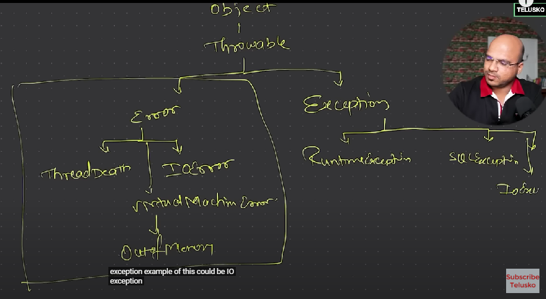

Java에서의 Class Hierachy를 `Exception` 관점에서 살펴보았고, 이를 정리해보았다.

# Class Hierachy

  
Java에서는 모든 클래스가 `Object` 클래스를 상속받는다. 그리고 `Object` 클래스는 `Throwable` 클래스를 상속받는다. `Throwable` 클래스는 `Exception` 클래스와 `Error` 클래스를 상속받는다. `Exception` 클래스는 `RuntimeException` 클래스와 `IOException` 클래스를 상속받는다. `RuntimeException` 클래스는 `ArithmeticException` 클래스와 `NullPointerException` 클래스를 상속받는다. `IOException` 클래스는 `FileNotFoundException` 클래스를 상속받는다.  
Error 영역에 있는 에러들은 개발자가 해결할 수 없는 에러들이다. 하지만, Exception 영역에 있는 에러들은 개발자가 해결할 수 있는 에러들이다.

# Unchecked & Checked

Runtime 영역의 에러들은 Unchecked Exception 이다. Unchecked이면, 컴파일러가 "에러 핸들하든지 말든지 상관안할게" 모드로 들어간다.  
Runtime 이외의 영역 내의 에러들은 Checked Exception 이다. 컴파일러가 "어? 이거 필수적으로 핸들해야하는데?" 모드로 들어간다.

# 참고링크

- [강의링크](https://www.youtube.com/watch?v=BGTx91t8q50)  
  9:34:28 분의 타임라인부터 참고하였다.
