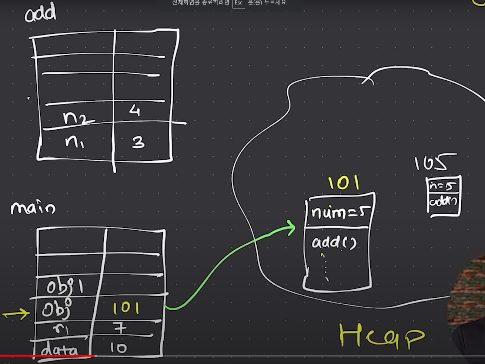

강의 영상에서 JVM 내에서의 코드 동작 원리에 대해 설명하는 부분이 있었다. 이를 정리해보았다.

# Code 구조

```java
class Calculator
{
	int num = 5;

	public int add(int n1, int n2)
	{
		return n1 + n2;
	}
}

public class Demo
{
	public static void main(String args[])
	{
		int data = 10;

		Calculator obj = new Calculator();
		Calculator obj1 = new Calculator();

		int r1 = obj.add(3, 4);
		System.out.println(r1);

		obj.num = 8;

		System.out.println(obj.num);
		System.out.println(obj1.num);
	}
}

```

실습때의 코드를 가져와보았다. 이 코드가 실행될 때 JVM 내에서는 다음과 같이 동작한다.  


# JVM - Stack 과 Heap, 그리고 인스턴스 변수

함수들은 Stack 형태로 만들어지고, 그 안에는 지역 변수들이 저장이 된다.  
main 함수내의 data나 r1, obj는 모두 `지역변수`이다. 하지만, obj는 data와 r1과는 다르게 `참조변수`라고 할 수 있다. object가 아닌 참조변수라고 해야한다. 그러면, obj가 가리키고 있는 Calculator object는 어디에 저장이 되는 것일까? 그곳이 바로 Heap 공간이다.  
Heap에서 Calculator object가 저장이 되고 obj 변수가 그 object를 가리키고 있는 형태가 되는 것이다. 또한, obj1도 obj와 같은 방식으로 Heap에 저장이 되고 obj1이 그 object를 가리키고 있는 형태가 된다. object안에 있는 num 변수는 지역변수가 아니라 `instance 변수`라고 한다.

# 참고링크

- [Java tutorial for Beginners](https://www.youtube.com/watch?v=BGTx91t8q5)
