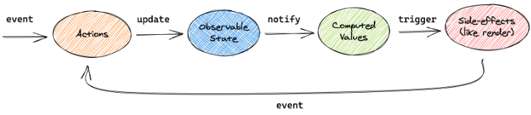

# MobX란?

Redux와 같은 `글로벌 상태관리 Tool`

# MobX 쓰는이유

`객체지향(OOP)` 기반이므로, Redux보다 코드가 더 간결해질 수 있다.

# MobX 흐름

</img>
action으로 state가 바뀌었을 때, `단방향`으로 데이터가 흐르게 된다. 그 결과 여향을 받는 view들이 update된다. event가 발생하면 action으로 observable을 변경한다. observable이 변경된 것은 그 값에 의존하고 있는 computed와 side effect에게 전달된다.

# MobX의 핵심 3가지

## 1. state: MobX가 추적하게 되는 데이터

state가 계속 변하는 것을 MobX가 추적할 수 있도록 `observable`이라고 표기를 해줘야 한다.

```ts
import { makeObservable, observable, action } from 'mobx'

class Todo {
  id = Math.random()
  title = ''
  finished = false

  constructor(title) {
    makeObservable(this, {
      title: observable,
      finished: observable,
      toggle: action,
    })
    this.title = title
  }

  toggle() {
    this.finished = !this.finished
  }
}
```

## 2. action으로 state를 변경

action은 state를 변경하는 모든 코드를 의미한다. action을 표기해야하는 이유는 다음과 같다.

> MobX가 자동으로 최적화를 위하여 transactions을 적용하기 때문이다.

action을 사용하면 코드를 잘 구조화하는데 도움이 되며, 의도치 않게 state를 변경하는 것을 막아준다.

## derivation: 상태가 변경되었을 때 자동으로 호출

state로 부터 자동으로 도출될 수 있는 모든 것을 deriviation이라한다.
deriviation은 2가지로 구분이 가능하다.

1. Computed Value

   `순수함수`를 통해 현재 observable state로부터 도출될 수 있는 값

2. Reactions  
   state가 변경되었을 때, 자동으로 일어나게 되는 사이트 이펙트

- derivation 에서 알아야 할 점
  - 모든 derivation(computed, reaction)은 state가 변경되었을 때, `자동으로`, 그리고 `atomic`하게 업데이트된다. 즉, update중인 값을 observe할 수 없다.
  - 모든 derivation은 `동기적으로` 업데이트 되는 것이 기본이다. action이 state를 변경한 직후에, computed 값을 사용하여도,
    computed값은 action이 변경한 observable로 재계산된 값이다.

## computed를 사용하여 값 만들기

- JS getter 함수인 get를 사용해야한다.
- makeObservable안에서 computed라고 표기해주어야 한다.  
  computed 값은 `lazily update`된다. 즉, 사용되지 않는 computed값은 side effect(I/O)에 필요해질 때가지는 업데이트 되지 않는다.

```TS
import { makeObservable, observable, computed } from "mobx"

class TodoList {
    todos = []
    get unfinishedTodoCount() {
        return this.todos.filter(todo => !todo.finished).length
    }
    constructor(todos) {
        makeObservable(this, {
            todos: observable,
            unfinishedTodoCount: computed
        })
        this.todos = todos
    }
}
```

get이 있는 unfinishedTodoCount 함수는 computed 값을 만들어낸다. 이 함수는 observable이 변경되면 자동으로 update된다.

## reactions로 사이트 이펙트 만들기

reaction 또한 observable이 변경되면 자동으로 실행된다. reaction은 computed와는 다르게, 어떤 결과를 반환하는게 아니라 `side affect를 만들어내기`만 한다. (console.log 찍기, 네트워크 요청 등등...)

## reactive한 리액트 컴포넌트

observer로 리액트 컴포넌트를 감싸면, 컴포넌트를 reactive하게 만들 수 있다.

> observer converts React components into dreivations of the data they render

observer를 사용하면, 컴포넌트는 mobx가 랜더링 해야하는 derivation으로 만들어버린다. 즉, 불필요한 리렌더링을 막을 수 있다.

> MobX will simply make sure the components are always re-rendered whenever needed, and never more than that.

MobX가 스스로 component가 사용하는 observable이 변경될 때만 컴포넌트를 리렌더링한다. 이는 해당 component의 부모가 리렌더링 될때, 자식 componnent는 리렌더링하지 않아도 되는 경우, 리렌더링을 막아준다.

## 커스텀 reactions 만들기

autorun이나 reaction, when 함수를 사용하여 reaction을 만들 수 있다.  
reaction이 그 안에서 주시하고 있는 observable이나 computed의 값이 변할 때, reaction인 함수가 자동으로 실행된다.  
아래 코드는 todos.unfinishedTodoCount값이 바뀔 때마다 실행된다.

```js
// A function that automatically observes the state.
autorun(() => {
  console.log('Tasks left: ' + todos.unfinishedTodoCount)
})
```

이게 가능한 이유는 다음과 같다.

> MobX reacts to any existing observable property that is read during the execution of a tracked function.  
> 즉, MobX가 추적하고 있는 함수가 실행되는 동안, 사용되는 observable property에 반응을 하기 때문이다.

[참고링크](https://velog.io/@yejineee/MobX-%EC%BD%94%EC%96%B4-%EA%B0%9C%EB%85%90)
