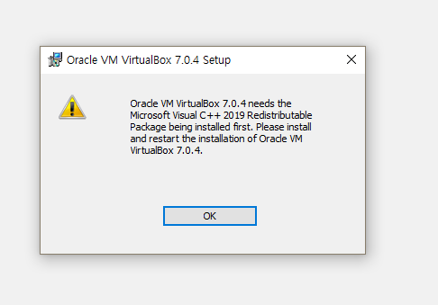
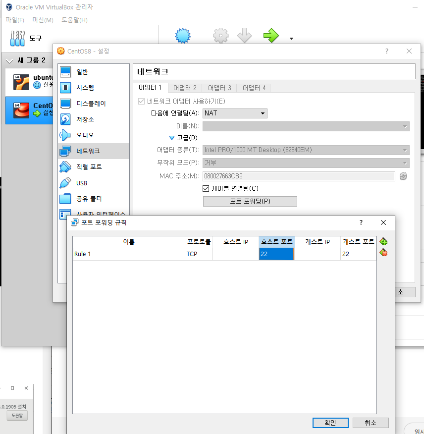
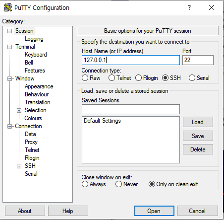

### [[Oracle] Linux RHEL 8.8에 Oracle Database 19c 설치 방법 총정리](https://acredev.tistory.com/62)  
  
Oracle Instance의 기본 설치 방법에 대해 공부하기 위해 VirtualBox 내에 RHEL 8.8 환경을 구성한 다음, `Oracle Database 19c`를 설치해봤다.  
설치 과정은 위의 글을 참고하였으며, 이번 글에선 해당 DB를 설치하면서 생겼던 문제점들 및 해결방법, 그리고 추가적으로 조사해본 내용들을 정리해봤다.

# Trouble Shooting

## 1. [Error] VirtualBox 설치 시, Visual C++ 2019 오류



위의 사진대로 Microsoft Visual C++ 2019를 설치하면 된다.  
설치 사이트 : [https://learn.microsoft.com/ko-kr/cpp/windows/latest-supported-vc-redist?view=msvc-170](https://learn.microsoft.com/ko-kr/cpp/windows/latest-supported-vc-redist?view=msvc-170)  

```bash
ARM64: 스마트폰, 태블릿PC의 CPU코어 설계 회사
X86: 32bit 윈도우즈 운영체제가 동작하는 CPU의 총칭.
X64: 64bit 윈도우즈 운영체제가 동작하는 CPU의 총칭.
```

## 2. Java 설치 오류

```bash
sudo subscription-manager register
sudo subscription-manager attach --auto
```

Red Hat Subscription Manager로 시스템을 등록해줘야한다.

```bash
sudo subscription-manager repos --enable=rhel-8-for-x86_64-baseos-rpms
sudo subscription-manager repos --enable=rhel-8-for-x86_64-appstream-rpms
```

관련 리포지토리들을 사용가능하도록 세팅해줘야한다.  

```bash
sudo yum clean all
sudo yum makecache
```

YUM 캐시들은 오래된 메타데이터를 담고 있을 수도 있어서, 캐시를 비워주는 것이 좋다.

```bash
sudo yum install java-1.8.0-openjdk
```

최종적으로 자바를 설치해준다.

## 3. wget compat-libstdc++ 오류

`404 Not Found Error` 가 떠버리는 이유는, CentOS 7이 EOL(End OF Life)에 도달하였기 때문이다. 

```bash
wget http://vault.centos.org/7.9.2009/os/x86_64/Packages/compat-libstdc++-33-3.2.3-72.el7.x86_64.rpm
```
CentOS Vault를 사용하기 위해 위와 같이 wget 명령어를 업데이트 해준다.

```bash
wget http://vault.centos.org/7.9.2009/os/x86_64/Packages/compat-libcap1-1.10-7.el7.x86_64.rpm
```
compat-libcap은 위 명령어를 사용한다.

```bash
sudo yum localinstall compat-libstdc++-33-3.2.3-72.el7.x86_64.rpm compat-libcap1-1.10-7.el7.x86_64.rpm
```
두 패키지 다운로드 완료 시, 위 명령어로 설치한다.

```bash
rpm -q compat-libstdc++ compat-libcap
```
패키지가 정상적으로 설치되었는지 최종 확인.

## 4. oracle 사용자의 홈 디렉토리 오류 

```bash
usermod -d /home/oracle oracle
```

위 명령어 이후에,
```bash
grep oracle /etc/passwd 의 결과는
oracle:x:65535:65535::/home/oracle:/bin/bash 이다.
```

## 5. X11 Forwarding 완료했는데도 firefox 명령어가 먹히지 않음

```bash
which firefox
```
위 명령어로 Firefox가 시스템에 설치되어있는지 확인한다. 결과가 빈 값이면, 설치되어 있지 않은 것이다.  
설치된 경우에도 경로가 `/usr/bin/firefox`와 같은 표준 위치에 있어야 실행된다.  

```bash
sudo dnf install firefox
```

위 명령어롤 통해 firefox를 설치해준다.

```bash
which firefox
```
다시 경로를 확인하여, 결과가 `/usr/bin/firefox`와 같은 값으로 반환되면 제대로 설치된 것 이다.

```bash
firefox &
```
X11 Forwarding이 제대로 작동하는지 확인하려면, 원격 서버에서 Firefox를 실행해본다.  
만약 여전히 실행되지 않거나, DISPLAY 관련 오류가 발생하면 X11 Forwarding 설정이 제대로 작동하지 않을 수 있다.

### 추가 문제 해결

a. DISPLAY 환경 변수 확인  
X11 Forwarding은 DISPLAY 환경 변수를 필요로한다. 로그인한 세션에서 DISPLAY가 설정되어 있는지 확인해야한다.

```bash
echo $DISPLAY
```
올바른 값이 없다면, SSH 연결 시 X 옵션을 사용했는지 확인하자.  
```bash
ssh -X user@remote-server
```

b. `xauth` 확인  
```bash
sudo yum install xauth
```

Firefox 설치 후 명령이 여전히 없을 경우엔, `/usr/bin` 이외의 디렉토리에 설치되었을 수도 있다.  
실행 파일 경로를 수동으로 찾아 PATH에 추가하기.

```bash
find / -name firefox 2>/dev/null
```
예를 들어, 결과가 `/opt/firefox/firefox` 라면, PATH에 추가한다.

```bash
export PATH=$PATH:/opt/firefox
```

## 6. dnf install firefox 이후에도, firefox 실행 오류

```bash
[root@oracle ~]# firefox
Couldn't open libGL.so.1: libGL.so.1: cannot open shared object file: No such file or directory
Redirecting call to abort() to mozalloc_abort

Segmentation fault (core dumped)
```

`libGL.so.1` 라이브러리르 못찾는다는 오류이며, 해당 라이브러리는 그래픽 렌더링에 필수적이다.  

```bash
sudo dnf install mesa-libGL
``` 
위 명령어로 필요한 라이브러리를 설치해준다.

```bash
find /usr -name libGL.so.1
```

위 명령어로 `libGL.so.1`이 시스템 내 있는지 확인.

```bash
sudo ldconfig
```
만약 라이브러리는 설치되어있지만, Firefox가 찾지 못한다면 dynamic linker cache를 위 명령어로 업데이트 해준다.


```bash
sudo yum install mesa-utils       # For RHEL 7
sudo dnf install mesa-utils       # For RHEL 8/9
glxinfo | grep OpenGL
```
OpenGL의 기능성을 glxinfo로 테스트 가능하다.  

## 7. oracle 파일 압축 후, `./runinstaller` 실행 오류

```bash
./runInstaller
./runInstaller: line 57: /oracle_db/oracle/product/db_home/bin/commonSetup.sh: No such file or directory
```

해당 오류가 뜨는 이유를 찾아보니, 오라클 파일 압축 해제 시 용량 부족으로 인해 파일이 누락되었을 수도 있다는 걸 깨달았다.  
디스크를 추가해서 용량을 확보하는 방법을 시도.  

### 1. Virtual BOx에 디스크 추가 

저장소 메뉴에서  
컨트롤러 -> SATA 칸에 디스크 추가

### 2. 서버에서 다음 명령어 수행

```bash
[root@oracle oracle]# lsblk
NAME   MAJ:MIN RM  SIZE RO TYPE MOUNTPOINT
sda      8:0    0   20G  0 disk
|-sda1   8:1    0   19G  0 part /
-sda2   8:2    0    1G  0 part [SWAP]
sdb      8:16   0   20G  0 disk
sr0     11:0    1 11.7G  0 rom
```
Virtual box 디스크를 추가한 이후의 상태이다.  
추가된 디스크 `sdb` 가 제대로 인식되어있으니, 이제 이 디스크를 사용할 준비를 해야한다. 아래 단계를 따라 진행하자.

```bash
fdisk /dev/sdb
```
먼저, 새로운 디스크 `sdb`에 파티션을 만들어준다.  

- n : 새 파티션 생성 (new partition)
- p : 기본 파티션 생성 (primary partition)
- 1 : 첫 번째 파티션 번호 선택.
- 기본 값을 계속 입력해 전체 디스크 크기를 할당.
- w : 변경 사항을 저장하고 종료.  

```bash
mkfs.ext4 /dev/sdb1
```

생성된 파티션에 파일 시스템을 포맷한다. 일반적으로 `ext4`를 사용한다.  

```bash
mkdir -p /oracle_db2
```
Oracle 설치 파일을 저장할 디렉터리를 만들어준다.

```bash
mount /dev/sdb1 /oracle_db2
```

새로운 디스크를 `/oracle_db2` 디렉토리에 마운트한다.  
마운트 후, 정상적으로 동작하는지 확인.  

```bash
df -h
```
`/oracle_db2` 가 표시되면 성공.  
부팅할 때 디스크가 자동으로 마운트되도록 설정할 수 있다. `/etc/fstab` 파일을 편집한다.

```bash
echo "/dev/sdb1 /oracle_db2 ext4 defaults 0 0" >> /etc/fstab
```
변경 후, fstab 설정이 유효한지 확인한다.

```bash
mount -a
```

Oracle 설치 파일을 새로운 경로(꼭 /oracle_db2일 필요는 없다)에 복사한 뒤 압축 해제.  

```bash
mv /oracle_db/oracle/product/db_home/LINUX.X64_193000_db_home.zip /oracle_db2/
cd /oracle_db2
unzip LINUX.X64_193000_db_home.zip
```

압축 해제 후, `/oracle_db2`에서 설치 시작

```bash
./runInstaller
```

## 8. 디스크 증설 이후, oracle 그룹 지정 필수! 하지만, noexec 옵션 오류 발생

oracle 설치는 oracle 유저만 할 수 있기 때문!

`mount | grep /oracle_db2` 명령어로 확인한 결과, `/oracle_db2` 파일 시스템에 `noexec` 옵션이 나타나지 않으며, 올바르게 마운트된 것으로 보인다. 그럼에도 불구하고 여전히 `Permission denied` 에러가 발생한다면, 다른 문제일 가능성 존재.  

```bash
sudo chmod +x /oracle_db2/runInstaller
```

파일에 실행 권한을 다시 설정해준다.

```bash
getenforce
```
SELinux가 활성화되어 있다면, 보안 정책 때문에 실행이 차단될 수 있다.  
상태를 확인하고, 필요한 경우 비활성화하면 된다.  
출력 결과가 `Enforcing` 이라면, SELinux가 활성화된 상태이다. 임시로 SELinux 를 비활성화하려면, 다음 명령어를 실행하면 된다.  

```bash
sudo setenforce 0
```  
이 명령어는 SELinux를 임시로 `Permissive` 모드로 변경하여 설치를 진행할 수 있게 한다. 설치 후에는 `SELinux`를 다시 활성화 할 수 있다.

```bash
sudo setenforce 1
```

### 파일 시스템의 사용자 및 그룹 권한 확인
```bash
ls -l /oracle_db2/runInstaller
```
파일의 소유자와 그룹이 oracle 사용자와 맞지 않을 수 있다. `ls -l` 명령어로 파일의 소유자와 그룹을 확인하고, `oracle` 사용자로 권한을 변경한다.  
파일의 소유자가 oracle 사용자와 그룹이 아닌 경우, 아래 명령어로 권한을 수정한다.
```bash
sudo chown oracle:oinstall /oracle_db2/runInstaller
```

### 파일 시스템 캐시 재시작
마운트 캐시나 파일 시스템 캐시 문제가 있을 수 있다. 이를 해결하려면 시스템 재부팅을 하면 된다.

```bash
sudo reboot
```
### 디스크 공간 확인
```bash 
df -h
```
여유 공간이 충분한지 확인하고, 디스크 용량이 부족한 경우 불필요한 파일 삭제.  

## 9. No X11 DISPLAY

이 오류는 X11 그래픽 환경이 없거나 올바르게 설정되지 않아 발생한다. `runInstaller` 가 GUI 기반 설치 프로그램이기 때문에 X11 환경이 필요하다. 

### 1. X11 포워딩 활성화 (만약 원격 접속을 통해 실행 중이라면)

```bash
ssh -X oracle@oracle_host
```

### 2. X11 환경 설치 확인 (서버에 X11이 설치되어 있지 않은 경우)

```bash
sudo yum groupinstall "X Window System"
sudo yum install xorg-x11-xauth xorg-x11-apps
```

### 3. Xvfb 사용 (가상 프레임버퍼로 실행)

서버에서 GUI가 필요하지만 그래픽 환경을 사용할 수 없는 경우, `Xvfb` (X Virtual Frame Buffer)를 사용하여 가상 디스플레이 환경을 만들어 실행할 수 있다.
```bash
sudo yum install Xvfb
Xvfb :1 -screen 0 1024x768x16 &
export DISPLAY=:1
./runInstaller
```

### 4. 터미널에서 GUI 설치 없이 텍스트 모드로 설치

```bash
./runInstaller -silent -responseFile /path/to/response/file
```

response file 은 미리 정의된 설정을 가진 파일로, 설치에 필요한 모든 옵션을 사전에 지정해 놓을 수 있다. 이 파일은 Oracle 설치 가이드에서 제공된다.

### 5. 현재 세션에서 DISPLAY 환경 변수 설정 확인

```bash
export DISPLAY=:0
```

## 9. 증설한 공간인 oracle_db2 -> 여기서도 runInstaller 실행 시 오류 발생
```bash
[oracle@oracle oracle_db2]$ ./runInstaller
ERROR: Unable to verify the graphical display setup. This application requires X display. Make sure that xdpyinfo exist under PATH variable.
ERROR: Unable to continue with the setup. Ensure user (oracle) has execution permission over software home (/oracle_db2).
```

위 항목들을 참고하여, oracle 유저 및 그룹 지정, 그리고 실행 권한을 주면된다.  

### 1. /oracle_db2 권한 확인

```bash
ls -ld /oracle_db2
```
위 명령어로 `ownership` 및 `permission` 확인

```bash
drwxr-xr-x 2 oracle oracle 4096 Dec 5 10:00 /oracle_db2
```
위 예시 결과처럼 나올 것이다.  


### 2. ownership 및 permission 수정

```bash
sudo chown -R oracle:oracle /oracle_db2
sudo chmod -R u+rwx /oracle_db2
ls -ld /oracle_db2
```

위의 명령어로 조치 후, 결과를 확인한다. 예상 결과는 다음과 같다.

```bash
drwxrwxr-x 2 oracle oracle 4096 Dec 5 10:00 /oracle_db2
```

### 3. Files 와 Subdirectories 확인

```bash
ls -l /oracle_db2
```
위의 경로 내 모든 파일과 하위 디렉토리들이 적합한 권한을 가지고 있는지 확인해준다.  
단 하나의 파일 혹은 경로가 `oracle` 소유권 혹은 실행 권한이 부족하다면 다음 명령어를 통해 해결한다.
```bash
sudo chown -R oracle:oracle /oracle_db2
sudo chmod -R u+rwx /oracle_db2
```

그리고 다시 `runInstaller`를 실행해보자.

### 계속 오류가 난다면?

1. 설치 디렉토리 위치 다시 한 번 더 확인

2. Mount Option 확인

만약 `/oracle_db2` 가 제한된 옵션들로 mounted 되어있다면, 실행을 막을 수도 있다.  
다음 명령어 입력.

```bash
mount | grep /oracle_db2
```

만약 결과가 `noexec` 라면, filesystem를 다음과 같이 remount 해준다.
```bash
sudo mount -o remount,exec /oracle_db2
```

## 10. runInstaller 드디어 실행 완료. 하지만, 다음 오류 발생

```bash
[INS-08101] Unexpected error while executing the action at state: 'supportedOSCheck'
```

[[INS-08101] Unexpected error while executing the action at state: 'supportedOSCheck'](https://positivemh.tistory.com/486)

해결방법 : CV_ASSUME_DISTID 값을 설정

```bash
$ export CV_ASSUME_DISTID=RHEL8.8
$ ./runInstaller
```

RHEL 버전에 맞게 바꾸고 위의 명령어 실행

# Today I've Learned

## 1. Putty로 Linux Server 원격 접속

Putty란, SSH(Secure Shell)나 Telnet에 원격으로 접속 가능한 프로그램이다. 보통 리눅스 서버 접속을 위해 사용한다.  
즉, 클라이언트가 Linux 서버 접속을 위해서는 `서버에는 SSH가 설치`되어 있어야하며, `클라이언트에는 putty` 라는 원격 프로그램이 설치되어있어야 한다.  

### 1. SSH 서버 설치 확인

```bash
rpm -qa | grep [패키지명]
```
설치된 패키지를 확인하는 명령어.  
cf) RPM : "Redhat Package Manager"의 약자이며, RHEL 에서만 쓸 수 있는 패키지 인스톨  

```bash
ps -ef | grep ssh 
```
서버에서 실행되고 있는 프로그램명 확인


### 2. Putty 설치
[Putty 설치링크](https://www.chiark.greenend.org.uk/~sgtatham/putty/)  

### 3. Virtual box 네트워크 설정

Virtual box에서 사용 중인 RHEL 인스턴스의 설정 - 네트워크를 들어가서 다음에 연결됨을 `NAT`로 설정해준다.    
  

  
그 다음엔 고급 -> 포트포워딩 -> 호스트 22 / 게스트 22 설정

### 4. Putty 원격접속
  

  
자기 자신을 나타내는 `127.0.0.1` 로 테스트하면 된다.
해당 주소는 루프백 IP 주소로, 주로 포트포워딩 설정 테스트할 때 사용하는 IP이다.

# References

- [[Error] VirtualBox 설치 시, Visual C++ 2019 오류](https://olppaemmit.tistory.com/216)
- [[Linux/CentOS 8] Putty 원격 접속](https://awesomek.tistory.com/entry/Linux-CentOS-8-Putty-%EC%9B%90%EA%B2%A9-%EC%A0%91%EC%86%8D)

## 2. usermod -d
-d 옵션이 궁금하여 찾아봤다.

[Linux - 사용자 계정 관리 명령어 : usermod](https://ohaengsa.tistory.com/entry/Linux-%EC%82%AC%EC%9A%A9%EC%9E%90-%EA%B3%84%EC%A0%95-%EA%B4%80%EB%A6%AC-%EB%AA%85%EB%A0%B9%EC%96%B4-usermod)  

```bash
-d : 사용자의 홈 디렉토리 변경
```

## 3. $ORACLE_HOME과 \\$ORACLE_HOME의 차이?

```bash
[oracle@oracle db_home]$ unzip $ORACLE_HOME/LINUX.X64_193000_db_home.zip
[oracle@oracle db_home]$ unzip \$ORACLE_HOME/LINUX.X64_193000_db_home.zip
```

위의 명령어 중, 첫번쨰 줄 처럼 쓰던 와중 tab키를 누르니 역슬래시가 생성되었다. 두 구문의 차이점을 찾아봤다.  
### 1. $ORACLE_HOME


```bash
export ORACLE_HOME=/oracle_db/oracle/product/db_home
```
만약 환경변수가 설정되어 있다면,   
```bash
unzip $ORACLE_HOME/LINUX.X64_193000_db_home.zip
unzip /oracle_db/oracle/product/db_home/LINUX.X64_193000_db_home.zip
```

위 명령어에서, 두 줄은 같은 의미를 뜻한다.

### 2. \\$ORACLE_HOME

백슬래시(\\) 덕분에, `$` 문자를 탈출하게 된다. 다시 말해, `$ORACLE_HOME` 자체를 하나의 문자열로 취급해버린다.