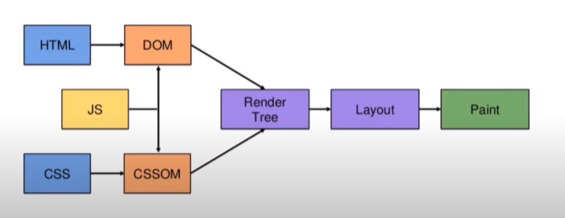
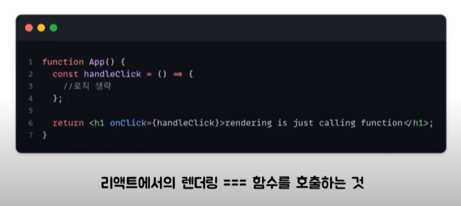
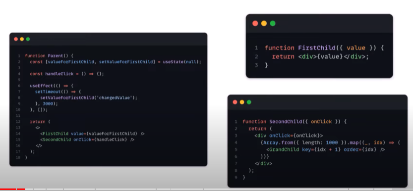
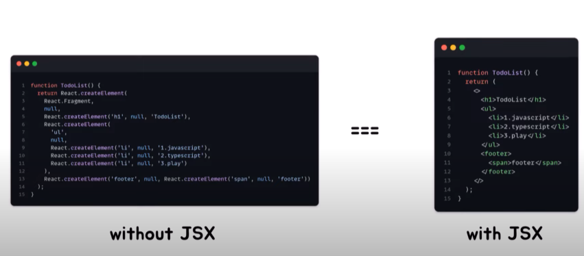
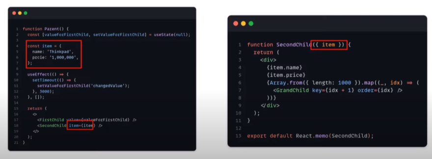

유튜브의 우아한테크 코스에서 `[10분 테코톡] 앨버의 리액트 렌더링 최적화` 영상을 보고 정리한 내용입니다.

# 리액트에서의 렌더링이란?

먼저, 브라우저의 렌더링 과정이다.

  
HTML를 파싱해서 DOM를 만들고, CSS를 파싱해서 CSSOM 를 만든다. DOM과 CSSOM를 통해 Render Tree를 만들고, Layout과 Paint 과정을 거쳐서 브라우저에 렌더링한다.

리액트에서의 렌더링은 `함수를 호출하는 것`이다.  
  
App 함수를 호출하여 내부 로직을 수행하고, return 문을 통해 리액트 Element 를 반환하는 것이다.  
다음은 영상에서 활용된 예시코드이다.  
  
Parent의 state, 혹은 FirstChild와 SecondChild 의 props가 변경되면 리렌더링, 즉 Parent 함수가 호출이 되고, return 문을 통해 FirstChild와 SecondChild 함수가 호출이 된다.  
여기서, SecondChild의 onClick 함수는 변경이 되지 않아서 리렌더링이 불필요하다.

# 렌더링 최적화 방법

React Developer Tools의 `Profiler`를 통해 렌더링 되는 절차를 확인할 수 있다.  
앞서 발생하는 불필요한 리렌더링을 해결하기 위해서는 `리렌더링 되는 조건`을 알아야한다. state가 바뀌었을 때, 혹은 props가 바뀌었을 때이다.  
부모로 부터 변하지 않은 onClick 함수를 props로 전달받는 것 같지만, `참조값`이 달라졌기 때문에 리렌더링 되는 것이다. 그 이유는, Parent 컴포넌트가 리렌더링 될 때마다 onClick 함수가 새로 생성되기 때문이다. 함수는 참조 타입의 데이터이기 때문에 다르다고 인식이 된다.

## useCallback

> 함수의 참조값을 유지해주는 훅이다.

함수를 `메모이제이션` 해주는 훅이고, 여기서 메모이제이션이란 기존에 수행한 연산의 결과값을 어딘가에 저장하고 필요할 때 마다 가져다 쓰는 것을 말한다.

```js
function Parent() {
  const [valueForFirstChild, setValueForFirstChild] = useState(null)

  const handleClick = useCallback(() => {}, [])

  setTimeout(() => {
    setValueForFirstChild('changedValue')
  }, 3000)

  return (
    <>
      <FirstChild value={valueForFirstChild} onClick={handleClick} />
      <SecondChild onClick={handleClick} />
    </>
  )
}
```

useCallback의 의존성 배열 안의 값이 바뀌지 않는 이상, handleClick 함수는 한 번만 생성된다.  
리렌더링이 되지 않을 것이라 예상했지만, 결과는 그렇지 않다.

```js
function Parent() {
  const [valueForFirstChild, setValueForFirstChild] = useState(null)
  const handleClick = useCallback(() => {}, [])

  setTimeout(() => {
    setValueForFirstChild('changedValue')
  }, 3000)

  return React.createElement(
    React.Fragment,
    null,
    React.createElement(FirstChild, {
      value: valueForFirstChild,
      onClick: handleClick,
    }),
    React.createElement(SecondChild, {
      onClick: handleClick,
    }),
  )
}
```

위의 코드는 Parent 컴포넌트가 Babel로 컴파일된 결과이다. 여기서 `React.createElement`는 새로운 리액트 엘리먼트를 만들어주는 함수이다.  
  
개발자들이 편하게 사용할 수 있도록 만들어진 JSX 문법을 통해 사용하더라도 결국엔 `React.createElement` 함수를 호출하는 것이다. 그래서, `useCallback`을 사용해도 리렌더링이 발생하는 것이다.  
그렇다면, useCallback은 아무런 도움이 되지 않는 것인가? 그렇지 않다.

## 리액트 렌더링 - Render, Commit Phase

리액트에서의 렌더링은 총 두 단계로 나누어진다.

1. Render Phase

   컴포넌트(함수) 호출하고, React Element를 반환한다. 그리고 새로운 Virtual DOM 를 생성해준다. 만약 첫번째 렌더링이 아니라면, 이전 Virtual DOM 과 비교를 해서 변경된 부분을 체크해준다. 이 과정을 `재조정(Reconciliation)`이라고 한다.

2. Commit Phase

   Render Phase에서 체크한 변경된 부분을 실제 DOM에 반영해주는 단계이다. 만약, 변경이 필요한 부분이 없다면 아무런 작업을 하지 않는다.

즉, render phase는 실행되지만, useCallback을 사용한 덕에 props 값을 이전과 같게 유지해주어서 commit phase는 실행되지 않게끔 해준 것이다. 그래서 어느정도 최적화가 되었다고 볼 수 있다. 하지만, render phase 까지도 실행되지 않게끔 해주고 싶다. 그럴 때는 `React.memo`를 사용하면 된다.

## React.memo

> 컴포넌트의 props가 변경되지 않았다면 리렌더링을 방지해주는 훅이다.

기본적으로 `얕은 비교`를 사용하여 props를 비교한다. 얕은 비교란, 원시타입의 데이터인 경우는 값이 다른지 비교하고, 참조타입의 데이터인 경우는 참조값이 다른지 비교하는 것을 말한다.

```js
import GrandChild from './GrandChild'

function SecondChild({ onClick }) {
  return (
    <div>
      <GrandChild onClick={onClick} />
    </div>
  )
}

export default React.memo(SecondChild)
```

위처럼 React.memo로 감싸주면, SecondChild의 Render Phase 마저 실행되지 않게 된다. 따라서, Profiler 에서도 렌더링이 발생하지 않는 것을 확인할 수 있다.

## 객체를 props로 넘겨주게 된다면?

  
변하지 않는 item 객체를 SecondChild 컴포넌트의 props로 넘겨주게 되면, 어떻게 될까?  
아쉽게도 Parent 컴포넌트가 리렌더링 될 때마다 item 객체가 새로 생성되기 때문에, SecondChild 컴포넌트는 리렌더링이 발생한다. item은 매번 다른 참조값을 지니게 된다. 여기서 사용할 수 있는 훅이 바로 `useMemo`이다.

## useMemo

> 값에 대한 메모이제이션을 제공해주는 훅이다.

의존성 배열에 들어있는 값이 달라지지 않는 이상, 매번 같은 값을 반환해주는 훅이다.

```js
function Parent() {
  const [valueForFirstChild, setValueForFirstChild] = useState(null)

  const item = {
    name: 'Thinkpad',
    price: 1000000,
  }

  const memoizedItem = useMemo(() => item, [])

  setTimeout(() => {
    setValueForFirstChild('changedValue')
  }, 3000)

  return (
    <>
      <FirstChild value={valueForFirstChild} />
      <SecondChild item={memoizedItem} />
    </>
  )
}
```

다음과 같이 useMemo를 사용해주면, item 객체는 매번 새로 생성되지 않고, memoizedItem에 할당된 참조값이 변하지 않기 때문에, SecondChild 컴포넌트는 리렌더링이 발생하지 않는다.

# 결론

## useCallback, useMemo, React.memo를 모든 곳에서 사용해주면 좋을까?

모두 하나의 코드라고 볼 수 있어서, 사용할 때마다 비용이 발생한다. 아직까지도 많은 FE 개발자들이 하고 있는 고민이다.

## 최적화 도구들을 사용하기 전에 근본적인 코드 개선

다음과 같이 코드를 개선할 수 있다.

```JS
function Component() {
	const forceUpdate = useForceUpdate()

	return (
		<>
			<button onClick={forceUpdate}>force</button>
			<Consoler value="fixedValue" />
		</>
	)
}
```

부모 컴포넌트가 리렌더링 되면, 고정된 props를 가진 Consoler 컴포넌트가 리렌더링 되는 것을 확인할 수 있다. Consoler 컴포넌트가 리렌더링 되지 않게 리팩토링을 할 수 있다. `children props`를 사용하여 다음과 같이 작성해줄 수 있다.

```js
function Component({ children }) {
  const forceUpdate = useForceUpdate()

  return (
    <>
      <button onClick={forceUpdate}>force</button>
      {children}
    </>
  )
}

function App() {
  return (
    <div>
      <Component>
        <Consoler value="fixedValue" />
      </Component>
    </div>
  )
}
```

이와 같이 리팩토링 해주면 Consoler 컴포넌트가 리렌더링 되지 않게 된다. babel로 컴파일된 결과를 보면 다음과 같기 때문이다.

```js
function Component({ children }) {
  const forceUpdate = useForceUpdate()

  return React.createElement(
    React.Fragment,
    null,
    React.createElement(
      'button',
      {
        onClick: forceUpdate,
      },
      'force',
    ),
    children,
  )
}
```

부모 컴포넌트의 return 문에서 children에 대한 createElement가 없기 때문에, Consoler 컴포넌트는 리렌더링 되지 않는다. 이렇게 최적화도구를 사용하지 않고 리팩토링을 통해 최적화를 할 수 있다.

# 마무리

> Don't optimize rendering prematurely, do it when needed.

미리 렌더링 최적화를 하지 마라, 필요할 때 해라.  
FE 개발을 하면서 이를 염두에 두고 코드를 작성해야겠다. 렌더링 최적화를 하기 위해 코드를 작성하다보면, 코드가 복잡해지고, 가독성이 떨어지는 경우가 많다. 그렇기 때문에, 렌더링 최적화를 하기 전에 `근본적인 코드 개선`을 먼저 해주는 것이 좋다.
