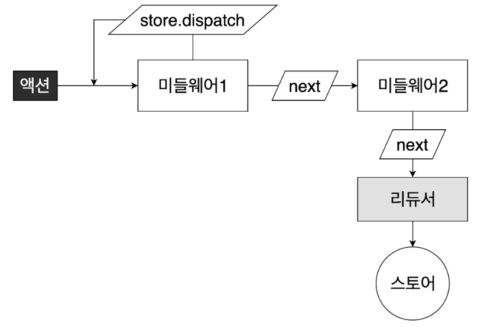

# 리덕스 미들웨어의 효과

액션이 디스패치 된 다음, 리듀서에서 해당 액션을 받아와서 업데이트 하기 전에 `추가적인 작업` 을 할 수 있다. 주된 사용 용도는 `비동기 작업` 을 처리하는 것 이다. 비동기 작업과 관련된 미들웨어 라이브러리는 `redux-thunk, redux-saga, redux-observable, redux-promise-middleware` 등이 있다. 주로 redux-thunk와 redux-saga가 많이 쓰인다.

# 미들웨어의 전체적인 실행 흐름

</img>

액션이 디스패치 된 다음, 리듀서에서 해당 액션을 받아와서 업데이트하기 전에 추가적인 작업을 할 수 있다.  
리덕스 미들웨어는 다음과 같은 형식을 따른다.

```js
const middleware = store => next => action => {
  // 하고 싶은 작업...
}

// 위 화살표 함수와 같은 코드

function middleware(store) {
  return function (next) {
    return function (action) {
      // 하고 싶은 작업...
    }
  }
}
```

`store` 는 리덕스 스토어 인스턴스이다. 이 안에 dispatch, getState, subscribe 등의 내장함수들이 있다.  
`next`는 액션을 다음 미들웨어에게 전달하는 함수이다. `next(action)` 이런 형태로 주로 사용한다. 미들웨어에서 `store.dispatch` 를 사용하면 다른 액션을 추가적으로 발생시킬 수 있다.

`action` 은 현재 처리하고 있는 액션 객체이다.

# redux-logger

다음과 같이 설치를 해주면 된다.

```bash
$ yarn add redux-logger
```

index.js에 다음과 같이 logger를 적용시켜줄 수 있다.

```js
// index.js

import React from 'react'
import ReactDOM from 'react-dom'
import './index.css'
import App from './App'
import * as serviceWorker from './serviceWorker'
import { createStore, applyMiddleware } from 'redux'
import { Provider } from 'react-redux'
import rootReducer from './modules'
import logger from 'redux-logger'

const store = createStore(rootReducer, applyMiddleware(logger)) // 여러개의 미들웨어를 적용 할 수 있다.

ReactDOM.render(
  <Provider store={store}>
    <App />
  </Provider>,
  document.getElementById('root'),
)

serviceWorker.unregister()
```

그러면 콘솔창에 prev state, action, 그리고 next state를 깔끔한 log로 확인이 가능하다.

# Redux DevTools 사용하기

다음과 같이 설치를 해준다.

```bash
$ yarn add redux-devtools-extension
```

그리고, 다음과 같이 index.js를 수정해준다.

```js
// index.js

import React from 'react'
import ReactDOM from 'react-dom'
import './index.css'
import App from './App'
import * as serviceWorker from './serviceWorker'
import { createStore, applyMiddleware } from 'redux'
import { Provider } from 'react-redux'
import rootReducer from './modules'
import logger from 'redux-logger'
import { composeWithDevTools } from 'redux-devtools-extension'

const store = createStore(
  rootReducer,
  composeWithDevTools(applyMiddleware(logger)),
) // 여러개의 미들웨어를 적용 할 수 있다.

ReactDOM.render(
  <Provider store={store}>
    <App />
  </Provider>,
  document.getElementById('root'),
)

serviceWorker.unregister()
```

그러면 Redux DevTool를 이용하여 상태 변화를 확인하고 직접 수정도 가능하다.

# redux-thunk

리덕스에서 비동기 작업을 처리할 때 가장 많이 사용하는 미들웨어이다. 액션 객체가 아닌 함수를 디스패치 할 수 있는게 특징이다.

# redux-saga

redux-thunk 다음으로 가장 많이 사용되는 라이브러리이다.

액션을 모니터링하고 있다가, 특정 액션이 발생하면 이에 따라 특정 작업을 하는 방식으로 사용을 한다.  
redux-saga는 redux-thunk 로 못하는 작업들을 수행할 수 있다.

1. 비동기 작업을 할 때 기존 요청을 취소 처리 할 수 있다.
2. 특정 액션이 발생햇을 때 이에 따라 다른 액션이 디스패치 되게끔 하거나, 자바스크립트 코드를 실행할 수 있다.
3. 웹 소켓을 사용하는 경우 Channel 이라는 기능을 사용하여 더욱 효율적으로 코드를 관리할 수 있다.
4. API 요청이 실패했을 때 재요청하는 작업을 할 수 있다.

# 참고링크

- [리덕스 미들웨어](https://react.vlpt.us/redux-middleware/)
