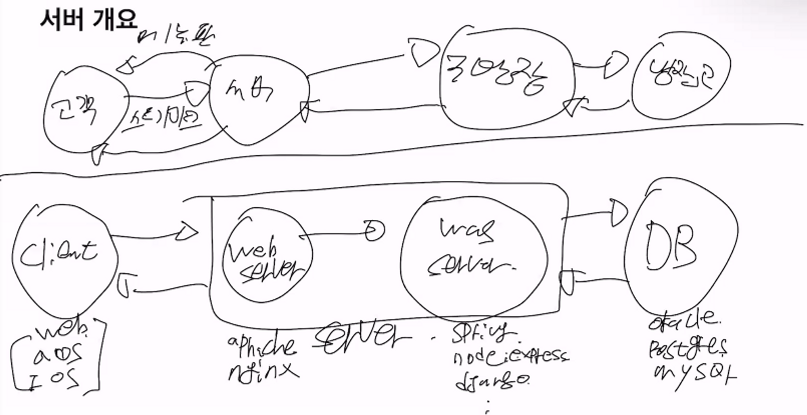
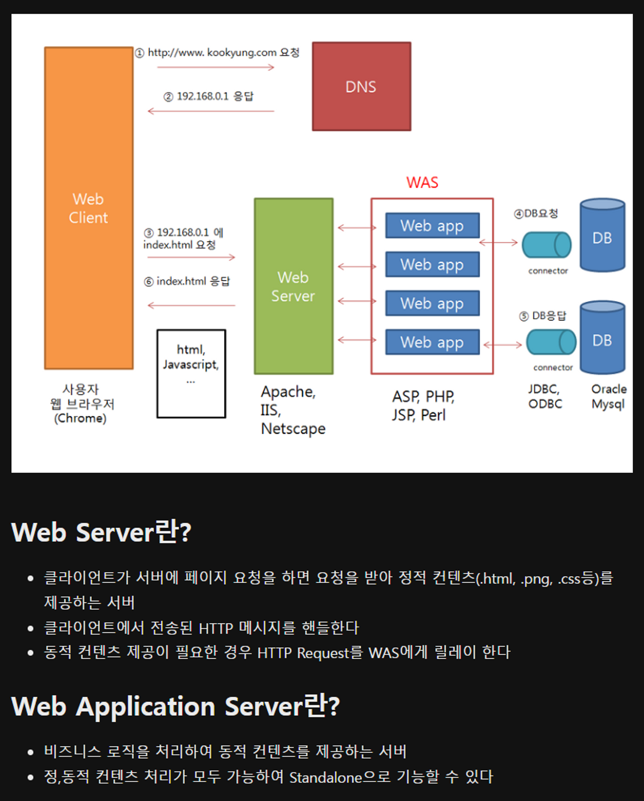
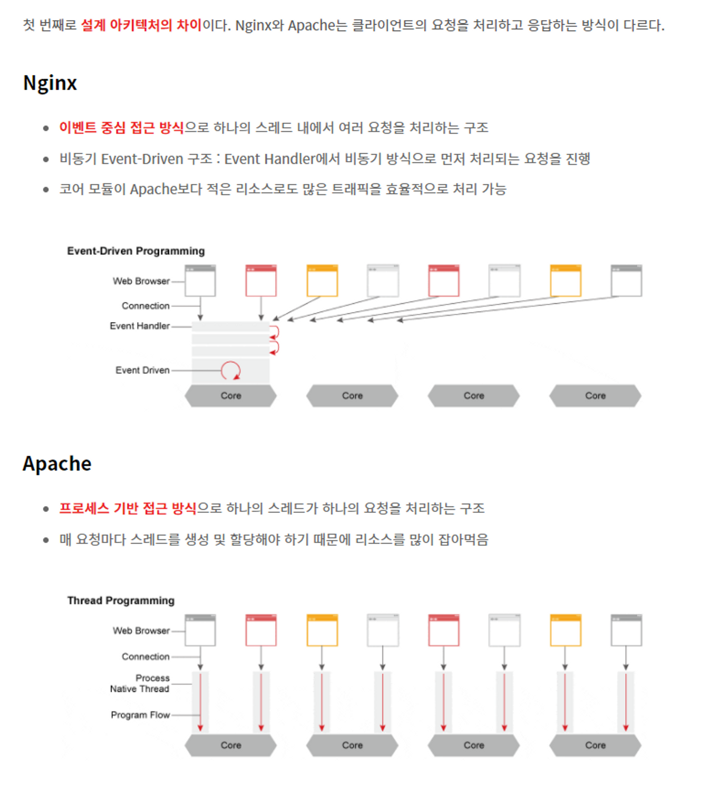
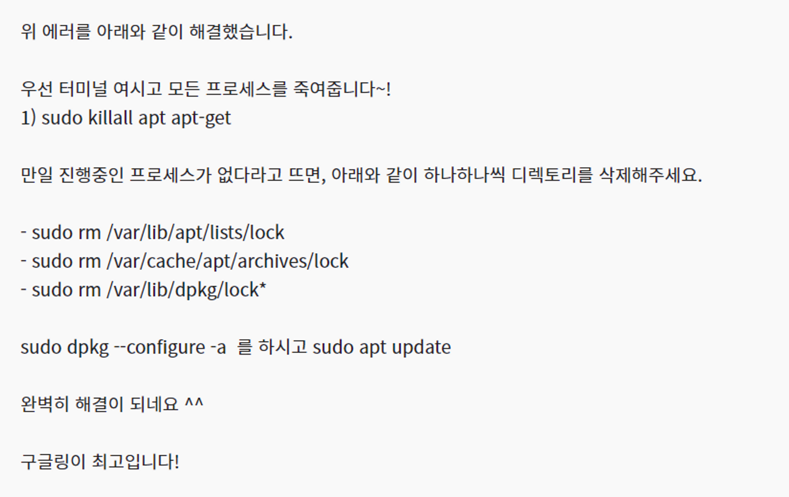

2022년 2학기, 9월부터 12월까지 UMC 동아리에서 Node JS 세미나 및 스터디를 진행하였다.  
방학이 된 지금, 드디어 배운 내용을 정리해보고자 한다. 많이 늦었지만, 최대한 그때의 기억을 되살려서 복습하면서 써봤다.

# 개념 키워드

## 서버와 서비스

Serv + er -> Server  
올바른 정보를 전달하는 역할을 하는 주체이다.  
서버의 역할은 누가 보느냐에 따라 달라지기 때문에 상대적이라 할 수 있다.  
`서비스`는 특정한 `요청`이 처리되는 전체적인 과정 혹은 방식

## 클라이언트 - 서버 관계
클라이언트 쪽에서 어떤 명령을 내리면, 그 명령 혹은 요청에 대한 결과를 전달해준다. 그림으로 표현하면 다음과 같다.    

  

Server는 크게 `Web Server와 WAS` 로 분류 가능하다.   

Web Server는 클라이언트가 서버에 페이지 요청을 하면 요청을 받아 정적 컨텐츠(.html, .png, .css등)를 제공하는 서버이다.  
WAS(Web Application Server)는 비즈니스 로직을 처리하여 동적 컨텐츠를 제공하는 서버이다.

  

Web Server 와 WAS의 기능을 분리하는 이유는 다음과 같다.  

- WAS의 비즈니스 로직은 DB에 접근해야 하는 경우가 많고, 이에 따라 수행 시간이 필요하기 때문에 정적 컨텐츠의 경우 웹 서버에서 제공하는 것이 로드 분산에 효율적이다.
- 웹 서버 없이 WAS에 직접 접근할 경우 WAS의 포트 번호가 노출되어 보안상 좋지 않다.
- 한 웹 서버에서 여러 WAS를 통해 서비스 함으로써 failover에 유리하도록 설계 가능하다.  
여기서 failover란, 장애 극복기능으로 컴퓨터 서버, 시스템, 네트워크, 등에서 이상이 생겼을 때 예비 시스템으로 자동전환되는 기능이다. 시스템 대체 작동 또는 장애 조치라고도 한다.

## 서버의 구조

### Server Program
여러 서버 프로그램이 존재하지만, UMC에선 `Apache`와 `Nginx`를 위주로 공부하였다.
> Nginx  

대용량 트래픽을 처리하기 위해 가벼움과 높은 성능을 목표로 하는 경량 웹 서버이다.  
클라이언트로부터 요청을 받았을 때 요청에 맞는 정적 파일을 응답해주는 HTTP Web Server로 활용되기도 하고,  
`Reverse Proxy Server` 로 활용하여 WAS 서버의 부하를 줄일 수 있는 `로드 밸런서`로 활용되기도 한다.  
여기서 로드 밸런서 란, 서버에 가해지는 부하(=로드)를 분산(=밸런싱) 해주는 장치 또는 기술을 말한다.  
Event Driven 구조로 동작한다. 즉, 한 개 또는 고정된 프로세스만 생성하여 사용한다.  
비동기 방식으로 요청들을 병행적으로 처리가능하다.  

> Apache

웹서버의 한 종류이자, Apache 재단에서 만든 HTTP 서버이다.  
구축이 쉽지만, Apache 자체만으로는 엄청 무겁고, Squid와 함께 Slowloris 취약점이 발견되었기에, 보통 프로그래밍 능력이 능숙한 사람들이나, 대형 사이트 운영자는 Nginx, IIS를 주로 사용한다.  
여기서 `Slowloris 공격` 이란, 단일 시스템이 최소한의 대역폭과 관련없는 서비스 및 포트에 대한 부작용을 발생시켜 웹 서버를 다운시키는 서버시 거부 공격이다.

> Nginx VS Apache



### Backend Language

> PHP

빠른 개발속도를 지니고, 기본적인 개발환경 세팅이 비교적 간단하다.  
하나의 파일에 HTML/CSS/JS 코드와 PHP 코드가 섞여 있으므로, 코드가 길어지면 코드를 읽기 힘들어진다.  
주로 중소규모 프로젝트에 적합하다.

> Java  

OOP(객체지향 프로그래밍) 언어이다. 유지보수가 용이하고, 대규모 프로젝트에 적합하다.  
`Spring Framwork`는 MVC 패턴, Dependency Injection 패턴을 사용하는 구조이다.  
Servlet, JSP 파일 등으로 구분하여 View는 JSP, Servlet은 Control, 그 외 Model Class를 작성하여 Model 역할로 나누어 MVC 패턴을 준수하는 구조이다.

> Node.js

JavaScript 런타임 환경  
가장 큰 특징은 바로 `비동기 처리방식`을 지닌다는 것 이다. throughput(시간당 처리량)이 가장 높다.  
처리 시간이 오래 걸리는 서비스에는 적합하지 않지만, 모바일 앱, 게임 백엔드 서버 구축 등에는 적합하다.

### DB, DBMS

> MySQL

전세계적으로 가장 널리 사용되고 있는 오픈 소스 데이터베이스 MySQL AB 사가 개발하여 배포/판매하고 있는 데이터베이스

> MSSQL

Microsoft SQL Server의 약어이다. 관계형 데이터베이스(RDBMS) 중 하나, 즉 데이터를 관계로서 표현하는 것이다.

> ORACLE  

Oracle Corporation 이라는 미국의 기업에서 만든 데이터베이스 관리 시스템

> MySQL vs MSSQL vs ORACLE

돈이 있는 곳은 오라클을 선호하고, 돈이 적거나 중소기업들은 대체로 MySQL을 선호하고, 전화기와 같은 장비 업체들이 서버를 윈도우로 둬야 해서 MSSQL을 사용하는 등, 크게 3가지로 주로 나뉜다.  
ORACLE이 대기업 위주로 많이 대중화되어있고, DB 튜닝 같은 작업이 수월하다.

### NoSQL (Not Only SQL)

기존의 관계형 DBMS가 갖고있는 특성 뿐만 아니라, 다른 특성들도 부가적으로 지원

> MongoDB

기존의 테이블 기반 RDBMS가 아닌 문서 지향 데이터 모델을 사용하는 교차 플랫폼 오픈 소스 데이터베이스  
비필수 스키마와 함께 JSON 과 같은 문서를 사용하여 대량의 데이터를 저장한다.

> Redis

Key, Value 구조의 비정형 데이터를 저장하고 관리하기 위한 오픈 소스 기반의 비관계형 데이터베이스 관리 시스템

> Cassandra

아파치 카산드라(Apache Cassandra)는 단일 장애 점 없이 고성능을 제공하면서 수많은 서버 간의 대용량의 데이터를 관리하기 위해 설계되었다.

## APM(Apache PHP MySQL)
Apache(버전 상관X) PHP(9.0 7.2 7.4) MySQL(5.8)  
ex) 
종업원 (손님맞이) / 주방장 / 냉장고  
APM은 `버전`을 많이 탄다.

## 가상머신(Virtual Machine)
하드웨어를 소프트웨어적으로 구현해서 그 위에서 운영체제가 작동하도록 하는 기술이다.
### Virtual Box
오라클에서 만든 가상머신 솔루션

### VMware
한 컴퓨터로 마치 여러 대의 컴퓨터를 사용하듯이 가상의 공간을 만들어주는 프로그램

### Linux, Ubuntu(16.04, 18.04, 20.04)
> Linux

Unix 기반의 OS. 무료이며 오픈소스이다.  
다양한 배포판이 존재한다. Redhat, CentOS, Debian, Fedora, Linux Mint 등이 있다.

> Ubuntu

리눅스 배포판 중 하나이다. 우분투 서버는 클라우드 및 서버에 적합하고 Ubuntu Core는 IoT 기반 장치를 개발하는데 적합하다.

> 유사점

둘 다 무료이며 오픈소스이다. 다중 사용자를 지원하고, 멀티 태스킹 및 멀티 쓰레딩을 허용한다. 다중 처리를 허용하고, 안전하고 안정적이다.

> 차이점  

리눅스는 리눅스 커널을 기반으로 구축된 무료 오픈 소프트웨어 운영 체제 제품군이다. 우분투는 데비안 기반의 무료 오픈 소스 운영체제 및 리눅스 배포판이다.  
리눅스가 핵심 운영체제이고, 우분투는 리눅스 배포본인 운영체제이다.  
리눅스는 개인용 컴퓨터, 게임 콘솔, 임베디드 시스템, 데스크톱 및 서버에 사용되고, 우분투는 주로 개인용 컴퓨터, 서버, 클라우드 컴퓨팅 및 IoT에 사용된다.

## 리눅스 명령어
[리눅스 명령어 모음 BEST 50](https://dora-guide.com/linux-commands/)

## 운영체제
컴퓨터 시스템의 자원들을 효율적으로 관리하며, 사용자가 컴퓨터를 편리하고 효과적으로 사용할 수 있도록 환경을 제공하는 여러 프로그램의 모임

# 미션

1. 본인의 컴퓨터에 서버(APM) 구축
2. Ubuntu에 Apache 소스 파일 설치

우선, Virtual Machine, Ubuntu를 설치해주었다. 그리고나서 VM위에 Ubuntu 운영체제를 구축하였다.  
APM 소스를 설치하는데 여기서 패키지를 사용하는 것이 아닌 소스 파일을 기반으로 설치를 해야했다.  
Apache, MySQL, PHP 를 설치하였고 phpinfo 페이지를 완성하였다.

# 트러블 슈팅 

> 1. vm에 ubuntu를 설치하였는데도 오류가 떴다.
```bash
drm:vmw_host_log [vmwgfx]] ERROR Failed to send host log message
```
위와 같은 오류가 떴다. 환경설정 > 디스플레이 > Graphics Controller를 VBoxVGA로 변경을 하여 해결을 하였다.

- 참고자료
[https://developyo.tistory.com/41](https://developyo.tistory.com/41)

> 2. 다음과 같은 오류 발생.
```bash
mtd device must be supplied (device name is empty)
```
이 문제는 도오오저히 해결이 안돼서, 22버전에서 `20버전`으로 바꿔서 다시 설치를 하니 해결이 되었다.

- 참고자료
[https://inpa.tistory.com/entry/LINUX-📚-리눅스-설치#우분투(리눅스)_OS_설치](https://inpa.tistory.com/entry/LINUX-📚-리눅스-설치#우분투(리눅스)_OS_설치)

> 3. Apache 설치를 위해 필요한 pcre 설치가 제대로 안되는 오류 발생
```bash
configure: error: Did not find working script at pcre-config
```

이 문제는 다음과 같이 해결해주었다.

```bash
--with-pcre=/usr/local/pcre
위 코드 대신 밑 코드로 변경
--with-pcre=/usr/local/pcre/bin/pcre-config
```
- 참고자료
[https://ppost.tistory.com/entry/우분투-APM-소스설치-시-일어나는-오류들-및-해결방안](https://ppost.tistory.com/entry/우분투-APM-소스설치-시-일어나는-오류들-및-해결방안)

> 4. 우분투에 Apache 설치중 발생한 오류
```bash
E: Could not get lock /var/lib/dpkg/lock-frontend - open (11: Resource temporarily unavailable) E: Unable to acquire the dpkg frontend lock (/var/lib/dpkg/lock-frontend), is another process using it?
```
위와 같은 오류를 다음과 같이 해결해주었다.  
  



- 참고자료
[https://kgu0724.tistory.com/71](https://kgu0724.tistory.com/71)

> 5. Windows에서 phpinfo 페이지가 안뜸
처음에는 메모장을 생성하여 제목을 phpinfo.php로 세팅하였는데 오류가 났다.  
Vscode 에디터로 직접 php 파일을 생성하니 해결이 되었다.

- 참고자료
[https://r-mango.tistory.com/9](https://r-mango.tistory.com/9)

> 6. Fatal error: Call to undefine dfunction mysqli_connect()
php.ini 파일의 UTF-8 인코딩 문제때문에 발생한 에러이다.  
ANSI 로 인코딩을 해주니 해결이 되었다.

- 참고자료
[https://foxtrotin.tistory.com/378](https://foxtrotin.tistory.com/378)


# 참고링크
- [https://velog.io/@ikswary/웹서버-구조](https://velog.io/@ikswary/%EC%9B%B9%EC%84%9C%EB%B2%84-%EA%B5%AC%EC%A1%B0)

- [https://velog.io/@wijihoon123/Nginx란-무엇인가](https://velog.io/@wijihoon123/Nginx%EB%9E%80-%EB%AC%B4%EC%97%87%EC%9D%B8%EA%B0%80)

- [https://ssaemo.tistory.com/350](https://ssaemo.tistory.com/350)

- [https://sorjfkrh5078.tistory.com/289](https://sorjfkrh5078.tistory.com/289)

- [https://lemontia.tistory.com/393](https://lemontia.tistory.com/393)