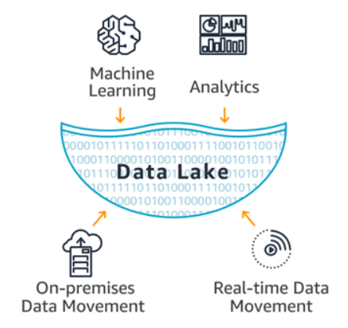

데이터 포털 웹 서비스 프로젝트 종료 시, 9월 1일부터 AWS Data Lake 구축에 대한 프로젝트를 진행할 예정이다. 이에 대한 사전 지식을 쌓기 위해, AWS Data Lake에 대한 정리를 해보았다.

# AWS Data Lake

데이터를 디지털 형식으로 변환할 수 있게 되면서 다양한 회사에서는 CRM(고객 관계 관리) 및 ERP(엔터프라이즈 리소스 관리) 시스템처럼 운영 체제의 데이터를 수집하는 데이터 웨어하우스를 구축하고 이 정보를 사용해 비즈니스 의사 결정을 지원할 수 있게 되었습니다.  
데이터 레이크의 개념은 모든 데이터를 하나의 중앙 리포지토리에 원하는 규모로 저장하는 것 입니다.  
  
Lake Formation은 데이터 레이크를 관리할 수 있는 콘솔을 제공합니다. 예를 들어 데이터베이스 및 로그 같은 여러 소스의 데이터를 데이터 레이크로 이동하는 작업을 구성할 수 있습니다. 이와 같이 많은 양의 다각적인 데이터를 보유할 때는 `적절한 액세스 권한을 구성하는 것도 중요`합니다.

# 참고자료

- [AWS Data Lake](https://aws.amazon.com/ko/blogs/korea/aws-lake-formation-now-generally-available/)
