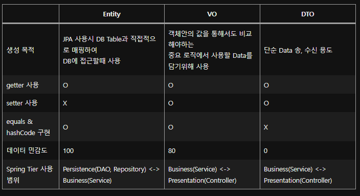

현장실습 떄 진행하는 데이터 포털 웹 서비스 프로젝트에서 모든 응답 관련 객체들을 DTO로 통일하고 있었다. 그런데, 말로만 듣던 Entity나 VO는 이럴 때 쓰는 거 아닌가? 라는 생각이 들어서 찾아보았다.

# Entity와 DTO 분리 이유

DB Layer와 View Layer 사이의 역할을 분리하기 위해서이다.  
DB Layer = Persistence Tier, View Layer = Presentation Tier 라고도 한다.  
Entity는 `실제 DB 테이블`과 매핑되어 만일 변경되게 되면 여러 다른 Class에 영향을 끼치고, DTO는 View와 통신하며 자주 변경되므로 분리해줘야 한다.  
결국 DTO는 Domain Model 객체(Entity)를 그대로 두고 복사하여, 다양한 Presentation Logic을 추가한 정도로 사용하며 Domain Model 객체(Entity)는 Persistent만을 위해서 사용해야한다.

# Entity

객체의 일관성을 최대한 유지시켜야 하므로, Setter 사용을 최대한 지양해야한다.

# VO

Value Object, 즉 말 그대로 값 객체이다. 핵심 역할은 equals()와 hashcode()를 오버라이딩 하는 것 이다.  
VO의 예제는 다음과 같다.

```JAVA
@Getter
@Setter
@Alias('example')
class exampleVO {
	private Long a;
	private String b;
	private String c;

	@Override
	public boolean equals(Object o) {
		if (this == o) return true;
		if (o == null || getClass() != o.getClass()) return false;
		exampleVO exampleVO = (exampleVO) o;
		return Objects.equals(a, exampleVO.a) && Objects.equals(b, exampleVO.b) && Objects.equals(c, exampleVO.c);
	}

	@Override
	public int hashCode() {
		return Objects.hash(a, b, c);
	}
}
```

# DTO(Data Transfer Object)

계층간 데이터 교환을 위한 객체이고, DB의 데이터를 Service나 Controller 등으로 보낼 때 사용하는 객체를 말한다. 또한, Controller Layer(View Layer)에서 Response DTO 형태로 Client에 전달한다.

# 정리

표로 정리해보면 다음과 같다.


# 참고링크

- [Entity, DTO, VO 차이](https://thenicesj.tistory.com/301)
- [Entity, DTO, VO 바로 알기](https://velog.io/@gillog/Entity-DTO-VO-%EB%B0%94%EB%A1%9C-%EC%95%8C%EA%B8%B0)
