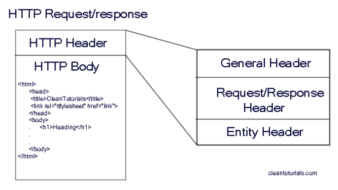
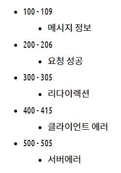

HTTP 통신 방식을 사용하여 데이터 포털 웹 서비스의 API 들을 호출하기로 하였다. 클라이언트와 서버, 그리고 API의 역할에 대해서 머릿속으로는 이해하고 있었지만, 정작 HTTP 헤더와 바디, 그리고 응답 코드에 대해서는 잘 몰랐다. 이번 기회에 HTTP 통신에 대해 정리해보고자 한다.

# HTTP 구조

HTTP 헤더와 바디로 구성되어 있다. 헤더는 `해당 메세지가 제공하는 기능에 대한 최소한의 정보가 정리된 요약본`이라고 할 수 있다. 바디는 `메세지에 대한 실제 내용`이다.  
HTTP 헤더는 크게 세 부분으로 구성되어 있다.

## General Header

전송되는 컨텐츠에 대한 정보보다는, 요청/응답이 이루어지는 날짜 및 시간등에 대한 일반적인 정보가 포함된다.

## Request/Response Header

Request Header는 웹 브라우저가 웹 서버에 요청하는 것을 텍스트로 변환한 메시지들이다.
Response Header는 웹 서버가 웹 브라우저에 응답하는 것을 텍스트로 변환한 메시지들이다.

## 응답 상태코드

## Entity Header

실제 주고 받는 콘텐츠와 관련된 http 보문에 대한 정도가 담겨져 있다.

# 참고링크

- [HTTP의 구조에 대해 이해하기(특히 Header 구조 파악하기)](https://hazel-developer.tistory.com/145)
