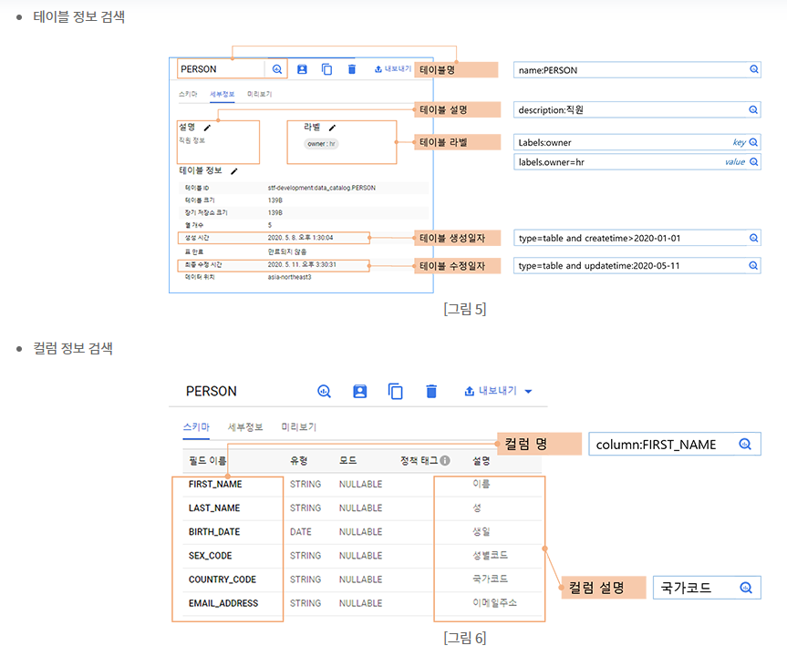

# 데이터 자산 관리의 중요성

오늘날 데이터의 중요성을 모르는 기업은 없다. 기업들은 아주 많은 데이터를 모아 분석하고, 그것을 기반으로 경영에 대한 의사 결정을 하기를 원한다. 그러나, 급격히 늘어나는 데이터를 잘 활용하는데에는 어려움이 있다. 대표적으로 데이터 이해관계자가 겪고 있는 문제는 다음과 같다.

- 원하는 데이터가 어디에 있는지 모른다.
- 중복된 많은 데이터 중 어떤 데이터가 최신인지 모르며, 누구에게 확인해야할지 알지 못한다.
- 데이터 제작자가 소비자를 위한 데이터에 대한 정보를 전달하기 어렵다. (데이터의 정확한 의미, 데이터의 사용 가능 여부, 데이터의 소유권 등)

그래서, Google Cloud는 이런 데이터 활용에 대한 어려움을 해결하고 데이터의 활용도를 높여줄 수 있는 도구로 `Data Catalog` 서비스를 제공하고 있다.

# Data Catalog 소개

> Google Cloud 내에 저장되어 있는 조직의 데이터 자산을 파악하고 관리할 수 있도록 도와주는 완전 관리형 메타데이터 관리 서비스

Data Catalog는 기업이 보유한 대규모 데이터를 중앙 집중식으로 관리하여, 효율적으로 활용할 수 있도록 한다.

# Data Catalog를 이용한 GCP 데이터 자산 관리

Data Catalog '탐색'과 '분류' 두 가지 간단한 방법으로 데이터를 자산화하고 이용할 수 있도록 한다.

## 탐색

메타데이터를 기반으로 데이터 자산을 탐색할 수 있다.

## 분류

태그 템플릿이라는 메타데이터 스키마를 정의하여 데이터 자산에 태깅.

# Data Catalog를 이용한 BigQuery 데이터 자산 탐색 및 분류

태깅된 정보(비즈니스 메타데이터)를 기반으로 탐색하는 방법을 알아보자.  
테이블 정보 검색과 칼럼 정보 검색은 다음과 같이 이뤄진다.

# 참고 자료

- [Data Catalog를 이용한 데이터 자산 관리](https://www.bespinglobal.com/data-catalog/)
