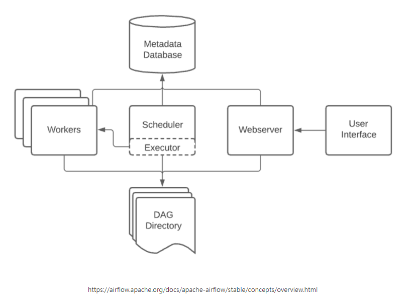
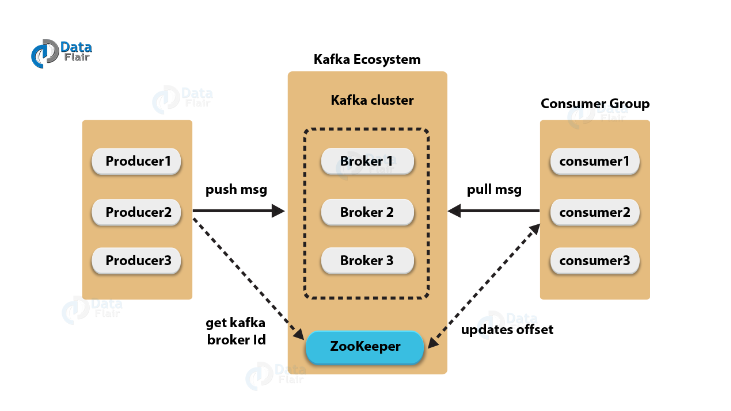

# 문제점

ElasticSearch 기능을 위한 테이블들이 향후 더 많이 추가될 경우, 점점 서비스 별로 사용하는 DB 데이터를 적재하고 통합하는 파이프라인을 관리하기 어려워질 거라 판단하였습니다. 이를 위해 포탈 서비스용 `통합 DB 파이프라인 구축` 방안을 마련해보기로 하였고, 두 가지 개선안의 개념 및 장단점을 조사해봤습니다.

# 개선안

## 1. ETL - Apache Airflow

### ETL Workflow 개념

`ETL(Extract, Transform, Load)` 은 여러 곳에 흩어져 있는 데이터를 추출하여 통합 DB에 적재하는 과정을 말합니다. 이를 위해 `Apache Airflow` 를 사용하여 ETL 파이프라인을 구축할 수 있습니다.

### Apache Airflow 개념

ETL 워크플로우를 편리하게 해주는 도구이며, `파이썬`을 사용하여 작성해야 합니다. 공식 문서에 따르면, `에어플로우`는 워크플로우를 프로그래밍적으로 작성하고 스케쥴링하고 모니터링하는 플랫폼이라 소개하고 있습니다.  
에어플로우에서는 작업해야하는 사항들을 `DAG(Directed Acyclic Graph)`라는 것을 통해 작성합니다. `DAG` 안에 여러 Task를 비순환적으로 연결시켜 스케쥴링하게 됩니다. 즉, 어떤 작업이 완료되면 어떤 작업을 실행시키겠다는 `작업 순서`를 정의하는 것입니다.

### Apache Airflow 구조

- Scheduler: 정의된 스케쥴에 따라 해당 작업 실행 명령을 내립니다. 실행할 작업은 Executor 에게 전달됩니다.
- WebServer: 웹 UI를 제공합니다. 웹 UI를 통해 DAG를 생성하고, 실행할 수 있습니다.
- Worker: 실제로 작업을 수행하는 프로세스입니다. Executor에 의해 실행됩니다.
- Executor: Worker를 실행시키는 역할을 합니다. Executor는 LocalExecutor, CeleryExecutor, KubernetesExecutor 등이 있습니다.
- Metadata Database: DAG 수행 기록 등 메타데이터를 저장하는 데이터베이스 입니다.

### 장단점

- 장점
  - 데이터 파이프라인을 세밀하게 제어할 수 있습니다.
  - 다양한 데이터 소스와 데이터 웨어하우스를 지원합니다.
  - `Backfill 절차`가 편리해집니다.
- 단점
  - DAG를 작성하기 위해 파이썬을 사용해야 하기 때문에, 파이썬을 모르는 사람들에게는 사용하기 어렵습니다.
  - 상대적으로 개발환경 구성이 어렵습니다.

## 2. CDC - Apache Kafka

### Kafka 개념

`카프카(Kafka)` 는 파이프라인, 스트리밍 분석, 데이터 통합 및 미션 크리티컬 애플리케이션을 위해 설계된 `고성능 분산 이벤트 스트리밍 플랫폼` 입니다.  
`Pub-Sub 모델의 메시지 큐` 형태로 동작하여 분산환경에 특화되어 있습니다.

### Kafka Architecture

- Topic: 메시지를 저장하는 논리적인 공간입니다. 카프카는 Topic을 기반으로 메시지를 저장하고, 메시지를 소비합니다.
- Partition: Topic을 나누는 물리적인 공간입니다. Topic은 여러 개의 Partition으로 나누어질 수 있습니다.
- Offset: Partition 내에서 메시지의 순서를 나타내는 값입니다. Offset은 메시지가 저장된 순서를 나타내며, 메시지가 저장될 때마다 1씩 증가합니다.
- Producer: 메시지를 생산하여 브로커의 토픽으로 전달하는 역할을 수행합니다.
- Broker: 카프카 애플리케이션이 설치되어 있는 서버 또는 노드를 지칭합니다.
- Consumer: 브로커의 토픽으로부터 저장된 메시지를 전달받는 역할을 수행합니다.
- Zookeeper: 분산 애플리케이션 관리를 위한 코디네이션 시스템이며, 분산된 노드의 정보를 중앙에 집중하고 구성관리, 그룹 네이밍, 동기화 등의 서비스를 수행합니다.

### 장단점

- 장점
  - 실시간으로 높은 처리량 및 고성능/분산/스케일 아웃에 용이합니다.
  - 스트리밍 데이터 처리가 필요한 경우에 적합합니다.
- 단점
  - 설정과 관리가 복잡합니다.
  - 메세지를 저장하기 위해 디스크를 사용하므로, 메세지를 읽고 쓰는 속도가 느립니다.

# 결론

포털 사이트 내에 등록된 `회사 서비스에서 사용되는 DB 데이터들의 메타 데이터화`한 후, `해당 메타 데이터를 통합 DB에 저장`, 그리고 `통합 DB기반 검색을 수행`하는 데이터 파이프라인이 최종적으로 완성되어야 합니다.  
최종 비교를 한 결과는 다음과 같습니다.

`Kafka`

- `메시지 큐 및 이벤트 스트리밍 플랫폼`입니다.
- 주로 `실시간 데이터 스트리밍 및 메시지 큐 역할`을 합니다.
- 변경 데이터를 실시간으로 캡처하고 전달할 때 좋습니다.
- 데이터의 높은 처리량이 필요할 때 유용합니다.
- 분산 아키텍처를 기반으로 하여 고가용성과 확장성을 제공합니다.

`Airflow`

- `워크플로 오케스트레이션 도구`로서, 작업들 간의 의존성을 관리하고 예약된 작업을 실행합니다.
- `일괄 처리 및 배치 작업에 적합`합니다.
- 시간 기반 또는 이벤트 기반 작업 스케줄링을 지원합니다.
- 다양한 데이터 소스와 대상 간의 ETL 작업을 관리할 때 유용합니다.
- 따라서 여기서 어떤 도구를 선택할지는 프로젝트의 성격과 요구사항에 따라 다를 것입니다.

`Kafka를 선택하는 경우`

- 데이터 파이프라인이 주로 `실시간 데이터 스트리밍`에 중점을 둘 때,
- 데이터 변경을 실시간으로 캡처하고 처리해야 할 때,
- 고가용성 및 확장성이 중요한 경우입니다.

`Airflow를 선택하는 경우`

- 데이터 파이프라인이 `일괄 처리 또는 일정 기반 작업 스케줄링`이 필요한 경우,
- ETL 작업이 다양한 데이터 소스와 대상 간에 이뤄져야 할 때,
- 작업들 간의 의존성을 정의하고 관리해야 할 때입니다.

실시간으로 데이터가 바뀌는 경우가 많지는 않다보니, 현재로서는 `일괄 처리 작업`을 `자동화` 하는 것이 더 중요하다고 판단하여 `Airflow`를 선택하였습니다.  
하지만, 두 도구를 혼용해서 사용할 수도 있으므로 향후에 실시간 데이터 스트리밍의 필요성이 점점 더 커질 경우엔 `Kafka`를 도입할 예정입니다.

# 참고링크

- [Apache Airflow, ETL Workflow 개념](https://mattpy.tistory.com/entry/Apache-Airflow-ETL-Workflow-%EA%B0%9C%EB%85%90)
- [Airflow](https://dataengineerstudy.tistory.com/141#AIRFLOW%20%EA%B0%9C%EB%B0%9C%EC%9D%98%20%EC%9E%A5%EB%8B%A8%EC%A0%90-1)
- [카프카란?](https://velog.io/@holicme7/Apache-Kafka-%EC%B9%B4%ED%94%84%EC%B9%B4%EB%9E%80-%EB%AC%B4%EC%97%87%EC%9D%B8%EA%B0%80)
- [Apache Kafka](https://velog.io/@jaehyeong/Apache-Kafka%EC%95%84%ED%8C%8C%EC%B9%98-%EC%B9%B4%ED%94%84%EC%B9%B4%EB%9E%80-%EB%AC%B4%EC%97%87%EC%9D%B8%EA%B0%80#kafka-vs-rabbitmq-vs-google-cloud-pubsub)
- [카프카의 장단점](https://pinggoopark.tistory.com/789)
