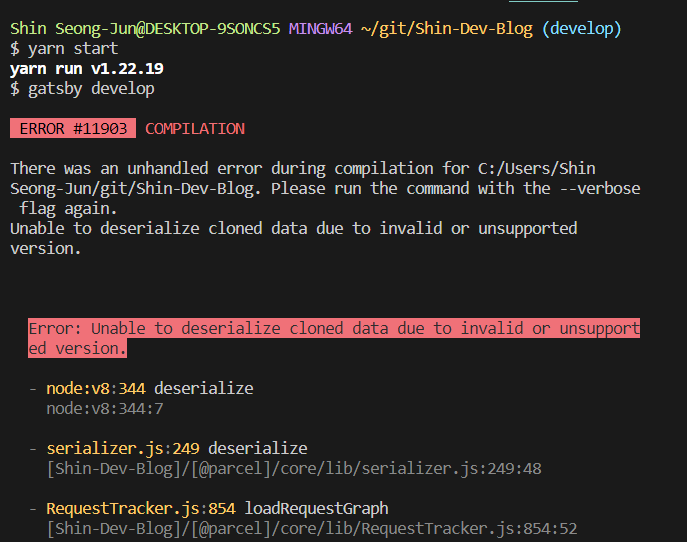

# yarn start 오류

다음과 같은 오류가 발생하였다.  

# 해결방법

[Node.js 및 npm 완전 삭제 및 재설치](https://unit-15.tistory.com/205)  
노드 버전 에러인 것 같아, 아예 삭제를 하고 재설치를 하니 실행이 잘 되었다.

# 또다른 문제점, 다시 해결

하지만, 국가 근로 개발 시 node 버전이 16 이어야 프로젝트가 실행되었다. 일일이 node를 삭제 후 재설치 할 수는 없으므로, nvm 을 사용하기로 하였다.  
[nvm을 통한 Node.js 버전 변경하기](https://velog.io/@qkrtnfks128/Node.js-%EB%B2%84%EC%A0%84-%EB%B3%80%EA%B2%BD%ED%95%98%EA%B8%B0)  
nvm을 이용하여 원할 때마다 node의 버전을 자유롭게 변경할 수 있게 되었다.
