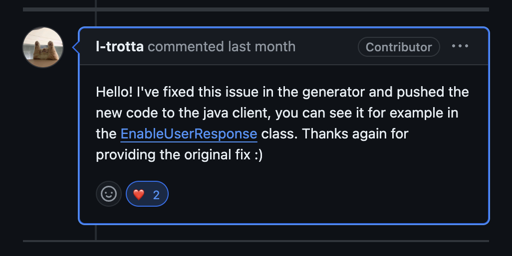

> [오픈소스 기여 회고 #3](https://shinsj4653.github.io/%EC%98%A4%ED%94%88%EC%86%8C%EC%8A%A4%203%EA%B8%B0%20%EB%A9%98%ED%86%A0%EB%A7%81_%EC%BD%94%EB%93%9C%20%EC%88%98%EC%A0%95/)

취업준비를 하면서 블로그 정리하기가 쉽지는 않지만..그래도 짧게라도 내 생각을 정리하는 시간은 굉장히 의미있다고 생각하기 때문에 한달에 한번이라도 정리해보도록 하자. 🥲  

## 나의 PR 반영 완료?

때는 5월 20일..신한은행 최종면접을 공부하다가 Github에 알림이 떴다. 이슈 해결 링크에 답글이 달린 것이었다! 그래서 살펴보니...
  
두둥! 나의 수정사항이 반영되긴 하였지만..직접적인 코드 수정은 운영자분께서 해주셨다. 이유를 살펴보니, `elasticsearch-java` 에서는 외부 사용자가 직접 코드 수정은 불가능하며, 운영자분들께서 code generator에서 직접 수정을 해줘야 한다고 코멘트 해주셨다.

## 그래도 코드 수정에 기여 완료!
> https://github.com/elastic/elasticsearch-java/commit/4acf3c308fdab8e5c7c34db43e3a3bf26ccfdad3
`I-trotta` 운영자님께서 반영해주는 코드 커밋 내역을 보니, `나의 커밋과 100% 일치`하는 것을 볼 수 있다! 이로써 나의 첫번째 기여는 성공으로 마무리되었다ㅎㅎㅎ

> https://chip-bream-9d5.notion.site/elastic-search-DisableUserResponse-_DESERIALIZER-should-use-emptyObject-not-fixedValue-dfb5921841894d8d90a1abfce454e8e7

인제님께서 공유해주신 역대 오픈소스 기여 정리 목록이다. 나의 PR 글에 Merged 아이콘을 달아주셔서 매우 뿌듯하였다!

## 두 번째 기여 도전 😎
첫번째로 기여한 elasticsearch-java는 레포 전체의 코드 생성기가 따로 존재하기 때문에, 실질적인 코드 기여는 어렵다는 느낌을 받았다. 따라서, 2번째 기여는 `elasticsearch` 에서 해보기로 하였다. 다음 오픈소스 글은 elasticsearch 오픈소스의 이슈 선정 정리글을 게시할 예정이다.