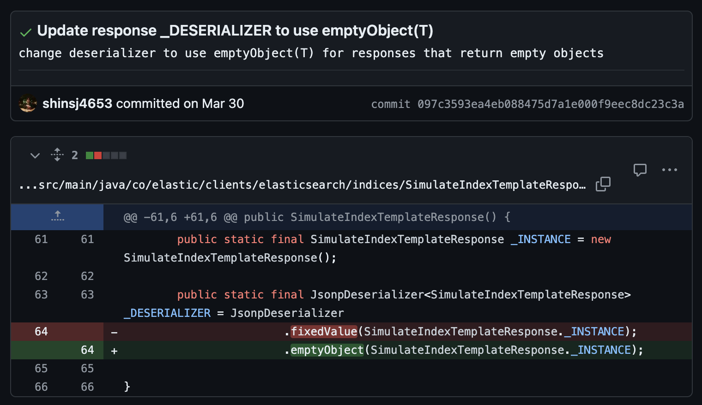
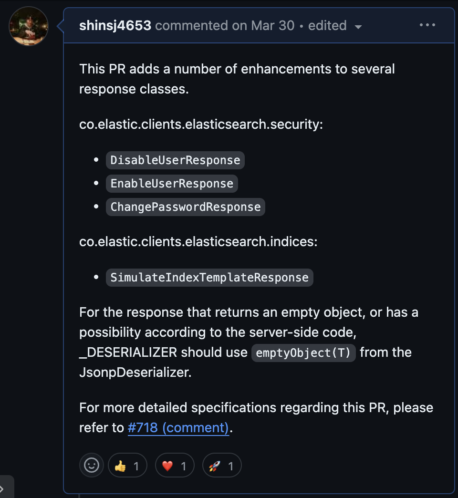

> [오픈소스 기여 회고 #2](https://shinsj4653.github.io/%EC%98%A4%ED%94%88%EC%86%8C%EC%8A%A4_3%EA%B8%B0%20%EB%A9%98%ED%86%A0%EB%A7%81_%EC%9D%B4%EC%8A%88%EC%84%A0%EC%A0%95/)  
지난 오픈소스 기여 활동 회고에서는 `elasticsearch-java`와 `elasticsearch` 오픈소스에서 선장한 이슈와 최종 선정한 이슈에 대한 이유와 피드백을 정리하였다. 이번 회고에서는 해당 이슈를 해결하기 위한 `커밋 및 PR 생성 과정`을 정리해보았다.

## 최종 선정 이슈
> https://github.com/elastic/elasticsearch-java/issues/718  
  
## 1. README와 Contributing 문서 읽기
프로젝트를 빌드 하여 실제 커밋을 만들고 PR을 날려보기로 하였다.  
우선, elasticsearch-java의 README 와 Contributing 관련 문서를 쭉 정독하였다.

> [GitHub - elastic/elasticsearch-java: Official Elasticsearch Java Client](https://github.com/elastic/elasticsearch-java?tab=readme-ov-file)  
> [elasticsearch-java/CONTRIBUTING.md at main · elastic/elasticsearch-java](https://github.com/elastic/elasticsearch-java/blob/main/CONTRIBUTING.md)  

읽는 과정에서 문제가 하나 생겼다. Contributing.MD에서 다음 글을 발견하였다.
> The co.elastic.clients.elasticsearch package and its children are all entirely generated, and the generator is not part of this repository. Because of this, PRs will not work for this part of the code.
If you want to suggest changes to the generated code, open an issue describing how the code should look like, so that we can discuss on updating the generator.  
제가 선정한 이슈에 해당되는 코드 위치가 `co.elastic.clients.elasticsearch` 패키지 내에 있기 때문에 이에 대한 pr은 작동하지 않을거라는 내용이었다. 이미 선정 이슈 코멘트에 코드 수정 방법은 제시된 상태여서, 다른 이슈를 찾아봐야할지, 아니면 제시된 수정방법을 실제로 반영한 PR을 날려도 괜찮을지 직접 코멘트로 여쭤보는게 좋을지 궁금하여 중간 점검 시간에 인제님께 여쭤봤다.  
이에 대한 인제님의 답변은 다음과 같았다.
> 흠 다른 PR들보니 co.elastic.clients.elasticsearch 아래 클래스들 고치기도 하는거 같은데.. 일단 이슈에 자세히 설명 달아두고 PR한번 날려보시죠! 검증테스트는 우선 안만들고 PR날려봐도 좋을거같네요ㅎ  

## 2. 적용 계획
1. `이슈 코멘트`에 이러한 이유 때문에 이 부분에서 이런식으로 고쳐야겠다고 코드 링크 와 함께 코멘트를 달기
2. `수정한 코드`에 대해서 PR 전송

중간 점검 피드백 이후에, 다음 두 스텝으로 계획을 세웠으며 이를 따르기로 하였다.

### 수정한 코드
> https://github.com/elastic/elasticsearch-java/pull/772/commits/097c3593ea4eb088475d7a1e000f9eec8dc23c3a  
  
결국 핵심은 서버 단 코드와 응답 형식을 일치시키기 위해 JsonpDeserializer가 `fixedValue()`가 아닌 `emptyObject()`를 사용하도록 수정해주는 것 이었다.

### 생성 PR
> https://github.com/elastic/elasticsearch-java/pull/772  
  
총 4개의 클래스에 대해서 같은 수정 방식을 공유하기 때문에, 이에 대한 내용을 언급해줬다.

## 최종 PR 피드백
인제님께서도 좋다고 피드백 해주셨으며, 따봉이 좀 있어야 운영자분들께서 잘 보신다고 하셔서 열심히 눌러주셨다ㅋㅋㅋ감사합니다 🤣  

이제는..해당 PR이 승인될 때까지 기다리는 것 밖에 남지 않았다..