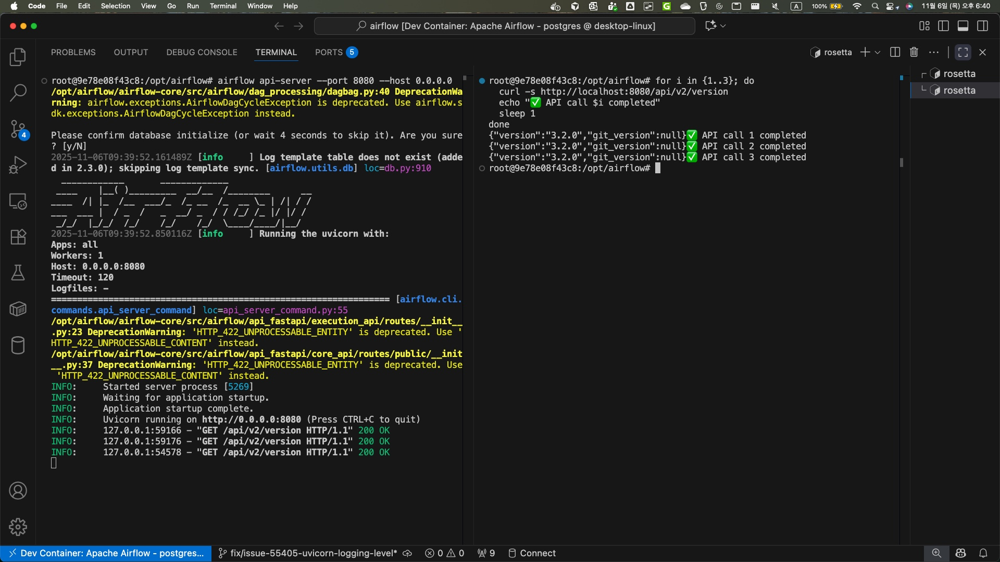
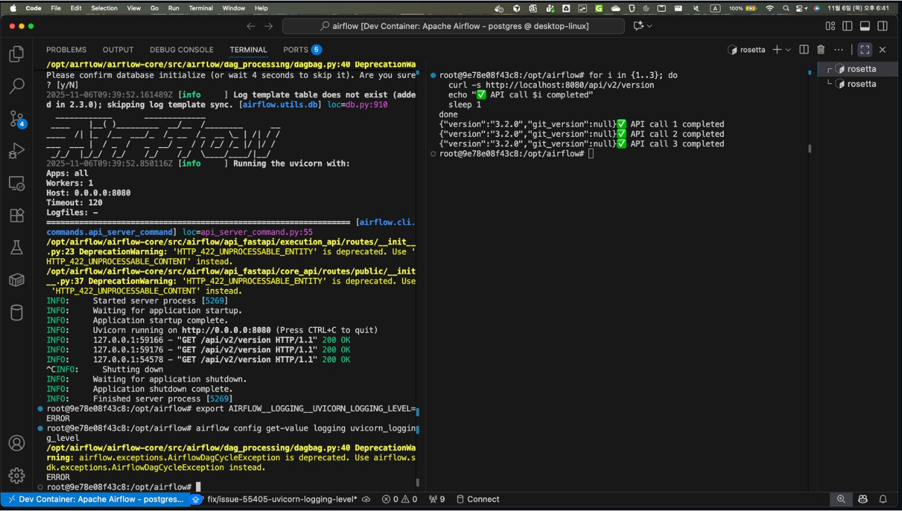
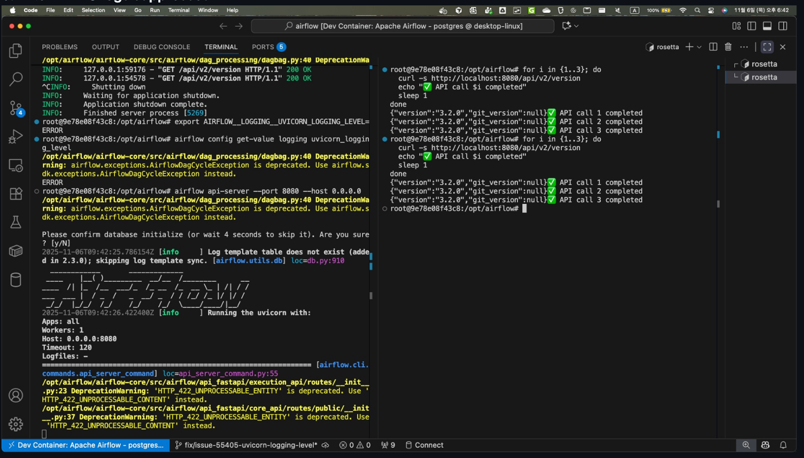
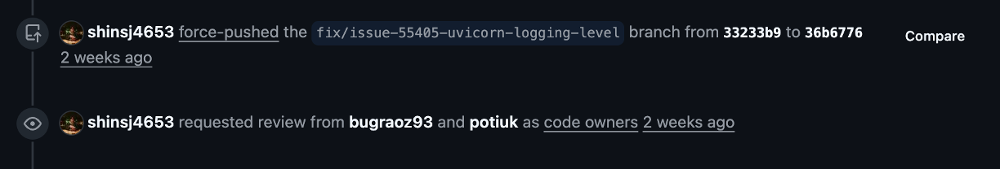
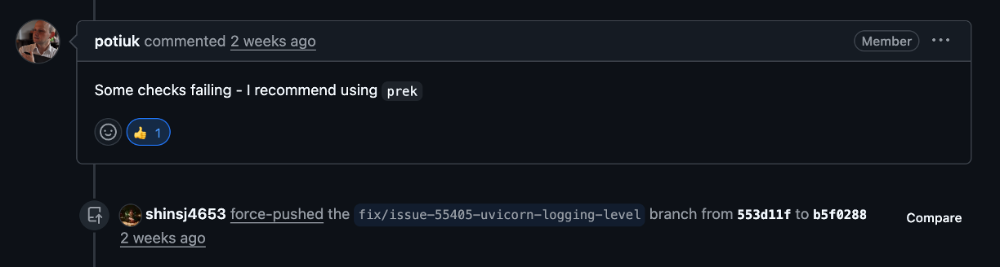
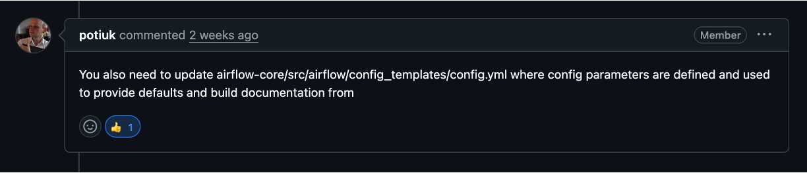

# PR 링크
[https://github.com/apache/airflow/pull/56062](https://github.com/apache/airflow/pull/56062)

결론부터 말하면, `기여 성공`했다. (야호!)  
어떤 과정을 거쳐서 성공했는지 아래에 적어봤다.

# 최근 근황 

DBA에서 데이터 엔지니어를 희망하여 이직하였지만, 데이터 파이프라인을 구축하며 오히려 **잘 설계된 DB의 가치**를 체감했고, 데이터를 '활용'하는 것보다 **'지키고 관리'하는 일**에서 더 큰 보람을 느낀다는 걸 깨달았다. 결국 나는 데이터의 흐름을 만드는 것보다, 그 데이터가 담기는 단단한 '그릇'을 책임지는 역할에 더 끌린다는 걸 깨달아 다시 DBA로 직무 전환을 하였고, 앞으론 DBA를 메인 커리어로 가져가기로 다짐하였다.

다만, 데이터 엔지니어링을 아예 놓진 않고, 공부를 병행하며 데이터 엔지니어링 역량도 함께 보유한 DBA로 성장하는게 좋을거라 판단하여 이번 airflow 기여에 도전하였다. 총 기간은 3개월, 생각보다 금방 Merge 결과를 받아 아직도 얼떨떨한 느낌이 든다. 도파민도 최강이다. 이래서 다들 오픈소스를 기여하나보다. (두근두근)  

각설하고, 3개월간의 오픈소스 기여 과정을 정리해보겠다. 

# 1. 이슈 선정
[⭐AI 활용 오픈소스 기여 가이드 — 오픈소스 기여의 진입 장벽을 낮추고 판도를 바꿀!](https://medium.com/opensource-contributors/%EC%98%A4%ED%94%88%EC%86%8C%EC%8A%A4%EC%9D%98-%ED%8C%90%EB%8F%84%EB%A5%BC-%EB%B0%94%EA%BF%80-ai%EB%A1%9C-%EC%98%A4%ED%94%88%EC%86%8C%EC%8A%A4-%EA%B8%B0%EC%97%AC-%EC%99%84%EB%B2%BD-%EA%B0%80%EC%9D%B4%EB%93%9C%EC%99%80-%ED%94%84%EB%A1%EC%ED%8A%B8-%EA%B3%B5%EC%9C%A0-2db85bf736b8)  

이번에도 역시 오픈소스 스승님이신 인제님의 블로그 글을 참고하였다. 가장 중요한 첫번째 단계, 바로 `적합한 이슈 선정`이다.  

## 이슈 선정 기준

좋은 이슈를 고르기 위해 세운 기준은 다음과 같다.

1. `good first issue` 라벨이 붙어있을 것
2. 메인테이너가 문제를 확인하고, **명확한 해결 방향**을 제시했을 것
3. 아직 담당자가 없거나, 진행 중인 PR이 없을 것

이 기준으로 Airflow 이슈들을 쭉 훑어보았다.

## 후보 이슈 분석

| 이슈 | 제목 | 기준 부합도 | 난이도 | 비고 |
| --- | --- | --- | --- | --- |
| **#55405** | **Airflow emits INFO logs despite logging_level=ERROR** | **상** | **중** | 메인테이너가 해결 방향 명시 |
| #2 | Not able to see all tags when the list is too long | 상 | 하 | UI 버그, CSS 수정 |
| #30 | Sensitive data from extra fields is visible... | 상 | 중 | UI 마스킹 기능 |
| #54965 | Show the file name... on the Code tab | 상 | 중 | 풀스택(API+UI) |

## 최종 선택: #55405

결국 선택한 이슈는 [#55405 - Airflow emits INFO logs despite logging_level=ERROR](https://github.com/apache/airflow/issues/55405) 이다.

**선택 이유:**
- `good first issue` 라벨 ✅
- 메인테이너(@potiuk)가 직접 해결 방향을 제시함 → `AIRFLOW__LOGGING__UVICORN_LOGGING_LEVEL` 설정 추가 ✅
- 담당자 없음, 진행 중인 PR 없음 ✅

**이슈 내용 요약:**
Airflow의 `logging_level`을 `ERROR`로 설정해도, uvicorn 같은 서드파티 라이브러리의 `INFO` 로그가 계속 출력되는 문제다. Airflow 설정이 자체 로거에만 적용되고, 외부 라이브러리 로거에는 영향을 주지 않기 때문에 발생한다.

메인테이너가 "새로운 설정 옵션을 추가해서 서드파티 로그 레벨도 제어할 수 있게 하자"라고 방향을 잡아줘서, 뭘 해야 하는지 명확했다. 이게 결정적이었다.

최종적으로 위 이슈를 선택하였고, 해당 이슈 해결을 위한 작업진행을 해도 되는지 댓글에 작성하였다. 물론 오픈소스 생태계에선 PR를 먼저 올리는 분이 우선순위에 올라간다고 하여, 나 역시도 작업 진행에 대한 통보(?)에 가까운 댓글을 남기고 얼른 작업 진행을 하려고 하였다.  
하지만, elasticsearch 기여때와는 다르게 potuik이라는 메인테이너분께서 직접 나를 해당 이슈에 assign 해주셨다는 점이다. 정말 진귀한 경험이었다. 나의 두번째 오픈소스 스승님으로 모시고 싶을 정도였다.

# 2. 실행 환경 세팅

나의 변경사항을 로컬에서 airflow 운영 환경처럼 동일하게 실행할 수 있도록 하는 방법을 찾아본 결과, `breeze` 를 통해 가능하다는 걸 찾았다.

## breeze란?

Breeze는 Apache Airflow의 **개발 및 테스트 환경을 손쉽게 구축**할 수 있도록 돕는 도구다. Docker 컨테이너를 활용해서 일관된 개발 환경을 제공하며, 복잡한 설정 없이도 Airflow 코드베이스에 기여하거나 테스트를 수행할 수 있게 해준다.

쉽게 말하면, **"내 로컬에서 Airflow 운영 환경을 그대로 재현"**할 수 있게 해주는 녀석이다.

## 사전 준비

Breeze를 사용하려면 아래 도구들이 필요하다.

- **Docker** (필수)
- **Docker Compose** (필수)
- **pipx** 또는 **uv** (Breeze 설치용)

## 환경 설정 순서

### 1. Airflow 소스 코드 클론

```bash
git clone https://github.com/apache/airflow.git
cd airflow
```

### 2. Breeze 설치

pipx를 사용하는 방법:
```bash
pipx install -e ./dev/breeze
```

또는 uv를 사용하는 방법:
```bash
uv tool install -e ./dev/breeze
```

### 3. Breeze 실행

```bash
breeze
```

처음 실행하면 Docker 이미지를 빌드하느라 시간이 좀 걸린다. 커피 한 잔 하고 오면 된다. ☕

### 4. Airflow 웹 서버 접속

Breeze가 실행되면 `http://localhost:8080`으로 접속해서 Airflow 웹 UI를 확인할 수 있다.

기본 계정:
- **ID**: admin
- **PW**: admin

## 유용한 Breeze 명령어

| 명령어 | 설명 |
| --- | --- |
| `breeze` | Breeze 컨테이너 진입 |
| `breeze start-airflow` | Airflow 웹서버 + 스케줄러 실행 |
| `breeze shell` | Breeze 쉘 진입 |
| `breeze stop` | Breeze 컨테이너 중지 |
| `breeze cleanup` | Docker 리소스 정리 |

이렇게 환경 세팅을 마치고, 본격적으로 이슈 분석에 들어갔다.

# 3. 이슈 분석 및 해결 방향 도출하기

이슈를 선택했으면 끝? 아니다. 이제부터가 진짜 시작이다. 코드를 건드리기 전에, **문제의 근본 원인**을 정확히 파악해야 한다.

## 문제 상황 정리

사용자가 보고한 현상을 다시 정리해보면:

- **Airflow 버전**: 3.0.2 (Helm Chart 1.18.0)
- **배포 환경**: Kubernetes 클러스터
- **설정**: `logging_level = ERROR`로 변경
- **문제**: 설정을 바꿨는데도 `INFO` 레벨 로그가 계속 출력됨

`airflow config get-value logging logging_level` 명령어로 확인해도 `ERROR`가 잘 반환된다. 설정은 분명히 적용됐는데, 왜 로그는 계속 나오는 걸까?

## 로그 출처 분석

문제가 되는 로그들을 자세히 살펴보니 패턴이 보였다.

**API 서버 로그:**
```
INFO:     10.244.1.1:53666 - "GET /api/v2/version HTTP/1.1" 200 OK
```

**Triggerer 로그:**
```
[2025-09-08 10:30:56 +0000] [14] [INFO] Starting gunicorn 23.0.0
[2025-09-08 10:30:56 +0000] [14] [INFO] Listening at: http://[::]:8794 (14)
```

이건 **Airflow 애플리케이션이 생성한 로그가 아니다.** 

| 컴포넌트 | 역할 | 사용하는 웹서버 | 로그 유형 |
| --- | --- | --- | --- |
| **API 서버** | REST API 제공 (FastAPI 기반), 외부 클라이언트 요청 처리 | uvicorn | HTTP 요청마다 access log 출력 |
| **Triggerer** | 장시간 대기 Task를 Worker 점유 없이 효율적으로 관리하는 백그라운드 서비스 | gunicorn | 서버 시작/워커 부팅 시 startup log 출력 |

**차이점:**
- **API 서버**: 사용자/외부 시스템이 Airflow에 API 호출할 때마다 `INFO: GET /api/v2/...` 형태의 access log가 **지속적으로** 출력됨
- **Triggerer**: 서버 시작 시점에 `Starting gunicorn`, `Booting worker` 같은 startup log가 **한 번** 출력됨

> 💡 **심화: Triggerer 내부 아키텍처**
> 
> Triggerer는 실제로 **두 개의 웹서버**를 사용합니다:
> 
> | 역할 | 웹서버 | 설명 |
> | --- | --- | --- |
> | 메인 워커 관리 | **gunicorn** | Triggerer 프로세스 관리 (`Starting gunicorn` 로그 출력) |
> | 로그 서빙 서버 | **uvicorn** | Task 실행 로그를 HTTP로 외부에 제공 (`serve_logs/core.py`) |
> 
> 따라서 이번 PR에서는 **gunicorn 로깅 레벨**뿐 아니라 Triggerer 내부의 **uvicorn 로그 서버 설정**도 함께 수정했습니다.

즉, `AIRFLOW__LOGGING__LOGGING_LEVEL` 설정은 **Airflow 자체 로거에만 적용**되고, uvicorn이나 gunicorn 같은 **서드파티 웹서버 라이브러리의 로거에는 영향을 주지 않는다.**

## 코드 분석

airflow 오픈소스에서 API 서버 로그 실행 역할을 담당하는 소스파일들의 흐름은 다음과 같다.  

```bash
[사용자] airflow api-server 명령 실행
        ↓
[airflow/cli/commands/api_server_command.py]  ← CLI 명령 처리 및 서버 시작
        ↓
[uvicorn / gunicorn] 웹서버 프로세스 시작
        ↓
[uvicorn 내부 로거] access_log=True로 설정된 경우 INFO 레벨 로그 출력
        ↓
"INFO: 10.244.1.1:53666 - GET /api/v2/version HTTP/1.1 200 OK" 형태의 로그 출력
```

문제 상황이 어디서 발생하고, 이로 인해 영향을 받는 소스파일이 어딘지 분석한 결과이다. 

| 문제 발생 위치 | 파일 경로 | 문제 상황 |
| --- | --- | --- |
| 설정 옵션 부재 | `airflow-core/src/airflow/configuration.py` | uvicorn/gunicorn 로깅 레벨 설정 옵션이 **존재하지 않음** |
| 하드코딩된 설정 | `airflow-core/src/airflow/cli/commands/api_server_command.py` | `access_log: True`가 하드코딩되어 있어 항상 INFO 로그 출력 |
| 설정값 미연동 | 동일 파일 | Airflow의 `logging_level` 설정이 uvicorn에 **전달되지 않음** |

이를 통해 수정이 필요한 소스코드 파일을 아래와 같이 결론내렸다.  

| 수정 파일 | 수정 내용 | 목적 |
| --- | --- | --- |
| `configuration.py` | `uvicorn_logging_level`, `gunicorn_logging_level` 설정 옵션 추가 | 사용자가 환경변수로 로깅 레벨 제어 가능하게 함 |
| `api_server_command.py` | 설정값을 읽어서 uvicorn `log_level` 파라미터에 전달 | 실제로 uvicorn 로깅 레벨을 변경 |
| `config.yml` | 새 설정 옵션의 문서화 및 기본값 정의 | 설정 옵션 메타데이터 관리 |


실제 Airflow 코드베이스를 살펴보니 원인이 명확해졌다.

**`api_server_command.py`의 uvicorn 설정:**
```python
uvicorn_kwargs = {
    "host": args.host,
    "port": args.port,
    "workers": num_workers,
    "access_log": True,  # ← 이게 INFO 로그를 생성!
    ...
}
```

`access_log: True`가 하드코딩 되어있다. 사용자가 아무리 Airflow 로깅 레벨을 바꿔봤자, uvicorn은 자기 설정대로 동작하는 거다.

**현재 Airflow가 지원하는 로깅 설정:**
```python
("logging", "logging_level"): _available_logging_levels,
("logging", "fab_logging_level"): _available_logging_levels,
("logging", "celery_logging_level"): [*_available_logging_levels, ""],
```

uvicorn이나 gunicorn 로깅 레벨을 제어하는 설정은 **아예 존재하지 않는다.**

## 근본 원인

정리하면 이렇다:

| 구분 | 설명 |
| --- | --- |
| **버그 여부** | 버그 아님. 기능 부족(Feature Gap) |
| **문제 원인** | Airflow 로깅 설정이 서드파티 라이브러리까지 커버하지 못함 |
| **영향 범위** | uvicorn, gunicorn 등 웹서버 컴포넌트의 로그 |

## 해결 방향

메인테이너(@potiuk)가 제시한 방향을 따르기로 했다.

**새로운 설정 옵션 추가:**
- `AIRFLOW__LOGGING__UVICORN_LOGGING_LEVEL`
- `AIRFLOW__LOGGING__UVICORN_ACCESS_LOG` (access log on/off)

**구현 포인트:**
1. 설정 옵션 정의 추가
2. `api_server_command.py`에서 설정값을 읽어서 uvicorn에 전달
3. 문서 업데이트

방향이 잡혔으니, 이제 실제 코드 수정에 들어갔다.

# 4. 코드 수정 및 테스팅

## 구현 내용

uvicorn과 gunicorn의 로깅 레벨을 Airflow 메인 로깅과 **독립적으로 제어**할 수 있는 설정 옵션을 추가했다.

핵심은 간단하다:
- `uvicorn_logging_level` 설정 추가
- `gunicorn_logging_level` 설정 추가  
- API 서버에서 이 값을 읽어서 uvicorn에 전달
- Triggerer log server에도 동일하게 적용


## 코드 수정

총 3개 파일을 수정했다.

### 1) `configuration.py` - 설정 옵션 정의

먼저 새로운 설정 옵션을 Airflow 설정 시스템에 등록했다.

```python
# airflow-core/src/airflow/configuration.py

("logging", "fab_logging_level"): _available_logging_levels,
("logging", "celery_logging_level"): [*_available_logging_levels, ""],
# 👇 새로 추가
("logging", "uvicorn_logging_level"): _available_logging_levels,
("logging", "gunicorn_logging_level"): _available_logging_levels,
```

이렇게 하면 `AIRFLOW__LOGGING__UVICORN_LOGGING_LEVEL` 환경변수나 `airflow.cfg`에서 설정할 수 있게 된다.

### 2) `api_server_command.py` - API 서버에 적용

API 서버 실행 시 설정값을 읽어서 uvicorn에 전달하도록 수정했다.

**Production 모드 (gunicorn + uvicorn workers):**

```python
# airflow-core/src/airflow/cli/commands/api_server_command.py

# 설정에서 uvicorn 로그 레벨 읽기
uvicorn_log_level = conf.get("logging", "uvicorn_logging_level", fallback="info").lower()

# ERROR 이상이면 access log 끄기
access_log_enabled = uvicorn_log_level not in ("error", "critical", "fatal")

uvicorn_kwargs = {
    "host": args.host,
    "port": args.port,
    ...
    "access_log": access_log_enabled,  # 기존: True (하드코딩)
    "log_level": uvicorn_log_level,    # 새로 추가
    ...
}
```

**Dev 모드 (standalone uvicorn):**

```python
# 개발 모드에서도 동일하게 적용
else:
    uvicorn_log_level = conf.get("logging", "uvicorn_logging_level", fallback="info").lower()
    run_args.extend(["--log-level", uvicorn_log_level])
```

핵심 포인트는 `access_log` 제어다. 로그 레벨이 `error`, `critical`, `fatal`이면 access log 자체를 꺼버린다. 어차피 INFO 로그인데 ERROR 레벨에서 보일 필요가 없으니까.

### 3) `serve_logs/core.py` - Triggerer log server에도 적용

Triggerer에서 로그 서빙할 때 쓰는 uvicorn에도 동일하게 적용했다.

```python
# airflow-core/src/airflow/utils/serve_logs/core.py

# 설정에서 uvicorn 로그 레벨 읽기
uvicorn_log_level = conf.get("logging", "uvicorn_logging_level", fallback="info").lower()

# 기존: log_level="info" (하드코딩)
uvicorn.run(
    "airflow.utils.serve_logs.log_server:get_app", 
    host="", 
    port=port, 
    log_level=uvicorn_log_level  # 설정값 사용
)
```

## 테스트 진행

Breeze로 띄운 Dev Container에서 테스트했다.

- **환경**: Apache Airflow Dev Container
- **백엔드**: PostgreSQL
- **Python**: 3.10

## 테스트 시나리오

### 1) 수정 전 (기본 동작)

먼저 기존 동작을 확인했다.

**터미널 1 - API 서버 실행:**
```bash
airflow api-server --port 8080 --host 0.0.0.0
```

**터미널 2 - API 호출:**
```bash
for i in {1..3}; do
  curl -s http://localhost:8080/api/v2/version
  echo "✅ API call $i completed"
  sleep 1
done
```

**결과 - INFO 로그가 줄줄 나옴:**



예상대로다. access log가 INFO 레벨로 찍히고 있다.

### 2) 설정 변경

환경변수로 uvicorn 로깅 레벨을 ERROR로 바꿨다.  



```bash
export AIRFLOW__LOGGING__UVICORN_LOGGING_LEVEL=ERROR
airflow config get-value logging uvicorn_logging_level
# ERROR
```

설정이 잘 먹혔다.

### 3) 수정 후 (INFO 로그 억제됨)

같은 테스트를 다시 돌렸다.

**터미널 1:**
```bash
airflow api-server --port 8080 --host 0.0.0.0
```

**터미널 2:**
```bash
for i in {1..3}; do
  curl -s http://localhost:8080/api/v2/version
  echo "✅ API call $i completed"
  sleep 1
done
```

**결과:**  
  
access log가 안 나온다! ERROR 레벨로 설정했으니 INFO 로그는 찍히지 않는 게 맞다.

API 응답은 정상적으로 오고, 로그만 깔끔하게 정리됐다. 

## 하위 호환성

기존 사용자한테 영향이 가면 안 되니까 이 부분도 신경 썼다.

- **기본값**: `info` (기존과 동일)
- **Breaking Change**: 없음
- **동작 방식**: 원하는 사람만 설정해서 쓰면 됨

# 5. 피드백 

오픈소스 기여 과정 중 가장 고통스러운 시간, PR 게시 후 피드백 기다리기이다. 나의 과정을 정리해보았다.

## 9/25: 리뷰가 안온다..
9월 25일날 PR를 게시하였고, 이슈에다가도 멘션하였지만 내가 수정한 코드 영역의 담당자분들, bugraoz93와 potuik는 묵묵부답이셨다.

```python
# .github/CODEOWNERS

# Airflow CLI
/airflow-core/src/airflow/cli/ @bugraoz93 @potiuk
```

## 12/4: 응원자 1명 등장
약 두달간 묵묵부답인 메인테이너분들..  
한번더 댓글로 ping을 날려 PR 리뷰를 부탁드리려던 찰나, 어떤 외국인 한분께서 댓글을 달아주셨다.

```text
Thanks you @shinsj4653 for submitting the PR. I would love that feature! Is there any way I can help so that it gets a review?
```

나의 해결 로직을 원하는 사람이 등장한 것 이다. 기분이 매우 뿌듯하면서 설렜었다.  
이 분 말씀대로, 어떻게 하면 이 PR이 리뷰 받을 수 있도록 할 수 있는지를 고민하였다.  
그랬더니 문득, 내가 올린 PR의 브랜치가 main의 변경사항을 담고 있지 못한다는 문구가 눈에 들어왔다. main브랜치와의 상태를 일치시키기 위해선 `force-push`를 사용하면 된다는 가이드를 받아, 우선 이것부터 해보기로 하였다.  
그랬더니, 놀라운 변경사항이 생겼다.

  

requested review 이벤트가 트리거 된 것 이었다. Github에 아래 기능이 내장되어 있었던 걸 알지 못헀다..

### GitHub 자동 리뷰어 할당 방식
1. CODEOWNERS 파일 (.github/CODEOWNERS)
- PR에서 수정된 파일 경로를 기반으로 자동으로 리뷰어 요청
- Force push 시에도 파일이 변경되면 해당 담당자에게 리뷰 요청
2. GitHub 저장소 설정
- Settings → Branches → Branch protection rules
- "Require review from Code Owners" 옵션이 활성화되어 있으면 CODEOWNERS 기반으로 리뷰어 자동 할당

다음엔 이런 사항들까지 모두 사전 점검해야겠다.

## 12/8: 첫번째 Test Workflow

[1st Test Workflow](https://github.com/apache/airflow/actions/runs/19982198173)  

airflow의 `ci-amd-arm.yml` 덕분에 나의 PR에 대한 workflow가 github actions 에 등록되었고, requested review 이벤트 덕분에 potuik 메인테이너께서 test workflow를 실행해주셨다.  

### 📍 CI 워크플로우 실행 권한

#### 1. GitHub 저장소 설정 위치

**Settings → Actions → General → Fork pull request workflows from outside collaborators**

여기서 다음 옵션 중 하나가 선택되어 있습니다:
- ✅ **"Require approval for first-time contributors"**
- ✅ **"Require approval for all outside collaborators"**

이 설정 때문에 외부 기여자(fork에서 PR 보낸 사람)의 워크플로우는 **메인테이너가 승인해야** 실행된다.

---

#### 2. Github Actions 설정

`ci-amd-arm.yml`에서 일부 힌트:

```yaml
# 35-37줄
permissions:
  # All other permissions are set to none by default
  contents: read
```

```yaml
# 257-259줄 - fork PR은 packages write 권한 없음
permissions:
  contents: read
  # This write is only given here for `push` events from "apache/airflow" repo. 
  # It is not given for PRs from forks.
  packages: write
```

---

#### 3. 왜 이렇게 설정하나?

**보안상의 이유:**
- Fork에서 온 PR이 악성 코드를 실행할 수 있음
- Secrets에 접근하거나 이미지를 빌드/푸시하는 것을 방지
- 메인테이너가 코드를 검토한 후 승인하면 실행

---

### 요약

| 위치 | 내용 |
|------|------|
| **GitHub 저장소 Settings** | Fork PR 워크플로우 승인 필요 설정 |
| `ci-amd-arm.yml` | permissions 제한, 조건부 실행 |

코드 자체에는 "메인테이너만"이라는 명시적 설정이 없고, **GitHub 저장소 관리자 설정**에서 제어됩니다! 👍

위 내용처럼, 정해진 사람들만 나의 변경사항에 대한 workflow를 실행할 수 있다. 실행 workflow의 결과는 아래와 같다.

| 테스트 카테고리 | 실패 항목 | 결과 |
| --- | --- | --- |
| CI Image checks | Static check | ❌ 실패 |
| Postgres/MySQL/Sqlite tests:core | API, CLI, Core, Serialization | ❌ 실패 |
| Low dep tests:core | API, CLI, Core, Serialization | ❌ 실패 |

### 오류 1: Static Check 실패

**핵심 에러:**
```diff
- uvicorn_log_level = conf.get("logging", "uvicorn_logging_level", fallback="info").lower()
-     
+ uvicorn_log_level = conf.get("logging", "uvicorn_logging_level", fallback="info").lower()
+
```

**원인:** `core.py`에서 trailing whitespace(줄 끝 공백)가 있어서 pre-commit hook이 실패

**수정:** 줄 끝 공백 제거 및 코드 포맷팅 정리

### 오류 2: Unit Test 실패

**핵심 에러:**
```bash
FAILED test_api_server_command.py::TestCliApiServer::test_run_command_daemon

Expected: run(..., access_log=True, proxy_headers=False)
Actual:   run(..., access_log=True, log_level='info', proxy_headers=False)
```

**원인:** `log_level` 파라미터를 추가했는데, 기존 테스트 코드에는 이 파라미터가 없어서 테스트가 실패

**수정:** 테스트 기대값에 `log_level='info'` 추가

### 수정 커밋

[Fix unit tests for uvicorn log level and fix trailing whitespace](https://github.com/apache/airflow/commit/0b10e39cb2046d89fc42d1df22d671e1894eeda7)

**수정 파일:**

| 파일 | 수정 내용 |
| --- | --- |
| `serve_logs/core.py` | trailing whitespace 제거 |
| `test_api_server_command.py` | 테스트 기대값에 `log_level='info'` 추가 (2곳) |  
  
수정 커밋에 대해 push 후, 리뷰 재요청을 드렸다.

## 12/9: 두번째 Test Workflow

[2nd Test Workflow](https://github.com/apache/airflow/actions/runs/20017506205)

potiuk은 신이시다. 재요청에 하루도 안되어서 응답해주셨다. 하지만 아쉽게도, 또 실패했다.

| 테스트 카테고리 | 실패 항목 | 결과 |
| --- | --- | --- |
| CI Image checks | Static check | ❌ 실패 |

### 오류: Static Check 실패 (또..)

**핵심 에러:**
```diff
- uvicorn.run("airflow.utils.serve_logs.log_server:get_app", host="", port=port, log_level=uvicorn_log_level)
+ uvicorn.run(
+     "airflow.utils.serve_logs.log_server:get_app", host="", port=port, log_level=uvicorn_log_level
+ )
```

**원인:** 분명 저번엔 trailing whitespace(줄 끝 공백)를 없애서 해당 오류가 안 날 줄 알았는데 다시 발생해서 의아했다. 알고 보니 **한 줄이 너무 길어서** 코드 포맷팅 규칙에 위반된 것이었다.  
이에 potuik은 `prek`를 사용해보라고 권장해주셨다.

  

### prek 이란?

> 💡 **prek (pre-commit)**: Git 커밋 전에 코드 스타일, 포맷팅, lint 등을 자동으로 검사하고 수정해주는 도구. Airflow 프로젝트에서는 `prek`라는 alias로 사용한다.

**사용 방법:**
```bash
# 모든 파일에 대해 prek 실행
prek run --all-files

# git hook으로 설치 (커밋 시 자동 실행)
prek install
```

### 교훈

단순히 trailing whitespace만 제거하는 게 아니라, **prek를 로컬에서 먼저 실행**해서 모든 포맷팅 이슈를 확인해야 했다. 이후부터는 push 전에 항상 `prek run --all-files`를 실행하기로 했다.

## 12/10: 세번째 Test Workflow

  

드디어, 테스트 결과가 올 성공으로 나왔다 (감격..)  
하지만..
potuik께서 이런 말씀을 하셨다.  

  

아뿔싸, 새로 추가한 `uvicorn_logging_level`에 대한 설명을 config.yml 에 추가했어야했다.  

[commit `8d33a7a`: add unvicorn_logging_level to config.yml](https://github.com/apache/airflow/commit/8d33a7a9a7b6172f37f658f2b9108bdb94690a38)  

```diff
      type: string
      example: ~
      default: "WARNING"
+   uvicorn_logging_level:
+     description: |
+       Logging level for uvicorn (API server and serve-logs).
+
+       Supported values: ``CRITICAL``, ``ERROR``, ``WARNING``, ``INFO``, ``DEBUG``.
+     version_added: 3.2.0
+     type: string
+     example: ~
+     default: "INFO"
    logging_config_class:
      description: |
        Logging class
```

위와 같이 `config.yml`에 `uvicorn_logging_level` 설정 옵션의 설명을 추가했다.
 
## 12/11: 네번째 Test Workflow  
[4th test workflow](https://github.com/apache/airflow/actions/runs/20069559767/job/57583891734?pr=56062)  

| 테스트 카테고리 | 실패 항목 | 결과 |
| --- | --- | --- |
| Build CI images | Build CI linux/amd64 image 3.10 | ❌ 실패 |

### 오류: CI 캐시 파일 오류

**핵심 에러:**
```bash
Verify ci-cache file exists
Process completed with exit code 1.
```

**원인 분석:**

| 항목 | 내용 |
| --- | --- |
| **오류 유형** | GitHub Actions 인프라 문제 |
| **원인** | CI 빌드에 필요한 캐시 파일이 존재하지 않음 |
| **내 코드 문제?** | ❌ 아님. GitHub Actions의 캐시 만료 또는 인프라 이슈 |
| **해결 방법** | 워크플로우 재실행 (Re-run) 요청 |

이 오류는 **내 코드와 무관한 CI 인프라 문제**였다. GitHub Actions에서 Docker 이미지 빌드 시 사용하는 캐시 파일이 만료되거나 손상되어 발생하는 일시적인 오류다. 메인테이너에게 워크플로우 재실행을 요청했다.

## 12/11: 마지막 Test Workflow, 그리고 PR Merge

[5th test workflow](https://github.com/apache/airflow/actions/runs/20108443529)

마침내 마지막 Test Workflow가 통과되었고, 인생 첫 오픈소스 Contribution에 성공하였다.  

  

# 7. 느낀점

이번 기여를 통해 느낀 점을 정리해본다.

1. 이슈 선정이 기여의 90%다.

> 솔직히 이번 기여는 난이도가 엄청 높진 않았다. Airflow 웹서버 실행 흐름을 파악하고, 관련 소스파일 몇 개를 수정한 게 전부였으니까. 하지만 그래서 더 중요한 걸 깨달았다. 나같은 뉴비한테는 **적당한 난이도의 이슈를 찾는 것 자체가 절반의 성공**이라는 거다. `good first issue` 라벨이 붙어있고, 메인테이너가 방향을 제시해준 이슈. 이런 보석 같은 이슈를 발굴하는 눈을 기르는 게 첫 번째 과제였다.
  
2. 메인테이너의 관심도가 생각보다 중요하다.

> 처음 PR 올리고 3개월이나 기다렸는데, 막상 potiuk이 리뷰를 시작하니까 일주일도 안 돼서 머지됐다. 12월 둘째주는 매일 피드백이 올 때마다 도파민이 터졌다. 리뷰어가 적극적으로 봐주면 이렇게 빨리 끝날 수 있구나 싶었다.
  
3. 테스트 코드와 린트는 기본 중의 기본.

> 코드 수정은 했는데 테스트가 깨지고, 린트 에러가 나고... 이런 실수를 반복하면서 깨달았다. 오픈소스 기여의 끝은 결국 **테스트 통과**다. 내 수정사항이 맞다고 우기는 게 아니라, 테스트 결과로 증명해야 한다. 다음 기여 때는 첫 커밋부터 변경사항에 대응하는 테스트 코드 검증 및 `prek run --all-files`를 습관화해야겠다.  

  
다음 기여는 회사에서 사용 중인 모니터링 도구, datadog에 기여해보기로 하였다. 위 교훈들을 다음엔 바로 적용할 수 있는, 성장하는 컨트리뷰터가 되겠다.
