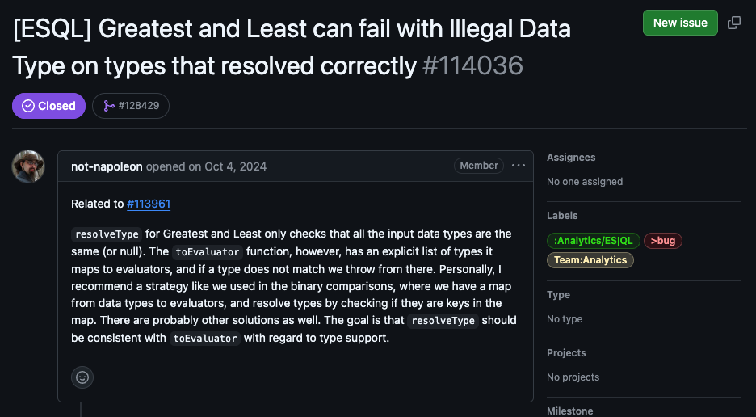
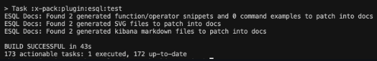
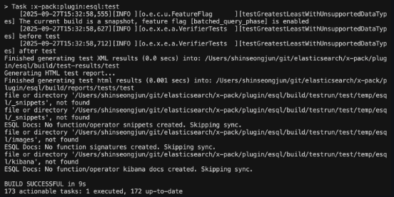
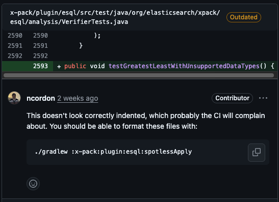
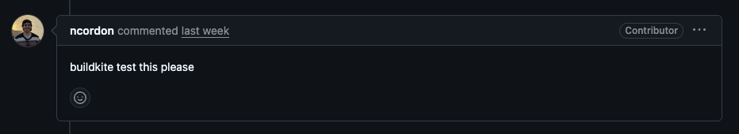
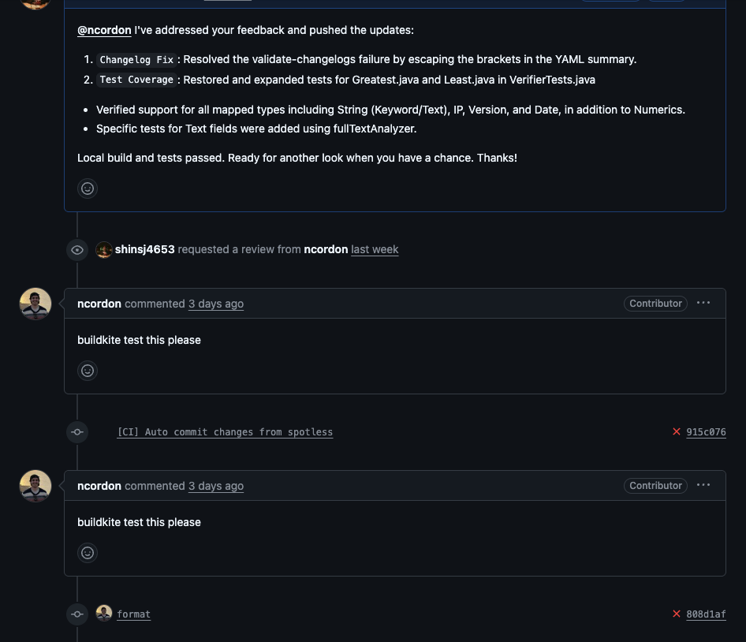
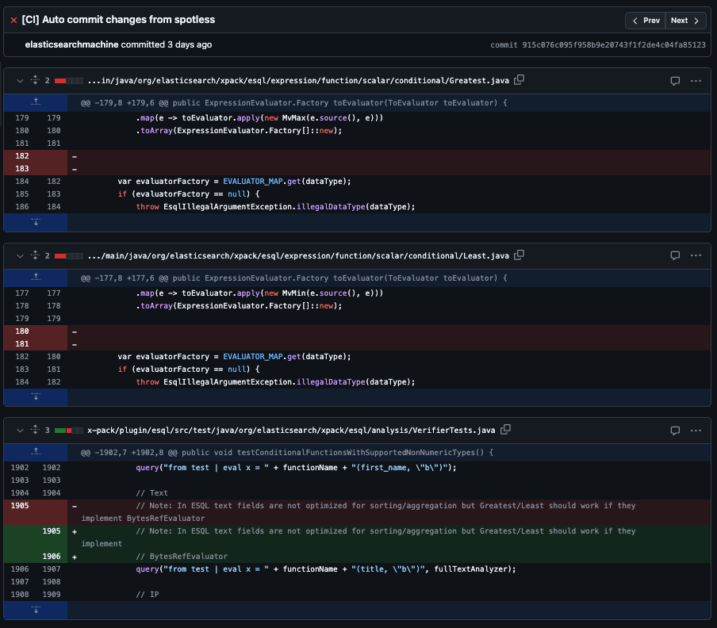
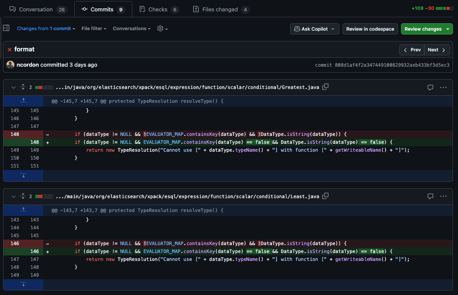
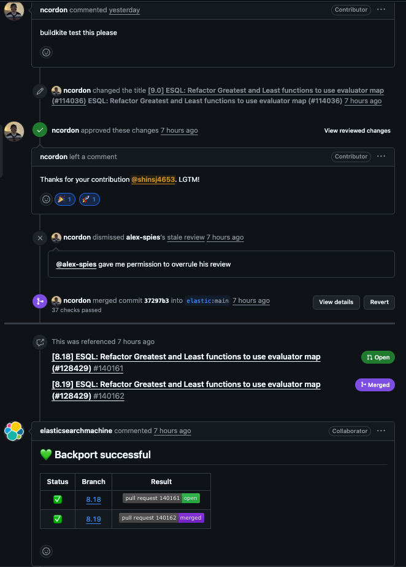

2026 병오년, 새해 첫 글을 또 하나의 오픈소스 기여글로 시작한다는 게 참 좋은 시작인 것 같다.  
[elasticsearch-java 기여](https://shinsj4653.github.io/%EC%98%A4%ED%94%88%EC%86%8C%EC%8A%A4%203%EA%B8%B0%20%EB%A9%98%ED%86%A0%EB%A7%81_%EC%BD%94%EB%93%9C%20%EC%88%98%EC%A0%95%20%EB%B0%8F%20%EA%B8%B0%EC%97%AC%20%EC%99%84%EB%A3%8C/)    
2024년 5월 31일날, 나의 코드 기여사항이 elasticsearch의 java 공식 배포판에 반영되었다는 소식을 접하였다. V사 인턴 때 가장 깊게 다뤘던 기술 스택에 기여한 점은 좋았지만, 나의 PR이 머지된 것이 아니여서 contributor 라벨을 얻진 못하였다. elasticsearch-java 프로젝트 특성상, 외부인의 PR이 머지되는건 불가능하다는 원칙 때문이었다.  
그 이후로, elasticsearch 만큼은 꼭 contributor 라벨을 따내보자라는 마음을 먹었고, 2025년 5월 26일날 게시한 PR이 마침내 머지되었다.    

[https://github.com/elastic/elasticsearch/pull/128429](https://github.com/elastic/elasticsearch/pull/128429)


약 7개월 간의 여정을 회고해본다.  

---

# 1. 오픈소스 스터디 8기 참여

[기여모임 8기 후기](https://medium.com/opensource-contributors/%EA%B8%B0%EC%97%AC%EB%AA%A8%EC%9E%84-8%EA%B8%B0-%ED%9B%84%EA%B8%B0-%EC%98%A4%ED%94%88%EC%86%8C%EC%8A%A4-%EA%B8%B0%EC%97%AC%EB%AA%A8%EC%9E%84-8%EA%B8%B0%EC%97%90%EC%84%9C-%ED%95%A8%EA%BB%98-%EB%A7%8C%EB%93%A0-pr%EA%B3%BC-%EA%B8%B0%EB%B6%80-%ED%9B%84%EA%B8%B0%EB%A5%BC-%EA%B3%B5%EC%9C%A0%ED%95%A9%EB%8B%88%EB%8B%A4-a87ad7b4d7ff)  
때는 2025년 5월, 오픈소스 스터디 8기에 참여하여 이번에야말로 elasticsearch 에 기여하기로 다짐하였다.  
이번에도 역시, 인제님의 가이드를 따라 가장 중요한 이슈 선정을 맨 처음에 진행하였다.  
[인제님의 오픈소스 기여 가이드](https://medium.com/opensource-contributors/%EC%98%A4%ED%94%88%EC%86%8C%EC%8A%A4%EC%9D%98-%ED%8C%90%EB%8F%84%EB%A5%BC-%EB%B0%94%EA%BF%80-ai%EB%A1%9C-%EC%98%A4%ED%94%88%EC%86%8C%EC%8A%A4-%EA%B8%B0%EC%97%AC-%EC%99%84%EB%B2%BD-%EA%B0%80%EC%9D%B4%EB%93%9C%EC%99%80-%ED%94%84%EB%A1%AC%ED%94%84%ED%8A%B8-%EA%B3%B5%EC%9C%A0-2db85bf736b8)

--- 
  
# 2. 이슈 선정
이번에도 중요하게 본 기준은 
- 해결 방법이 명확한가
- 게시된 PR이 없는가

이 2가지였고, 그 때 당시 추천받은 이슈는 아래와 같았다.  
[https://github.com/elastic/elasticsearch/issues/114036](https://github.com/elastic/elasticsearch/issues/114036)  
  
## 2-1. 이슈에 필요한 개념 학습



### ES|QL 핵심 개념 이해하기

이 이슈를 이해하기 위해서는 Elasticsearch의 ES|QL(Elasticsearch Query Language)에서 사용되는 몇 가지 핵심 개념들을 먼저 이해해야 한다.

### `1. Evaluator란?`

**Evaluator**는 ES|QL에서 실제로 데이터를 처리하고 계산을 수행하는 컴포넌트이다.  
예를 들어, `GREATEST(a, b, c)` 함수를 호출하면, 해당 함수의 Evaluator가 실제로 a, b, c 값들을 비교하여 가장 큰 값을 반환하는 로직을 실행한다.

각 데이터 타입(Integer, Long, Double, String 등)마다 별도의 Evaluator가 존재한다. 이는 타입별로 비교 연산의 방식이 다르기 때문이다:
- `IntegerEvaluator`: 정수형 비교
- `LongEvaluator`: Long 타입 비교  
- `DoubleEvaluator`: 실수형 비교
- `BytesRefEvaluator`: 문자열/바이트 비교

```java
// Greatest.java
@Evaluator(extraName = "Int")
    static int process(int[] values) {
        int max = values[0];
        for (int i = 1; i < values.length; i++) {
            max = Math.max(max, values[i]);
        }
        return max;
    }
```

### `2. toEvaluator란?`

**toEvaluator**는 ES|QL 표현식(Expression)을 실제 실행 가능한 Evaluator로 변환하는 메서드이다.  
이 메서드는 입력 데이터 타입에 따라 적절한 Evaluator를 선택하여 반환한다.

```java
// Greatest.java
@Override
    public ExpressionEvaluator.Factory toEvaluator(ToEvaluator toEvaluator) {
        // force datatype initialization
        var dataType = dataType();
        if (dataType == DataType.NULL) {
            throw EsqlIllegalArgumentException.illegalDataType(dataType);
        }

        ExpressionEvaluator.Factory[] factories = children().stream()
            .map(e -> toEvaluator.apply(new MvMax(e.source(), e)))
            .toArray(ExpressionEvaluator.Factory[]::new);

        if (DataType.isString(dataType)) {
            return new GreatestBytesRefEvaluator.Factory(source(), factories);
        }

        return switch (dataType) {
            case BOOLEAN -> new GreatestBooleanEvaluator.Factory(source(), factories);
            case DOUBLE -> new GreatestDoubleEvaluator.Factory(source(), factories);
            case INTEGER -> new GreatestIntEvaluator.Factory(source(), factories);
            case LONG -> new GreatestLongEvaluator.Factory(source(), factories);
            case DATETIME -> new GreatestLongEvaluator.Factory(source(), factories);
            case DATE_NANOS -> new GreatestLongEvaluator.Factory(source(), factories);
            case IP -> new GreatestBytesRefEvaluator.Factory(source(), factories);
            case VERSION -> new GreatestBytesRefEvaluator.Factory(source(), factories);
            default -> throw EsqlIllegalArgumentException.illegalDataType(dataType);
        };
    }
```

#### 연결 관계
```txt
@Evaluator(extraName = "Int")           toEvaluator 메서드
static int process(int[] values)   -->  case INTEGER -> new GreatestIntEvaluator.Factory(...)
         ↓                                              ↓
   코드 생성기가                              런타임에 이 Factory 선택
         ↓
GreatestIntEvaluator.java 자동 생성
(src/main/generated/ 폴더에)
```
즉, @Evaluator(extraName = "Int")가 붙은 process(int[] values) 메서드는 코드 생성기에 의해 GreatestIntEvaluator 클래스로 변환되고, toEvaluator() 메서드에서 DataType.INTEGER인 경우 GreatestIntEvaluator.Factory를 반환하여 연결되는 구조이다.

#### 코드 생성기란?
코드 생성기는 Java Annotation Processor이다.   
#### 1. @Evaluator 어노테이션 정의
```java
// Evaluator.java

/**
 * Implement an evaluator from a static {@code process} method. The generated
 * evaluator provides each argument in one of three ways:
 * ...
 */
@Target(ElementType.METHOD)
@Retention(RetentionPolicy.SOURCE)  // 컴파일 타임에만 사용
public @interface Evaluator {
    String extraName() default "";
    Class<? extends Exception>[] warnExceptions() default {};
    boolean allNullsIsNull() default true;
}
```
#### 2. EvaluatorProcessor - Annotation Processor
```java
// EvaluatorProcessor.java

/**
 * Glues the {@link EvaluatorImplementer} into the jdk's annotation
 * processing framework.
 */
public class EvaluatorProcessor implements Processor {
    // ...
    @Override
    public Set<String> getSupportedAnnotationTypes() {
        return Set.of(Evaluator.class.getName(), MvEvaluator.class.getName(), ConvertEvaluator.class.getName());
    }
```
#### 3. EvaluatorImplementer - 실제 코드 생성 로직
```java
// EvaluatorImplementer.java

public class EvaluatorImplementer {
    // ...
    public EvaluatorImplementer(...) {
        // 클래스명 생성: Greatest + Int + Evaluator = GreatestIntEvaluator
        this.implementation = ClassName.get(
            elements.getPackageOf(declarationType).toString(),
            declarationType.getSimpleName() + extraName + "Evaluator"
        );
    }

    public JavaFile sourceFile() {
        // JavaPoet 라이브러리로 Java 소스 파일 생성
        JavaFile.Builder builder = JavaFile.builder(implementation.packageName(), type());
        // ...
        return builder.build();
    }
```

#### 동작 흐름
결국 코드 생성기의 동작 흐름은 아래와 같다.
```java
컴파일 시점
    │
    ▼
┌─────────────────────────────────────────────────────────────┐
│  Greatest.java                                              │
│  ┌───────────────────────────────────────────────────────┐  │
│  │ @Evaluator(extraName = "Int")                         │  │
│  │ static int process(int[] values) { ... }              │  │
│  └───────────────────────────────────────────────────────┘  │
└─────────────────────────────────────────────────────────────┘
                        │
                        ▼  javac가 @Evaluator 발견
┌─────────────────────────────────────────────────────────────┐
│  EvaluatorProcessor (Annotation Processor)                  │
│      └── EvaluatorImplementer (코드 생성 로직)               │
└─────────────────────────────────────────────────────────────┘
                        │
                        ▼  자동 생성
┌─────────────────────────────────────────────────────────────┐
│  src/main/generated/                                        │
│  └── GreatestIntEvaluator.java  (153줄 자동 생성!)          │
└─────────────────────────────────────────────────────────────┘
```

그리고 포인트는, `toEvaluator`는 명시적으로 지원하는 타입 목록을 가지고 있으며, 목록에 없는 타입이 들어오면 예외를 발생시킨다.

#### 좀 더 구체화된 플로우
정리하면서도 이해가 좀 어려워 더 자세히 작성해봤다.  
`toEvaluator`가 하는 일은 변환이 아니라, 이미 존재하는 Evalutator 클래스를 런타임에 "조립"하여 실행 준비를 하는 것이다.  

#### 전체 라이프사이클
```txt
┌──────────────────────────────────────────────────────────────────────────┐
│                         1️⃣ 컴파일 타임 (빌드 시)                          │
├──────────────────────────────────────────────────────────────────────────┤
│                                                                          │
│   Greatest.java                                                          │
│   ┌────────────────────────────────────────────────┐                     │
│   │ @Evaluator(extraName = "Int")                  │                     │
│   │ static int process(int[] values) {             │                     │
│   │     int max = values[0];                       │  ◀── 개발자가 작성   │
│   │     for (int i = 1; i < values.length; i++)    │                     │
│   │         max = Math.max(max, values[i]);        │                     │
│   │     return max;                                │                     │
│   │ }                                              │                     │
│   └────────────────────────────────────────────────┘                     │
│                          │                                               │
│                          ▼  Annotation Processor                         │
│   ┌────────────────────────────────────────────────┐                     │
│   │ GreatestIntEvaluator.java (자동 생성)          │                     │
│   │ - eval(Page page) 메서드                       │ ◀── 코드 생성기가   │
│   │ - Factory 클래스                               │     자동 생성       │
│   │ - null 처리, 블록 처리 로직                     │                     │
│   └────────────────────────────────────────────────┘                     │
│                                                                          │
└──────────────────────────────────────────────────────────────────────────┘
                                    │
                                    │ 컴파일된 .class 파일들
                                    ▼
┌──────────────────────────────────────────────────────────────────────────┐
│                         2️⃣ 런타임 (쿼리 실행 시)                          │
├──────────────────────────────────────────────────────────────────────────┤
│                                                                          │
│   사용자 쿼리: "FROM index | EVAL x = GREATEST(a, b, c)"                 │
│                          │                                               │
│                          ▼                                               │
│   ┌──────────────────────────────────────────────────────────────────┐   │
│   │ 2-1. 파싱 & 분석 단계                                             │   │
│   │ - 쿼리 파싱 → Greatest Expression 객체 생성                       │   │
│   │ - a, b, c 필드의 데이터 타입 분석 → INTEGER로 결정                 │   │
│   └──────────────────────────────────────────────────────────────────┘   │
│                          │                                               │
│                          ▼                                               │
│   ┌──────────────────────────────────────────────────────────────────┐   │
│   │ 2-2. toEvaluator() 호출 (물리 계획 생성)                          │   │
│   │                                                                  │   │
│   │   return switch (dataType) {                                     │   │
│   │       case INTEGER -> new GreatestIntEvaluator.Factory(...)      │   │
│   │       ...                                                        │   │
│   │   };                                                             │   │
│   │                                                                  │   │
│   │   💡 이 시점: Factory 객체만 생성 (아직 Evaluator 인스턴스 X)       │   │
│   └──────────────────────────────────────────────────────────────────┘   │
│                          │                                               │
│                          ▼                                               │
│   ┌──────────────────────────────────────────────────────────────────┐   │
│   │ 2-3. Factory.get(context) 호출 (실행 단계)                        │   │
│   │                                                                  │   │
│   │   // Factory 내부                                                │   │
│   │   public GreatestIntEvaluator get(DriverContext context) {       │   │
│   │       return new GreatestIntEvaluator(source, values, context);  │   │
│   │   }                                                              │   │
│   │                                                                  │   │
│   │   💡 이 시점: 실제 Evaluator 인스턴스 생성!                        │   │
│   └──────────────────────────────────────────────────────────────────┘   │
│                          │                                               │
│                          ▼                                               │
│   ┌──────────────────────────────────────────────────────────────────┐   │
│   │ 2-4. eval(Page page) 호출 (데이터 처리)                           │   │
│   │                                                                  │   │
│   │   // 각 데이터 페이지마다 반복                                    │   │
│   │   for (int p = 0; p < positionCount; p++) {                      │   │
│   │       valuesValues[i] = valuesVectors[i].getInt(p);              │   │
│   │       result.appendInt(Greatest.process(valuesValues)); ◀──────  │   │
│   │   }                             │                                │   │
│   │                                 │                                │   │
│   │   💡 여기서 원래 작성한 process() 호출!                           │   │
│   └──────────────────────────────────────────────────────────────────┘   │
│                                                                          │
└──────────────────────────────────────────────────────────────────────────┘
```
#### 생성된 코드에서 핵심 부분 
1. Factory 클래스 : 레시피
```java
// GreatestIntEvaluator.java

static class Factory implements EvalOperator.ExpressionEvaluator.Factory {
    private final Source source;

    private final EvalOperator.ExpressionEvaluator.Factory[] values;

    public Factory(Source source, EvalOperator.ExpressionEvaluator.Factory[] values) {
      this.source = source;
      this.values = values;
    }

    @Override
    public GreatestIntEvaluator get(DriverContext context) {
      EvalOperator.ExpressionEvaluator[] values = Arrays.stream(this.values).map(a -> a.get(context)).toArray(EvalOperator.ExpressionEvaluator[]::new);
      return new GreatestIntEvaluator(source, values, context);
    }
```

2. eval() : 실제 실행
```java
public IntVector eval(int positionCount, IntVector[] valuesVectors) {
    try(IntVector.FixedBuilder result = driverContext.blockFactory().newIntVectorFixedBuilder(positionCount)) {
      int[] valuesValues = new int[values.length];
      position: for (int p = 0; p < positionCount; p++) {
        // unpack valuesVectors into valuesValues
        for (int i = 0; i < valuesVectors.length; i++) {
          valuesValues[i] = valuesVectors[i].getInt(p);
        }
        result.appendInt(p, Greatest.process(valuesValues));
      }
      return result.build();
    }
  }
```

| 단계 | 비유 | 실제 |
|------|------|------|
| @Evaluator + process() | 요리 레시피의 핵심 조리법 | 비교 로직만 작성 |
| 코드 생성기 | 레시피를 완전한 요리책으로 | 블록 처리, null 처리 등 자동 추가 |
| toEvaluator() | 손님 주문에 맞는 요리책 선택 | 데이터 타입에 맞는 Factory 반환 |
| Factory | 선택된 요리책의 재료 목록 | Evaluator 생성에 필요한 정보 보관 |
| Factory.get() | 주방에서 실제 요리 준비 | Evaluator 인스턴스 생성 |
| eval(Page) | 손님에게 서빙 | 데이터 처리 및 결과 반환 |

결론은 "Evaluator에 의해 생성된 GreatestIntEvaluator 클래스를, 런타임에서 toEvaluator에 의해 실제 실행 가능한 형태로 바뀐다"   
더 정확히 말하면:  
컴파일 시: GreatestIntEvaluator 클래스가 이미 완전한 형태로 생성됨  
런타임 시: toEvaluator()는 단지 데이터 타입을 보고 적절한 Factory를 선택  
실행 시: Factory.get()이 실제 인스턴스를 생성하고, eval()이 데이터를 처리  
즉, "변환"보다는 "선택 → 인스턴스화 → 실행" 과정입니다!

### `3. resolveType이란?`

**resolveType**은 ES|QL 쿼리의 타입 분석(Type Resolution) 단계에서 호출되는 메서드이다.  
이 메서드는 함수의 입력 인자들을 분석하여 결과 타입을 결정하고, 타입 오류가 있는지 검증한다.

```java
// resolveType 메서드의 기존 구현 (문제가 있던 버전)
@Override
protected TypeResolution resolveType() {
    // 모든 인자의 타입이 동일한지만 확인
    DataType firstType = children().get(0).dataType();
    for (Expression child : children()) {
        if (child.dataType() != firstType && child.dataType() != NULL) {
            return new TypeResolution("Type mismatch");
        }
    }
    return TypeResolution.TYPE_RESOLVED; // 타입이 같으면 OK
}
```

### `4. Greatest와 Least 함수`

**GREATEST 함수**: 주어진 값들 중 가장 큰 값을 반환한다.
```sql
-- ES|QL 예시
FROM employees
| EVAL max_value = GREATEST(salary, bonus, commission)
```

**LEAST 함수**: 주어진 값들 중 가장 작은 값을 반환한다.
```sql
-- ES|QL 예시  
FROM employees
| EVAL min_value = LEAST(salary, bonus, commission)
```

---

## 2-2. 이슈 발생 원인 파악

이 이슈의 핵심은 **`resolveType`과 `toEvaluator` 사이의 타입 지원 불일치**에 있다.

### 문제 상황

```txt
[타입 분석 단계]                    [실행 단계]
resolveType() ──────────────────▶ toEvaluator()
    │                                  │
    │ "타입이 같으면 OK"                │ "지원 타입 목록에 있어야 OK"
    │                                  │
    ▼                                  ▼
  성공!                          Illegal Data Type 에러!
```

**기존 `resolveType`의 문제점:**
1. 모든 입력 인자의 타입이 동일한지만 확인
2. 해당 타입이 실제로 Evaluator에서 **지원되는지는 확인하지 않음**

**예시 시나리오:**
```sql
-- 사용자가 지원되지 않는 타입으로 GREATEST를 호출
FROM some_index
| EVAL result = GREATEST(unsupported_field1, unsupported_field2)
```

1. `resolveType` 단계: "두 필드의 타입이 같네? ✅ 통과!"
2. `toEvaluator` 단계: "이 타입에 대한 Evaluator가 없는데? ❌ 에러!"

이로 인해 사용자는 혼란스러운 에러 메시지를 받게 된다. 타입 분석 단계에서 통과했는데 실행 단계에서 갑자기 "Illegal Data Type" 에러가 발생하기 때문이다.

### 근본 원인

```java
// resolveType: 타입 동일성만 체크
protected TypeResolution resolveType() {
    // 모든 입력이 같은 타입이거나 NULL이면 OK
    // BUT: 해당 타입이 실제로 지원되는지는 모름!
}

// toEvaluator: 명시적 타입 목록으로 체크
public ExpressionEvaluator.Factory toEvaluator() {
    // INTEGER, LONG, DOUBLE 등 명시적 목록만 지원
    // 목록에 없으면 throw!
}
```

**두 메서드가 서로 다른 기준으로 타입을 검증**하고 있어서, `resolveType`에서는 통과하지만 `toEvaluator`에서 실패하는 불일치가 발생한다.

---

## 2-3. 해결 방법

이슈에서 제안된 해결책은 **Binary Comparison 연산자들에서 사용하는 전략**을 채택하는 것이다.

### 핵심 아이디어: 타입-Evaluator 매핑 Map 사용

```java
// 지원되는 타입과 Evaluator를 매핑하는 Map
private static final Map<DataType, EvaluatorFactory> EVALUATORS = Map.of(
    DataTypes.INTEGER, GreatestIntEvaluator::new,
    DataTypes.LONG, GreatestLongEvaluator::new,
    DataTypes.DOUBLE, GreatestDoubleEvaluator::new,
    DataTypes.DATETIME, GreatestDatetimeEvaluator::new,
    DataTypes.KEYWORD, GreatestBytesRefEvaluator::new
    // ... 지원되는 모든 타입
);
```

### 수정된 resolveType

```java
@Override
protected TypeResolution resolveType() {
    DataType commonType = findCommonType(children());
    
    // 핵심: Evaluator Map에 해당 타입이 있는지 확인!
    if (!EVALUATORS.containsKey(commonType)) {
        return new TypeResolution(
            "Unsupported data type [" + commonType + "] for GREATEST"
        );
    }
    
    return TypeResolution.TYPE_RESOLVED;
}
```

### 수정된 toEvaluator

```java
@Override
public ExpressionEvaluator.Factory toEvaluator() {
    DataType type = dataType();
    
    // 같은 Map을 사용하므로 resolveType을 통과했다면
    // 여기서도 반드시 찾을 수 있음!
    EvaluatorFactory factory = EVALUATORS.get(type);
    
    // resolveType과의 일관성이 보장됨
    assert factory != null : "resolveType should have caught this";
    
    return factory.create(source(), children());
}
```

### 해결 방법의 장점

1. **일관성 보장**: `resolveType`과 `toEvaluator`가 동일한 타입 목록(Map의 키)을 참조
2. **명확한 에러 메시지**: 타입 분석 단계에서 지원되지 않는 타입을 조기에 감지하여 명확한 에러 제공
3. **유지보수 용이**: 새로운 타입 지원 시 Map에 항목만 추가하면 됨
4. **DRY 원칙**: 타입 목록을 한 곳에서만 관리

```txt
[수정 후 흐름]
resolveType() ─────────────────▶ toEvaluator()
    │                                │
    │ EVALUATORS Map에              │ EVALUATORS Map에서
    │ 타입이 있는지 확인              │ Evaluator 조회
    │                                │
    ▼                                ▼
  지원 타입이면 성공              항상 성공 (일관성 보장)
  미지원 타입이면 명확한 에러
```

---

# 3. 첫번째 기여 및 피드백 

## 3-1. 2025/05/26: 첫번째 코드 기여

### 1. Greatest.java 리팩토링

#### 1-1. `toEvaluator()` 메서드를 switch 표현식으로 변경

기존에 Map 기반으로 Evaluator를 찾던 방식을 switch 표현식으로 교체했다.

```java
//164:175:x-pack/plugin/esql/src/main/java/org/elasticsearch/xpack/esql/expression/function/scalar/conditional/Greatest.java
        return switch (dataType) {
            case BOOLEAN -> new GreatestBooleanEvaluator.Factory(source(), factories);
            case DOUBLE -> new GreatestDoubleEvaluator.Factory(source(), factories);
            case INTEGER -> new GreatestIntEvaluator.Factory(source(), factories);
            case LONG -> new GreatestLongEvaluator.Factory(source(), factories);
            case DATETIME -> new GreatestLongEvaluator.Factory(source(), factories);
            case DATE_NANOS -> new GreatestLongEvaluator.Factory(source(), factories);
            case IP -> new GreatestBytesRefEvaluator.Factory(source(), factories);
            case VERSION -> new GreatestBytesRefEvaluator.Factory(source(), factories);
            default -> throw EsqlIllegalArgumentException.illegalDataType(dataType);
        };
```

#### 1-2. `isSupportedDataType()` 헬퍼 메서드 추가

지원되는 데이터 타입인지 확인하는 메서드를 switch 표현식으로 구현했다.

```java
//223:228:x-pack/plugin/esql/src/main/java/org/elasticsearch/xpack/esql/expression/function/scalar/conditional/Greatest.java
    private static boolean isSupportedDataType(DataType dataType) {
        return switch (dataType) {
            case BOOLEAN, DOUBLE, INTEGER, LONG, DATETIME, DATE_NANOS, IP, VERSION -> true;
            default -> false;
        };
    }
```

### 1-3. `resolveType()` 메서드에 타입 검증 로직 추가

지원되지 않는 데이터 타입에 대한 에러 메시지를 개선했다.

```java
//126:128:x-pack/plugin/esql/src/main/java/org/elasticsearch/xpack/esql/expression/function/scalar/conditional/Greatest.java
        if (dataType != NULL && !isSupportedDataType(dataType) && !DataType.isString(dataType)) {
            return new TypeResolution("Cannot use [" + dataType.typeName() + "] with function [" + getWriteableName() + "]");
        }
```

### 2. Least.java 리팩토링

Greatest.java와 동일한 패턴으로 Least.java도 리팩토링했다.

#### 2-1. `toEvaluator()` 메서드를 switch 표현식으로 변경

```java
//160:171:x-pack/plugin/esql/src/main/java/org/elasticsearch/xpack/esql/expression/function/scalar/conditional/Least.java
        return switch (dataType) {
            case BOOLEAN -> new LeastBooleanEvaluator.Factory(source(), factories);
            case DOUBLE -> new LeastDoubleEvaluator.Factory(source(), factories);
            case INTEGER -> new LeastIntEvaluator.Factory(source(), factories);
            case LONG -> new LeastLongEvaluator.Factory(source(), factories);
            case DATETIME -> new LeastLongEvaluator.Factory(source(), factories);
            case DATE_NANOS -> new LeastLongEvaluator.Factory(source(), factories);
            case IP -> new LeastBytesRefEvaluator.Factory(source(), factories);
            case VERSION -> new LeastBytesRefEvaluator.Factory(source(), factories);
            default -> throw EsqlIllegalArgumentException.illegalDataType(dataType);
        };
```

#### 2-2. `isSupportedDataType()` 헬퍼 메서드 추가

```java
//219:224:x-pack/plugin/esql/src/main/java/org/elasticsearch/xpack/esql/expression/function/scalar/conditional/Least.java
    private static boolean isSupportedDataType(DataType dataType) {
        return switch (dataType) {
            case BOOLEAN, DOUBLE, INTEGER, LONG, DATETIME, DATE_NANOS, IP, VERSION -> true;
            default -> false;
        };
    }
```

#### 2-3. `resolveType()` 메서드에 타입 검증 로직 추가

```java
//122:124:x-pack/plugin/esql/src/main/java/org/elasticsearch/xpack/esql/expression/function/scalar/conditional/Least.java
        if (dataType != NULL && !isSupportedDataType(dataType) && !DataType.isString(dataType)) {
            return new TypeResolution("Cannot use [" + dataType.typeName() + "] with function [" + getWriteableName() + "]");
        }
```

#### 3. VerifierTests.java에 테스트 추가

`testGreatestLeastWithUnsupportedDataTypes()` 테스트 메서드를 추가하여 지원되지 않는 데이터 타입에 대한 에러 메시지를 검증했다.

```java
//2593:2626:x-pack/plugin/esql/src/test/java/org/elasticsearch/xpack/esql/analysis/VerifierTests.java
public void testGreatestLeastWithUnsupportedDataTypes() {
    // geo_point 타입에 대한 Greatest 함수 에러 검증
    assertEquals(
        "1:64: Cannot use [geo_point] with function [Greatest]",
        error("row wkt = \"POINT(1 1)\" | eval geopoint = to_geopoint(wkt), x = greatest(geopoint)")
    );
    
    // cartesian_point 타입에 대한 Greatest 함수 에러 검증
    assertEquals(
        "1:71: Cannot use [cartesian_point] with function [Greatest]", 
        error("row wkt = \"POINT(1 1)\" | eval cartpoint = to_cartesianpoint(wkt), x = greatest(cartpoint)")
    );
    
    // geo_point 타입에 대한 Least 함수 에러 검증
    assertEquals(
        "1:64: Cannot use [geo_point] with function [Least]",
        error("row wkt = \"POINT(1 1)\" | eval geopoint = to_geopoint(wkt), x = least(geopoint)")
    );
    
    // cartesian_point 타입에 대한 Least 함수 에러 검증
    assertEquals(
        "1:71: Cannot use [cartesian_point] with function [Least]",
        error("row wkt = \"POINT(1 1)\" | eval cartpoint = to_cartesianpoint(wkt), x = least(cartpoint)")
    );
    
    // 지원 타입과 미지원 타입 혼합 시 에러 검증
    assertEquals(
        "1:73: second argument of [greatest(num, geopoint)] must be [integer], found value [geopoint] type [geo_point]",
        error("row wkt = \"POINT(1 1)\", num = 1 | eval geopoint = to_geopoint(wkt), x = greatest(num, geopoint)")
    );
    
    assertEquals(
        "1:73: second argument of [least(num, geopoint)] must be [integer], found value [geopoint] type [geo_point]",
        error("row wkt = \"POINT(1 1)\", num = 1 | eval geopoint = to_geopoint(wkt), x = least(num, geopoint)")
    );
}
```

### 4. 테스트 실행 결과

#### 4-1. Greatest/Least 함수 테스트

```bash
./gradlew :x-pack:plugin:esql:test --tests "*GreatestTests*" --tests "*LeastTests*" \
  -x :libs:simdvec:compileMain21Java -x :libs:simdvec:compileMain22Java --console=plain
```
  
- **결과**: 모든 테스트 PASSED

### 4-2. VerifierTests 타입 검증 테스트

```bash
./gradlew :x-pack:plugin:esql:test \
  --tests "VerifierTests.testGreatestLeastWithUnsupportedDataTypes" \
  -x :libs:simdvec:compileMain21Java -x :libs:simdvec:compileMain22Java --console=plain --info
```

  
- **결과**: PASSED

### 5. 변경 사항 요약

| 항목 | 변경 전 | 변경 후 |
|------|---------|---------|
| Evaluator 조회 방식 | `EVALUATOR_MAP.get(dataType)` | `switch (dataType) { ... }` |
| 타입 검증 | 없음 | `isSupportedDataType()` 메서드 추가 |
| 에러 메시지 | 일반적인 예외 | `"Cannot use [타입명] with function [함수명]"` |
| 테스트 커버리지 | 기본 타입만 | 미지원 타입(geo_point, cartesian_point) 추가 |

이번 리팩토링을 통해 Map 조회 오버헤드를 제거하고, 컴파일 타임에 모든 케이스를 검증할 수 있게 되었으며, `resolveType()`과 `toEvaluator()` 간의 타입 일관성을 보장하게 되었다.

## 3-2. 2025/12/23: 첫번째 피드백

아주 긴 인내의 시간이 흘러, ncordon 메인테이너분께서 피드백이 오셨다.
> Thanks a lot for the contribution @shinsj4653!

감사 인사와 함께 3가지 주요 피드백이 있었다.

### 1. Switch 표현식이 아닌 Map 기반 Evaluator 조회 방식으로 되돌려야 함

> We have now duplicated the logic for knowing whether we support a type in `resolveType()` and `toEvaluator()` and we should not do that in my opinion. Otherwise, if somebody added a new type, they would have to add it to both places. Going with that approach misses the point of the issue #114036, so I'm going to ask you to please revert to the evaluator map you used in 95f84d2

**피드백 요약:**
- 현재 구현은 `resolveType()`과 `toEvaluator()` 두 곳에서 지원 타입 로직이 **중복**됨
- 새로운 타입 추가 시 **두 곳 모두 수정**해야 하는 문제 발생
- 이는 이슈 #114036의 핵심 목표를 놓친 것
- **Map 기반 Evaluator 조회 방식으로 되돌릴 것**을 요청

**왜 Switch가 아닌 Map인가?**

| 방식 | 타입 추가 시 수정 필요 위치 | 일관성 보장 |
|------|---------------------------|-------------|
| Switch 표현식 | `isSupportedDataType()` + `toEvaluator()` (2곳) | ❌ 수동으로 동기화 필요 |
| Map 기반 | `EVALUATOR_MAP`만 (1곳) | ✅ 자동 보장 |

### 2. 테스트 코드 포맷팅 문제



> This doesn't look correctly indented, which probably the CI will complain about. You should be able to format these files with:
> ```bash
> ./gradlew :x-pack:plugin:esql:spotlessApply
> ```

**피드백 요약:**
- 테스트 코드의 **들여쓰기가 올바르지 않음**
- CI에서 실패할 가능성이 높음
- `spotlessApply` 명령어로 포맷팅 수정 필요

### 3. Map에서 Source.EMPTY 사용 불가

가장 핵심적인 피드백이었다. 내가 처음 제출한 코드는 이랬다:

```java
// ❌ 잘못된 구현 (내가 처음 작성한 코드)
private static final Map<DataType, Function<ExpressionEvaluator.Factory[], ExpressionEvaluator.Factory>> EVALUATOR_MAP = Map.of(
    DataType.BOOLEAN, factories -> new LeastBooleanEvaluator.Factory(Source.EMPTY, factories),
    DataType.DOUBLE, factories -> new LeastDoubleEvaluator.Factory(Source.EMPTY, factories),
    DataType.INTEGER, factories -> new LeastIntEvaluator.Factory(Source.EMPTY, factories),
    // ...
);
```

> This is not correct. We cannot pass `Source.EMPTY`.

**문제점:**
- `Source.EMPTY`를 사용하면 **에러 발생 위치 추적이 불가능**
- 쿼리의 어느 부분에서 에러가 발생했는지 알 수 없음
- ES|QL에서 `Source`는 **쿼리 내 표현식의 위치 정보**를 담고 있음

**참조 코드 (GreaterThan.java):**

ncordon 메인테이너가 참조하라고 알려준 올바른 패턴이다:

```java
// ✅ 올바른 구현 (GreaterThan.java 참조)
private static final Map<DataType, EsqlArithmeticOperation.BinaryEvaluator> evaluatorMap = Map.ofEntries(
    Map.entry(DataType.INTEGER, GreaterThanIntsEvaluator.Factory::new),
    Map.entry(DataType.DOUBLE, GreaterThanDoublesEvaluator.Factory::new),
    Map.entry(DataType.LONG, GreaterThanLongsEvaluator.Factory::new),
    Map.entry(DataType.UNSIGNED_LONG, GreaterThanLongsEvaluator.Factory::new),
    Map.entry(DataType.DATETIME, GreaterThanLongsEvaluator.Factory::new),
    Map.entry(DataType.DATE_NANOS, GreaterThanLongsEvaluator.Factory::new),
    Map.entry(DataType.KEYWORD, GreaterThanKeywordsEvaluator.Factory::new),
    Map.entry(DataType.TEXT, GreaterThanKeywordsEvaluator.Factory::new),
    Map.entry(DataType.VERSION, GreaterThanKeywordsEvaluator.Factory::new),
    Map.entry(DataType.IP, GreaterThanKeywordsEvaluator.Factory::new)
);

// 사용 시점에 source()와 인자를 전달
evaluatorMap.get(commonType).apply(source(), lhs, rhs);
```

**핵심 차이점:**

| 항목 | 내 구현 (잘못됨) | 올바른 구현 |
|------|-----------------|-------------|
| Map 값 타입 | `Function<Factory[], Factory>` | `BinaryEvaluator` (메서드 참조) |
| Source 전달 | Map 정의 시 `Source.EMPTY` 고정 | 사용 시점에 `source()` 동적 전달 |
| 에러 위치 추적 | ❌ 불가능 | ✅ 가능 |

**수정 방향:**
1. Map에는 **생성자 메서드 참조**만 저장 (`Factory::new`)
2. 실제 사용 시점에 `source()`와 `factories`를 전달
3. 이를 통해 쿼리 내 정확한 에러 위치 추적 가능

### 4. 불필요한 MultiMatch 테스트 코드 포함

> Why are we adding tests for multimatch here?

**피드백 요약:**
- PR에 `testMultiMatchFunctionNotAllowedAfterCommands` 테스트가 포함되어 있었음
- 이 테스트는 **Greatest/Least 이슈와 전혀 관련 없는 코드**

```java
// x-pack/plugin/esql/src/test/java/org/elasticsearch/xpack/esql/analysis/VerifierTests.java

public void testMultiMatchFunctionNotAllowedAfterCommands() throws Exception {
    // MultiMatch 관련 테스트 - Greatest/Least와 무관
}
```

AI 기반으로 테스트 코드를 작성하다보니, 이런 실수가 발생했던 것 같다. 꼭 반드시, AI 기반 코드는 2~3 번 이상씩 반복해서 점검하자.

---

# 4. 두번째 기여 및 피드백 

## 4-1. 2025/12/29: 두번째 코드 기여

위 피드백을 기반으로 아래 사항들을 반영했다.

### 1. Map 기반 Evaluator로 복구

첫번째 피드백에서 지적받은 대로, switch 표현식을 제거하고 `EVALUATOR_MAP` 방식으로 되돌렸다.

**핵심 수정:** `Source.EMPTY` 대신 실제 `source()`를 전달하기 위해, Map 값 타입을 `BiFunction`으로 변경했다.

```java
// Greatest.java - 수정된 EVALUATOR_MAP
private static final Map<DataType, BiFunction<Source, ExpressionEvaluator.Factory[], ExpressionEvaluator.Factory>> EVALUATOR_MAP = Map.ofEntries(
    Map.entry(DataType.BOOLEAN, GreatestBooleanEvaluator.Factory::new),
    Map.entry(DataType.DOUBLE, GreatestDoubleEvaluator.Factory::new),
    Map.entry(DataType.INTEGER, GreatestIntEvaluator.Factory::new),
    Map.entry(DataType.LONG, GreatestLongEvaluator.Factory::new),
    Map.entry(DataType.DATETIME, GreatestLongEvaluator.Factory::new),
    Map.entry(DataType.DATE_NANOS, GreatestLongEvaluator.Factory::new),
    Map.entry(DataType.IP, GreatestBytesRefEvaluator.Factory::new),
    Map.entry(DataType.VERSION, GreatestBytesRefEvaluator.Factory::new)
);

// 사용 시 source() 전달
return EVALUATOR_MAP.get(dataType).apply(source(), factories);
```

**GreaterThan.java 패턴 적용:**
- 메인테이너가 제안한 `GreaterThan.java`의 패턴을 참고
- 생성자 메서드 참조(`Factory::new`)를 Map에 저장
- 사용 시점에 `source()`를 동적으로 전달

### 2. VerifierTests 정리

불필요하게 포함되었던 MultiMatch 관련 테스트들을 제거했다.

```java
// 제거된 테스트들
- testMultiMatchFunctionNotAllowedAfterCommands()
- 기타 rebase 과정에서 포함된 MultiMatch 테스트들
```

### 3. 포맷팅 적용

`spotlessApply` 명령어로 코드 포맷팅을 수정했다.

```bash
./gradlew :x-pack:plugin:esql:spotlessApply
```

### 4. Rebase 및 로컬 테스트 검증

최신 main 브랜치에 rebase 후, 아래 테스트들을 로컬에서 실행하여 모두 통과를 확인했다.

```bash
# 실행한 테스트 목록
./gradlew :x-pack:plugin:esql:test --tests "org.elasticsearch.xpack.esql.analysis.VerifierTests"
./gradlew :x-pack:plugin:esql:test --tests "org.elasticsearch.xpack.esql.expression.function.scalar.conditional.GreatestTests"
./gradlew :x-pack:plugin:esql:test --tests "org.elasticsearch.xpack.esql.expression.function.scalar.conditional.LeastTests"
```

### 변경 사항 요약

| 항목 | 첫번째 기여 | 두번째 기여 |
|------|------------|------------|
| Evaluator 조회 | switch 표현식 | `EVALUATOR_MAP` (Map 기반) |
| Source 전달 | - | `BiFunction`으로 동적 전달 |
| 불필요한 코드 | MultiMatch 테스트 포함 | 제거 완료 |
| 포맷팅 | 들여쓰기 오류 | `spotlessApply` 적용 |
| Rebase | - | 최신 main 반영 |

위 수정사항을 기반으로, ncordon 메인테이너가 피드백 후, Buildkite CI 테스트를 실행했다.

## 4-2. 2025/12/30: 두번째 피드백

두번째 코드 기여사항을 토대로, 이번엔 이런 피드백을 해주셨다.

### 1. String 타입 처리도 EVALUATOR_MAP에 포함시키기

**Greatest.java 피드백:**
```java
// ❌ 현재 코드 (별도 if문으로 처리)
if (DataType.isString(dataType)) {
    return new GreatestBytesRefEvaluator.Factory(source(), factories);
}
```

> This can also be put in the evaluator map, there are two possible underlying types that are considered string I think

**Least.java 피드백:**
```java
// ❌ 현재 코드 (별도 if문으로 처리)
if (DataType.isString(dataType)) {
    return new LeastBytesRefEvaluator.Factory(source(), factories);
}
```

> Same here 😄

**피드백 분석:**

| 항목 | 현재 구현 | 피드백 내용 |
|------|----------|------------|
| String 타입 처리 | `if (DataType.isString(dataType))` 별도 분기 | `EVALUATOR_MAP`에 포함시키기 |
| 중복 코드 | Map 조회와 if문이 분리됨 | 단일 Map에서 모든 타입 처리 |
| String 관련 타입 | `KEYWORD`, `TEXT` 등 | 두 가지 underlying 타입 존재 |

**수정 방향:**

```java
// ✅ 수정된 EVALUATOR_MAP (String 타입 포함)
private static final Map<DataType, BiFunction<Source, ExpressionEvaluator.Factory[], ExpressionEvaluator.Factory>> EVALUATOR_MAP = Map.ofEntries(
    Map.entry(DataType.BOOLEAN, GreatestBooleanEvaluator.Factory::new),
    Map.entry(DataType.DOUBLE, GreatestDoubleEvaluator.Factory::new),
    Map.entry(DataType.INTEGER, GreatestIntEvaluator.Factory::new),
    Map.entry(DataType.LONG, GreatestLongEvaluator.Factory::new),
    Map.entry(DataType.DATETIME, GreatestLongEvaluator.Factory::new),
    Map.entry(DataType.DATE_NANOS, GreatestLongEvaluator.Factory::new),
    Map.entry(DataType.IP, GreatestBytesRefEvaluator.Factory::new),
    Map.entry(DataType.VERSION, GreatestBytesRefEvaluator.Factory::new),
    // String 타입들도 Map에 포함
    Map.entry(DataType.KEYWORD, GreatestBytesRefEvaluator.Factory::new),
    Map.entry(DataType.TEXT, GreatestBytesRefEvaluator.Factory::new)
);
```

**String 타입이 두 가지인 이유:**
- `KEYWORD`: 정렬, 집계에 최적화된 문자열 타입
- `TEXT`: 전문 검색(Full-text search)에 최적화된 문자열 타입

두 타입 모두 내부적으로 `BytesRef`로 처리되므로 같은 `BytesRefEvaluator`를 사용한다.

### 2. Test 코드 전부 삭제하는 실수

관계없는 MultiMatch 테스트 코드들을 삭제하다가 정작 필요한 테스트들도 삭제해버렸다.

```java
public void testConditionalFunctionsWithSupportedNonNumericTypes() {
        for (String functionName : List.of("greatest", "least")) {
            // Keyword
            query("from test | eval x = " + functionName + "(\"a\", \"b\")");
            query("from test | eval x = " + functionName + "(first_name, last_name)");
            query("from test | eval x = " + functionName + "(first_name, \"b\")");

            // Text
            // Note: In ESQL text fields are not optimized for sorting/aggregation but Greatest/Least should work if they implement BytesRefEvaluator
            query("from test | eval x = " + functionName + "(title, \"b\")", fullTextAnalyzer);

            // IP
            query("from test | eval x = " + functionName + "(to_ip(\"127.0.0.1\"), to_ip(\"127.0.0.2\"))");

            // Version
            query("from test | eval x = " + functionName + "(to_version(\"1.0.0\"), to_version(\"1.1.0\"))");

            // Date
            query("from test | eval x = " + functionName + "(\"2023-01-01\" :: datetime, \"2023-01-02\" :: datetime)");
            query("from test | eval x = " + functionName + "(\"2023-01-01\" :: date_nanos, \"2023-01-02\" :: date_nanos)");
        }
    }
```
위 테스트코드를 추가하여 피드백을 반영 완료하였다.

## 4-3. 2025/12/29: buildkite 테스트 결과

피드백 후, buildkite 로 테스트를 시행해주셨다.



[buildkite 테스트 결과](https://buildkite.com/elastic/elasticsearch-pull-request/builds/111825/steps/canvas)

### buildkite란?

**buildkite**는 하이브리드 CI/CD(Continuous Integration/Continuous Deployment) 플랫폼이다.

#### 핵심 특징

| 특징 | 설명 |
|------|------|
| **하이브리드 아키텍처** | 제어 평면은 클라우드, 빌드 에이전트는 자체 인프라에서 실행 |
| **자체 호스팅 에이전트** | 빌드가 자신의 머신에서 실행되어 보안과 성능 제어 가능 |
| **무제한 확장성** | 병렬 빌드 수 제한 없음, 필요에 따라 에이전트 추가 |
| **플랫폼 독립적** | Linux, macOS, Windows, Docker, Kubernetes 등 지원 |

#### Elasticsearch가 Buildkite를 사용하는 이유

**1. 대규모 테스트 스위트 처리**
```txt
Elasticsearch 테스트 현황:
- 수만 개의 단위 테스트
- 수천 개의 통합 테스트  
- 다양한 JDK 버전 (11, 17, 21, 22)
- 다양한 OS (Linux, Windows, macOS)
```
→ **병렬 처리**와 **확장성**이 필수적

**2. 자체 인프라 활용**
- Elastic은 자체 빌드 서버 보유
- Buildkite의 하이브리드 모델로 **비용 효율적** 운영
- **민감한 코드**가 외부 서버로 전송되지 않음

**3. 복잡한 파이프라인 지원**
```yaml
# Elasticsearch의 Buildkite 파이프라인 구조 예시
steps:
  - group: "Part 1 - Unit Tests"
    steps:
      - label: ":java: JDK 17 Tests"
      - label: ":java: JDK 21 Tests"
  
  - group: "Part 2 - Integration Tests"
    steps:
      - label: ":elasticsearch: REST API Tests"
      
  - group: "Part 3 - ESQL Tests"  # ← 여기서 에러 발생
    steps:
      - label: ":esql: Greatest/Least Tests"
```

**4. GitHub 통합**
- PR에 자동으로 빌드 상태 표시
- 메인테이너가 빌드 결과를 쉽게 확인 가능
- 실패한 테스트에 대한 상세 로그 제공

#### 다른 CI/CD 도구와의 비교

| 항목 | Buildkite | GitHub Actions | Jenkins |
|------|-----------|----------------|---------|
| 호스팅 | 하이브리드 | 클라우드 | 자체 호스팅 |
| 확장성 | ✅ 무제한 | ⚠️ 동시 실행 제한 | ✅ 무제한 |
| 설정 복잡도 | 중간 | 낮음 | 높음 |
| 대규모 프로젝트 | ✅ 최적화 | ⚠️ 제한적 | ✅ 가능 |
| 비용 효율성 | ✅ 자체 인프라 활용 | ⚠️ 분당 과금 | ✅ 자체 관리 |

**결론:** Elasticsearch처럼 **대규모 테스트 스위트**와 **다양한 플랫폼 지원**이 필요한 프로젝트에는 Buildkite의 하이브리드 모델이 최적의 선택이다.  

Buildkite로 돌린 테스트에서 아래 두 단계에서 에러가 발생했다.


### 1. validate-changelogs

**핵심 에러 로그:**
```bash
Caused by: while parsing a block mapping
 in 'reader', line 1, column 1:
    pr: 128429
    ^
expected <block end>, but found '<scalar>'
 in 'reader', line 2, column 17:
    summary: [ESQL] Refactor Greatest and Least func ...
                    ^

BUILD FAILED in 2m 16s
```

**에러 원인 분석:**

이 에러는 **YAML 파싱 오류**이다. YAML에서 `[` 문자는 **배열(리스트)의 시작**을 의미하는 특수 문자이다.

```yaml 
# ❌ 잘못된 changelog 파일
# docs/changelog/128429.yaml
pr: 128429
summary: [ESQL] Refactor Greatest and Least functions to use evaluator map
```

| 문제 | 설명 |
|------|------|
| `[ESQL]` 부분 | YAML 파서가 `[`를 보고 **배열이 시작된다**고 해석 |
| 예상 동작 | `[ESQL]`을 문자열로 인식해야 함 |
| 실제 동작 | 배열로 파싱 시도 → `ESQL]`이 유효한 배열 요소가 아니므로 에러 |

**YAML 특수 문자 목록:**
```yaml
# YAML에서 주의해야 할 특수 문자들
[ ]  # 배열
{ }  # 객체
:    # 키-값 구분
#    # 주석
|    # 멀티라인 문자열
>    # 폴딩 문자열
&    # 앵커
*    # 별칭
```

**해결 방법:** 특수 문자가 포함된 문자열은 **따옴표로 감싸야** 한다. 

```yaml
pr: 128429
summary: "[ESQL] Refactor Greatest and Least functions to use evaluator map"
area: ES|QL
type: bug
issues:
  - 114036
```
따라서, 위처럼 코드 수정을 해줬다.

### 2. part-3

```bash
[ant:checkstyle] [ERROR] .../Least.java:142:70: Do not negate boolean expressions with !, but check explicitly with == false as it is more explicit [BooleanNegation]
[ant:checkstyle] [ERROR] .../Greatest.java:144:70: Do not negate boolean expressions with !, but check explicitly with == false as it is more explicit [BooleanNegation]
```

### 에러 원인

Elasticsearch 프로젝트의 Checkstyle 규칙 중 BooleanNegation 규칙 위반이었다.
이 규칙은 ! 연산자를 사용한 boolean 부정을 금지하고, 대신 == false를 사용한 명시적 비교를 요구한다. 이는 코드 가독성과 명확성을 위한 Elasticsearch의 코딩 컨벤션이다.

### 해결 방법
```java
// Greatest.java

if (!isSupportedDataType(dataType) && !DataType.isString(dataType))
```

결국, 이 코드의 존재로 인해 buildkite 테스트 과정이 실패가 난 거였다. 위에서 언급한 것 처럼, 이 코드는 더 이상 불필요해졌기 때문에 이 코드를 없앰으로써 자연스럽게 이 에러도 해결되었다.

---

# 5. 세번째 기여 및 피드백, 그리고 기여 성공

## 5-1. 2025/12/30: 세번째 코드 기여

ncordon의 개인적인 피드백과 Buildkite 테스트 에러 결과를 토대로, 아래처럼 세번째 기여를 마쳤다.

### 1. Changelog 수정

`validate-changelogs` 실패를 해결하기 위해 YAML summary의 대괄호를 이스케이프 처리했다.

```yaml
# ❌ 수정 전
summary: [ESQL] Refactor Greatest and Least functions to use evaluator map

# ✅ 수정 후
summary: "[ESQL] Refactor Greatest and Least functions to use evaluator map"
```

### 2. 테스트 커버리지 확장

VerifierTests.java에 Greatest.java와 Least.java에 대한 테스트를 복원하고 확장했다.

**테스트 대상 타입:**

| 카테고리 | 타입 | 테스트 추가 |
|---------|------|-----------|
| Numeric | Integer, Long, Double | ✅ |
| String | Keyword, Text | ✅ (신규) |
| Date | DateTime, DateNanos | ✅ |
| 기타 | IP, Version | ✅ |

### 3. Text 필드 전용 테스트 추가

String 타입 중 `Text` 필드에 대한 테스트를 `fullTextAnalyzer`를 사용하여 추가했다.

```java
// Text 필드 테스트 예시
// fullTextAnalyzer를 사용하여 Text 타입 필드 생성 후 Greatest/Least 함수 테스트
```

**Keyword vs Text 차이:**

| 타입 | 분석기(Analyzer) | 용도 |
|------|-----------------|------|
| Keyword | 분석 없음 (원본 그대로) | 정렬, 집계, 정확한 매칭 |
| Text | fullTextAnalyzer 적용 | 전문 검색 (토큰화) |

### 4. String 타입을 EVALUATOR_MAP에 포함

ncordon의 피드백대로 `KEYWORD`와 `TEXT` 타입을 `EVALUATOR_MAP`에 직접 추가했다.

```java
// Greatest.java - String 타입 추가
private static final Map<DataType, BiFunction<Source, ExpressionEvaluator.Factory[], ExpressionEvaluator.Factory>> EVALUATOR_MAP = Map.ofEntries(
    // ... 기존 타입들
    Map.entry(DataType.KEYWORD, GreatestBytesRefEvaluator.Factory::new),
    Map.entry(DataType.TEXT, GreatestBytesRefEvaluator.Factory::new)
);
```

### 5. 로컬 빌드 및 테스트 통과

모든 수정사항 반영 후 로컬에서 빌드와 테스트를 실행하여 통과를 확인했다.

```bash
./gradlew :x-pack:plugin:esql:test --tests "VerifierTests" 
./gradlew :x-pack:plugin:esql:test --tests "GreatestTests"
./gradlew :x-pack:plugin:esql:test --tests "LeastTests"
# 모두 PASSED ✅
```

### 변경 사항 요약

| 항목 | 두번째 기여 | 세번째 기여 |
|------|------------|------------|
| Changelog | - | YAML 대괄호 이스케이프 |
| String 타입 | if문 별도 처리 | `EVALUATOR_MAP`에 포함 |
| 테스트 커버리지 | 기본 타입만 | String(Keyword/Text), IP, Version, Date 추가 |
| Text 필드 테스트 | - | `fullTextAnalyzer` 사용 테스트 추가 |

## 5-2. 2025/12/30: Buildkite 테스트

이번엔 ncordon께서 바로 Buildkite test를 시행하셨다.  

답답하셨는지, 아니면 빠르게 마무리 짓고 싶으셨는지 본인께서 직접 에러를 고치시면서 buildkite test를 시행하셨다.



### 1. [CI] Auto commit changes from spotless



Spotless 포맷팅 에러가 났다.  
보여준 커밋 [CI] Auto commit changes from spotless는 Spotless라는 코드 포맷팅 도구가 자동으로 수정한 내용이다.  

### Spotless란?
Spotless는 ElasticSearch 사용하는 자동 코드 포맷팅 도구이다. CI 파이프라인에서 코드 스타일을 자동으로 검사하고, 필요시 자동 수정 커밋을 생성한다.

ElasticSearch의 코드 스타일 규칙에서는 연속된 빈 줄을 허용하지 않는다. 2개 이상의 연속 빈 줄이 있어서 Spotless가 제거했다.  

```java
// 수정 전 (한 줄이 너무 김)
// Note: In ESQL text fields are not optimized for sorting/aggregation but Greatest/Least should work if they implement BytesRefEvaluator

// 수정 후 (두 줄로 분리)
// Note: In ESQL text fields are not optimized for sorting/aggregation but Greatest/Least should work if they implement
// BytesRefEvaluator
```

원인: Elasticsearch는 한 줄당 최대 글자 수 제한 (보통 140자)이 있다. 주석이 이 제한을 초과해서 Spotless가 자동으로 줄바꿈했다.

### ES CI 자동 수정 프로세스
```txt
PR 제출 → Buildkite CI 실행 → Spotless 검사 실패 
                                    ↓
                         elasticsearchmachine 봇이
                         자동 수정 커밋 생성 & 푸시
                                    ↓
                         "[CI] Auto commit changes from spotless"
```
빈 줄 초과, 줄 길이 초과로 인해 ES의 Spotless 가 자동으로 재포맷팅을 하였다.

### 2. format

  

```java
// Greatest.java

// as-is 
if (dataType != NULL && !EVALUATOR_MAP.containsKey(dataType) && !DataType.isString(dataType)) {
...

// to-be
if (dataType != NULL && EVALUATOR_MAP.containsKey(dataType) == false && DataType.isString(dataType) == false) {
        if (dataType != NULL && EVALUATOR_MAP.containsKey(dataType) == false && DataType.isString(dataType) == false) {
            return new TypeResolution("Cannot use [" + dataType.typeName() + "] with function [" + getWriteableName() + "]");
        }
}
```

이전 buildkite에서도 등장한 BooleanNegation 에러이다. to-be 처럼 코드 수정을 ncordon께서 직접 해주셨다.

### 마지막 buildkite

[buildkite-test-last](https://buildkite.com/elastic/elasticsearch-pull-request/builds/112166/steps/canvas?sid=019b7fab-369b-4f35-900a-04dea82e2d63)  
[15 tools called]

### 핵심 에러 로그 분석

#### 📍 핵심 에러 부분

```txt
11007|Tests with failures:
11009| - org.elasticsearch.xpack.esql.session.EsqlResolvedIndexExpressionIT.testLocalDateMathExpression
11011| - org.elasticsearch.xpack.esql.plugin.IndexResolutionIT.testResolvesDateMath

11015|1482 tests completed, 2 failed, 12 skipped

11019|> Task :x-pack:plugin:esql:internalClusterTest FAILED

11035|FAILURE: Build failed with an exception.

11039|* What went wrong:
11041|Execution failed for task ':x-pack:plugin:esql:internalClusterTest'.
11043|> There were failing tests.

11337|BUILD FAILED in 55m 3s
```

### ❌ 에러 원인

#### 실패한 테스트 (2개)
| 테스트 클래스 | 테스트 메서드 |
|-------------|-------------|
| `EsqlResolvedIndexExpressionIT` | `testLocalDateMathExpression` |
| `IndexResolutionIT` | `testResolvesDateMath` |

#### 원인 분석

두 테스트 모두 **Date Math Expression** (날짜 수학 표현식) 관련 테스트이다.

- ES|QL에서 `<index-{now/M{yyyy.MM}}>` 같은 날짜 기반 인덱스 패턴을 처리하는 로직을 테스트
- 예: 현재 날짜가 2026년 1월이면 `index-2026.01`로 해석됨

**이 테스트 실패는 사용자의 Greatest/Least 코드 변경과 무관한 것으로 보인다.**

가능한 원인:
1. **Flaky Test (불안정 테스트)**: 타이밍이나 환경에 따라 간헐적으로 실패하는 테스트
2. **인덱스 생성 타이밍 문제**: Date math 표현식으로 인덱스를 생성할 때 클러스터 상태와의 동기화 문제
3. **다른 PR과의 충돌**: 메인 브랜치에서 Date Math 관련 코드가 변경되어 발생한 문제

### 💡 결론

| 항목 | 내용 |
|------|------|
| **실패 태스크** | `:x-pack:plugin:esql:internalClusterTest` |
| **실패 테스트 수** | 2개 (총 1482개 중) |
| **에러 유형** | ES|QL Date Math Index Resolution 테스트 실패 |
| **관련성** | Greatest/Least PR과 **무관한** 테스트 실패로 추정 |

이 에러는 **인프라/환경 이슈** 또는 **flaky test**일 가능성이 높으므로, CI를 다시 실행(re-run)하도록 가이드를 받았다.  
맞는 가이드였는지 ncordon께선 다시 re-run을 하였고, 결국 에러 없이 buildkite가 수행완료되었다.

  
최종 머지까지 성공!


# 소감
airflow 기여에 이어 두번째 오픈소스 기여에 성공하여 이젠 자신감이 붙은 느낌이다.    
확실히 코드 로직도 중요하지만, 테스트 코드도 어떤 흐름으로 실행되는지를 이해하는 것이 중요하다. 린트나 포맷은 기본이며, Spotless나 BooleanNegation 등 ES 에서 따르는 규칙이 있는 것 처럼 각 오픈소스마다 따르는 규칙을 명확하게 따라야겠다고 느꼈다.  
다음에는 회사에서 주로 사용중인 `Datadog`이나 `Terraform` 에 기여해보고 싶다.