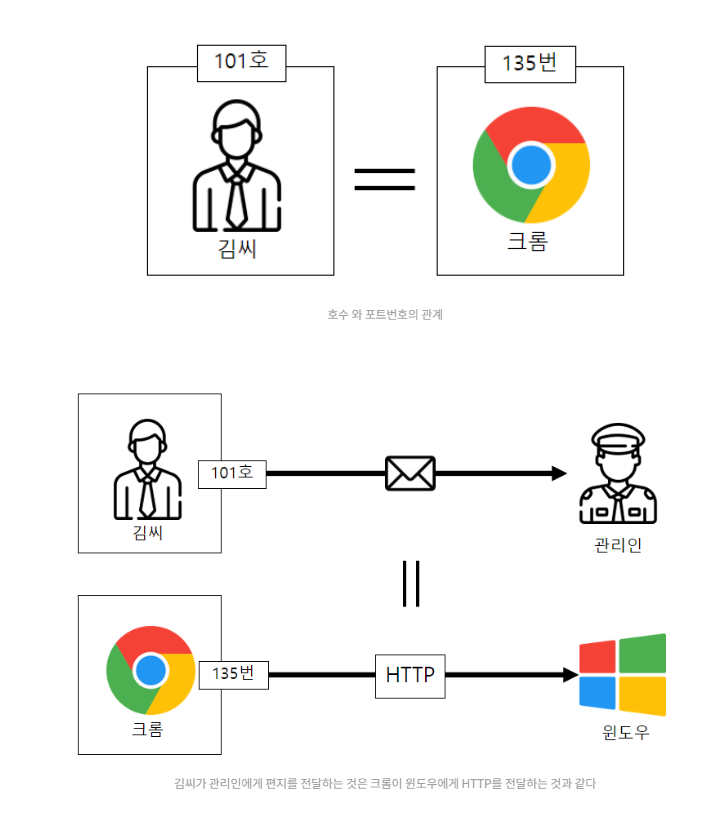
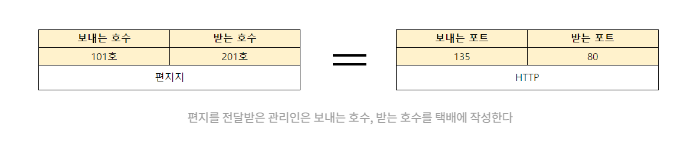
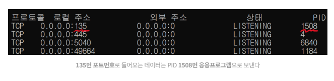
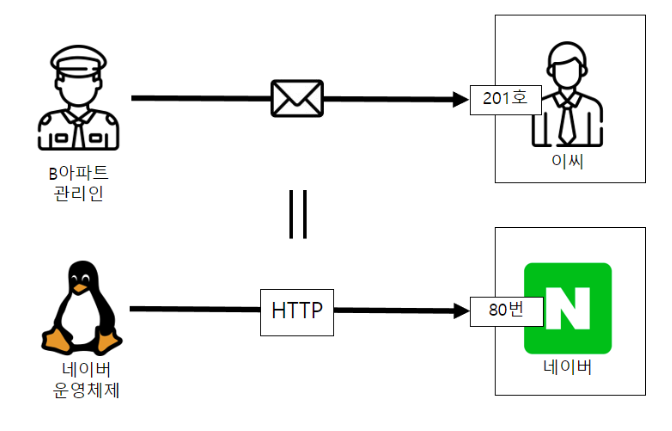
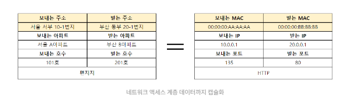
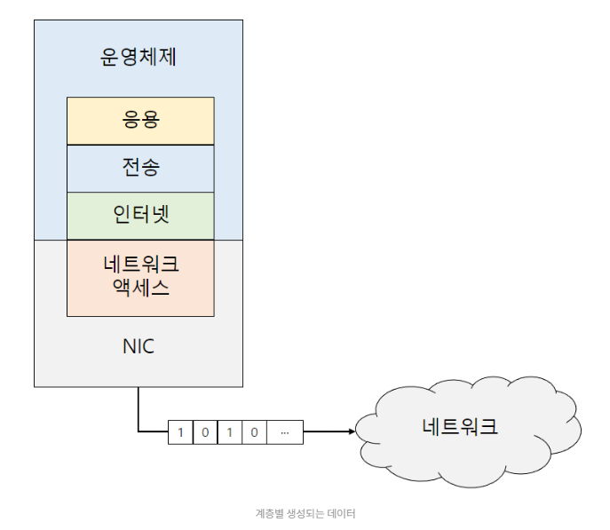
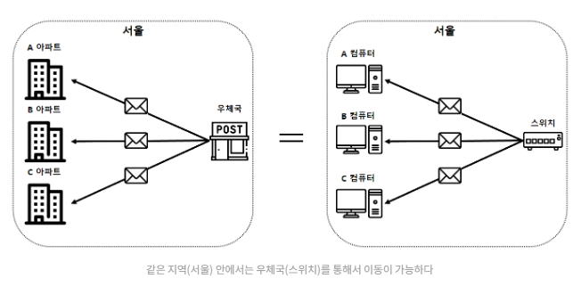
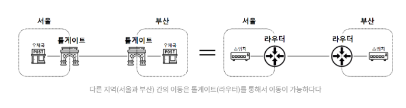
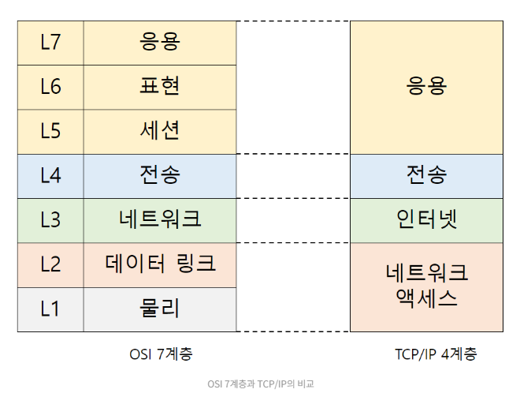
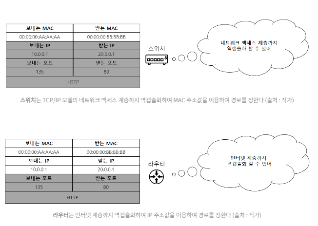

`택배 배송 과정으로 알아보는 엄청 쉬운 컴퓨터 네트워크` 글의 다음편이다. 에전 글에서 본 내용이 `인터넷에서 어떤식으로 이루어지는지`를 보았고, 내용을 정리해보았다.

# 응용게층에서 벌어지는 일

이전 글에서 서울 A 아파트에서 사는 김씨가 편지를 택배로 부쳐 부산 C 아파트의 박씨에게 보내는 과정을 살펴보았다.  
컴퓨터에서는 크롬과 같은 `응용프로그램(애플리케이션)`이 데이터를 생성하는 주체이다.  
  
사람이 안부를 묻기 위해 `편지`를 작성하듯, 웹 브라우저(애플리케이션)는 화면에서 필요한 데이터를 요청하기 위해 `HTTP 데이터`를 생성한다. 4단계 중 데이터를 생성하는 이 단계는 `응용(애플리케이션) 계층` 이라 부른다. 응용프로그램에서 데이터가 생성된다는 의미를 담고 있다.

# 전송계층에서 벌어지는 일

생성된 데이터는 이제 이걸 필요로 하는 자에게 전송되어야 한다. 그 전에, 어디로 데이터를 보내는지 `주소`를 입력하는 과정이 필요하다. 김씨의 편지를 전달받은 `관리인`은, 편지를 택배로 감싼 후(캡슐화), `101동 김씨가 201동 박씨로 보내는 편지`라는 정보를 택배 위에 작성한다. 이는 크롬이라는 `응용프로그램`이 페이지 요청을 위해 `HTTP(편지) 를 운영체제`에 보내는 것과 같다.

  
운영체제는 네트워크 통신을 원하는 `응용 프로그램`에게 `포트번호`를 할당함과 동시에 관리를 하고 있다. "netstat" 라는 명령어를 통해 운영체제가 관리하는 포트번호와 프로세스(애플리케이션)의 관계를 알 수 있다.  

마치 아파트 관리인이 편지의 주소를 확인해보니 135호(135번 포트)로 보내는 편지임을 확인하고 김씨(PID 1508) 에게 전달하는 것과 동일하다. 운영체제인 윈도우가, 데이터가 135번 포트로 보내져야 한다는 것을 확인하고, 전달하는 것과 마찬가지이다.  
그렇다면 부산의 B 아파트로 편지가 전달된 경우, 어떻게 이씨에게로 전달이 될까? 김씨의 택배(편지)가 부산의 B아파트로 전달되면, 관리인이 먼저 받게 된다. 그 후, 관리인은 택배에 적힌 `받는 호수`를 확인한 뒤, 이씨에게 전달된다. 이는 데이터가 컴퓨터에게 전달되면, `운영체제`가 데이터의 `받는 포트`를 확안하고 애플리케이션에 전달하는 것과 동일하다.
  
컴퓨터 세계에서 응용프로그램은 데이터를 스스로 가져가지 못한다. 편지를 택배로 보내겠다는 김씨의 요청을 알게 된 배달부는 김씨의 아파트 주소를 직접 확인하고 방문할 수 있지만, 컴퓨터는 `운영체제`를 통해 주소를 확인해야 한다. 김씨의 주소를 확인하려면 아파트 관리인에게 확인해야 하는 상황이라고 생각하면 된다. 배달부는 아파트 관리인을 통해 김씨가 몇 호에 사는지 알 수 있다. 이를 컴퓨터에서는, `운영체제를 통해 포트번호를 알게되는 과정`이라고 볼 수 있다.  
이 과정은 응용프로그램으로 데이터의 송, 수신, 즉 `전송`을 담당하는 단계로, `전송 계층`이라 부른다.

# 인터넷 계층에서 벌어지는 일

그런데 같은 아파트의 201호가 아니라 다른 아파트의 201호라면 어떻게 되는 것인가?  
이씨에게 택배를 전달하기 위해 1차적으로 `호수번호`가 필요했다면, 2차적으로 그 호수번호가 어떤 아파트에 속해 있는 것인지, 그 `아파트 이름`이 필요하다. 그래서 관리인은 보내는 아파트는 서울 A 아파트, 받느 아파트는 부산 B 아파트라고 택배상자 위에 표시한다. 다시 한 번 `캡슐화` 하는 것 이다.

컴퓨터 세계에서는 서울과 부산과 같은 지역을 `네트워크`라 부르고 네트워크와 네트워크의 연결을 `인터넷`이라 부른다. 수많은 네트워크가 연결된, 인터넷에서 특정 주소를 의미하는 단어를 `IP(Internet Protocol) 주소`라고 부른다. 보내는 호수가 적힌 택배를 다시 택배 상자로 감싸 `아파트 주소`를 적는 것은, 인터넷에서 특정 네트워크의 컴퓨터를 식별하기 위해 붙이는 `IP주소`로 빗댈 수 있다.  
이 과정은 인터넷에서 목적지 주소를 찾기 위한 단계로, `인터넷 게층`이라 부른다.  
포트번호를 캡슐화하는 `전송계층`, IP주소를 캡슐화하는 인터넷 계층에 해당하는 `관리인`의 역할을 네트워크에선 `운영체제`가 담당하게 된다.

# 네트워크 계층에서 벌어지는 일

그런데 부산의 B아파트로 보내고자 배달부가 택배상자를 배달하려고 하기 전, 부산에 B아파트라는 동일한 이름이 2곳에 존재한다는 것을 알게 되면 어떻게 될 것 인가?  
아파트 이름만으로는 이씨가 사는 아파트가 어떤 아파트인지 구분할 수 없는 상황이다. 현실에서는 이와 같은 상황에서 `지번`을 이용하여 해결할 수 있다. `부산 서부 10-1번지, 부산 동부 20-1번지`와 같은 땅의 주소를 이용하여 201호 이씨가 살고 있는 B 아파트로 전달하게 전달이 가능하다.  
또한 이씨가 살고 있는 아파트명이 B아파트에서 BB아파트로 변경된다 한들, 땅의 주소는 변하지 않는 `고유한 주소`이다. 컴퓨터 세계에서도 `땅`과 같이 컴퓨터의 고유한 주소를 표시하기 위한 `장치`가 존재하는데, 바로 `NIC(Network Interface Controller)`이다.  
  
NIC는 컴퓨터가 네트워크로 접속하기 위해 반드시 필요한 장치로, 네트워크와 컴퓨터를 이어주는, 즉 `인터페이스` 의 역할을 해주는 장치라는 의미에서 `네트워크 인터페이스 기기`라는 이름을 갖고있다.
  
땅 주소를 표기하는 약속으로 지번, 도로명이 있듯 NIC의 주소를 표기하는 방법으로 가장 많이 이용되고 있는 것은 `이더넷 프로토콜` 이다.  
이더넷 프로토콜은 주소를 표시하기 위해 `MAC(Media Access Control) 주소`를 사용한다. 여기서 미디어(매체)란, 이더넷 케이블, 광섬유 케이블과 같은 `유선`을 의미하거나, 와이파이 같은 `무선`을 의미한다. 즉, 유선이 연결되는 NIC나 무선 와이파이를 송, 수신할 수 있는 와이파이 모듈과 같은 장치를 구분하는 `주소`라는 의미이다.
  
이런 고유한 주소, 즉 MAC 주소 덕분에 데이터가 도달되어야 할 명확한 위치를 찾을 수 있었던 것이다. 이름이 같은 B 아파트 중에서 정확한 B아파트의 위치를 찾아낸 것 처럼 말이다. 이 과정은 네트워크로 나가기 위한 마지막 단계로, 네트워크에 접속한다는 의미에서 `네트워크 액세스 계층`이라 부른다. `관리인`에게 택배를 전달받은 `배달부`가 우체국으로 배달하는 것 처럼, NIC의 역할을 하는 것이다.  
  
데이터가 최종 목적지로 전송되기 위해 필요한, 1차 주소 포트번호, 2차 주소 IP 주소, 그리고 마지막 3차 주소는 MAC 주소인 것이다.
  
지금까지 알아본 4단계(응용, 전송, 인터넷, 네트워크 액세스)를 우리는 `TCP/IP 모델`이라고 부른다.

# 데이터 생성 주체

TCP/IP 4단계를 통해서 네트워크로 내보낼 수 있는 데이터를 생성하였다. 각 단계는 수 많은 네트워크가 연결된 인터넷에서 가고자 하는 목적지를 올바르게 찾아갈 수 있도록 캡슐화 되어 있음을 알게 되었다.
  
그렇다면 이 캡슐화된 데이터는 누가, 어디에서 만드는 것 일까요? 바로 윈도우즈, 리눅스와 같은 운영체제이다. `운영체제`는 사용자의 응용프로그램에서 생성한 데이터를 `응용 -> 전송 -> 인터넷계층` 순서로 단계적으로 캡슐화한 후, NIC로 전달하여 `NIC`에서는 마지막으로 네트워크로 내보내기 전 `네트워크 액세스 계층`으로 캡슐화한다. 이렇게 캡슐화가 완료된 데이터의 이름을 `프레임`이라고 한다. 마지막으로 물리적인 유, 무선 매체를 통해 `비트(bit)` 단위로 전송하게 된다.
  
같은 지역 네트워크에서 올바른 경로를 찾아 택배를 유통해주는 우체국을 컴퓨터 세계에서는 `스위치`라고 한다.

그런데 서울에서 부산으로 보낼 때는 다른 지역의 경로를 찾아 이동할 수 있게 해주는 `라우터` 라는 것이 필요하다.
  
네트워크에서 데이터를 올바른 경로로 이동시키기 위해 스위치, 라우터, 이 2개 장치가 존재한다고 볼 수 있다.
  
흔히 `스위치를 2계층` 장비, `라우터를 3계층` 장비라고 표현한다. 이는 TCP/IP 모델의 부모 격인, `OSI 7계층`의 2계층, 3계층을 의미한다. OSI 7계층에서 2계층은 `데이터링크`, 3계층은 `네트워크`인데, TCP/IP 4계층에서는 각각 `네트워크 액세스`, `인터넷` 계층이라 한다.
  
2계층의 대표적인 프로토콜로는 `MAC 주소`를 이용하여 같은 지역 네트워크(LAN) 의 장치를 식별하는 `이더넷 프로토콜`이 있다. 3계층의 대표적인 프로토콜로는 `IP 주소`를 이용하여 다른 지역 네트워크(WAN) 의 장치를 식별하는 `인터넷 프로토콜(IP)`이 있다.  
  
2계층과 3계층 프로토콜을 이용하여 경로를 찾는다는 의미는, 2계층 프로토콜을 해석하여 이동시켜주는 장치인 `스위치`와 3계층 프로토콜을 해석하여 이동시켜주는 장치인 `라우터`가 존재한다는 의미이다.
  
즉, "몇 계층 장비"라는 것은 `캡슐화`된 데이터를, 장치가 해석할 수 있는 계층까지 `역캡슐화`하여 프로토콜의 내용을 확인하고 경로를 설정해주는 장비라고 볼 수 있다. TCP/IP 에서는 인터넷 계층까지 역캡슐화하느냐, 네트워크 액세스까지 역캡슐화하느냐를 가르는 장비인 것이다.
  
`스위치`는 TCP/IP 모델의 네트워크 액세스 계층까지 역캡슐화하여 MAC 주소값을 이용하여 경로를 정한다. 반면, `라우터`는 인터넷 계층까지 역캡슐화하여 IP 주소값을 이용하여 경로를 정한다.

# 결론

위의 내용으로 데이터가 네트워크를 통해 목적지로 전달되려면 필요한 요소들을 알아보았다. 다음 글은 TCP/IP 모델의 계층별 대표적인 프로토콜을 알아보고, 마지막으로 웹 브라우저를 통해 요즘IT 화면을 요청하면 실제로 어떻게 데이터가 전달되는지 상세히 알아보는 글을 준비해주신다고 한다. 기대가 된다.

# 참고링크

[주니어 개발자를 위한 엄청 쉬운 TCP/IP 4계층 이야기](https://yozm.wishket.com/magazine/detail/1956/?utm_source=stibee&utm_medium=email&utm_campaign=newsletter_yozm&utm_content=contents)
