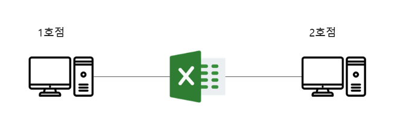
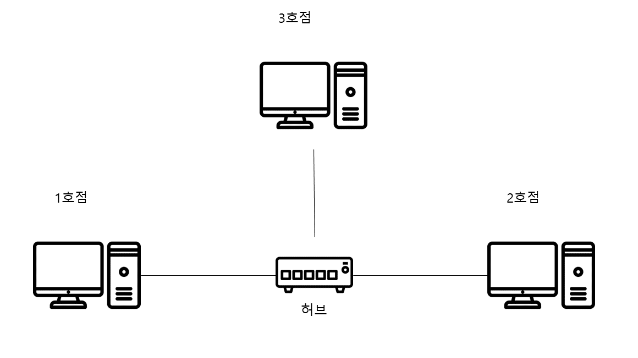
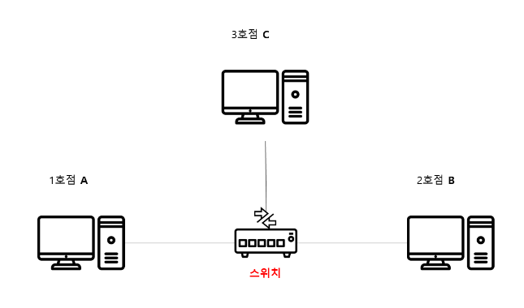
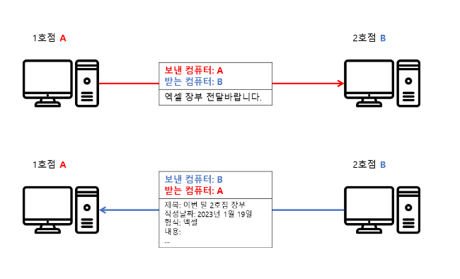
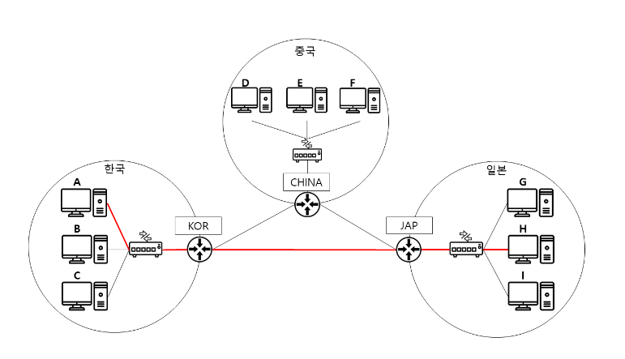

요즘 IT 사이트에서 `주니어 개발자를 위한 엄청 쉬운 네트워크 이야기` 를 보고 글 내용을 정리해보았다.

# 네트워크를 알아야 하는 이유

1. 포트 포워딩

   외부에서 나의 컴퓨터로 접근하기 위해 공유기의 `포트 포워딩` 기능이 필요하다. 공유기 외부IP의 특정포트로 데이터가 들어온다면, 컴퓨터에서 실행중인 웹 서버로 들어오도록 하여 콘텐츠를 제공하는 나만의 웹 서버를 만들 수 있다.

2. 쿠버네티스  
   환경구성을 위해 물리적인 컴퓨터가 여러 대 필요하여, AWS에서 인스턴스를 할당받고 내부망으로 노드들을 연결한 후 오토 스케일링을 하는 등 `네트워크와 관련된 행동`들이 많았다.

글쓴이 분 께서 경험하신 네트워크 지식의 필요성을 느낀 경험 두 가지이다. 나 역시 졸업프로젝트를 진행하면서, Lightsail의 인스턴스에 접속하기 위해 `포트 포워딩`을 해야했다. UMC 개발 동아리에서 배운 포트 포워딩 지식을 실제 상황에서 활용해보니 뿌듯하기도 하였고, 네트워크 지식이 토이 프로젝트 같은 활동을 할 때 필수적이라는 것을 느꼈다.

# 컴퓨터 네트워크

옛날 옛적, 한국의 한 마을에 사는 김씨는 `컴퓨터 마트` 라는 이름으로 마트를 운영하고 있었다. 장사가 잘되자, 마트는 옆 동네까지 진출하였고, 컴퓨터 마트 2호점이 생겼다. 김씨는 컴퓨터 마트 2호점을 운영하면서, 컴퓨터 마트 1호점과 컴퓨터 마트 2호점의 장부를 공유하고 싶었다. 그래서 컴퓨터 마트 1호점과 컴퓨터 마트 2호점의 컴퓨터를 연결하였다. 이렇게 컴퓨터 마트 1호점과 컴퓨터 마트 2호점의 컴퓨터를 연결하여 데이터(액셀로 된 장부)를 보냈고, 이를 `컴퓨터 네트워크`라고 부르기로 한다.


# 약속(프로토콜)을 정하다

각 컴퓨터는 데이터를 주고받는 형식을 지정할 수 있었는데, 2호점에서는 엑셀의 데이터를 `제목, 작성날짜, 형식, 내용` 순서로 보냈다.  
그러나, 내용이 중요하다 생각한 창업자 김씨는, 제목 다음으로 내용을 받도록 데이터 형식을 지정해버렸다.

```py
1. 제목: 이번 달 2호점 장부
2. 내용: 2023년 1월 19일
3. 작성날짜: 엑셀
4. 형식 :
...
```

그래서, 위와 같이 `작성날짜` 데이터가 1호점에 왔을 떄는 `내용` 항목에 들어가게 되어, 내용이 날짜가 된 채로 보이는 황당한 상황을 겪게 된 것이다. 결국, 창업자 김씨는 2호점 주인과 `내용을 두 번째에 넣자는 약속`을 체결하였고, 이러한 약속된 데이터 형식을 `프로토콜`이라고 부르기로 하였다.

# 허브의 등장

컴퓨터 마트는 3호점까지 생겨날 정도로 번창을 하였다. 그러나, 또 문제가 발생하였다. 마트가 두개였을 때는 두 대의 컴퓨터를 직접 연결하였으나, 세 대가 되자 컴퓨터마다 나머지 두 대를 각각 연결할 수 있도록 두 개의 선이 필요했다.  
계속해서 지점이 늘어날 떄마다, 컴퓨터에 선을 연결하게 되면 `연결하는 선이 기하급수 적으로 늘어날 것`이라 생각했다.  
그래서, 컴퓨터끼리 직접적으로 연결하지 않고 `중앙에 하나의 장치를 두기`로 하였다. 중앙에 위치한다는 의미로 `허브`라 부르기로 하였다.
  
허브가 생기니 컴퓨터마다 복잡하게 선을 연결해야 할 필요가 없어졌고, 간단하게 허브 하나로만 연결하면 되었다.

# 스위치의 등장

하지만 문제가 모두 해결된 것은 아니었다. 2호점에서 사과가 많이 팔리는 것을 알게 된 김씨는 컴퓨터 네트워크를 통해 2호점으로 메시지를 보내게 되었다. 그런데, 그만 그 메세지가 허브에 연결된 3호점에게도 전달되었다. 3호점에선 잘 필리지도 않는 사과 물량을 늘려 버린게 된 셈이다.  
이러한 문제를 해결하기 위해 김씨는 `특정 컴퓨터에만 데이터를 전달할 수 있도록 이름을 붙이기로 한다`. 또한 단순하게 데이터 전달만 하던 허브를, 데이터의 `방향 전환`이 가능한 장치로 향상시킨다.  
  
데이터의 `전환`이 가능하다는 의미로 `스위치`라고 부르기로 하였다.  
2호점에만 메세지를 전달하기 위해 프로토콜도 변경해야 했다. `보내는 컴퓨터의 정보`와 `받는 컴퓨터의 정보`를 프로토콜에 추가하여, A에서 B로 장부 요청 시, B에서는 보낸 컴퓨터가 A라는 것을 확인하고, 프로토콜의 받는 컴퓨터로 입력하여, 정확하게 응답할 수 있게 되었다.  


# 세계를 잇는 라우터

시간이 흘러 대기업이 된 컴퓨터 마켓은, 중국와 일본까지 진출하여 각 나라별로 네트워크를 이루게 되었다. 이를 나라마다 `각자의 지역 네트워크를 형성하였다` 하여, `LAN(Local Area Network)` 라 부르기로 하였다.  
네트워크에 통달한 김씨는 이제 각 나라를 연결하여 데이터 통신이 가능해지도록 해야했다. 처음 떠올린 방법은 각 나라의 스위치를 모두 서로 연결하는 것이었다. 그러나, LAN 내부에서 1개씩만 스위치가 늘어나게 되더라도, 엄청나게 복잡해질게 뻔했다.  

그래서, 이러한 문제점은 각 나라를 대표하는 장치를 두어 연결하는 것으로 해결하기로 하였다. 그리고 `나라의 경로를 표시한다는 의미`로 이 장치를 `라우터`라고 부르기로 하였다.  
더불어, `다른 나라로 데이터를 요청`하기 위해 프로토콜을 개선할 필요가 있었다. `보낸 나라와 받은 나라`의 정보가 다음과 같이 포함되어야 했다.

```PY
보낸 컴퓨터 : A
받는 컴퓨터 : H

보낸 라우터 : KOR
받는 라우터 : JAP

제목 : ...
내용 : ...
작성날짜 : ...
형식 : 메세지
```

# 참고링크

[주니어 개발자를 위한 엄청 쉬운 네트워크 이야기](https://yozm.wishket.com/magazine/detail/1875/)
