요즘 IT의 `주니어 개발자를 위한 엄청 쉬운 네트워크 이야기`의 다음 편을 읽어보고 내용을 정리해보았다.

# TCP/IP

> 인터넷에서 사용하는 표준 프로토콜

www.naver.com 을 치고 그 화면을 받을 때까지, 데이터가 4계층에 걸쳐서 만들어지고, 다시 그 4계층을 역으로 거치는 과정이 일어난다. 이 모델을 그림으로 표현하면 아래와 같다.  
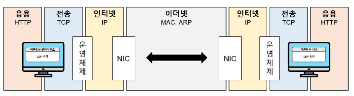  
응용, 전송, 인터넷, 이더넷에 도달한 뒤 다시 거꾸로 인터넷, 전송, 응용을 거치는 과정을 머릿속에 그려보면 된다. 그리고 이 과정에서 각 단계마다 `캡슐화`라는 과정이 일어난다. 이는 데이터가 다음 계층에 의해 감싸지는 것이라고 이해하면 된다. 데이터가 4단계에 걸쳐, 단계에 따라 포장지에 쌓여 생성된 뒤, 다시 거꾸로 그 과정을 거쳐 수신자에게 전달되는 과정에 대한 전반적인 흐름을 이해하는 것이 목표다. 현실 세계에서 `편지를 주고받는 상황`을 생각하면서 흐름을 직관적으로 이해해보자.

# 서울 우체국

`서울` 이라는 `네트워크`에 사는 `김씨`가 같은 네트워크, 즉 같은 서울에 사는 `이씨`에게 `편지를 택배로` 보내고자 한다.  
우선, `같은 지역`에서 김씨의 택배가 어떠한 단계를 거쳐서 이씨를 찾아가는지 알아보자.

## 1단계, 편지 작성

김씨는 이씨에게 전달하고자 하는 글을 `편지지 양식`에 맞춰서 썼다.

```py
[인사말]

[본문]

[맺음말]

					김씨가
```

## 2단계, '보내는 이' 작성

편지를 편지봉투에 넣고, 이 편지를 `보내는 이, 받는 이`를 적어 넣는다.  
편지지를 편지봉투로 감쌌다고 볼 수 있다. 실제 네트워크에서는 다음 계층이 이전 계층을 감싸는 과정이 일어나는데 이를 `캡슐화`라고 부른다. 캡슐화는 내용물을 목적지로 보내기 위해 단계별로 감싸는 행동이다.  
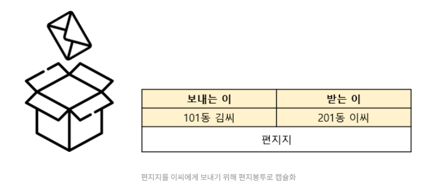

## 3단계, '보낼 곳' 작성

이 편지를 택배 상자에 넣어 `캡슐화`하고, 송장에 이 택배를 받을 아파트를 적어 붙인다.
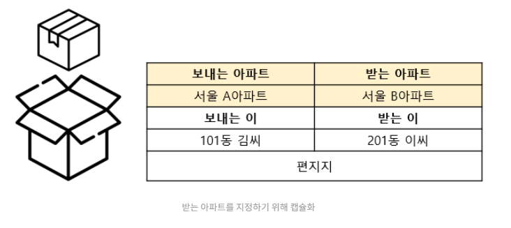

## 4단계, '주소지' 할당

김씨의 편지가 서울 우체국에 도착하였다. 우체국에서는 송장을 확인해 실제 배달부가 찾아가야 할 주소를 붙여주는 일을 하게 된다. `서울 B아파트는 서울 동부 20-1번지` 라는 식으로 주소를 붙인다. 이 또한 다른 주소가 감싸는 캡슐화라고 할 수 있다.

  
이렇듯 `각 단계가 존재하는 이유`는, `캡슐화`라는 과정을 통해 `이전 단계의 내용물을 다른 곳으로 이동` 시키기 위한 것이라 할 수 있다.

# 역 캡슐화

최종 목적지인 B아파트, "서울 동부 20-1번지" 로 캡슐화한 덕분에, 택배 기사는 정확하게 택배상자를 전달할 수 있었습니다. B아파트에서는 다음 과정을 통해 이씨에게 편지가 최종적으로 전달이 된다.  
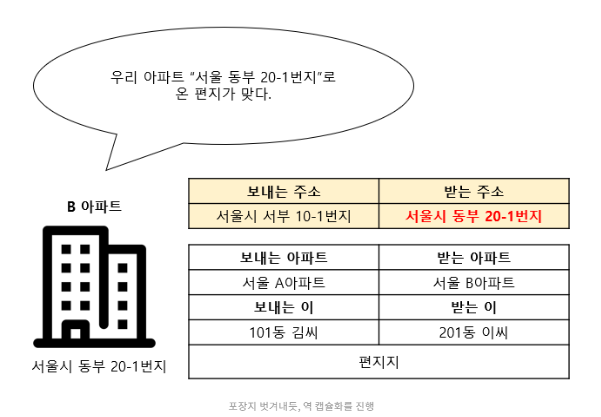

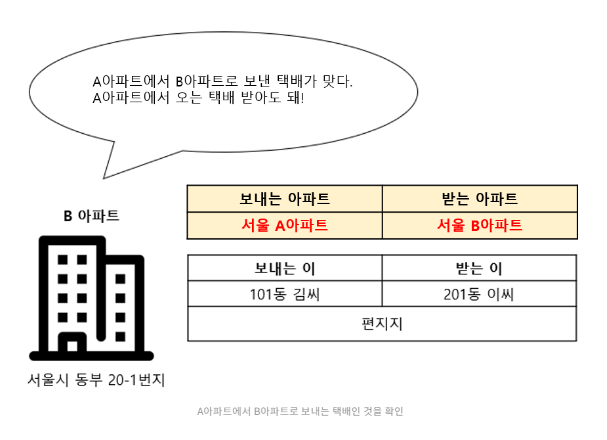

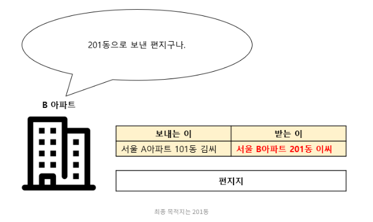

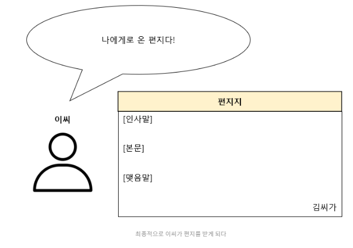  
이처럼 캡슐화된 내용들을 꺼내면서 목적지를 찾아가는 과정을 캡슐화의 반대라고 하여 `역캡슐화`라고 부른다.  
"편지지 -> 받는 이 -> 받는 곳" 이 과정을 그대로 반대로 하여 "받는 곳 -> 받는 이 -> 편지지" 의 과정을 거쳐서 이씨가 편지를 받을 수 있게 된 것 이다.  
그렇다면, 서울이 아닌 `다른 도시로의 전달`은 어떻게 이루어질까?

# 도시 간의 편지 전달

이번엔 부산의 C아파트 박씨에게 택배를 보내려고 한다. 서울 우체국 까지의 과정은 동일하다.  
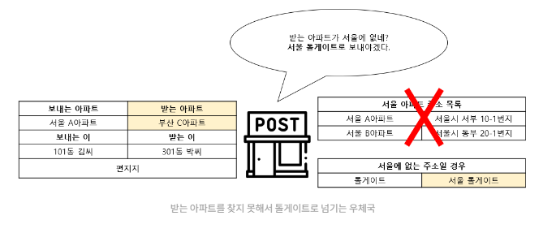  
같은 지역, 서울에 있는 살마에게 보내는 택배가 아니다 보니, 서울 우체국에서 해결할 수가 없다. 그래서 서울에서 밖으로 나가려면 `반드시 통해야` 하는 `서울 톨게이트`를 `받는 곳`으로 하여 전달하게 된다.  
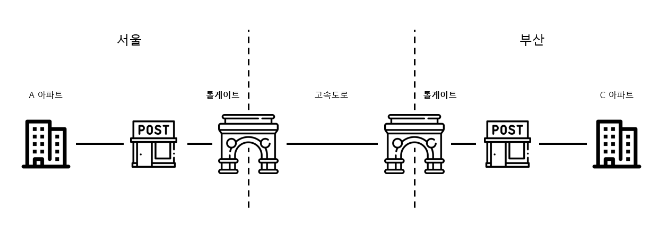  
서울 톨게이트는 `받는 곳`을 확인하여 본인에게 전달된 것이 맞는지 확인한다. 그 뒤 톨게이트에 연결된 여러 고속도로 중, 부산으로 이어지는 곳이 있는지 찾은 후 해당 고속도로로 택배상자를 전달하게 된다.  
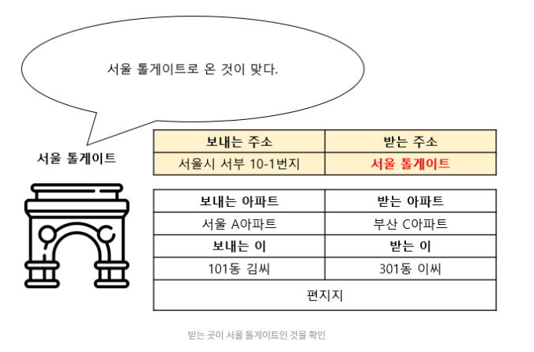  
톨게이트는 고속도로로 반드시 이어져 있어서, 받는 곳을 따로 지정하여 캡슐화를 하지 않고, 해당 고속도로 방면으로 보내기만 하면 된다.  
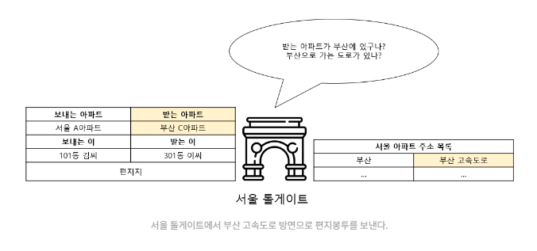  
부산 고속도로와 이어져 있는 부산 톨게이트에서는 부산으로 전달해야 하는 택배인 것을 알고 부산 우체국으로 전달한다.  
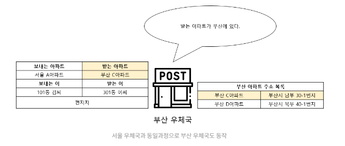  
부선 우체국에서는 서울 우체국과 동일한 과정으로 동작을 한다. 부산 C 아파트가 부산에 있다는 것을 알고 정확한 `주소지`를 할당해주고, 역캡슐화 과정을 통해 박씨에게 편지가 전달될 수 있다.  
네트워크에서 `LAN(Local Area Network)`를 `같은 지역`이라 할 수 있고, 다른 지역으로 넘어가는 것을 `WAN(Wide Area Network)` 라고 하여, 같은 지역에서의 연결이 아닌, 지역과 지역의 `넓은 연결`을 의미한다.  
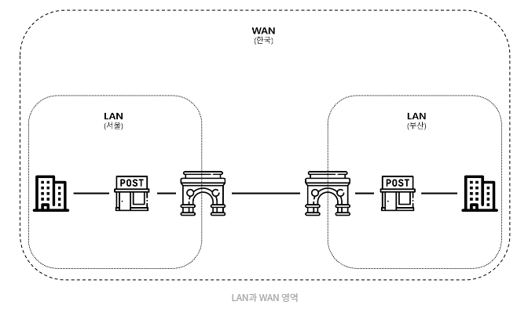  
네트워크가 컴퓨터 간의 통신을 의미하는 것 처럼, 현실에서도 사람과 사람, 사람과 회사, 회사와 회사 등 많은 것들이 연결되어 통신하고 있다.  
다음 편에서는 `데이터의 캡슐화 4단계가 컴퓨터 세계에서는 어떻게 이루어지는지` 알아보자.

# 참고링크

[택배 배송 과정으로 알아보는 엄청 쉬운 컴퓨터 네트워크](https://yozm.wishket.com/magazine/detail/1906/)
