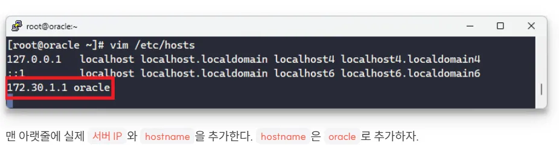
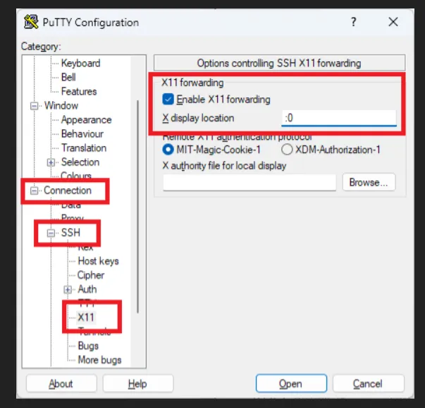
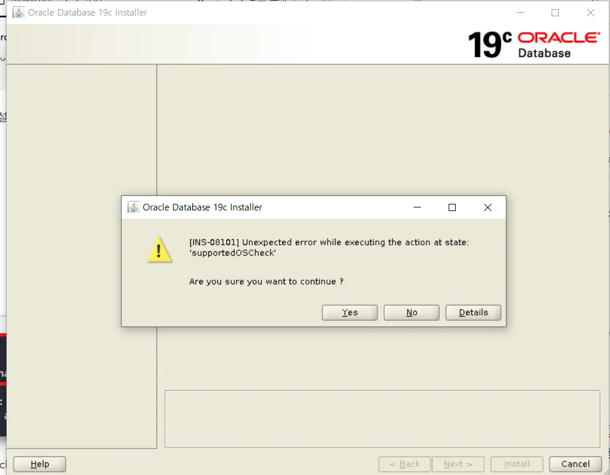

[[Oracle] Linux RHEL 8.8에 Oracle Database 19c 설치 방법 총정리](https://acredev.tistory.com/62#6.%20oracle%20%EC%82%AC%EC%9A%A9%EC%9E%90%20%EB%B0%8F%20%EA%B7%B8%EB%A3%B9%20%EC%83%9D%EC%84%B1%20%EB%B0%8F%20%EC%84%A4%EC%A0%95-1)

오라클 설치가 힘든 이유?

→ 운영 체제, 기타 다른 요소들과 충돌하여 발생

→ 설치중 문제가 발생한다면 해결하기 힘듦

그래서, 오라클 설치 사전 절차가 중요!

```bash
1. 시스템 요구사항 
2. 운영 체제 요구 사항
3. 운영 체제 커널 파라미터 
4. 필요한 디렉토리 생성
5. 운영 체제 유저/그룹 생성
```

## 시스템 요구사항

- 메모리 : 최소 1GB, 권장 : 2GB 이상
- 가상 메모리 : 메모리의 1.5배
- 디스크 공간 : /oracle - 50GB ~ 100GB
- 임시공간 : 1GB
- 시스템 비트 : 64 bit

### 메모리, 가상 메모리 확인

```bash
# grep MemTotal /proc/meminfo
# grep SwapTotal /proc/meminfo
```

### 디스크 공간 확인

```bash
# df -h
```

### 운영체제 버전 확인

```bash
# uname -r -> 리눅스 버전 확인
# cat /etc/redhat-release -> 리눅스 종류 확인
```

## 가장 먼저 해야할 것

- 블로그 2번. host 및 hostname 설정 변경
- 블로그 3번. THP 비활성화

책에선 나오지 않는다

```bash
# ifconfig를 통해 ip 주소를 알아낸다음 다음 사진처럼 기입

# vim /etc/hosts
```



## 운영체제 요구사항

해당 운영체제에서 필요한 운영 체제 버전과 필요한 패키지, 서비스 팩 및 패치

자바 설치 TS + 19c 설치 블로그에서 4,5 번 항목 참조

## 운영체제 커널 파라미터

```bash
/sbin/sysctl - a | grep sem
/sbin/sysctl - a | grep shm
/sbin/sysctl - a | grep file-max
/sbin/sysctl - a | grep ip_local_port_range
```

## 필요한 디렉토리 생성(리눅스/유닉스)

오라클 사용자의 기본 디렉토리(home directory) 와 오라클이 설치될 위치 정하고 해당 디렉토리 생성

```bash
# mkdir -p /oracle
# chown -R oracle:oinstall /oracle

# mkdir -p /grid
# chown -R grid:oinstall /grid
```

## 운영체제 유저/그룹 생성(리눅스)

필요한 디렉토리 생성 + 유저/그룹 생성 → 블로그 참고

## 이후 설정

블로그 8. SELINUX 해제

그리고 그 이후부턴 쭉 블로그 참고하는 게 더 나을듯 하다

책은 12c이고, 블로그는 19c이기도 하고, 저번 성공사례가 있기도 하기 때문

다시 한번, 트러블 슈팅 내용 기반으로 필요한 절차들을 정리해보자

### Putty X11 Forwarding 설정

[[Linux] Xming과 PuTTY를 이용하여 X11 Forwarding 접속 설정방법](https://acredev.tistory.com/61)

```bash
# export DISPLAY=127.0.0.1:0.0
-> 여기서 중요한 부분은 :0.0 을 생략하면 안된다!

# dnf install firefox

# 설치 후 경로 확인
# which firefox
# 결과가 /usr/bin/firefox와 같은 값으로 반환되면 설치가 제대로 완료된 것
```

1. Xming 설치 후 실행

[Xming X Server for Windows](https://sourceforge.net/projects/xming/)

2. Putty 설정



3. Linux 서버 설정

```bash
# cat /etc/ssh/sshd_config | grep X11
```


위의 설정을 모두 끝내면, 비로소 firefox 가 실행된다

### Oracle Database 19c 설치

[Database Software Downloads | Oracle](https://www.oracle.com/database/technologies/oracle-database-software-downloads.html)

`Linux.X64_193000_db_home.zip` 다운로드 후, $ORACLE_HOME 경로로 복사

블로그에는 없는 이 오류해결법

→ ./runInstaller 실행 시, 다음 오류 발생



블로그에서는 

```bash
$ export CV_ASSUME_DISTID=RHEL7.6
```

8 환경에서는 INS-08101 오류 출력 가능성이 높다고 한다.

하지만, 실제로는 본 RHEL 버전 그대로 맞춰주면 해결된다

```bash
$ export CV_ASSUME_DISTID=RHEL8.8
```

## 오라클 데이터베이스 요소

설치 다음엔, 데이터베이스 생성을 해줘야한다

→ **데이터베이스의 기본 요소들을 정확히 생성하는 것이 중요!!**

### 데이터 파일

실제 데이터베이스의 데이터가 저장되는 공간

### 컨트롤 파일

데이터베이스의 내부적 변경을 제어하는 파일

### 리두 로그 파일

데이터의 변경에 대한 로그를 기록하는 파일

### 기타 파일

동적/정적 파라메터 파일 등

데이터 파일, 컨트롤 파일, 리두 로그 파일은 필수!!!

## 수동 데이터베이스 생성

```bash
1. 파라메터 파일 생성
2. 데이터베이스 생성
3. 필요 스크립트 수행
4. 데이터베이스 생성 완료
```

### 파라메터 파일 생성

두 가지 종류의 파라메터 파일 존재

1. 정적 파라메터 파일
- 텍스트 파일 형태
- 오라클 환경 변수의 변경을 위해 사용자가 해당 파일을 직접 수정 가능

1. 동적 파라메터 파일
- 바이너리 파일
- SQL 문장을 통해 오라클 환경 변수 값이 해당 파라메터 파일에 자동으로 적용이 가능

데이터베이스 생성을 위해서는 둘 중 하나만 존재하면 된다.

만약, 동적 파라미터 파일을 사용한다면?

- 환경 변수 변경 작업 시, DB를 재기동하지 않아도 되지만, 모든 환경 변수에 적용되는 것은 아님!
- 마찬가지로, 정적 파라메터 파일을 사용하더라도, 재기동 없이 변경 사항을 적용시킬 수 있으나, 동적 파라메터 파일을 사용하는 것보다 더 많은 환경 변수에 대해 변경 후 재기동을 수행해야함
- 물론, 정적 파라메터 파일의 환경 변수를 재기동 없이 변경하여 운영 중에 사용했다면, 해당 정적 파라메터 파일에 변경된 호나경 변수 내용을 적용해야 다음 재기동 시 변경된 값이 적용됨
- 둘 중 더 좋은 것은 없다

```bash
SID : 데이터베이스 인스턴스 이름
ORACLE_HOME : 오라클 엔진이 설치되어 있는 위치
```

정적 파라메터 파일 위치

```bash
$ORACLE_HOME/dbs 밑에 init<SID>.ora로 수동 생성
```

나 같은 경우엔, 

```bash
ORACLE_SID=orcl
```

### 데이터베이스 생성

생성하려면 노마운트 상태여야 한다.

데이터베이스  생성을 위해 노마운트 상태를 만들기 위해서는 파라메터 파일만 존재하면 가능!

또한, `SYSDBA` 권한으로 해당 DB를 접속해야한다

p.54 에 설치에 필요한 디렉토리 생성

→ 이미 블로그 따라 설치를 하니, 디렉토리들은 모두 생성되어있는 것 같아서 생략

```bash
> id 
[oracle@oracle ~]$ id
uid=65535(oracle) gid=65535(oinstall) groups=65535(oinstall),10(wheel),65536(dba),65537(oper),65538(backupdba),65539(dgdba),65540(kmdba),65541(racdba)

> sqlplus '/as sysdba' -> sysdba 권한으로 접속

SQL> STARTUP NOMOUNT
```

노마운트 상태로 데이터베이스 오픈을 시도하였지만, 다음 오류 발생

```sql

SQL> STARTUP NOMOUNT
ORA-01081: cannot start already-running ORACLE - shut it down first

```

이럴땐,

```sql
SQL> shutdown immediate;
SQL> startup
```

이런식으로 해결 가능

- 그림으로 공부하는 오라클 구조
    
    Ch5. 오라클의 기동/정지의 개요
    
    오라클 기동 4단계
    
    ```sql
    OPEN : 데이터 처리를 할 수 있는 상태
    MOUNT : 데이터 파일에 접근할 수 있는 상태 (컨트롤 파일 읽은 상태)
    NOMOUNT : 백그라운드 프로세스와 공유 메모리가 존재하는 상태
    SHUTDOWN : 정지 상태
    ```
    
    **인스턴스 == 백그라운드 프로세스 + 공유 메모리**
    
    보통 환경에서는 인스턴스와 데이터베이스는 일대일 대응
    
    하지만, RAC(Real Application Clusters) 는 인스턴스와 데이터베이스가 일대일 대응 X
    
    ## 기동 처리의 흐름과 내부 동작
    
    ### 기동 정지 상태에서 NOMOUNT로 전환
    
    ```sql
    SQL> startup nomount
    
    ORACLE instance started
    ```
    
    실행 시, ORACLE_HOME과 ORACLE_SID 환경 변수를 토대로 **초기화 파라미터 파일**을 찾아서 읽어옴
    
    파라미터 파일 위치 → ORACLE_HOME (오라클이 설치된 경로) → /dbs 경로
    
    파일에서 읽어온 파라미터를 토대로 **공유 메모리(버퍼 캐시나 공유 풀) 확보 + 백그라운드 프로세스 생성**
    
    ### NOMOUNT에서 MOUNT로 전환
    
    ```sql
    SQL> alter database mount;
    
    Database mounted;
    ```
    
    초기화 파라미터에 기술된 파일의 경로를 사용해 `컨트롤 파일`을 열어 내용을 읽어오는 것
    
    → REDO 로그 파일이나 데이터 파일의 위치를 파악
    
    → 위치만 파악하는 것이므로, 파일이 없어도 에러 발생 X
    
    ### MOUNT에서 OPEN
    
    ```sql
    SQL> alter database open;
    
    Database opened;
    ```
    
    데이터 파일을 열어서 간단한 점검 실시, 백그라운드 프로세스 가동
    
    기동 정지 상태에서 `startup` 입력하면 바로 SHUTDOWN → OPEN
    
    ## shutdown 옵션 및 동작
    
    | 옵션 | 커넥션의 종료를 기다리는가? | 변경된 데이터를 데이터 파일에 기록하는가? |
    | --- | --- | --- |
    | 없음(기본) | 커넥션의 종료를 기다린다 | Yes |
    | transactional | 트랜잭션이 끝나는 것을 기다린다
    트랜잭션이 끝나면 커넥션 끊어버림 | Yes |
    | immediate | No. 커밋하지 않은 데이터는 없어진다 | Yes |
    | abort | No. 커밋하지 않은 데이터는 없어진다 | No |
    
    ### 인스턴스 복구
    
    데이터파일에 기록되지 않은 데이터는 REDO 로그 파일의 데이터 사용해서 복구함
    
    OS 장애나 서버 장비의 장애 등 오라클이 비정상적으로 종료했을 때도 수행함
    

CREATE DATABASE문이 끝나면 OPEN 상태로 자동 전환된다.

```sql
SQL> shutdown;
Database closed.
Database dismounted.
ORACLE instance shut down.
SQL> startup nomount;
ORACLE instance started.

Total System Global Area  746583112 bytes
Fixed Size                  9139272 bytes
Variable Size             494927872 bytes
Database Buffers          239075328 bytes
Redo Buffers                3440640 bytes
SQL> create database orcl
  2  user sys identified by oracle
  3  user system identified by oracle
  4  logfile group 1 ('/data1/redo01a.log') size 50M,
  5  group 2 ('/data2/redo02a.log') size 50M,
  6  group 3 ('/data3/redo03a.log') size 50M
  7  maxlogfiles 50
  8  maxlogmembers 5
  9  maxdatafiles 1000
 10  maxinstances 1
 11  character set K016MSWIN949
 12  national character set AL16UTF16
 13  datafile '/data1/system_01.dbf' size 2000M reuse
 14  extent management local
 15  sysaux datafile '/data1/sysaux_01.dbf' size 2000M reuse
 16  default tablespace tbs_1 datafile '/data1/tbs_01.dbf' size 100M
 17  default temporary tablespace temp
 18  tempfile '/data1/temp_01.dbf' size 200M reuse
 19  undo teablespace undotbs1
 20  datafile '/data1/undotbs1_01.dbf' size 100M reuse
 21  autoextend on maxsize unlimited;
create database orcl
*
ERROR at line 1:
ORA-12744: Character set K016MSWIN949 is not allowed as a database character
set.

SQL>

```

shutdown 후, nomount 상태에서 다시 SQL를 돌려봤지만, 위의 에러가 뜸

- ERROR at line 1:
ORA-12744: Character set K016MSWIN949 is not allowed as a database character
set.
    
    [오라클.Character Set 이 KO16MSWIN949 인 경우 다국어 입력 방법](https://godreem.tistory.com/entry/%EC%98%A4%EB%9D%BC%ED%81%B4Character-Set-%EC%9D%B4-KO16MSWIN949-%EC%9D%B8-%EA%B2%BD%EC%9A%B0-%EB%8B%A4%EA%B5%AD%EC%96%B4-%EC%9E%85%EB%A0%A5-%EB%B0%A9%EB%B2%95)
    
    아.. 바보였다.
    
    KO16MSWIN949다..
    

- ERROR at line 1:
ORA-65008: missing or invalid SEED clause
    
    ```sql
    create database orcl
    user sys identified by oracle
    user system identified by oracle
    logfile group 1 ('/data1/redo01a.log') size 50M,
    group 2 ('/data2/redo02a.log') size 50M,
    group 3 ('/data3/redo03a.log') size 50M
    maxlogfiles 50
    maxlogmembers 5
    maxdatafiles 1000
    maxinstances 1
    character set KO16MSWIN949
    national character set AL16UTF16
    datafile '/data1/system_01.dbf' size 2000M reuse
    extent management local
    sysaux datafile '/data1/sysaux_01.dbf' size 2000M reuse
    default tablespace tbs_1 datafile '/data1/tbs_01.dbf' size 100M
    default temporary tablespace temp
    tempfile '/data1/temp_01.dbf' size 200M reuse
    undo tablespace undotbs1
    datafile '/data1/undotbs1_01.dbf' size 100M reuse
    autoextend on maxsize unlimited;
    ```
    
    이제는 오타가 없을 줄 알았는데, 오류 발생
    
    The error `ORA-65008: missing or invalid SEED clause` occurs because Oracle Multitenant Architecture is enabled by default in Oracle Database 12c and later versions. In this architecture, a database is either a Container Database (CDB) or a Pluggable Database (PDB), and the creation of a CDB requires a `SEED` clause to define the seed database.
    
    To fix this issue, you should decide whether you want to create a non-CDB database (legacy architecture) or a CDB database. Here's how to handle each case:
    
    → non-cdb db 생성을 위해, init.ora 파라메타 파일을 변경하거나, multitenancy 가 disabled 되도록 SQL 문을 수정!
    
    ```sql
    CREATE DATABASE orcl
    USER sys IDENTIFIED BY oracle
    USER system IDENTIFIED BY oracle
    LOGFILE GROUP 1 ('/data1/redo01a.log') SIZE 50M,
            GROUP 2 ('/data2/redo02a.log') SIZE 50M,
            GROUP 3 ('/data3/redo03a.log') SIZE 50M
    MAXLOGFILES 50
    MAXLOGMEMBERS 5
    MAXDATAFILES 1000
    MAXINSTANCES 1
    CHARACTER SET KO16MSWIN949
    NATIONAL CHARACTER SET AL16UTF16
    DATAFILE '/data1/system_01.dbf' SIZE 2000M REUSE EXTENT MANAGEMENT LOCAL
    SYSAUX DATAFILE '/data1/sysaux_01.dbf' SIZE 2000M REUSE
    DEFAULT TABLESPACE tbs_1 DATAFILE '/data1/tbs_01.dbf' SIZE 100M
    DEFAULT TEMPORARY TABLESPACE TEMP
    TEMPFILE '/data1/temp_01.dbf' SIZE 200M REUSE
    UNDO TABLESPACE undotbs1
    DATAFILE '/data1/undotbs1_01.dbf' SIZE 100M REUSE AUTOEXTEND ON MAXSIZE UNLIMITED;
    ALTER SYSTEM SET enable_pluggable_database = false;
    ```
    

- ERROR at line 1:
ORA-02095: specified initialization parameter cannot be modified
    
    
    The error `ORA-02095: specified initialization parameter cannot be modified` occurs because the `enable_pluggable_database` parameter is a static initialization parameter. Static parameters cannot be changed dynamically using the `ALTER SYSTEM` command. Instead, they must be modified in the initialization parameter file (`init.ora`) or the server parameter file (`spfile`) and require a database restart to take effect.
    
    ### Steps to Fix the Issue
    
    1. **Edit the `enable_pluggable_database` Parameter**
        
        Locate the `spfile` or `init.ora` file for your database instance. Depending on whether your Oracle instance is using an SPFILE or PFILE:
        
        - If using an **SPFILE**:
        Use the `ALTER SYSTEM` command to update the parameter and restart the database.
            
            ```sql
            sql
            코드 복사
            ALTER SYSTEM SET enable_pluggable_database = FALSE SCOPE=SPFILE;
            
            ```
            
        - If using a **PFILE**:
        Open the `init.ora` file (located in the `$ORACLE_HOME/dbs` directory on Unix or `%ORACLE_HOME%\database` on Windows) and add or update the line:
            
            ```
            plaintext
            코드 복사
            enable_pluggable_database = false
            
            ```
            
    2. **Restart the Oracle Database**
        
        After modifying the parameter in the appropriate configuration file, restart the database to apply the changes:
        
        ```bash
        bash
        코드 복사
        # Stop the database
        sqlplus / as sysdba
        SHUTDOWN IMMEDIATE;
        
        # Start the database
        STARTUP;
        
        ```
        
    3. **Run the `CREATE DATABASE` Command Again**
        
        After restarting the database with `enable_pluggable_database = false`, execute your `CREATE DATABASE` command to create a non-CDB database.
        
    
    ---
    
    ### Verify the Parameter Change
    
    After restarting, confirm that the `enable_pluggable_database` parameter is set to `FALSE`:
    
    ```sql
    sql
    코드 복사
    SHOW PARAMETER enable_pluggable_database;
    
    ```
    
    This should return:
    
    ```
    plaintext
    코드 복사
    NAME                                 TYPE        VALUE
    ------------------------------------ ----------- --------------------
    enable_pluggable_database            boolean     FALSE
    
    ```
    
    Once confirmed, rerun your `CREATE DATABASE` command. Let me know if you encounter further issues!
    

이미 control file이 있다고 해서, 한번 기존 db를 지우고 책에 나와있는 query 를 써서 새 db를 만들어보고 싶다.

- 기존 DB 아예 삭제 후, 새 DB 생성
    
    To completely delete the existing Oracle database files and create a brand-new database, follow these steps:
    
    ---
    
    ### **1. Stop the Oracle Instance**
    
    Before removing files, ensure the database instance is stopped to prevent file locks or conflicts.
    
    ```bash
    bash
    코드 복사
    sqlplus / as sysdba
    SHUTDOWN IMMEDIATE;
    EXIT;
    
    ```
    
    If the instance is already stopped, you can skip this step.
    
    ---
    
    ### **2. Locate Existing Database Files**
    
    Identify all the files related to the existing database. These typically include:
    
    1. **Control Files**: Locations are specified in the parameter `CONTROL_FILES`.
        
        ```sql
        sql
        코드 복사
        SHOW PARAMETER control_files;
        
        ```
        
    2. **Data Files and Temp Files**: Located in the directories specified during database creation.
    3. **Redo Log Files**: Found in the `LOGFILE` locations specified during database creation.
    
    Default locations for these files are typically under `$ORACLE_BASE/oradata/<DB_NAME>`.
    
    ---
    
    ### **3. Remove Existing Database Files**
    
    Delete all the files associated with the database. Use the paths obtained in step 2 or common default paths:
    
    ```bash
    bash
    코드 복사
    # Example paths
    rm -rf /oracle_db/oracle/oradata/ORCL/*
    rm -rf /oracle_db/oracle/flash_recovery_area/ORCL/*
    
    ```
    
    ⚠️ **Be very careful when using `rm -rf` commands. Double-check the paths to avoid accidental deletion of unrelated files.**
    
    ---
    
    ### **4. Remove the Database Entry (Optional)**
    
    If the database entry still exists in Oracle's configuration, remove it using the `DBCA` (Database Configuration Assistant) or manually.
    
    ### Using DBCA:
    
    ```bash
    bash
    코드 복사
    dbca
    
    ```
    
    - Choose "Delete a Database."
    - Select the database to delete and follow the prompts.
    
    ---
    
    ### **5. Create a New Database**
    
    With the old files removed, proceed to create a new database. You can use `CREATE DATABASE` in SQL or the `DBCA` tool:
    
    ### Using `CREATE DATABASE` SQL Command:
    
    ```sql
    sql
    코드 복사
    CREATE DATABASE orcl
    USER sys IDENTIFIED BY oracle
    USER system IDENTIFIED BY oracle
    LOGFILE GROUP 1 ('/data1/redo01a.log') SIZE 50M,
            GROUP 2 ('/data2/redo02a.log') SIZE 50M,
            GROUP 3 ('/data3/redo03a.log') SIZE 50M
    MAXLOGFILES 50
    MAXLOGMEMBERS 5
    MAXDATAFILES 1000
    MAXINSTANCES 1
    CHARACTER SET KO16MSWIN949
    NATIONAL CHARACTER SET AL16UTF16
    DATAFILE '/data1/system_01.dbf' SIZE 2000M REUSE EXTENT MANAGEMENT LOCAL
    SYSAUX DATAFILE '/data1/sysaux_01.dbf' SIZE 2000M REUSE
    DEFAULT TABLESPACE tbs_1 DATAFILE '/data1/tbs_01.dbf' SIZE 100M
    DEFAULT TEMPORARY TABLESPACE TEMP
    TEMPFILE '/data1/temp_01.dbf' SIZE 200M REUSE
    UNDO TABLESPACE undotbs1
    DATAFILE '/data1/undotbs1_01.dbf' SIZE 100M REUSE AUTOEXTEND ON MAXSIZE UNLIMITED;
    
    ```
    
    ### Using DBCA:
    
    1. Launch DBCA:
        
        ```bash
        bash
        코드 복사
        dbca
        
        ```
        
    2. Select "Create a Database."
    3. Follow the prompts to configure and create the database.
    
    ---
    
    ### **6. Verify the New Database**
    
    After creation, ensure the database is functional:
    
    1. Start the database:
        
        ```bash
        bash
        코드 복사
        sqlplus / as sysdba
        STARTUP;
        
        ```
        
    2. Confirm the database is running:
        
        ```sql
        sql
        코드 복사
        SELECT name FROM v$database;
        
        ```
        
    
    ---
    
    Let me know if you encounter further issues!
    

아예 새로운 `initorcl.dba` 파라미터 파일을 `$ORACLE_HOME/dbs` 경로 내에 생성해줌

하지만 다음 오류 발생

- ORA-09925: Unable to create audit trail file
Linux-x86_64 Error: 2: No such file or directory
Additional information: 9925
    
    다음과 같이 initorcl.ora 파일 생성함
    
    ```bash
    compatible='12.1.0.1'
    
    db_name=ORCL
    instance_name=ORCL
    control_files='/data1/control01.ctl'
    db_block_size=8192
    db_cache_size=800M
    large_pool_size=64M
    log_buffer=1048576
    shared_pool_size=500M
    undo_management=AUTO
    undo_tablespace=UNDOTBS1
    diagnostic_dest=/oracle_db/oracle/oradata
    pga_aggregate_target=200m
    audit_file_dest=$ORACLE_BASE/admin/ORCL/adump
    audit_trail=none
    ```
    
    The error `ORA-09925: Unable to create audit trail file` occurs because Oracle cannot create or access the directory specified in the `audit_file_dest` parameter. This usually happens when:
    
    1. The directory specified in `audit_file_dest` does not exist.
    2. Oracle does not have the necessary permissions to write to the directory.
    
    ---
    
    ### Steps to Resolve
    
    ### **1. Verify the Directory Path**
    
    Check if the directory specified in `audit_file_dest` exists:
    
    ```bash
    bash
    코드 복사
    ls -ld $ORACLE_BASE/admin/ORCL/adump
    
    ```
    
    If the directory does not exist, create it:
    
    ```bash
    bash
    코드 복사
    mkdir -p $ORACLE_BASE/admin/ORCL/adump
    
    ```
    
    ### **2. Set Correct Permissions**
    
    Ensure the Oracle database process has the necessary permissions to access the directory:
    
    ```bash
    bash
    코드 복사
    chown -R oracle:oinstall $ORACLE_BASE/admin/ORCL/adump
    chmod -R 750 $ORACLE_BASE/admin/ORCL/adump
    
    ```
    
    Replace `oracle:oinstall` with the appropriate user and group for your Oracle installation if different.
    
    ---
    
    ### **3. Verify and Restart**
    
    After making the changes:
    
    1. Restart the database:
        
        ```bash
        bash
        코드 복사
        sqlplus / as sysdba
        SHUTDOWN IMMEDIATE;
        STARTUP;
        
        ```
        
    2. Confirm the database starts without errors.
    
    ---
    
    ### Optional: Modify the `audit_file_dest` Path
    
    If the `$ORACLE_BASE` variable is not correctly set, consider using an absolute path for `audit_file_dest`. For example:
    
    ```
    plaintext
    코드 복사
    audit_file_dest='/oracle_db/admin/ORCL/adump'
    
    ```
    
    Update the `initorcl.ora` file with the correct absolute path and restart the database.
    
    ---
    
    These steps should resolve the issue. Let me know if you encounter additional problems!
    

위의 해결방법을 참고하여, STARTUP NOMOUNT 까지는 성공했다. 하지만, 또 오류 발생

- ERROR at line 1:
ORA-01501: CREATE DATABASE failed
ORA-00200: control file could not be created
ORA-00202: control file: '/data1/control01.ctl'
ORA-27040: file create error, unable to create file
Linux-x86_64 Error: 2: No such file or directory
Additional information: 1
    
    ```sql
    CREATE DATABASE orcl
    USER sys IDENTIFIED BY oracle
    USER system IDENTIFIED BY oracle
    LOGFILE GROUP 1 ('/data1/redo01a.log') SIZE 50M,
            GROUP 2 ('/data2/redo02a.log') SIZE 50M,
            GROUP 3 ('/data3/redo03a.log') SIZE 50M
    MAXLOGFILES 50
    MAXLOGMEMBERS 5
    MAXDATAFILES 1000
    MAXINSTANCES 1
    CHARACTER SET KO16MSWIN949
    NATIONAL CHARACTER SET AL16UTF16
    DATAFILE '/data1/system_01.dbf' SIZE 2000M REUSE EXTENT MANAGEMENT LOCAL
    SYSAUX DATAFILE '/data1/sysaux_01.dbf' SIZE 2000M REUSE
    DEFAULT TABLESPACE tbs_1 DATAFILE '/data1/tbs_01.dbf' SIZE 100M
    DEFAULT TEMPORARY TABLESPACE TEMP
    TEMPFILE '/data1/temp_01.dbf' SIZE 200M REUSE
    UNDO TABLESPACE undotbs1
    DATAFILE '/data1/undotbs1_01.dbf' SIZE 100M REUSE AUTOEXTEND ON MAXSIZE UNLIMITED;
    ```
    
    다음 create database문을 시도하였지만, 오류 발생
    
    → 나의 $ORACLE_HOME은 책 예시와는 다르므로, 이렇게 고쳐서 입력해봤다.
    
    ```sql
    CREATE DATABASE orcl
    USER sys IDENTIFIED BY oracle
    USER system IDENTIFIED BY oracle
    LOGFILE GROUP 1 ('/oracle_db/oracle/oradata/ORCL/redo01a.log') SIZE 50M,
            GROUP 2 ('/oracle_db/oracle/oradata/ORCL/redo02a.log') SIZE 50M,
            GROUP 3 ('/oracle_db/oracle/oradata/ORCL/redo03a.log') SIZE 50M
    MAXLOGFILES 50
    MAXLOGMEMBERS 5
    MAXDATAFILES 1000
    MAXINSTANCES 1
    CHARACTER SET KO16MSWIN949
    NATIONAL CHARACTER SET AL16UTF16
    DATAFILE '/oracle_db/oracle/oradata/ORCL/system_01.dbf' SIZE 2000M REUSE EXTENT MANAGEMENT LOCAL
    SYSAUX DATAFILE '/oracle_db/oracle/oradata/ORCL/sysaux_01.dbf' SIZE 2000M REUSE
    DEFAULT TABLESPACE tbs_1 DATAFILE '/oracle_db/oracle/oradata/ORCL/tbs_01.dbf' SIZE 100M
    DEFAULT TEMPORARY TABLESPACE TEMP
    TEMPFILE '/oracle_db/oracle/oradata/ORCL/temp_01.dbf' SIZE 200M REUSE
    UNDO TABLESPACE undotbs1
    DATAFILE '/oracle_db/oracle/oradata/ORCL/undotbs1_01.dbf' SIZE 100M REUSE AUTOEXTEND ON MAXSIZE UNLIMITED;
    ```
    
    그리고, 파라미터 파일도 바꿔줬다.
    
    To adapt your parameter file for Oracle 19c and align it with the `$ORACLE_HOME` value of `/oracle_db/oracle/oradata/ORCL`, you need to update several paths and parameters to ensure compatibility and proper functioning. Here’s how the modified parameter file should look:
    
    ### Updated Parameter File (`initorcl.ora`):
    
    ```
    
    compatible='19.0.0'
    db_name=ORCL
    instance_name=ORCL
    control_files='/oracle_db/oracle/oradata/ORCL/control01.ctl'
    db_block_size=8192
    db_cache_size=800M
    large_pool_size=64M
    log_buffer=1048576
    shared_pool_size=500M
    undo_management=AUT
    undo_tablespace=UNDOTBS1
    diagnostic_dest=/oracle_db/oracle
    pga_aggregate_target=200M
    audit_file_dest=/oracle_db/oracle/admin/ORCL/adump
    audit_trail=none
    
    ```
    
    ---
    
    ### Key Adjustments:
    
    1. **`compatible`**: Update to match Oracle 19c (`compatible='19.0.0'`) to leverage the features of the new version.
    2. **`control_files`**: Adjust the control file path to match your `$ORACLE_HOME` structure:
        
        ```
        plaintext
        코드 복사
        control_files='/oracle_db/oracle/oradata/ORCL/control01.ctl'
        
        ```
        
    3. **`diagnostic_dest`**: This parameter defines the **base directory** for diagnostic logs. It should point to `/oracle_db/oracle`, as it’s the base directory for `oradata` and other diagnostic files:
        
        ```
        plaintext
        코드 복사
        diagnostic_dest=/oracle_db/oracle
        
        ```
        
    4. **`audit_file_dest`**: Update the path to match the directory structure under `$ORACLE_HOME`. This should align with the convention used in Oracle 19c:
        
        ```
        plaintext
        코드 복사
        audit_file_dest=/oracle_db/oracle/admin/ORCL/adump
        
        ```
        
        Ensure the directory exists and has the proper permissions:
        
        ```bash
        bash
        코드 복사
        mkdir -p /oracle_db/oracle/admin/ORCL/adump
        chown -R oracle:oinstall /oracle_db/oracle/admin/ORCL
        chmod -R 750 /oracle_db/oracle/admin/ORCL
        
        ```
        
    5. **`undo_tablespace` and `undo_management`**: These settings remain the same, as they control undo management for the database.
    6. **Remove Deprecated or Unnecessary Parameters**:
        - Ensure no deprecated parameters (for example, some audit settings) are included. Oracle 19c has some changes in how auditing is handled, but `audit_trail=none` remains valid.
    
    ---
    
    ### Directory Preparations
    
    1. **Verify Base Directory**:
    Ensure that `/oracle_db/oracle` and its subdirectories exist:
        
        ```bash
        bash
        코드 복사
        mkdir -p /oracle_db/oracle/oradata/ORCL
        mkdir -p /oracle_db/oracle/admin/ORCL/adump
        chown -R oracle:oinstall /oracle_db/oracle
        chmod -R 750 /oracle_db/oracle
        
        ```
        
    2. **Set Environment Variables**:
    Confirm that the environment variables point correctly to your Oracle installation:
        
        ```bash
        bash
        코드 복사
        export ORACLE_HOME=/oracle_db/oracle
        export ORACLE_BASE=/oracle_db/oracle
        export PATH=$ORACLE_HOME/bin:$PATH
        export ORACLE_SID=ORCL
        
        ```
        
    
    ---
    
    ### Testing the Updated File
    
    1. **Start Oracle Instance with the New Parameter File**:
        
        ```bash
        bash
        코드 복사
        sqlplus / as sysdba
        STARTUP NOMOUNT PFILE='/oracle_db/oracle/admin/ORCL/initorcl.ora';
        
        ```
        
    2. **Proceed with Database Creation**:
    Run your `CREATE DATABASE` SQL, ensuring all paths match the `$ORACLE_HOME` directory structure.
    
    If everything is configured correctly, the database should create successfully without errors. Let me know if additional adjustments are needed!
    
    4o
    
- **PFILE과 SPFILE**
    
    위의 토글에서 새로운 파라미터 파일로 oracle instance를 실행할 수 있는 방법을 PFILE를 통해 설명한다.
    
    ### PFILE vs SPFILE
    
    인스턴스는 기본적으로 SPFILE를 사용
    
    - PFILE (파라미터 파일)
    
    텍스트 형식으로 저장된 파라미터 파일
    
    텍스트 에디터를 통한 파라미터 수동 변경이 가능
    
    하지만, 변경 반영하기 위해서는 인스턴스를 재기동할 필요가 있다.
    
    PFILE은 데이터베이스 생성할 때나 장애 발생 시 사용
    
    - SPFILE (서버 파라미터 파일)
    
    오라클 9i 이후에 추가된 바이너리 형식의 파라미터 파일
    
    텍스트 에디터를 사용한 변경은 불가능
    
    변경을 위해서는 SQL문(ALTER SYSTEM문)을 사용 
    
    파라미터를 변경할 때는 반영할 범위(현재의 인스턴스만인지, 재기동 후인지, 둘 다 인지) 지정 가능
    
    PFILE 을 사용해 수동으로 생성되거나 데이터베이스를 생성할 때 사용하는 DBCA에 의해 자동으로 생성됨
    
- $ORACLE_HOME 변수명을 헷갈림..바보
    
    ```sql
    export ORACLE_HOSTNAME=oracle
    export ORACLE_UNQNAME=orcl
    export ORACLE_BASE=/oracle_db/oracle
    export ORACLE_HOME=$ORACLE_BASE/product/db_home
    export ORA_INVENTORY=$ORACLE_BASE/oraInventory
    export ORACLE_SID=orcl
    export DATA_DIR=$ORACLE_BASE/app/oradata
    export PATH=/usr/sbin:/usr/local/bin:$PATH
    export PATH=$ORACLE_HOME/bin:$PATH
    export LD_LIBRARY_PATH=$ORACLE_HOME/lib:/lib:/usr/lib
    export CLASSPATH=$ORACLE_HOME/jlib:$ORACLE_HOME/rdbms/jlib
    ```
    
    다음과 같이 수정해야함
    
    orclinit.ora
    
    ```sql
    compatible='19.0.0'
    db_name=ORCL
    instance_name=ORCL
    control_files='/oracle_db/oracle/app/oradata/ORCL/control01.ctl'
    db_block_size=8192
    db_cache_size=800M
    large_pool_size=64M
    log_buffer=1048576
    shared_pool_size=500M
    undo_management=AUTO
    undo_tablespace=UNDOTBS1
    diagnostic_dest=/oracle_db/oracle
    pga_aggregate_target=200M
    audit_file_dest=/oracle_db/oracle/admin/ORCL/adump
    audit_trail=none
    ```
    
    db 접속 후, nomount 실행
    
    ```sql
    sqlplus / as sysdba
    STARTUP NOMOUNT PFILE='/oracle_db/oracle/admin/ORCL/initorcl.ora';
    
    ```
    
    create database문
    
    ```sql
    CREATE DATABASE orcl
    USER sys IDENTIFIED BY oracle
    USER system IDENTIFIED BY oracle
    LOGFILE GROUP 1 ('/oracle_db/oracle/app/oradata/ORCL/redo01a.log') SIZE 50M,
            GROUP 2 ('/oracle_db/oracle/app/oradata/ORCL/redo02a.log') SIZE 50M,
            GROUP 3 ('/oracle_db/oracle/app/oradata/ORCL/redo03a.log') SIZE 50M
    MAXLOGFILES 50
    MAXLOGMEMBERS 5
    MAXDATAFILES 1000
    MAXINSTANCES 1
    CHARACTER SET KO16MSWIN949
    NATIONAL CHARACTER SET AL16UTF16
    DATAFILE '/oracle_db/oracle/app/oradata/ORCL/system_01.dbf' SIZE 2000M REUSE EXTENT MANAGEMENT LOCAL
    SYSAUX DATAFILE '/oracle_db/oracle/app/oradata/ORCL/sysaux_01.dbf' SIZE 2000M REUSE
    DEFAULT TABLESPACE tbs_1 DATAFILE '/oracle_db/oracle/app/oradata/ORCL/tbs_01.dbf' SIZE 100M
    DEFAULT TEMPORARY TABLESPACE TEMP
    TEMPFILE '/oracle_db/oracle/app/oradata/ORCL/temp_01.dbf' SIZE 200M REUSE
    UNDO TABLESPACE undotbs1
    DATAFILE '/oracle_db/oracle/app/oradata/ORCL/undotbs1_01.dbf' SIZE 100M REUSE AUTOEXTEND ON MAXSIZE UNLIMITED;
    
    ```
    
    ```sql
    Database created.
    
    SQL>
    ```
    
    와 드디어..Database created; 구문 떴다.
    

### 필수 스크립트 수행

다음 두 스크립트를 실행해야 한다

```sql
CATALOG.SQL # 데이터 딕셔너리 뷰 생성
CATPROC.SQL # 필요 패키지 생성
```

위 스크립트는 `$ORACLE_HOME/rdbms/admin` 에 존재하며, SYS 유저로 수행해야 한다.

```sql
# sqlplus / as sysdba
SQL> @$ORACLE_HOME/rdbms/admin/catalog.sql
SQL> @$ORACLE_HOME/rdbms/admin/catproc.sql
```

## 자동 데이터베이스 생성

DBCA(Database Configuration Assistant) 유틸리티를 이용하여 쉽게 생성도 가능

`$ORACLE_HOME/bin` 디렉토리에 존재하는 dbca 실행파일을 실행