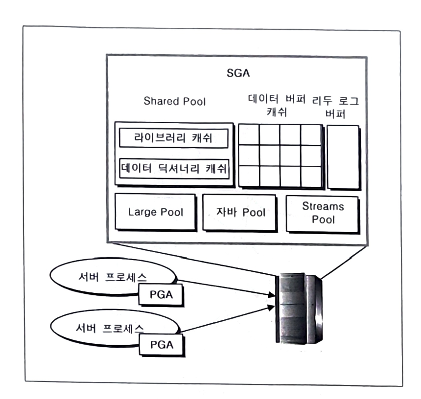

## SGA(System Global Area)

모든 사용자가 공유 가능

## PGA(Program Global Area, Private Global Area)

<aside>
💡

데이터베이스에 접속하는 모든 유저에게 할당되는 각각의 서버 프로세스가 독자적으로 사용하는 오라클 메모리 영역

</aside>

사용자마다 개별적으로 사용

.png>)

Dedicated 서버 방식, Shared 서버 방식이 존재

PGA 내부의 UGA 위치만 다르다

PGA는 서버 프로세스에 생성되며, 오라클에서 사용하는 메모리 영역

유저 프로세스 : 데이터베이스에 접속하기 위해 실행한 프로그램 → 그 프로그램을 수행하는 클라이언트에는 유저 프로세스가 생성됨. DB에 접속하는 순간, 모든 정보를 서버 프로세스에게 전달함

**서버 프로세스 : 유저 프로세스로부터 해당 SQL과 기타 정보를 전달받음. 받은 정보들을 저장하기 위해 자신만의 메모리인 PGA 활용**

**`Dedicated 서버 방식`**

- **PGA = 변수 저장공간 (Stack Space) + UGA**
- 실무에서 거의 이 방식 사용
- 하나의 유저 프로세스에 하나의 서버 프로세스, 그리고 하나의 PGA를 생성

Shared 서버 방식

- PGA = 변수 저장 공간
- UGA 는 기본적으로 Shared Pool에 저장하며 Large Pool로 변경 가능

## PGA

.png>)

### SQL Work Area

1. 비트맵 생성 영역
- 비트맵 인덱스 사용 시 사용하는 비트맵 인덱스 생성 영역

1. 비트맵 병합 영역
- 비트맵 인덱스를 사용하여 실행을 분석한 후 비트맵을 병합해야하는 경우 사용하는 영역
- ex) 비트맵 인덱스의 컬럼을 WHERE 조건에서 OR 연산자를 이용하는 경우에 2개의 비트 값을 비교해야 하므로 비트맵 병합 발생

1. 정렬 공간 (Sort Area)
- Order By 또는 Group By 등의 정렬을 수행하기 위한 공간
- 해당 공간에서만 정렬이 완료된다면 이를 메모리 정렬이라 부름
- 정렬 시 메모리 공간 부족하다면, 디스크에 구성되는 임시(TEMP) 테이블스페이스를 이용하게 된다

1. 해쉬 공간 (Hash Area)
- 조인 방식 중 하나인 해쉬 조인의 해쉬 영역을 생성하는 공간으로 사용

### UGA

1. 세션 메모리 (Session Memory)
- 서버 프로세스에 의해 추출된 결과 값을 전달하기 위해 필요한 **유저 프로세스의 세션 정보** 저장

### Private SQL Area

1. 영구 영역 (Persistent Area)
- 바인드 변수 값을 저장하며 바인드 변수는 실행되는 런타임 시 SQL 문에 제공됨
- 바인드 변수 == SQL에서 상수 값을 변수 처리한 부분을 의미함

1. 런타임 영역 (Run Time Area)
- 쿼리 실행 상태 정보를 저장
- ex) 현재 테이블 스캔을 통해 지금까지 몇 개의 행이 출력되었는지에 대한 정보를 저장하고 있다
- DML 문장의 경우, SQL 문장이 완료될 때 런타임 영역도 해제한다.

## PGA(Program Global Area)의 관리

다음과 같은 파라미터에 의해 PGA 크기 관리 가능

.png>)

주의

- PGA_AGGREGATE_TARGET 파라메터는 PGA의 총합을 제한하는 파라메터는 아니다
- 하나의 서버 프로세스에서 할당되는 PGA의 크기에 대한 단순 지표를 제공함

- WORKAREA_SIZE_POLICY : AUTO면 SORT_AREA_SIZE 및 HAS_AREA_SIZE 파라메터는 무시됨
.png>)


AWR(Automatic Workload Repository)

→ 현재 오라클의 부하 지표를 저장하고 있다

- V$PROCESS 동적 성능 뷰에서 평소 사용되는 PGA의 크기 확인 가능

## SGA(System Global Area)의 개념

<aside>
💡

오라클은 필요한 데이터를 **디스크에서 액세스 후 메모리에 저장한 다음에는 메모리에 저장된 데이터를 읽거나 변경을 수행**함

→ 이러한 일련의 작업에서 사용되는 공용 메모리 영역

→ 결국, 오라클이 SQL을 수행하기 위해 데이터를 읽거나 변경하기 위해 사용하는 공용 메모리 영역

</aside>

.png>)

동일 데이터베이스에 접속하는 모든 사용자는 동일 SGA를 사용하게 된다.

SGA는 인스턴스가 시작될 때 시스템 메모리에서 할당받으며 종료될 때 다시 시스템 메모리 영역으로 반환된다.

SGA의 중요 요소에 대한 목적  
  

| 항목 | 목적 |
| --- | --- |
| Shared Pool | SQL의 빠른 파싱 |
| Data Buffer Cache | 데이터 블록의 빠른 액세스 (재사용 포함) |
| Redo Log Buffer | 데이터베이스의 모든 변경사항에 대한 로그를 기록하여 장애 발생 시 복구 |

## SGA의 관리

### SGA 변경

```sql
SQL> ALTER SYSTEM SET parameter_name = 변경값;
```

SGA의 설정 값을 변경하고자 하는 경우 전체 SGA를 값이 SGA_MAX_SIZE 파라미터에서 정한 값 이하까지 alter system set 명령을 이용하여 동적으로 변경 가능

ex) 

- SGA_MAX_SIZE - 64GB
- 데이터 버퍼 캐시 - 24GB
- Shared Pool - 24GB

위와 같은 경우 다음과 같이 변경 가능

```sql
SQL> ALTER SYSTEM SET db_cache_size = 20G;
SQL> ALTER SYSTEM SET shared_pool_size = 28G;
```

데이터 버퍼 캐시에서 축소한 4GB만큼 Shared Pool에 할당

만약 데이터 버퍼 캐시를  64GB로 변경하려 한다면 SGA의 전체 합이 SGA_MAX_SIZE 파라메터의 값을 초과하므로, ORA-00384 Insufficient memory to grow cache 에러 발생

### 설정된 SGA 크기 확인

다음과 같은 데이터 딕셔너리 뷰 조회 또는 SQL*PLUS 명령어로 확인 가능

- V$SGA
- V$PARAMETER
- V$SPPARAMETER
- V$SGA_DYNAMIC_COMPONENTS
- show parameter 명령어

SQL*PLUS 접속 후, show sga 명령 수행 하면 다음 결과 출력

```sql
SQL> show sga
```

위의 예에서 SharedPool의 일부, Large Pool 및 자바 Pool은 Variable Size로 통합되어 보여진다.

V$SPPARAMETER 또는 V$PARAMETER 를 검색하면 SGA의 구성 요소에 설정된 정확한 값 확인 가능

## Shared Pool

<aside>
💡

파라메터 정보, 실행된 SQL, SQL 분석/실행 정보 및 오라클 오브젝트 정보를 저장하는 메모리 영역

</aside>

SQL을 수행하는 과정에서 `파싱`의 역할 수행

파싱 : 유저 프로세스에서 요청한 SQL을 수행하기 전에 수행할 수 있는 SQL인지 아닌지를 검증하고 분석하는 단계

파싱은 소프트 파싱, 하드 파싱으로 구분됨

- 소프트 파싱 : 검색 단계에서 기존에 동일한 SQL이 수행된 걸 확인하고 해당 SQL의 파싱 정보를 재사용
- 하드 파싱 : 기존에 동일한 SQL이 수행되었지만 메모리가 부족하여 LRU 알고리즘에 의해 버려지거나 수행된 적이 없는 SQL로 다시 파싱을 수행

결국, 목적은

파싱을 효과적으로 수행하기 위한 것!

목적 달성을 위해서는,

- 이전에 수행된 SQL에 대해서 소프트 파싱 유도
- 하드 파싱 시 적은 자원 사용

### Shared Pool 구성요소

.png>)

| 항목 | 구성요소 | 구성요소 |
| --- | --- | --- |
| 고정 영역 |  | 프로세스 목록/세션 목록/Enqueue 목록/트랜잭션 목록 |
| 동적 영역 | 라이브러리 캐쉬 |  |
|  | 데이터 딕셔너리 캐시 (로우 캐쉬) | 시스템 테이블 스페이스의 딕셔너리 정보 저장 |
| Reserved 영역 |  | 동적 메모리 할당을 위한 공간으로 파싱 공간을 많이 필요로 하는 SQL 파싱에 주로 사용 |

동적 영역 - 라이브러리 캐시

.png>)

동적 영역 중, **라이브러리 캐시에서 SQL 파싱 수행**

해당 영역의 해시 테이블, LRU 리스트의 사용 목적

해시 테이블

- 메모리 크기 내에서 **지금까지 수행된 모든 SQL 저장**
- 새로운 SQL 수행 시, 해쉬 테이블 검색하여 동일한 SQL 존재하는지 확인
- 동일 SQL 존재하면 하드 파싱 수행X, 소프트 파싱 수행함

LRU 리스트

- 메모리는 유한함 → 수행된 SQL을 모두 저장할 수 없다
- 최근에 가장 적게 사용된 SQL을 메모리에서 삭제하여 자주 사용될 SQL 정보를 저장하고 유지하여 메모리 사용 효율을 극대화함

.png>)

### 고정 영역

- 오라클이 SGA를 관리하는 매커니즘 및 오라클 파라메터 정보가 저장됨
- 고정 영역의 크기는 SQL *PLUS에서 show sga 명령으로 확인 가능
    
    → 결과에서 Fixed Size의 값이 고정 영역의 크기
    
- 고정 영역의 크기는 파라메터 설정 값 등을 고려하여 자동으로 할당되며 사용자가 지정 불가능

### 동적 영역

- 라이브러리 캐쉬와 데이터 딕셔너리 캐쉬로 구분
- 동적 영역의 크기는 SHARED_POOL_SIZE 파라메터를 사용하여 지정 가능

**라이브러리 캐쉬**

- DB에 접속한 유저가 실행한 SQL, 오라클이 내부적으로 사용하는 SQL(Recursive SQL), SQL에 대한 분석 정보 (Parse Tree) 및 실행계획 (Execution Plan)이 저장됨
- 여기서 파싱을 수행함!!!

데이터 딕셔너리 캐쉬 (로우 캐쉬)

- 테이블, 인덱스, 함수 및 트리거 등 **오라클 오브젝트 정보** 및 **권한** 외에도 **시스템 테이블스페이스의 모든 딕셔너리 정보**가 저장됨

### Reserved 영역

- 동적 메모리 할당을 위한 공간
- 파싱 공간을 많이 필요로 하는 SQL 파싱에 주로 사용됨

### 라이브러리 캐쉬의 Subpool

.png>)
Latch 

- 메모리에 대한 락 메커니즘

Enqueue

- 테이블 등의 오브젝트에 대한 락 메커니즘

락 메커니즘?

→ 어떤 공유 자원에 대해서 동시 변경을 방지하기 위해 순차적으로 엑세스하게 하는 요소

PGA의 경우는 공유 자원이 아니므로 Latch 등에 의해 락 메커니즘 구현 X

→ 하지만, SGA는 공유 자원이므로 많은 Latch가 존재함

SQL에 대한 하드 파싱 수행 시, 파싱 정보를 메모리에 저장해야 하므로 라이브러리 캐시에서 메모리 조작을 할당받아야함

.png>)

Subpool

- 라이브러리 캐시를 여러 개의 Pool로 구분함으로써 기존에 하나의 Shared Pool Latch가 하나일 때 발생하는 경합을 최소화시킴
- 장점 : Shared Pool Latch 경합 감소
- 단점 : 너무 많은 개수로 Subpool을 구성하게 되면 ORA-4031 발생 가능성 증가

- ORA-4031
    
    unable to allocate %s bytes of shared memory
    
    SQL 정보를 저장할 수 있는 충분한 크기의 사용 가능 메모리 조각을 Shared Pool의 프리리스트에서 찾지 못하고 LRU 리스트를 검색해도 찾지 못할 경우 발생
    
    .png>)
    

### 라이브러리 캐쉬의 해쉬 테이블

기존 SQL의 검색 속도 향상을 위해 사용

파싱의 과정

```sql
SQL> SELECT * FROM EMP;

1. 문장 확인 (Syntax Check) : Shared Pool의 라이브러리 캐시 및 데이터 딕셔너리 캐시

- SQL 문장 점검한 후 문법에 오류가 있지 않으면 다음 단계 이동

2. Semantic 확인 (Database Resolution) : Shared Pool의 데이터 딕셔너리 캐쉬

- 해당 SQL이 참조하는 테이블이나 칼럼이 존재하는지 등을 확인
- 해당 작업을 수행할 수 있는 권한이 있는지도 확인
-> 이는 Shared Pool의 데이터 딕셔너리 캐시에 캐싱되어 있는 오라클의 데이터 딕셔너리 테이블을 통해 확인함
-> 필요한 데이터 딕셔너리 테이블이 존재하지 않으면, 오라클 시스템 테이블스페이스로부터 해당 정보를 
데이터 딕셔너리 캐쉬로 로우 단위로 캐싱함
-> 이러한 이유에서 데이터 딕셔너리 캐쉬를 로우 캐쉬라고도 함

3. 검색(Search) : Shared Pool의 라이브러리 캐쉬

- 기존에 동일한 SQL이 수행되었던 적이 있는지 확인
- 수행된 적이 있었다면 별도로 파싱을 수행하지 않고 기존에 수행된 SQL의 파싱 정보 그대로 재사용
-> 해쉬 테이블 탐색

4. Optimization : 옵티마이저

- 좀 더 좋은 실행계획을 생성하기 위해서 쿼리를 변경하는 단계

5. TM 락 : 서버 프로세스

- 파싱 트리를 만드는 동안 테이블이 삭제되면 안되므로 아주 잠깐 테이블에 TM Lock 수행
```

여기서 3번째 단계인 검색을 살펴보자

Shared Cursor

- 실제 수행한 SQL에 대한 정보 가지고 있음
- 수행한 SQL과 동일한 Shared Cursor가 존재할 경우 해당 SQL은 소프트 파싱이 가능

→ 결국, 소프트 파싱은 수행하는 SQL에 대해서 해당 해쉬 테이블을 검색하여 동일한 SQL의 Shared Cursor 를 찾아 재사용하는 것!

- Shared Pool의 해시 테이블에서 SQL에 대한 Object Handle을 의미함

파싱의 **검색** 단계를 더 살펴보자

.png>)

Shared Pool의 라이브러리 캐쉬 → 해쉬 테이블로 구성

해쉬 Bucket

- 이미 정해져 있는 값
- 해쉬 함수를 수행하면 무조건 이미 정해진 값 중 하나가 리턴됨

1. 클라이언트에서 수행한 SQL을 전달받은 서버 프로세스는 해당 SQL을 ASCII 값으로 전환하여 해쉬 함수 수행

2. 해쉬 함수를 수행한 결과 값에 해당하는 해쉬 Bucket 선택
- 해쉬 함수를 수행하여 추출될 수 있는 모든 결과에 대해 하나씩 존재
- 따라서, 어떠한 SQL이던 해쉬 함수를 수행하게 되면 해쉬 Bucket이 선택됨

3. 특정 해쉬 Bucket 선택 완료되면, 기존에 동일한 SQL이 수행되었을 경우에는 해당 해쉬 Bucket 아래 Object Handle이 연결되어 있다
- 해당 해쉬 Bucket 에 연결되어 있는 Object Handle 중 뒤에서부터 액세스하여 동일한 SQL이 존재하는지 확인

4. 이전에 수행된 적이 없거나, 해당 해쉬 테이블의 공간이 부족하여 Object Handle이 메모리에서 제거되어 동일한 SQL 정보를 저장하고 있는 Object Handle를 발견하지 못하면 해당 SQL에 대해 다시 파싱을 수행함
    
    → 이를 HARD 파싱이라함
    
    → 하드 파싱을 수행하는 단계에서는 해당 해쉬 Bucket의 마지막 Object Handle 뒤에 파싱 정보를 새로 생성함
    
5. 수행한 SQL과 동일한 내용을 가지는 Object Handle을 찾게 되면 검색을 정지하고 해당 SQL 수행정보 및 실행 계획 등을 재사용함

.png>)

**해쉬 테이블에서 해쉬 Bucket으로 분기하여 검색**하는 이유

→ 검색 대상을 감소시켜 검색 속도를 빠르게 하기 위해서!

해쉬 Bucket이 100개일 때 기존 수행된 SQL이 10,000개라면 평균적으로 하나의 해쉬 Bucket에는

100개의 Object의 Object Handle이 연결될 것이다.

새로운 SQL 실행되면 해쉬 함수에 의해 결과 값을 리턴받고, 하나의 해쉬 Bucket이 선택됨

→ 해당 SQL과 동일한 SQL이 이전에 수행되었다면 동일한 해쉬 함수 값 리턴 받음

→ 해당 해쉬함수의 리턴 값에 해당하는 해쉬 Bucket에 연결됨

→ 그렇기 때문에 다른 해쉬 Bucket에는 해당 SQL과 해당 해쉬 함수의 리턴 값에 해당하는 SQL의 정보 존재 X

→ 따라서, 해당 해쉬 Bucket만 검색하여 소프트 파싱 할지 하드 파싱 할지 확인 가능

결국, 10,000개 SQL 검색이 아닌 100개의 SQL만 검색하면 파싱을 할 수 있다.

소프트 파싱, 즉 SQL 정보 재사용하게 되면 

SQL문 분석, 오브젝트 확인 및 실행계획 수립 절차를 수행하지 않기 때문에 파싱에 대한 부하를 감소시켜 전체 실행 시간 단축 및 자원 사용을 감소시킬 수 있다.

동일한 SQL이 되려면

- 대, 소문자 일치
- 띄어쓰기 일치
- 오브젝트 소유자 일치

### Shared Pool의 공간 관리 (해쉬 테이블 공간)

Shared Pool의 크기는 제한되어 있기 때문에 SHARED_POOL_SIZE 파라메터에 지정된 크기 이상의 정보가 저장되어야 한다면?

→ 저장되어 있던 정보를 제거하고 새로운 정보를 저장하게 된다

→ 이 때 LRU 알고리즘 사용

→ 해쉬 테이블의 Object Handle을 제거하거나 보관하게 된다

결국, LRU 알고리즘의 목적

- 해쉬 테이블의 Object Handle 및 기타 정보에 대해 자주 사용되는 자원을 지속적으로 보관하도록 구현하여 **소프트 파싱** 유도

SQL 실행되면, 해당 SQL에 대한 파싱 정보를 해쉬 테이블에 저장하기 위해 Shared Pool에 여유 공간 탐색

→ 사용할 수 있는 메모리 공간을 사용 가능 메모리 조각 (Free Chunk) 라고 함

→ 해당 조각들은 Shared Pool Latch에 의해 할당된다

결국, 실행된 SQL에 대한 정보를 보관하기 위해서는 **메모리 조각**이 존재해야 하며 이러한 메모리 조각을 관리하는 것이 LRU 리스트

### Shared Pool의 Reserved 공간

Shared Pool에 대해 미리 공간을 예약함으로써 메모리 조각 부족으로 인한 SQL 수행 실패를 방지하기 위한 방법

.png>)

위 처럼 세팅하면, 일반 Shared Pool로 90MB 할당되며, Shared Pool Reserved 공간으로는 10MB 할당 받음

→ 이렇게 되면 4400 Byte (0.0044 MB) 이상의 메모리 조작이 필요한 SQL1 은 Shared Pool Reserved 공간의 메모리를 사용하게 되며, 4,400 Byte 이하인 SQL2는 일반 Shared Pool 를 사용함

만약 Shared Pool Reserved 공간을 따로 설정 안하면 Shared Pool 크기의 5%로 설정된다 (보통 5%에서 10% 정도 설정하는 것이 유리)

→ Shared Pool Reserved 공간은 Shared Pool의 50% 이상 설정할 수 없다

## 데이터 버퍼 캐쉬

<aside>
💡

오라클이 데이터를 읽고 수정하기 위해 디스크에 존재하는 데이터를 읽어 저장하는 메모리 공간

</aside>

### 데이터 버퍼 캐쉬의 개념

자주 사용하되는 데이터 블록들의 메모리 저장 공간

→ 필요한 데이터 블록을 최대한 디스크가 아닌 메모리에서 액세스 할 수 있도록

**목적 : 데이터 블록에 대한 빠른 액세스**

- 액세스 하고자 하는 데이터 블록에 대해 데이터베이스 버퍼 캐쉬에 계속 보관해서 Logical Read가 발생할 수 있도록 구현한 LRU 알고리즘 사용
- 버퍼 캐쉬에 존재하는 데이터 블록에 대한 검색 기능을 강화한 해쉬 테이블 아키텍쳐 사용

.png>)

SQL을 수행한 후 해당 SQL이 Shared pool에서 파싱이 완료되었다면 다음 단계에서 데이터 버퍼 캐쉬에 해당 데이터가 저장되어 있는 데이터 블록이 존재하는지 검색

→ 존재하지 않는다면 서버 프로세스가 필요한 데이터 블록을 디스크로부터 데이터 버퍼 캐쉬로 캐싱

→ 만약 존재한다면 디스크 액세스 필요 없음

여기서 Physical Read 혹은 Logical Read 발생

Physical Read

- 데이터 버퍼 캐시에 해당 데이터가 저장되어 있는 데이터 블록이 존재하지 않는다면 서버 프로세스가 필요한 데이터 블록을 디스크로부터 데이터 버퍼 캐쉬로 캐싱

Logical Read

- 디스크 액세스 필요없이, 데이터 버퍼 캐쉬에서 필요한 데이터 블록 접근 가능한 경우

기본 데이터 버퍼 캐쉬 → DB_CACHE_SIZE 파라미터로 결정

show sga 명령어 결과에선 Database Buffers가 데이터 버퍼 캐쉬의 크기이다.

데이터베이스 성능 향상을 위해 가급적 필요한 데이터를 디스크 I/O (Physical Read/Write) 없이 메모리에서 엑세스 하는 것이 성능에 유리!

→ 이를 위해 SGA 영역 중에서 데이터 버퍼 캐쉬에 가장 많은 크기를 할당함

### 데이터 버퍼 캐쉬의 활용

.png>)

서버 프로세스

- 디스크로부터 필요한 데이터 블록을 액세스하여 데이터 버퍼 캐쉬에 저장
- 필요한 데이터 블록의 수가 여러 개 일지라도, 하나씩 데이터 버퍼 캐쉬로 캐싱하게 된다.
- 하지만, SQL에서 전체 테이블 검색을 수행하는 경우 DB_FILE_MULTIBLOCK_READ_COUNT 파라미터에 저장된 데이터 블록의 수 만큼 데이터 버퍼 캐쉬로 한 번에 읽게 된다.

```sql
SQL> show parameter DB_FILE_MUTLIBLOCK_READ_COUNT
```

16 출력되면 테이블 전체를 엑세스하는 경우에 16개 블록 단위로 I/O 발생

DBWR(Database Writer) 백그라운드 프로세스

- 데이터 버퍼 캐쉬에 저장되어 있는 블록 중 **변경된 데이터 블록의 내용을 디스크에 저장**하는 프로세스

둘 다 데이터 블록 단위로 읽고 기록한다.

→ 왜냐하면, 오라클의 I/O 단위는 데이터 블록이기 때문

### 다중 데이터 블록 크기 지정

.png>)

데이터 블록 크기 : DB_BLOCK_SIZE 파라메터로 설정

하지만, 9i 부터는 여러 개의 데이터 블록 크기 설정 가능

.png>)

위의 value 값을 변경하려면, 오라클의 파라메터 파일 (init<SID>.ora) 변경하면됨

실제 운영에서는, 다중 데이터 블록의 크기 설정은 안 쓰는 것이 유리함

→ 운영에서 테이블 스페이스 별로 블록의 크기라 다르다면 테이블을 서로 다른  데이터 블록의 크기로 이동하는 것이 힘들기 때문

→ 서로 다른 크기의 데이터 블록을 가지는 테이블스페이스 간에는 여러 작업에 제한이 발생

### 데이터 블록 크기와 데이터 버퍼 캐쉬

데이터 블록의 크기가 큰 경우

.png>)

데이터 블록 크기 : 16KB

데이터 블록이 크기 때문에, 유저 A와 유저 B의 SQL 결과가 동일 데이터 블록에 저장됨

장점

- 한 번의 디스크 I/O 로 많은 데이터 추출 가능

단점

- 데이터 블록에 대한 경합 발생 가능성 증가

→ 동시에 많은 유저 동일 데이터 블록을 사용할 확률이 높아지므로 해당 데이터 블록에 대한 경합 발생

데이터 블록의 크기가 작은 경우

.png>)

장점

- 데이터 블록에 대한 경합 발생 가능성 감소

단점

- 더 많은 디스크 I/O 발생

데이터 블록 크기는 대부분 8K로 설정

 

### 다중 데이터 버퍼 캐쉬 설정

.png>)

기본(Default)

- 일반 데이터 버퍼 캐시
- DB_CACHE_SIZE 파라메터에 의해 설정됨
- 일반적인 테이블이나 인덱스는 기본 데이터 버퍼 캐쉬를 이용함

고정(Keep)

- 해당 데이터 버퍼 캐쉬로 읽혀진 데이터 블록은 재사용률이 높다고 판단하여 해당 데이터 버퍼 캐쉬의 내용을 삭제하지 않으려고 한다
- DB_KEEP_CACHE_SIZE 파라메터에 의해 설정
- 자주 사용되고 성능 좌우하는 테이블, 인덱스를 위치시킴(코드성 테이블)

재활용(Recycle)

- 재사용이 거의 안 됨
- DB_RECYCLE_CACHE_SIZE 파라메터에 의해 설정됨

각각의 데이터 버퍼 캐쉬는 독립된 영역 및 LRU 리스트 가짐

버퍼 캐쉬의 크기는 고정 > 기본 > 재활용 순

테이블 및 인덱스 단위로 지정 가능

```sql
SQL> ALTER TABLE EMP STORAGE(BUFFER_POOL KEEP);
SQL> ALTER TABLE EMP STORAGE(BUFFER_POOL RECYCLE);
```

## 리두 로그 버퍼 (Redo Log Buffer)

.png>)

<aside>
💡

개념 : 오브젝트 및 데이터 변경 시 생성되는 로그를 저장하는 SGA 메모리 공간
목적 : 데이터베이스내의 모든 변경 작업에 대한 복구를 지원

</aside>

서버 프로세스가 로그를 리두 로그 버퍼에 저장한 다음, 백그라운드 프로세스인 LGWR 프로세스에 의해 리두 로그 파일에 저장된다.

LOG_BUFFER 파라메터로 지정 가능

### 복구 vs 롤백

복구 : 장애(디스크 장애, 인스턴스가 비정상 종료했을 때)에 대한 DB 복구

주체 : 리두 로그 파일 + 언두 데이터 

롤백 : 작업에 대한 작업 전 데이터로 복구

주체 : 언두 데이터

### 리두 로그 버퍼의 아키텍쳐

**Physiological 로깅**

DB 로깅에는 다음 3가지가 존재

- Logical 로깅 : 작업에 대한 이전 이미지와 이후 이미지가 아닌 작업에 대한 명세서 기록
- Physical 로깅 : 변경된 블록에 대한 이전 이미지, 이후 이미지 모두 저장
- Physiological 로깅 : 변경된 데이터에 대해서는 이전/이후 이미지를 저장하며 명세서 작성

.png>)

기본적으로 로그 양이 적고, 복구가 완벽한 Physiological 로깅 사용

**Write-Ahead 로깅 (로그 Ahead)**

기록하는 작업을 먼저 수행한다는 의미

이렇게 해야 장애 발생해도 해당 작업에 대해 복구 수행 가능!

.png>)

**로그 Force At Commit**

커밋된 데이터는 반드시 리두 로그 파일에 로그를 기록하게 된다

### 리두 로그의 생성 과정

.png>)

리두 로그를 리두 로그 버퍼에 기록하기 위해서는 리두 Copy Latch 를 획득해야한다.

리두 Copy Latch 는 **리두 로그 버퍼에 로그를 기록하는 Latch**이다

그 다음엔 Allocation Latch를 획득해 리두 로그 버퍼로부터 로그 기록할 수 있는 여유 공간을 할당받아야한다.

해당 공간에 리두 Copy Latch를 이용하여 리두 로그를 기록하게 된다

리두 로그 버퍼에 공간 없으면, 해당 서버 프로세스는 리두 Writing Latch를 획득함

→ Writing Latch는 DB에 하나만이 존재하며 해당 Latch를 획득한 서버 프로세스만이 LGWR 백그라운드 프로세스를 기동시킬 수 있다.

.png>)

리두 로그 버퍼는 메모리 영역이므로 해당 공간에서 락이 필요하게 되면 Latch를 사용하게 된다
.png>)
### 리두 로그의 성능

과다한 트랜잭션은 리두 로그 많이 발생시키며 성능 저하로 이어질 수 있음

Log File Sync

리두 로그 버퍼 관련 대기 이벤트 중 하나

# Large Pool

필수적으로 지정해야하는 SGA 영역이 아니다

Shared Pool의 부하 감소시킴

.png>)

RMAN : 오라클 백업, 복구 용 유틸리티

병렬 프로세스 간 주고받은 메세지 → Large Pool 설정 안하면 Shared Pool에 저장됨

→ 이 경우 메세지의 크기가 너무 커지면 ORA-4031 에러 발생

.png>)

# Java Pool 및 Streams Pool