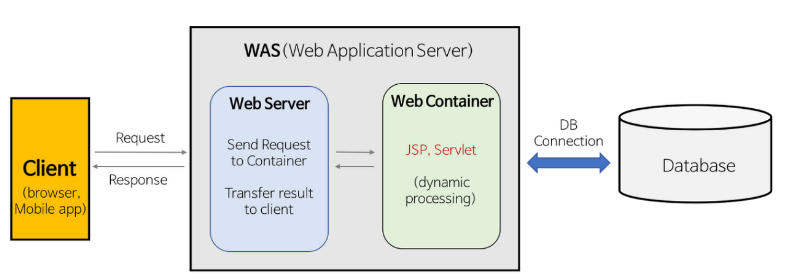
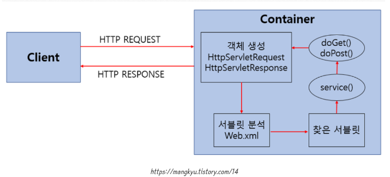
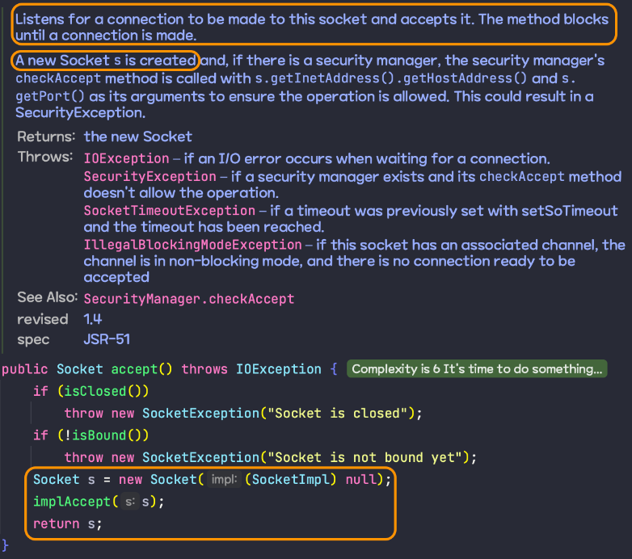
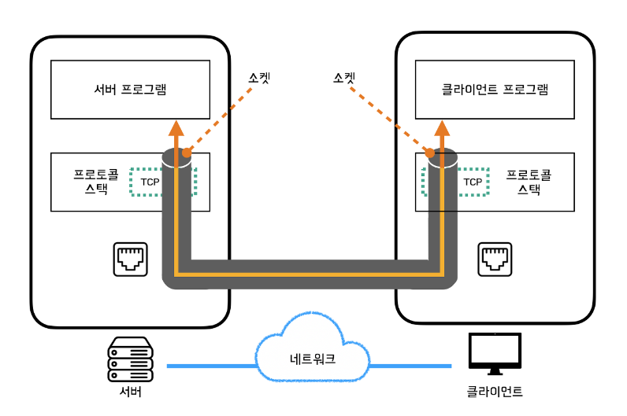
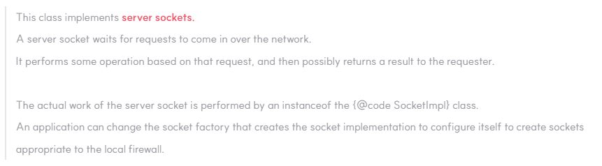
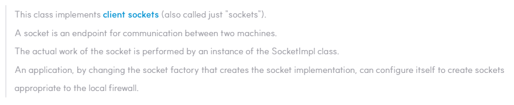
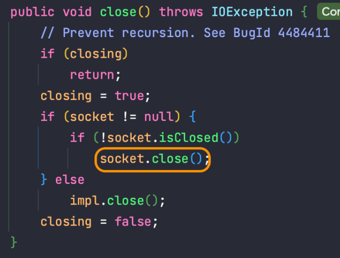

GDSC 동아리에서 처음으로 진행한 스터디가 바로 스프링의 내장 웹 서버인 `톰캣을 직접 구현해보는 스터디`였다.  
이번 스터디를 진행하면서 웹 서버, 톰캣의 구조와 서블릿, 그리고 HTTP 요청과 응답 처리에 대해 깊게 학습할 수 있었다.  
스터디를 하면서 배운 개념, 그리고 트러블 슈팅들을 정리해보았다. 정리 후, 자료를 참고하지 않고 직접 스스로 구현해보는 연습도 해볼 예정이다.

# WAS(Web Application Server)와 WS(Web Server)의 차이

`WAS(Web Applcation Server)`

- 비즈니스 로직을 넣을 수 있음
- `Tomcat`, PHP, ASP, .NET 등

`WS(Web Server)`

- 비즈니스 로직을 넣을 수 없음
- Nginx, `Apache` 등

## Web Server와 WAS(Web Application Server)에 대해



## 1. Web Server

- 클라이언트에게 요청을 받고 정적인 Request라면 (html, css 등) 정적인 콘텐츠를 Response 한다.
- 클라이언트에게 요청을 받고 동적인 Request라면 WAS로 처리를 이관한 뒤, WAS가 처리한 결과를 클라이언트에게 전달한다.

## 2. WAS

- DB 조회가 필요하거나 사용자의 입력을 받아 서버에서 가변적으로 로직을 수행하는 등의 `동적인 처리` 가 필요한 요청을 처리해준다.
- Web Container의 JSP/Servlet 구동 환경을 제공하고 프로그래밍 언어(JSP, ASP, PHP 등)로 작성한 뒤 HTML 문서로 만들고 Web Server로 전달한다.

1. 프로그램 실행 환경과 DB 접속 기능을 제공
2. 여러 개의 트랜잭션을 관리
3. 업무를 처리하는 프로그래밍 언어의 비즈니스 로직을 수행
4. Web Service 플랫폼으로서의 역할 병행

## WAS 작동 프로세스

1. Web Server로 요청이 오면 컨테이너가 응답
2. 컨테이너는 web.xml를 참조하여 해당 서블릿에 대한 쓰레드 생성하고 httpServletRequest, httpServletResponse 객체를 생성하여 서블릿에 전달
3. 컨테이너는 JSP/Servlet 호출
4. 호출된 Servlet의 작업을 담당하게 된 쓰레드(2번에서 만든 스레드)는 doPost() 또는 doGet()을 호출
5. 호출된 doPost(), doGet() 메서드는 생성된 동적 페이지를 Response 객체에 담아 컨테이너에 전달
6. 컨테이너는 전달받은 Response 객체를 HttpResponse 형태로 바꿔 WebServer에 전달하고 생성되었던 스레드를 종료하고 httpServletRequest, httpServletResponse 객체을 소멸시킨다.

## Web Server와 WAS 둘 다 사용하지 않고 WAS만 사용하면 되지 않나? 둘이 분리한 이유?

Web Server를 WAS 앞에 둠으로써 얻는 이점을 살펴보면 된다.

1. 기능을 분리하여 서버 부하 방지

- 단순한 정적 컨텐츠 요청은 Web Server에서 빠르게 클라이언트에게 제공하여 WAS로 넘어오지 않게 막는 것이 좋다.

2. 물리적으로 분리하여 보안 강화

- WebServer와 WAS느 Port번호가 다르다.
- 물리적으로 두 개의 서버를 완전히 분리하여 보안 강화 가능
- 또한, SSL에 대한 암복호화 처리에 Web Server를 사용하여 웹 서비스의 보안 강화 가능

3. 여러 대의 WAS 연결 가능

- Web Server 하나에 여러 대의 WAS를 설치하고 로드 밸런싱을 통해 WAS의 부하를 분산시킬 수 있다.

위의 토픽 중, WAS의 동작 구조가 큰 도움이 되었다. doPost와 doGet 메서드를 구현하는 것이 스터디 Task 중 일부였기 때문에 큰 구조를 이해한 채로 스터디 진행이 가능하였다.

# 서블릿이란?

> 자바를 사용해 웹을 만들기 위해 필요한 기술

클라이언트의 요청을 처리하고, 그 결과를 반환하는 Servlet 클래스의 구현 규칙을 지킨 자바 웹 프로그래밍 기술이다.  
Spring MVC에서 `Controller`로 이용되며, 사용자의 요청을 받아 처리한 후에 결과를 반환한다.

## 서블릿의 동작방식



1. 사용자가 URL 입력 시, HTTP Request가 `Servlet Container`로 전송
2. 요청 받은 Servlet Container는 `HttpServletRequest, HttpServletResponse` 객체를 생성
3. `web.xml`을 기반으로 사용자가 `요청한 URL이 어느 서블릿에 대한 요청인지 찾는다.`
4. 해당 서블릿에서 `service() 메서드를 호출한 후 GET, POST 여부에 따라 doGet() 또는 doPost() 호출`
5. doGet() 또는 doPost() 메서드는 동적 페이지를 생성한 후 `HttpServletResponse 객체에 응답`을 보낸다.
6. `응답이 끝나면 HtppServletRequest, HttpServletResponse 객체를 소멸`시킨다.

# 코드 기반 톰캣 실행 흐름

## 1. 간단한 톰캣 구현 확인

메인 메서드이다.

```java
public class Application {

    public static void main(String[] args) {
        Tomcat tomcat = new Tomcat();
        tomcat.start();
    }
}
```

Tomcat 객체를 생성하고 시작한다. Tomcat 클래스는 다음과 같이 구현되어 있다.

```java
public class Tomcat {

    public void start() {
        Connector connector = new Connector();
        connector.start();

        try {
            // make the application wait until we press any key.
            System.in.read();
        } catch (IOException e) {
            log.error(e.getMessage(), e);
        } finally {
            log.info("web server stop.");
            connector.stop();
        }
    }
}
```

Tomcat에서는 Connector 객체를 만들고 이를 시작한다. Connector 객체는 다음과 같이 구현되어 있다.

```java
public class Connector implements Runnable {

    private static final int DEFAULT_PORT = 8080;
    private static final int DEFAULT_ACCEPT_COUNT = 100;

    private final ServerSocket serverSocket;
    private boolean stopped;

    public Connector() {
        this(DEFAULT_PORT, DEFAULT_ACCEPT_COUNT);
    }

    public Connector(final int port, final int acceptCount) {
        this.serverSocket = createServerSocket(port, acceptCount);
        this.stopped = false;
    }

    private ServerSocket createServerSocket(final int port, final int acceptCount) {
        try {
            final int checkedPort = checkPort(port);
            final int checkedAcceptCount = checkAcceptCount(acceptCount);
            return new ServerSocket(checkedPort, checkedAcceptCount);
        } catch (IOException e) {
            throw new UncheckedIOException(e);
        }
    }

   private int checkPort(final int port) {
        final var MIN_PORT = 1;
        final var MAX_PORT = 65535;

        if (port < MIN_PORT || MAX_PORT < port) {
            return DEFAULT_PORT;
        }
        return port;
    }

    private int checkAcceptCount(final int acceptCount) {
        return Math.max(acceptCount, DEFAULT_ACCEPT_COUNT);
    }

    public void start() {
        var thread = new Thread(this);
        thread.setDaemon(true);
        thread.start();
        stopped = false;
        log.info("Web Application Server started {} port.", serverSocket.getLocalPort());
    }

    @Override
    public void run() {
        // 클라이언트가 연결될때까지 대기한다.
        while (!stopped) {
            connect();
        }
    }

    private void connect() {
        try {
            Socket connection = serverSocket.accept();
            process(connection);
        } catch (IOException e) {
            log.error(e.getMessage(), e);
        }
    }

    private void process(final Socket connection) {
        if (connection == null) {
            return;
        }
        Http11Processor processor = new Http11Processor(connection);
        new Thread(processor).start();
    }

    public void stop() {
        stopped = true;
        try {
            serverSocket.close();
        } catch (IOException e) {
            log.error(e.getMessage(), e);
        }
    }
}
```

connect()와 process() 메서드가 중요하다. 하지만 먼저, Http11Processor 클래스를 살펴보자.

```java
public class Http11Processor implements Runnable, Processor {

    private final Socket connection;

    public Http11Processor(final Socket connection) {
        this.connection = connection;
    }

    @Override
    public void run() {
        log.info("connect host: {}, port: {}", connection.getInetAddress(), connection.getPort());
        process(connection);
    }

    @Override
    public void process(final Socket connection) {
        try (final var inputStream = connection.getInputStream();
             final var outputStream = connection.getOutputStream()) {

            // TODO

            outputStream.write(response.getBytes());
            outputStream.flush();
        } catch (IOException | UncheckedServletException e) {
            log.error(e.getMessage(), e);
        }
    }
}
```

## 2. 클라이언트 커넥션 수락

요청의 시작은 클라이언트가 웹 서버로 요청을 보내는 것이며, 웹 서버는 클라이언트로부터 접속 요청이 오면 이를 수락해줘야 데이터를 주고받을 수 있다.  
이 부분은 아래와 같이 구현된다.

```java
private void connect() {
    try {
        // serverSocket은 ServerSocket 타입
        Socket connection = serverSocket.accept();
        process(connection);
    } catch (IOException e) {
        log.error(e.getMessage(), e);
    }
}
```

우선 `ServerSocket`의 accept()를 살펴보자.



주석을 통해 해당 메소드는 `ServerSocket`에 대한 연결(connection)이 이루어질 때 까지 기다렸다가 연결을 수락하고 새로운 `Socket`을 생성하여 반환한다고 한다.

그런데 왜 `Socket` 을 새로 만들어 반환하는 것일까?? 이를 위해서는 웹 요청이 어떠한 과정을 통해 이뤄지는지에 대해서 알아야 한다.

### 웹 요청 프로세스

사용자가 브라우저를 통해 서버에 요청을 보내는 경우, 서버의 URL, Http Method와 입력된 데이터 등을 바탕으로 브라우저는 HTTP Request Message를 만든다. 이후 DNS 서버로부터 서버의 IP 주소를 조회하고 이곳에 요청 메세지를 보낸다.  
이때 발생하는 데이터의 송-수신 과정은 다음과 같다.  


데이터를 송-수신하는 컴퓨터 사이에 데이터가 흐르는 `통로`가 존재하며, 이를 통해 데이터가 흐르면서 상대측에 도착하게 된다  
이러한 통로는 처음부터 연결된 상태로 존재하지 않는다. 데이터를 송-수신하기 전에 양 컴퓨터 사이에서 통로를 연결해주는 작업이 선행되어야 한다. 이때 해당 통로의 양 끝에 존재하는 데이터의 출입구를 `소켓`이라 부른다. 통로를 연결하기 위해서는 이 `소켓`을 먼저 만들어야 하고, 이후 양쪽의 소켓을 연결하는 작업이 필요하다.  
실제 구현은 위의 코드에서 본 것과 같이, 서버에서 먼저 소켓을 만든 뒤 클라이언트에서 연결하기를 기다린다.  
이후 클라이언트측에서 소켓을 만든 뒤, 서버의 소켓과 연결하게 되면 그때부터 데이터를 주고받을 수 있게 된다.

> 데이터를 주고받기 위해서는 클라이언트 소켓이 서버 소켓에 연결되어야 한다.

그다음으로 알아볼 것은, `ServerSocket`과 `Socket`에 대한 내용이다.

### ServerSocket



ServerSocket은 `서버의 Socket`을 구현한다.

### Socket



즉, `ServerSocket`의 accpet() 에서 반환해주는 `Socket`은 `서버 소켓`과 연결된 `클라이언트 소켓`임을 알 수 있다.

## 3. 요청 메세지 수신 & 처리

클라이언트가 보낸 HTTP 요청 메시지를 네트워크로부터 읽어야 한다.

```java
private void process(final Socket connection) {
    if (connection == null) {
        return;
    }
    var processor = new Http11Processor(connection);
    new Thread(processor).start();
}


public class Http11Processor implements Runnable, Processor {

    private static final Logger log = LoggerFactory.getLogger(Http11Processor.class);

    private final Socket connection;

    public Http11Processor(final Socket connection) {
        this.connection = connection;
    }

    @Override
    public void run() {
        log.info("connect host: {}, port: {}", connection.getInetAddress(), connection.getPort());
        process(connection);
    }

    @Override
    public void process(final Socket connection) {
        try (final var inputStream = connection.getInputStream();
             final var outputStream = connection.getOutputStream()) {

            String request = 요청_메세지_수신(inputStream);

            // 아래 두개가 '응답 생성'
            String responseBody = 메시지에서_지정한_리소스_가져온다(request);
            String response = 응답_생성();


            // 아래 두개가 '응답 반환'
            outputStream.write(response.getBytes());
            outputStream.flush();
        } catch (IOException | UncheckedServletException e) {
            log.error(e.getMessage(), e);
        }
    }
}
```

이때 요청 메세지를 수신하는 부분은 다음과 같다.

```java
String request = 요청_메세지_수신(inputStream);
```

## 4. 리소스 매핑과 접근

```java
private String 메시지에서_지정한_리소스_가져온다(request){

    String 리소스_이름 = 메시지에서_지정한_리소스_이름을_가져온다(request);

    return resources_디렉토리_내에서_리소스를_찾아_반환한다(리소스_이름);
}
```

이때 웹 서버의 `resources` 디렉토리에 정적 파일들이 존재한다. 즉, 요청이 localhost:8080/index.html 인 경우, index.html을 찾아 반환해줘야 한다.

## 5. 응답 메세지 생성

```java
// 아래 두개가 '응답 생성'
String responseBody = 메시지에서_지정한_리소스_가져온다(request);
String response = 응답_생성();
```

응답 헤더를 포함한 HTTP 응답 메세지를 생성한다. HTTP 응답 메세지는 다음과 같은 형태이다.


## 6. 응답 반환

```JAVA
// 아래 두개가 '응답 반환'
outputStream.write(response.getBytes());
outputStream.flush();
```

## 7.연결 종료

```java
try (final var inputStream = connection.getInputStream();
     final var outputStream = connection.getOutputStream()) {
} // try with resource 를 통한 auto close
```

try with resource 를 사용하여 OutputStream이 close 되면서 연결이 종료된다.  
connection.getOutputStream()의 타입은 SocketOutputStream인데, SocketOuputStream의 close() 메서드는 다음과 같다.



소켓을 닫아줌으로써 연결을 종료하는 코드가 들어있는 것을 확인 가능하다.

다음 글로는 InputStream과 OutputStream에 대해 작성해볼 생각이다.

# TIL

## 1. Paths.get() vs Path.of()

특정 경로내의 파일을 읽어오기 위해선, 해당 경로를 Path 객체로 만들어야 한다. 여기서 사용할 수 있는 함수가 2가지 종류여서 이를 정리해봤다.

```java
public final class Paths {
    public static Path get(URI uri) {
        return Path.of(uri);
    }
}
```

Paths.get() 를 호출하면, Path.of() 를 호출한 뒤, 받은 결과를 return 해준다. Java 8 이전에는 Interface 내에 정적 메서드 사용이 불가하였지만, Java 11부터는 정적 메서드 생성이 가능해졌다.

[인터페이스의 정적 메서드](https://nanamare.tistory.com/129)

버전 간의 호환성을 위해 Paths.get() 를 사용가능하다.  
하지만, 기존의 get() 함수의 이름 때문에 마치 getter() 처럼 느껴졌지만, Paths.get() 는 Paths 객체 요소 중 어느 하나도 get 해주지 않는다.  
따라서, Path.of() 를 사용하는 것이 더 직관적이다. 또한, 자바의 표준 정적 팩토리 메서드이기 때문에 이를 사용하는 것이 더 바람직하다.

[정적 팩토리 메서드는 왜 사용할까?](https://tecoble.techcourse.co.kr/post/2020-05-26-static-factory-method/)

## 2. newCachedThreadPool() vs newFixedThreadPool()

```java
// Connector.java
// Connector.java
public Connector(final int port, final int acceptCount, final int maxThreads) {
        this.serverSocket = createServerSocket(port, acceptCount);
        this.executor = Executors.newFixedThreadPool(maxThreads);
        this.stopped = false;
    }
```

- newFixedThreadPool

공유 언바운드 큐에서 작동하는 `고정된 수의 쓰레드를 재사용하는 쓰레드풀`을 생성한다.

만약 동시에 실행되는 태스크의 수가 최대 쓰레드의 수를 초과한다면, 작업 중 일부를 큐에 넣어 순서를 기다리게 된다.

- newCachedThreadPool

사용가능 쓰레드 없을 시, 새롭게 쓰레드 생성한다.

## 3. submit() vs exectue()

```JAVA
private void process(final Socket connection) {
        if (connection == null) {
            return;
        }

        log.info("connect host: {}, port: {}", connection.getInetAddress(), connection.getPort());
        var processor = new Http11Processor(connection);
        executor.submit(processor);
    }
```

두 작업 모두 쓰레드풀에게 작업 처리 요청하는 메서드

- execute()

작업 처리 도중, 예외 발생하면 해당 쓰레드는 제거되고, 새 쓰레드가 계속해서 생겨난다.

- submit()

예외 발생하더라도 쓰레드가 종료되지 않고 계속해서 재사용되어 다른 작업 처리 가능

⇒ 쓰레드 생성의 오버헤드 줄일 수 있다.

또한, 작업 처리 결과를 받을 수 있도록 `Future` 를 리턴하는데, 이는 작업 실행 결과나 작업 상태(실행중)를 확인하기 위한 객체

[Java-Future 사용 방법](https://codechacha.com/ko/java-future/)

## 4. ConcurrentHashMap

```java
// SessionManager.java
private static final Map<String, Session> SESSIONS = new ConcurrentHashMap<>();
public static void add(final Session session) {
        SESSIONS.put(session.getId(), session);
    }
```

put() 메서드에 대해서 synchronized 를 붙여, 읽기에 대해서는 여러 쓰레드에서 동시에 읽을 수 있도록 하지만, 쓰기에 있어서는 동시에 하나의 쓰레드만 접근 가능하도록 한다.

## 느낀점

코드 구현력도 중요하지만, 무엇보다 말로 설명할 수 있을 만큼 기본 CS 지식을 쌓는 것이 중요하다는 것을 느꼈다. 2024년 취뽀를 위해 CS 기본기를 틈틈이, 꾸준히 쌓아나가야겠다.

# 참고자료

- [기술면접 Spring - 1/3](https://lealea.tistory.com/224)
- [웹 서버가 하는 일 알아보기](https://ttl-blog.tistory.com/1483#%F0%9F%90%B3%201.%20%ED%81%B4%EB%9D%BC%EC%9D%B4%EC%96%B8%ED%8A%B8%20%EC%BB%A4%EB%84%A5%EC%85%98%20%EC%88%98%EB%9D%BD-1)
